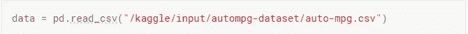

# 各种回归模型的应用

> 原文：<https://medium.com/analytics-vidhya/application-of-various-regression-models-7388d6138527?source=collection_archive---------14----------------------->

一个数据科学项目通过代码！

照片由 [Unsplash](https://unsplash.com?utm_source=medium&utm_medium=referral) 上的[vini cius Henrique](https://unsplash.com/@x_vinicius?utm_source=medium&utm_medium=referral)拍摄

# **简介**

在这个项目中，我们将涵盖各种回归模型。对于这个项目，我使用了来自 UCI 机器学习资源库的[自动 MPG](https://archive.ics.uci.edu/ml/datasets/auto+mpg) 数据集。共有 9 个属性:

1.mpg:连续
2。气缸:多值离散
3。排量:连续
4。马力:连续
5。重量:连续
6。加速:连续
7。年款:多值离散
8。原点:多值离散
9。汽车名称:字符串(对于每个实例是唯一的)

# **目标**

该项目的目标如下:

1.  尝试不同的回归方法，看看哪种方法的准确度最高。

说到这里，我们开始吧！

# 导入库

# **读取数据**

# **了解数据**

接下来，我想更好地了解我在做什么。

*   下面的代码块给出了关于数据的一般信息。
*   *数据形状* — **给出数据的形状。**
*   *data.isnull()。sum()* — **给出每一列中缺失值的总数。**
*   *data.info()* — **根据特征的数据类型给出信息。**

总共有 398 行和 9 列。

因为特性“马力”中有 6 个缺失值，给定为“？”，所以我们使用 SimpleImputer 类用最频繁的值替换缺失值。

[simple imputr](https://scikit-learn.org/stable/modules/generated/sklearn.impute.SimpleImputer.html)类提供了输入缺失值的基本策略。缺失值可以使用提供的常数值进行估算，或者使用缺失值所在的每列的统计数据(平均值、中值或最频繁值)进行估算。

马力是一个数字特征，但是在这个数据集中，这个特征是对象数据类型。所以我将 feature 马力的数据类型转换为浮点数据类型。

接下来，我想进一步探索我的数据。

# **探索性数据分析**

EDA 在任何机器学习项目中都扮演着非常重要的角色。它包括可视化数据，统计总结数据。为了从数据中获得更深入的见解，我使用了一些图表，如 Pairplot 和 Countplot。

“原点”变量中有 3 个唯一值，它们本质上是离散的。

这里，

1 代表美国，

2 代表欧洲，

3 代表亚洲。

现在，我想看看数据集中所有变量的成对关系。

pairplot 绘制数据集中的成对关系。pairplot 函数创建一个轴网格，这样数据中的每个变量将在 y 轴的一行中共享，在 x 轴的一列中共享。

从图中我们可以看出，重量、马力和排量与目标变量 mpg 呈负相关。

计数图是一种条形图，给出变量中每个类别的计数。

在该数据集中，有近 200 辆 4 缸汽车、100 辆 8 缸汽车和 75 辆 6 缸汽车。

大多数汽车来自美国。

任何项目中最激动人心的部分！

为培训准备数据。我将数据分为特征变量矩阵(x)和目标变量向量(y)。

**拆分数据**

接下来，我将数据分成训练集和测试集，这样我就可以交叉验证我的模型，并确定它们的有效性。

由于这些特征存在于不同的比例中，我们使用 StandardScaler 来标准化这些特征。标准化数据意味着它将转换数据，使其分布的平均值为 0，标准差为 1。为了均衡数据范围，标准化数据非常重要。

现在，我们已经完成了数据预处理，我们准备应用各种回归模型。

**模型 1 —线性回归**

为了确定模型符合数据的程度，我使用了 r 平方分数作为评估标准。

r 平方是数据与拟合回归线接近程度的统计度量。它也被称为决定系数，或多元回归的多重决定系数

r 平方始终介于 0 和 100%之间:

*   0%表示该模型不能解释响应数据在其平均值附近的任何可变性。
*   100%表示模型解释了响应数据围绕其平均值的所有可变性。

**模型 2 —决策树回归**

模型 3 —支持向量回归

模型 4 —随机森林回归

# **结论**

因此，在应用不同的回归模型并在测试集上比较其精度后，我们可以说随机森林回归在所有模型中具有最高的精度。

# 感谢阅读！！