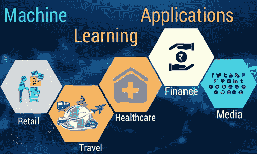
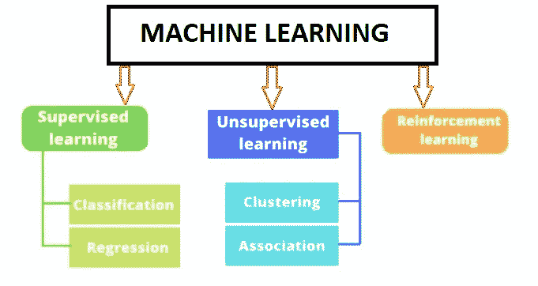

# 机器学习的应用和类型

> 原文：<https://medium.com/analytics-vidhya/applications-and-types-of-machine-learning-c177a844bf38?source=collection_archive---------10----------------------->

> 机器学习有哪些应用？机器学习的类型？

> **根据维基百科:**机器学习(ML)是对通过经验自动改进的计算机算法的研究。它被视为人工智能的一个子集。机器学习算法基于样本数据(称为“训练数据”)建立模型，以便在没有明确编程的情况下进行预测或决策。

# 机器学习的应用

# 1.机器学习在零售业中的应用

机器学习为零售业的营销和业务流程优化开辟了新的前景。为了了解机器学习在零售领域的应用，让我们来看看这项技术在零售领域的各种应用背景。

*   为零售客户提供真正个性化的产品推荐。
*   通过实时和动态的价格调整提供更好的价格来促进销售。
*   通过正确的预测制定更好的库存计划并确保更好的维护。
*   基于过去的客户数据和客户行为，提供更快、更高效的交付。
*   基于早期客户行为数据，更好地预测销售和客户服务。
*   基于应用内和网上客户行为和互动，完善应用用户体验并优化网站内容。
*   根据以前的客户行为对客户进行更好的细分。

# 2.机器学习在旅游中的应用

数据科学展示了我们未来的出行方式。如果你正在寻找如何充分利用业务活动产生的大量数据的新想法，这里有一些机器学习在旅游行业的应用。

*   的智能旅行助手搜索最便宜的报价、预订航班和酒店、规划完整的旅行，并通过有用的信息改善您的总体客户体验。
*   租车优惠、替代旅行日期或路线、根据用户偏好的新旅行目的地，甚至一些推荐的当地景点的更好的推荐平台。
*   航班价格和酒店价格根据供应商和购买预期不断变化。因此，在机器学习的帮助下，旅游业非常需要能够监控并及时发送有趣报价警报的智能工具。
*   通过使用机器学习配置文件和技术来分析客户行为，可以帮助防止和检测非法交易。

# 3.机器学习在医疗保健中的应用

越来越多的机器学习在医疗保健领域的应用让我们得以一瞥未来，数据、分析和创新携手合作，帮助无数患者，而他们甚至没有意识到这一点。

1.识别疾病和诊断

2.药物发现和制造

3.个体化用药

4.基于机器学习的行为修正

5.智能健康记录

6.临床试验和研究

7.爆发预测

# 4.机器学习在金融中的应用

*   欺诈检测:识别和防止欺诈交易需要能够分析大量数据的复杂解决方案。
*   投资预测:基金经理可以比传统投资模型更早地发现市场变化。
*   客户服务:机器学习通过让虚拟助理能够学习，给他们带来了新的变化。
*   贷款承保:向客户提供保险产品的金融机构从 ML 中获得的收益与保险公司相同。
*   流程自动化:ML 可以做的不仅仅是自动化后台和面向客户的流程。它可以解释文档，分析数据，并提出或执行智能响应。

# 5.机器学习在媒体中的应用

社交媒体营销的机器学习应用高度依赖于自然语言处理和光学字符识别等人工智能子领域。

*   文本识别:可以分析您上传的任何图像文件中的文本，然后将图像中的文本转换为有助于手写识别的文本。
*   图像识别:脸书人工智能套件中最具争议的技术是著名的人脸识别 DeepFace 网络。
*   推荐平台:个性化内容推荐是社交媒体成瘾的罪魁祸首。Instagram Explore 选项卡就是一个很好的例子，它分析了哪些帖子引起了你的兴趣，以便在 Explore 选项卡中放置类似的图片。

# 机器学习的类型

经典机器学习通常按照算法如何学习变得更加准确来分类。有三种基本方法:监督学习、非监督学习和强化学习。数据科学家选择使用的算法类型取决于他们想要预测的数据类型。

# **监督学习**

在这种类型的机器学习中，数据科学家为算法提供带标签的训练数据，并定义他们希望算法评估相关性的变量。算法的输入和输出都是指定的。

让我们以一所学校为例，一名教师要求根据随机测试来检查她的学生的表现。老师已经有了考试答案，加上学生给出的答案。现在老师会把学生的答案和实际答案进行核对，得到成绩，这就叫准确性。同样，监督学习工作，会有 2 个输出，一个是由机器给出的，另一个是实际输出。

监督学习问题可以进一步分为回归和分类问题。

## 分类:一个分类问题是当输出变量是一个类别，比如红色或蓝色或者有疾病和没有疾病。

## 回归:一个回归问题是当输出变量是一个实值，如美元或重量。

# 无监督机器学习

这种类型的机器学习涉及对未标记数据进行训练的算法。该算法扫描数据集，寻找任何有意义的联系。数据算法训练和它们输出的预测或建议都是预先确定的。

让我们以一个婴儿和她家的狗为例。婴儿认识并认出了她的狗。几个星期后，一个家庭朋友带来了一只狗，并试图与婴儿玩耍。宝宝之前没见过这只狗。但它认识到许多特征(2 只耳朵，眼睛，用 4 条腿走路)都像她的宠物狗。她认为这种新动物是一只狗。这是无监督的学习，没有人教你，但是你从数据中学习(在这种情况下是关于狗的数据。)如果这是在监督下学习的话，家庭朋友会告诉婴儿这是一只狗。

无监督学习问题可以进一步分为聚类和关联问题。

## 聚类:它主要处理在一组未分类的数据中发现一种结构或模式。聚类算法将处理您的数据，并找到数据中存在的自然聚类(组)。

## 关联:这种无监督的技术是关于在大型数据库中发现变量之间有趣的关系。例如，购买新房的人最有可能购买新家具。

# **强化学习**

强化学习通常用于教会机器完成多步过程，这些过程有明确定义的规则。强化学习就是按顺序做决定。简单来说，我们可以说，输出取决于当前输入的状态，下一个输入取决于前一个输入的输出。

让我们考虑一个你玩游戏的例子。一气呵成就能达到最后的境界。你先玩游戏，输了很多次，从错误中吸取教训，然后重新玩。强化学习也是如此。

希望你已经了解了机器学习的应用和类型。

# 参考

[1].[《机器学习教科书》](http://www.cs.cmu.edu/~tom/mlbook.html)。【www.cs.cmu.edu】T5[T6。](http://www.cs.cmu.edu./)已检索 2020 年 5 月 28 日

[2]杰森·布朗利的􀀁Book:机器学习算法大师

[3].维基百科链接:[https://en.wikipedia.org/wiki/Machine_learning](https://en.wikipedia.org/wiki/Machine_learning)

[4].[https://data-flair.training/blogs/machine-learning-tutorial](https://data-flair.training/blogs/machine-learning-tutorial/)