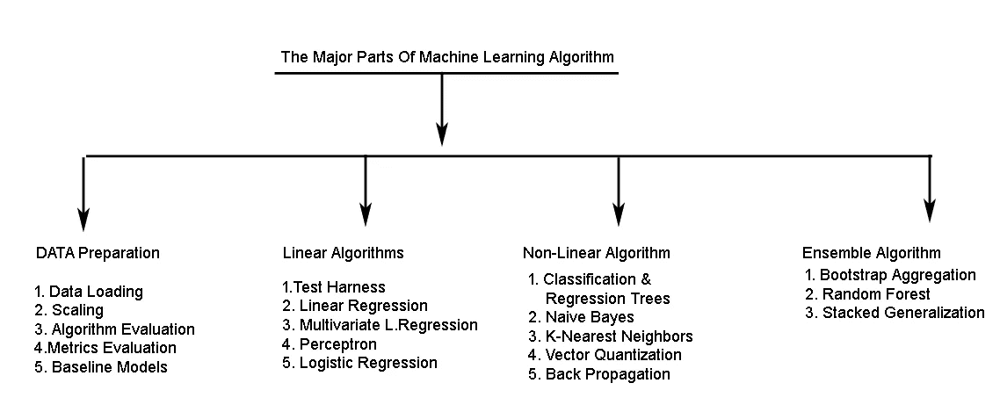

# 应用机器学习—快照

> 原文：<https://medium.com/analytics-vidhya/applied-machine-learning-snapshot-80e16e00fa1?source=collection_archive---------25----------------------->

应用机器学习是机器学习在特定数据相关问题上的应用。这可能涉及监督学习，其中有标记的训练数据，也可能涉及非监督学习模型，其中可以根据未标记的数据进行分析。因此，统计算法和技术被用来对数据进行分类和处理。应用机器学习是一个具有挑战性的过程，因为我们必须找到一种最适合该问题的算法。

solébikes 在 [Unsplash](https://unsplash.com?utm_source=medium&utm_medium=referral) 上拍摄的照片

**应用机器学习有 4 个基本部分和子部分:**

1.  **数据准备:**
    **数据加载:**是从标准文件格式(如 Excel、CSV 等)加载和操作数据的过程。
    **缩放数据:**过程准备数值数据以学习算法。
    **算法评估:**这是根据看不见的数据来评估算法性能的技术。
    **指标评估:**对新数据的预测技巧进行评分和评估。
    **基线创建:**建立劣质案例以改善由此产生的问题的技术。

**2。线性算法:**
**测试利用:**将之前的部分数据汇集在一起，对同一问题的不同技术进行评估。
**线性回归:**预测单个输入的数值。
**多元线性回归:**预测有多个输入变量的数值。逻辑回归:根据两个问题预测类别值。还有…

**感知器:**感知器是二进制分类器监督学习下的机器学习中的算法。它是一个线性分类器，根据一个线性预测函数结合一组权重和特征向量进行预测。

**3。非线性算法**
**分类和回归树(CART) :**
**决策树**是一种来自监督机器学习的算法类型。这解释了训练数据中的输入及其对应的输出，其中数据根据某个参数被连续分割。两个决策实体是节点和叶子。

**朴素贝叶斯:**是贝叶斯定理的一种分类技术。这假定一个类中某个特定特性的存在与该类中任何其他特性的存在无关。假设显示预测者之间的独立性。

**K-最近邻(KNN):** 用于预测训练数据的分类或数值输出。
**矢量量化:**这是一种神经网络，比 k 近邻更有效。
**反向传播:**就是“误差的反向传播”。人工神经网络和误差函数的监督学习的最广泛使用的算法。这是深度学习的边界领域。该方法计算误差函数的梯度(梯度下降),取其权重。

**4。集成算法:**

是使用几种模型帮助改进机器学习结果的方法。
**Bootstrap 聚合:**涉及决策树的集合。这也被称为装袋。
**随机森林:**产生更快训练和更好性能的算法。
**堆叠概括:**一种集成技术，也称为堆叠或混合，它学习如何组合来自多个模型的预测。

**图解快照**

