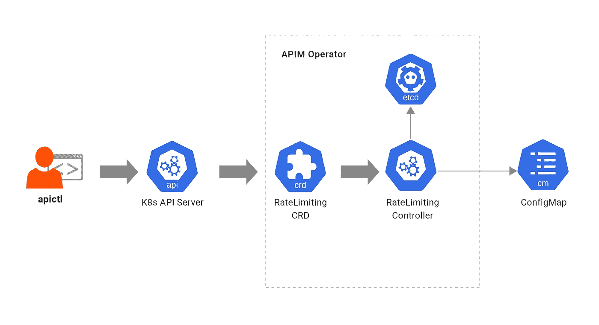
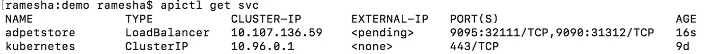
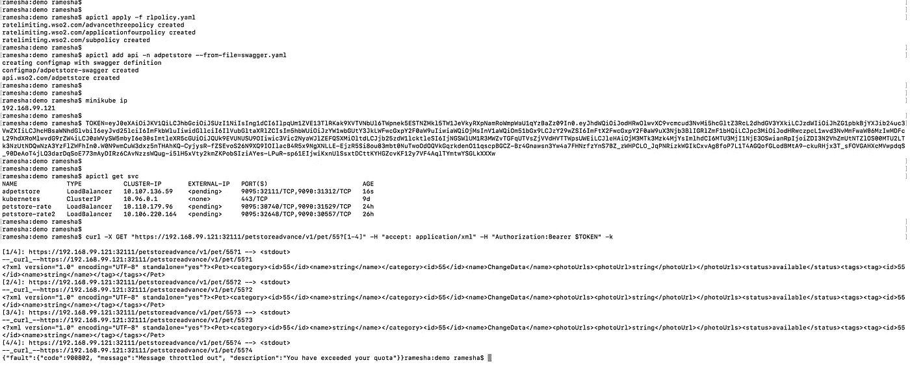

# 在 Kubernetes 为你的微服务申请商业计划

> 原文：<https://medium.com/analytics-vidhya/apply-a-business-plan-for-your-micro-service-in-kubernetes-33e46bf33f15?source=collection_archive---------21----------------------->


在 kuberenetes 中部署微服务已经在很短的时间内在容器化技术中取得了很大的进展。随着 kubernetes 带来的部署微服务的便利，合并业务计划来管理这些微服务的需求也在增加。

让我们看看如何将商业计划应用到你的微服务中，并通过 4 个步骤将它作为一个管理 API。

# 先决条件

1.  [库贝克特尔](https://kubernetes.io/docs/tasks/tools/install-kubectl/)
2.  [Kubernetes v1.12 或以上](https://kubernetes.io/docs/setup/)
3.  DockerHub 或私有 docker 注册表中的帐户
4.  Kubernetes 的 API 操作员。下载 [api-k8s-crds-1.0.0.zip](https://github.com/wso2/k8s-apim-operator/releases/download/v1.0.0/api-k8s-crds-1.0.0.zip) 并解压
5.  从[https://github.com/wso2/product-apim-tooling/releases/](https://github.com/wso2/product-apim-tooling/releases/)下载适用于您的操作系统的 API 控制器 3.0.0 版

让我们亲自动手，一步一步地钻研这个过程。

# 步骤 1:为 Kubernetes 部署 API 操作符

用于 Kubernetes 的 API Operator 是一个方便的工具，可以在 Kubernetes 中将您的微服务部署为托管 API，并使用业务计划和安全计划来管理它们，没有任何麻烦。在这里，我将使用 Kubernetes 的 API 操作符来将我们的微服务部署为 Kubernetes 中的托管 API，并应用业务计划来限制资源的 API 请求数量。

1.  导航到先决条件 4 中解压缩的 zip 中的 *api-k8s-crds-1.0.0* 目录
2.  部署与 API 操作符相关的工件

```
kubectl apply -f apim-operator/controller-artifacts/
```

3.Kubernetes 的 API 操作符通过将托管 API 映像推送到 DockerHub，使它可以在另一个集群中重用。您可以按如下方式输入 DockerHub 信息，并部署控制器配置。

*   打开 apim-operator/controller-configs/controller _ conf . YAML，更新*用户的 docker 注册表*。

```
dockerRegistry: <username-docker-registry>
```

*   打开 apim-operator/controller-configs/Docker _ secret _ template . YAML .
    输入 Docker-Hub 帐户的 base 64 编码用户名和密码

```
data:
 username: ENTER YOUR BASE64 ENCODED USERNAME
 password: ENTER YOUR BASE64 ENCODED PASSWORD
```

*   执行以下命令来部署控制器配置。

```
kubectl apply -f apim-operator/controller-configs/
```

4.配置 [API 控制器](https://wso2.com/api-management/tooling/)，这是一个综合的命令行工具，用于处理与 API 操作符相关的操作。

*   提取 API 控制器发行版，并使用命令行工具在提取的文件夹中导航
*   将提取的文件夹的位置添加到系统的 PATH 变量中，以便能够从任何地方访问可执行文件。
*   将 API 控制器的模式设置为 Kubernetes

```
apictl set --mode k8s
```

# 步骤 2:在集群中部署您的业务计划

您可以使用 RateLimiting 类型定义您的业务计划，并在集群中部署它。

有 3 种限速类型:*提前、订阅*和*申请*；这允许您在不同的基础上限制 API 请求的数量。在这篇博客中，我们将讨论高级类型，这实际上是最简单的类型，它允许您限制所有用户对特定资源或 API 的 API 请求数量。

让我们定义我们的业务策略，每分钟只允许 3 个请求。

```
apiVersion: wso2.com/v1alpha1
kind: RateLimiting
metadata:
  name: advancethreepolicy
spec:
  type: advance
  description: Allow 3 requests per minute   # optional
  timeUnit: min
  unitTime: 1
  requestCount:
    limit: 3
```

让我们在 kubernetes 集群中部署它。(rlpolicy.yaml 是上述策略的文件名)

```
apictl apply -f rlpolicy.yaml
```



限速控制器的体系结构

当您在业务计划中部署速率限制 CRD 时，速率限制控制器会创建一个包含您已部署的所有策略的配置图。

# **第三步:在招摇定义中引用你的商业计划**

您可以使用 swagger 定义，用您的业务计划策略、安全策略和微服务的端点来定义您的托管 API。

你可以在这里 找到一个 swagger 定义 [**的例子。我已经用扩展“x-wso2-throttling-tier”定义了要应用于整个 API 的策略。如果您想要限制对一个资源的 API 请求的数量，您可以在资源级别以同样的方式定义它。**](https://github.com/RameshaKaru/crd-demo/blob/master/swagger.yaml)

```
x-wso2-throttling-tier: advancethreepolicy
```

在示例 swagger 文件中，我使用了来自 swagger.io 的样本 Petstore。

```
x-wso2-production-endpoints: 
  urls: — [https://petstore.swagger.io/v2](https://petstore.swagger.io/v2)
```

您可以通过“x-wso2-production-endpoints”扩展以同样的方式使用部署在 kubernetes 中的微服务的端点。

# **步骤 4:使用 swagger 部署您的托管 API**

最后一步，让我们在 Kubernetes 中部署我们的托管 API。

```
apictl add api -n adpetstore --from-file=swagger.yaml
```

API 操作者将运行 kaniko 作业，用给定的 swagger 文件和在步骤 2 中创建的策略配置图来创建微网关的映像。

API 服务需要一些时间才可用。在 API 服务可用之后，我们可以调用 API 并测试我们的业务计划是否得到应用。



```
TOKEN=eyJ0eXAiOiJKV1QiLCJhbGciOiJSUzI1NiIsIng1dCI6IlpqUm1ZVE13TlRKak9XVTVNbUl6TWpnek5ESTNZMkl5TW1JeVkyRXpNamRoWmpWaU1qYzBaZz09In0.eyJhdWQiOiJodHRwOlwvXC9vcmcud3NvMi5hcGltZ3RcL2dhdGV3YXkiLCJzdWIiOiJhZG1pbkBjYXJib24uc3VwZXIiLCJhcHBsaWNhdGlvbiI6eyJvd25lciI6ImFkbWluIiwidGllciI6IlVubGltaXRlZCIsIm5hbWUiOiJzYW1wbGUtY3JkLWFwcGxpY2F0aW9uIiwiaWQiOjMsInV1aWQiOm51bGx9LCJzY29wZSI6ImFtX2FwcGxpY2F0aW9uX3Njb3BlIGRlZmF1bHQiLCJpc3MiOiJodHRwczpcL1wvd3NvMmFwaW06MzIwMDFcL29hdXRoMlwvdG9rZW4iLCJ0aWVySW5mbyI6e30sImtleXR5cGUiOiJQUk9EVUNUSU9OIiwic3Vic2NyaWJlZEFQSXMiOltdLCJjb25zdW1lcktleSI6IjNGSWlUM1R3MWZvTGFqUTVsZjVVdHVTTWpsUWEiLCJleHAiOjM3MTk3Mzk4MjYsImlhdCI6MTU3MjI1NjE3OSwianRpIjoiZDI3N2VhZmUtNTZlOS00MTU2LTk3NzUtNDQwNzA3YzFlZWFhIn0.W0N9wmCuW3dxz5nTHAhKQ-CyjysR-fZSEvoS26N9XQ9IOIlacB4R5x9NgXNLLE-EjzR5Si8ou83mbt0NuTwoOdOQVkGqrkdenO11qscpBGCZ-Br4Gnawsn3Yw4a7FHNrfzYnS7BZ_zWHPCLO_JqPNRizkWGIkCxvAg8foP7L1T4AGQofGLodBMtA9-ckuRHjx3T_sFOVGAHXcMVwpdqS_90DeAoT4jLQ3darDqSoE773mAyDIRz6CAvNzzsWQug-i5lH5xVty2kmZKPobSIziAYes-LPuR-sp61EIjwiKxnUlSsxtDCttKYHGZcvKF12y7VF4AqlTYmtwYSGLkXXXw
```

现在让我们用默认的 JWT 令牌调用 API，它允许所有用户。

```
curl -X GET "https://<external IP of LB service>:9095/petstoreadvance/v1/pet/55" -H "accept: application/xml" -H "Authorization:Bearer $TOKEN" -k
```

如果您使用 GKE 集群，您可以使用我们部署的托管 API 服务的外部 IP(adpet store)。如果您使用的是 minikube，您可以使用节点端口，该服务与 minikube IP 一起公开。

作为一个例子，你可以看到我在 minikube 中使用的以下命令。

```
curl -X GET "https://192.168.99.121:32111/petstoreadvance/v1/pet/55?[1-4]" -H "accept: application/xml" -H "Authorization:Bearer $TOKEN" -k
```

因为我们应用了我们的商业计划，允许我们的微服务每分钟只有 3 个请求，从下面的截图你可以看到第 4 个请求已经被抑制了。



在这篇博客中，我们能够用 4 个简单的步骤为我们的微服务应用一个商业计划，每分钟只允许 3 个请求。

希望你喜欢我的博客，如果你想监控我们上面部署的 API 的统计数据，你可以关注下面的文章。

[https://medium . com/@ ramesha . karu/monitor-the-statistics-of-your-micro-service-in-kubernetes-f 649 f 8960 b0a](/@ramesha.karu/monitor-the-statistics-of-your-micro-service-in-kubernetes-f649f8960b0a)