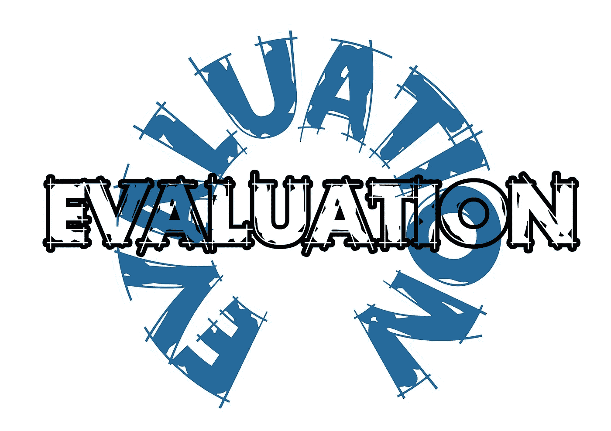

# 应用 PyTorch 中的任何指标

> 原文：<https://medium.com/analytics-vidhya/apply-any-metrics-in-pytorch-16e281e06699?source=collection_archive---------19----------------------->

在本文中，我们将了解如何在 pytorch 代码中应用 scikit learn 库中的任何指标。



因此，在我们的训练循环中，当我们做 ***模型(input _ data _ from _ data loader)***时，它将为我们的回归模型 或 ***给出我们 n 个分类类别*** 的 ***回归输出。现在，如果我们在 GPU 或 TPU 中训练我们的模型，那么我们需要借助这段代码将我们的预测和实际值分离到 CPU，并将它们的类型更改为 numpy 数组。***

```
**real_targets** = **real_targets**.detach().cpu().numpy()
**predicted_targets** = **predicted_targets**.detach().cpu().numpy()
```


在这之后，我们需要理解，我们的度量标准想要输入什么。如果它要求对其实际目标和预测目标的所有输出数据进行一次预测，那么我们编写以下代码:

```
total_sum = 0for i,j **in** zip(**real_targets**, **predicted_targets**):
    total_sum  += [sklearn.metrics](https://scikit-learn.org/stable/modules/classes.html#module-sklearn.metrics).**OUR_REQUIRED_METRIC**(i, j)***# Keep on taking the total sum value from each batches of dataloader***
final_sum = final_sum + total_sum***# taking the average of all sum we obtained* REQUIRED_ACCURACY_PERCENTAGE** = final_sum/***number_of_data_in_dataframe***
```


如果我们的度量要求所有预测的数组以及所有目标的数组，那么我们需要像这样进行度量评估

```
all_targets = 0
all_predictions = 0***# for each batch of training and validation do this***
if batch_index_number > 0:
     all_targets = np.concatenate((all_targets, **real_targets**), axis=0)
     all_predictions = np.concatenate((all_predictions, **predicted_targets**), axis=0)else:
     all_targets = **real_targets**
     all_predictions = **predicted_targets****# finally calculating the value of evaluation metric like this *REQUIRED_ACCURACY_PERCENTAGE* =** [sklearn.metrics](https://scikit-learn.org/stable/modules/classes.html#module-sklearn.metrics).**OUR_REQUIRED_METRIC**(all_targets, all_predictions)
```

阅读这里写的每一行代码前的注释，以便更好地理解。如果你对这篇文章还有任何问题，那么不要忘记在下面的评论中提问，在此之前祝你学习愉快。