# 应用人工神经网络|数字和时尚 MNIST

> 原文：<https://medium.com/analytics-vidhya/applying-ann-digit-and-fashion-mnist-13accfc44660?source=collection_archive---------2----------------------->

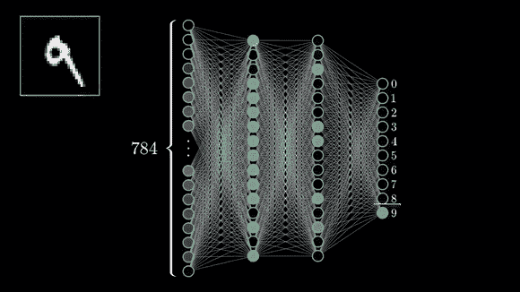

# 介绍

深度学习开启了增加处理数据集的计算能力的新时代。此外，它还为处理图像、音频和视频数据等非结构化数据铺平了道路，而正常的机器学习模型需要花费更长的时间来训练这些数据。在神经网络和反向传播的帮助下，我们可以最小化预测中的损失，并且更加准确。

## 什么是深度学习？

深度学习是机器学习的一部分，其中模型在类似人脑的深度神经网络的帮助下学习。复杂的数据问题很快就可以借助深度学习解决。

## 图像分类

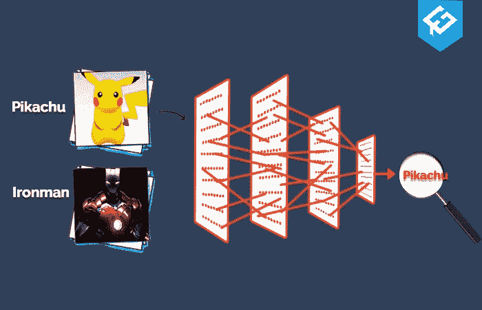

如果你给一个人一个苹果，他/她很容易认出这个苹果是一个红色的水果，并把它命名为“苹果”。在内部，这个人的大脑捕捉苹果的图像，并将其与这个人以前见过的历史图像(训练数据)和告诉他苹果的人(标签)进行比较。在这些数据和标签的帮助下，他的大脑被训练来对任何给他的水果进行分类。同样可以输入到训练过的神经网络，它会输出给我们图像的名称。

## 承认

1.  [Keras 文档](https://keras.io/)
2.  [安](https://www.kaggle.com/nareshbhat/fashion-mnist-a-gentle-introduction-to-ann)的温柔介绍——纳雷什·巴特
3.  [安与克拉斯综合指南](https://www.kaggle.com/prashant111/comprehensive-guide-to-ann-with-keras)——普拉尚·班纳吉

## 问题陈述

在这里，我们处理两个数据集，一个是 MNIST(改进的国家标准和技术研究所数据库)，这是一个手写数字的大型数据库，通常用于训练各种图像处理系统，另一个是时尚 MNIST，这也是一个关于服装服饰的大型数据库。我们的工作是建立一个高效的深度学习模型来识别手写数字和服装配饰。

## 项目目标

项目的目标包括-

1.  MNIST 探索性数据分析
2.  数据预处理
3.  构建深度学习模型(ANN)
4.  模型评估

**注意:**这是我的第一个深度学习项目，我考虑了时尚 MNIST 和数字 MNIST 数据集进行练习。

## 导入库

## 加载两个数据集

让我们欢迎我们的 MNIST 数据集

## 影像数据集看起来如何？

您可能会想到训练和测试数据集中只有图像的数据集，但计算机不理解图像，而是理解数字。让我们看看它看起来怎么样

```
fashion_train.head()
```

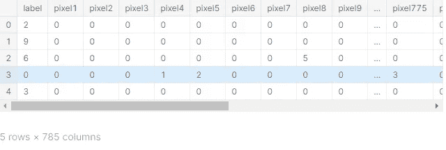

在时尚 mnist 数据集中，标签号不是指数字本身，而是服装配饰的 id。我们可以从记录中给定的 pixedl 值获得图像。每个像素值在 0 到 255 之间变化。较高的强度值(255)类似于颜色，较低的强度值(0)是白色。中间有很多阴影。

## 列车测试分体式 MNIST

我们需要将时尚 MNIST 数据集分为输入数据和标签数据。我们的 MNIST 已经被提取为 X-y 训练测试数据，所以不需要分割它

```
X_train_fashion = fashion_train.drop('label',axis = 1)
y_train_fashion = fashion_train['label']
X_test_fashion = fashion_test.drop('label',axis = 1)
y_test_fashion = fashion_test['label']
```

# 探索性数据分析

## 将数字可视化

让我们看看每个数据集中的图像。但是在我们的时尚数据集中进行分割之前，数据格式是在数据帧中，在这种情况下，我们无法查看图像，因此在此之前，我们将重塑我们的数据帧，并将其放入数组中，以获得数据集中的每个图像

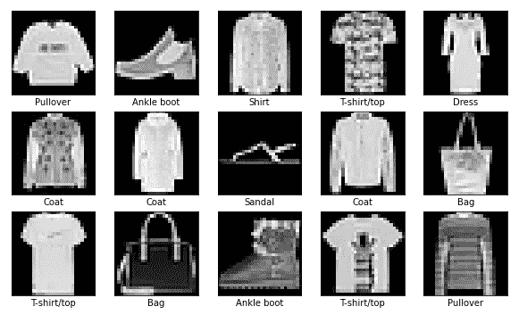

在这里，我们可以看到不同类型的服装配件为男性和女性在时尚 mnist

```
*#Names of numbers in the dataset in order*
col_names = ['Zero','One','Two','Three','Four','Five','Six','Seven','Eight','Nine']

*#Visualizing the digits*
plt.figure(figsize=(10,10))
for i **in** range(15):
    plt.subplot(5,5,i+1)
    plt.xticks([])
    plt.yticks([])
    plt.imshow(X_train_digit[i], cmap='gray')
    plt.xlabel(col_names[y_train_digit[i]])
plt.show()
```

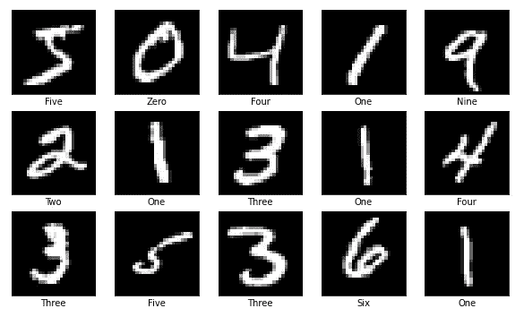

在这里，我们可以看到来自 mnist 数据集的手写数字。如果你注意到所有的手写记录都互不相同，这使得计算机很难预测，但神经网络可以轻松做到这一点

## 图像的像素强度

我们知道 RGB 的值在 0 到 255 之间，其中 0 是最低强度(黑色)，255 是最高强度(白色)。让我们借助从 [Naresh Bhat 的笔记本](https://www.kaggle.com/nareshbhat/fashion-mnist-a-gentle-introduction-to-ann)中获取的惊人函数来检查每个像素的像素强度

```
*#Visualizing for digit MNIST*
fig = plt.figure(figsize = (12,12)) 
ax = fig.add_subplot(111)
visualize_input(X_train_digit[1], ax)
plt.show()
```

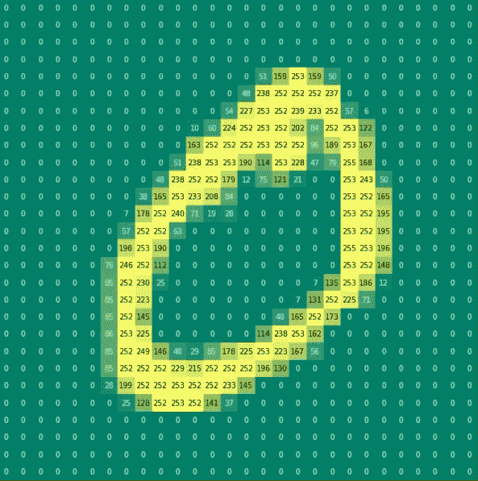

我们拍摄了“0”图像，您可以发现所有亮度最高的像素(范围在 220–255 之间)都有明亮的颜色，其余(绿色)的亮度为 0

```
*#Visualizing for Fashion MNIST*
fig = plt.figure(figsize = (12,12)) 
ax = fig.add_subplot(111)
visualize_input(x_train_reshape[1], ax)
plt.show()
```

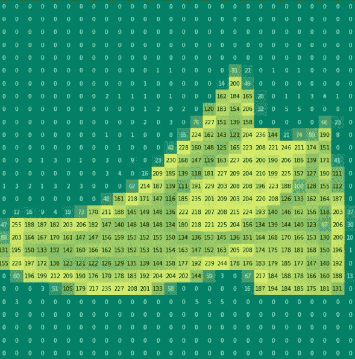

我们拍摄了鞋子的图像，你可以发现所有亮度在 220-255 之间的像素都有明亮的颜色，其余的(绿色)亮度为 0。这里也有物体内部的暗亮度像素，它也已经被捕获

## MNIST 的标签数量

```
*#Setting plot size*
sns.set(rc={'figure.figsize':(11.7,8.27)})

*#Getting dataframe data*
mnist=pd.read_csv("../input/digit-recognizer/train.csv")

*#Countplot*
ax = sns.countplot(x="label", data=mnist,
                   facecolor=(0, 0, 0, 0),
                   linewidth=5,
                   edgecolor=sns.color_palette("dark", 3),
                   order = mnist['label'].value_counts().index)
```

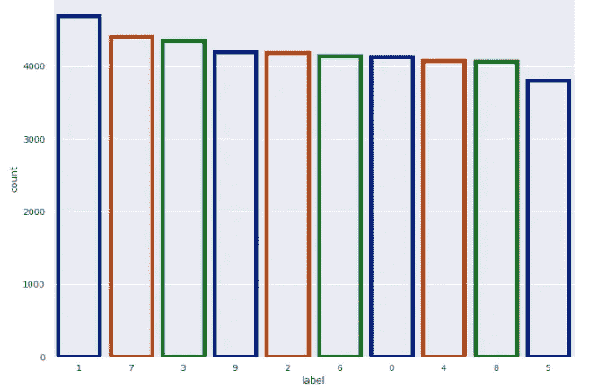

**感悟:**

*   MNIST 数据集的标签非常均衡。
*   标签的最大数量是“1”，其次是“7”和“3”。

没有必要分析时尚 MNIST，因为每个标签的数据正好有 6000 条记录

# 数据处理

## 重塑数字 MNIST

数字 MNIST 的形状是在 2D 数据中提取的，由于它只允许 1D 数据，所以不能馈送给神经网络，所以我们借助于整形函数来转换它们。让我们通过检查训练数据的维度来确认。

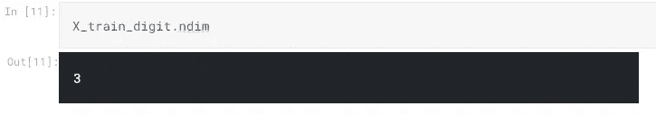

这里的维度显示为 3，其中第一个维度属于记录，后面是 2D 数据。让我们检查形状。

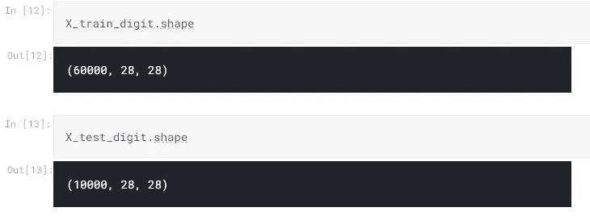

从火车形状可以看出我们有(6000，28，28)。这里，6000 是我们拥有的记录数，28X28 是 2D 数据的维数。现在它可以表示为 784(28X28)，这是一个一维数据。通过转换成 1D，我们可以将数据输入神经网络进行训练。现在使用整形功能，

```
X_train_digit = X_train_digit.reshape(60000, 784)
X_test_digit = X_test_digit.reshape(10000, 784)
```

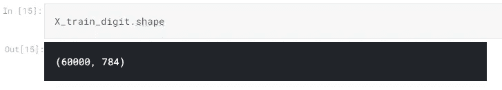

## 给标签编码

我们的 MNIST 数据集在两个数据集中各有 10 个类。现在，让我们借助 Keras utils 库中的 to _ categorical()函数对数据集中的标签类进行编码。如果标签是“5 ”,它将在向量的第五个位置编码为 1，对于所有的类标签依此类推。让我们直观地看一下

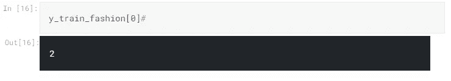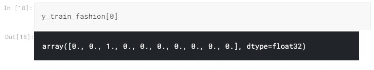

从结果中我们可以看到，数字 2 在向量的第二个位置被激活，从而被编码。这类似于一个热编码。

# 构建深度学习模型——人工神经网络

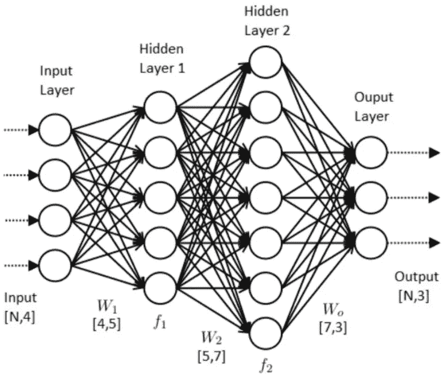

人工神经网络类似于大脑的神经网络，在输入和输出层之间具有密集连接的神经元。它有一个隐藏层，内部处理发生在人工神经网络中。神经网络的目标是通过使用被称为反向传播的学习方法来最小化损失(实际预测),在反向传播中，权重在每个连接层中被重新初始化许多个时期，通过这些时期损失被最小化。

首先，让我们构建并编译一个没有任何超参数调整的人工神经网络模型，然后我们应用超参数调整来了解模型精度如何提高

在这一阶段，我们遵循 3 个步骤

1.  定义模型
2.  用损失函数编制模型
3.  使模型符合我们的数据

## 定义模型

为了定义模型，我们需要 Sequential()函数来帮助我们建立基础神经网络，我们必须在此基础上决定密集层和神经元。

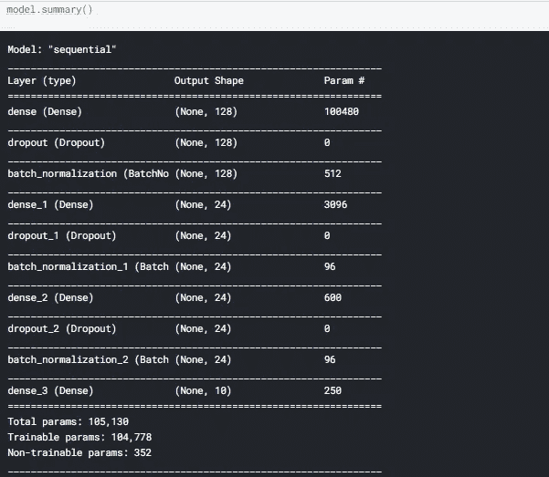

*   我们对隐藏层使用 relu 激活函数，对输出层使用 sigmoid
*   因为我们没有标准化我们的数据集，所以我们使用 BatchNormalization()函数在神经网络中进行标准化
*   我们也在考虑每个隐藏层中的丢弃层，以减少过度拟合的机会

## 编译模型

神经网络的基本模型已经准备好了。是时候为神经网络连接大脑了。在这一部分中，我们告诉神经网络如何学习模型，其中我们表示损失函数的类型以及要使用的优化器和指标。

*   **优化器:** Adam 是一种优化算法，可用于替代经典的随机梯度下降过程，根据训练数据迭代更新网络权重。它不像 SGD 那样需要一个恒定的学习速率，而是在每个周期中改变学习速率
*   **损失函数:**分类交叉熵是用于多类分类任务的损失函数。在这些任务中，一个示例只能属于许多可能类别中的一个，模型必须决定属于哪一个。从形式上来说，它被设计用来量化两个概率分布之间的差异。
*   **指标:**准确度是正确预测的数量与输入样本总数的比率。

```
*#Compiling the model*
model.compile(loss="categorical_crossentropy",
              optimizer="adam",
              metrics = ['accuracy'])
```

# 拟合模型

现在，是时候训练我们的神经网络了。因为我们在这里没有使用任何超参数训练。我只是给出了在这种情况下表现更好的批量大小和时期的值。

```
model.fit(X_train_digit, y_train_digit, batch_size=100, epochs=30)
```

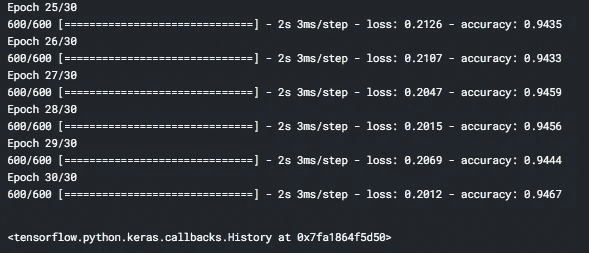

最后 5 个纪元

从训练结果中我们可以看到，在仅仅 30 个时期之后，准确度已经提高到大约 95%,并且损失值是 0.19，这是非常好的。通过超参数调谐，我们可以获得更高的精度

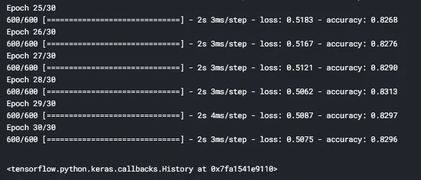

最后 5 个纪元

对于时尚 MNIST 数据集，我们获得了 83%的准确率，损失大约为 0.5，这是很好的，但可以通过超参数调整或 CNN 网络来做得更好。让我们用测试数据来评估这个模型

# 模型评估

# 测量精度

现在是时候检查我们的模型在得到看不见的数据时的表现了。我们有来自 keras 的 evaluate()函数来评估我们的训练模型，让我们使用它来获得两个数据集的测试准确性

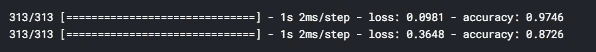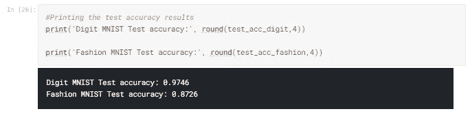

从结果中我们可以看到，与时尚 MNIST 数据(87%)相比，数字 MNIST 数据在测试数据上表现更好(97%)。但是在使用超参数调优之后，情况可能会发生变化。让我们展示混淆矩阵

## 混淆矩阵

让我们看看有多少标签被正确分类，有多少被错误分类

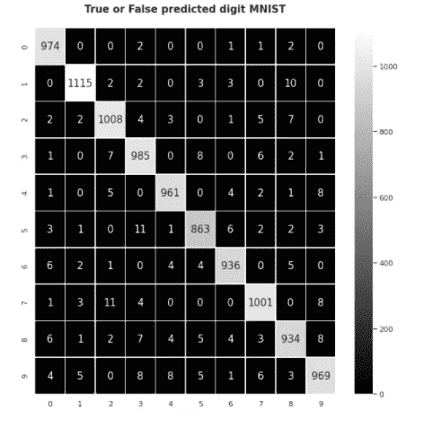

```
*#Confusion matrix for Fashion MNIST*
con_mat=confusion_matrix(y_test_fash_eval,y_predict_fash)
plt.style.use('seaborn-deep')
plt.figure(figsize=(10,10))
sns.heatmap(con_mat,annot=True,annot_kws={'size': 15},linewidths=0.5,fmt="d",cmap="gray")
plt.title('True or False predicted Fashion MNIST**\n**',fontweight='bold',fontsize=15)
plt.show()
```

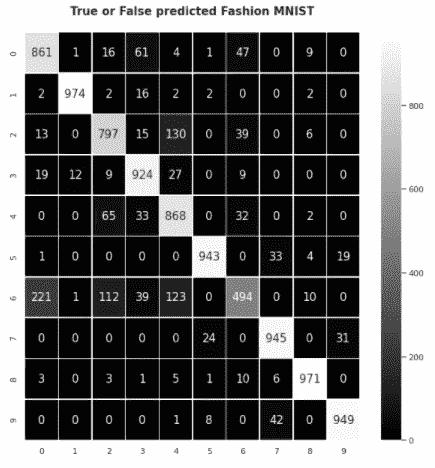

从结果中我们可以看出，矩阵显示出大部分标签被正确分类的积极结果，并且有很少的标签被错误分类(不在对角线部分的数字)。

如果你注意到与时装模特相比，模特做得无可挑剔。在时尚界，与其他产品相比，mnist 标签 6 的产品被错误地分类。

现在让我们尝试超参数调整，看看它是否得到改善。

# 人工神经网络中超参数调整

超参数是决定网络结构的变量(例如:隐藏单元的数量)和决定如何训练网络的变量(例如:学习速率)。在训练之前(在优化权重和偏差之前)设置超参数。谈到这个问题，我们有很多参数

1.  层数
2.  每层中的神经元数量
3.  批量
4.  纪元
5.  【计算机】优化程序
6.  损失函数
7.  激活

**注意:**我没有涵盖所有参数的超参数调整，因为它将有很高的计算量，并且它需要一个具有更好工作站的好设备来平稳运行。

## 数字 MNIST 超参数调谐

现在，让我们设置超参数的数字 MNIST 模型，并重复同样的时尚 MNIST

```
*#Fitting the params with the training data to figure out the best params and accuracy score*
grid_result = grid.fit(X_train_digit, y_train_digit)

print(grid_result.best_score_,grid_result.best_params_)
```

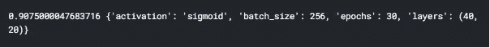

我们已经得到了 91%的最佳分数和参数，其中我们选择 sigmoid 作为激活函数，具有 256 个批量和 40，20 个隐藏层

## 超参数调整后的模型评估

我们取得了相当好的结果。让我们用测试数据来评估调整后的模型

```
*#Predicting from the params we got from grid search cv*
pred_y = grid.predict(X_test_digit)

y_test_digit=np.argmax(y_test_digit, axis=1)

*#Confusion matrix*
con_mat=confusion_matrix(y_test_digit,pred_y)
plt.style.use('seaborn-deep')
plt.figure(figsize=(10,10))
sns.heatmap(con_mat,annot=True,annot_kws={'size': 15},linewidths=0.5,fmt="d",cmap="gray")
plt.title('True or False predicted digit MNIST**\n**',fontweight='bold',fontsize=15)
plt.show()
```

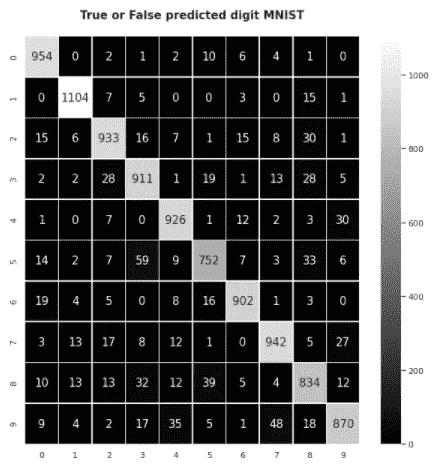

我们得到了 91%的准确度，这与没有超参数调谐的情况相比是相当差的。这可能是由于我在这里没有辍学的事实。

## 时尚 MNIST-超参数调谐

是时候调整我们的时尚 MNIST 模型了

```
def create_model_fash(layers, activation):
    model = Sequential()
    for i, nodes **in** enumerate(layers):
        if i==0:
            model.add(Dense(nodes,input_dim=X_train_fashion.shape[1]))
            model.add(Activation(activation))
            model.add(Dropout(0.3))
        else:
            model.add(Dense(nodes))
            model.add(Activation(activation))
            model.add(Dropout(0.3))

    model.add(Dense(units = 10, kernel_initializer= 'glorot_uniform', activation = 'softmax')) 

    model.compile(optimizer='adam', loss='categorical_crossentropy',metrics=['accuracy'])
    return model*#Using Keras classifier to apply the function*
model4 = KerasClassifier(build_fn=create_model_fash, verbose=0)

*#Tuning the layers, activation function and batch sizes*
layers = [(20,), (40, 20), (45, 30, 15)]
activations = ['sigmoid', 'relu','softmax']
param_grid = dict(layers=layers, activation=activations, batch_size = [128, 256], epochs=[30])

*#Using GridSearchCV to fit the param dictionary*
grid = GridSearchCV(estimator=model4, param_grid=param_grid,cv=5)
```

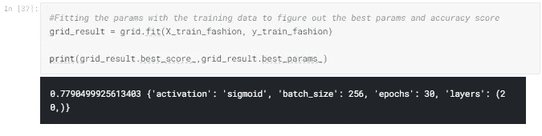

我们只有 78%的准确度，这与没有超参数调谐的情况相比是很差的。只有一个隐藏层是用 sigmoid 激活选择的，这里也没有删除层。

```
*#Predicting from the params we got from grid search cv*
pred_y = grid.predict(X_test_fashion)

y_test_fashion=np.argmax(y_test_fashion, axis=1)

*#Confusion matrix*
con_mat=confusion_matrix(y_test_fashion,pred_y)
plt.style.use('seaborn-deep')
plt.figure(figsize=(10,10))
sns.heatmap(con_mat,annot=True,annot_kws={'size': 15},linewidths=0.5,fmt="d",cmap="gray")
plt.title('True or False predicted fashion MNIST**\n**',fontweight='bold',fontsize=15)
plt.show()
```

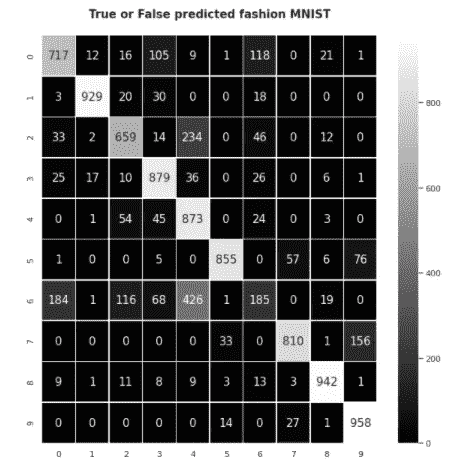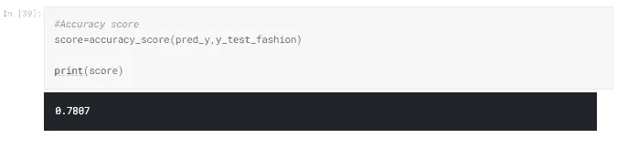

经过调优，我们在时尚 MNIST 模型上获得了 78%的测试准确率。你可以注意到标签 6 和 4 产品被错误分类了很多。你可以通过在参数字典中添加更多的参数来尝试调整，并获得比这更好的结果

# 结论


我们已经得出结论，我想总结一下我们在项目中所做的工作。我们采用了两个流行的 MNIST 数据集并对其进行预处理。我们后来创造了一个人工神经网络。此外，我们在人工神经网络中进行超参数调整，并获得了最佳的准确性。在结束之前，我想指出可以进一步做的事情

1.  可以调整更多的参数
2.  超参数调整也可以通过选择神经元的数量来完成
3.  可以执行诸如提前停止和批处理规范化之类的技术

感谢大家看完整篇文章。如果你对我的工作有任何重要的反馈或建议，请在评论中提出。

在这里找到我的其他文章