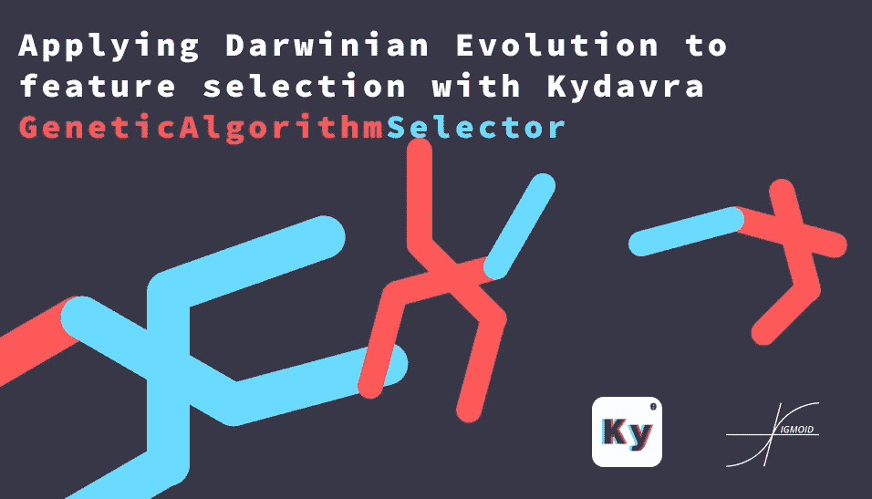

# 用 Kydavra 遗传算法选择器将达尔文进化应用于特征选择

> 原文：<https://medium.com/analytics-vidhya/applying-darwinian-evolution-to-feature-selection-with-kydavra-geneticalgorithmselector-6ca8341cd2f9?source=collection_archive---------30----------------------->



机器学习的发展蕴含了大量的数学知识。但有时在特征选择阶段，数学有时不能给出准确的答案(因为数据的结构、来源和许多其他原因)。然后游戏内进入编程招数，多为蛮力方法:)。

遗传算法是一系列受生物进化启发的算法，基本上使用循环——交叉、变异、尝试，根据评分标准开发最佳状态组合。所以，让我们来看看代码。

## 使用 Kydavra 库中的 GeneticAlgorithmSelector。

要安装 kydavra，只需在终端中写入以下命令:

```
pip install kydavra
```

现在，您可以导入选择器并将其应用于数据集，如下所示:

```
from kydavra import GeneticAlgorithmSelectorselector = GeneticAlgorithmSelector()new_columns = selector.select(model, df, ‘target’)
```

就像所有的 Kydavra 选择器一样。现在让我们在 Hearth disease 数据集上尝试一下。

```
import pandas as pddf = pd.read_csv(‘cleaned.csv’)
```

我强烈建议您在应用选择器之前对数据集进行洗牌，因为它使用了度量标准(目前 cross_val_score 还没有在这个选择器中实现)。

```
df = df.sample(frac=1).reset_index(drop=True)
```

现在我们可以应用我们的选择器。提到它有一些参数:

*   **nb_children** (int，default = 4)算法将为下一代选择的最佳子代的数量。
*   **nb_generation** (int，default = 200)将要创建的代数，技术上讲就是迭代次数。
*   **scoring _ metric**(sk learn scoring metric，默认= accuracy_score)用于选择最佳特征组合的度量分数。
*   **max** (boolean，default=True)如果设置为 True，算法将选择得分最高的组合，如果设置为 False，将选择得分最低的组合。

但是现在，我们将使用除 scoring_metric 之外的基本设置，因为我们有一个疾病诊断的问题，所以最好使用 Precision 而不是 accuracy。

```
from kydavra import GeneticAlgorithmSelectorfrom sklearn.metrics import precision_scorefrom sklearn.ensemble import RandomForestClassifierselector = GeneticAlgorithmSelector(scoring_metric=precision_score)model = RandomForestClassifier()
```

所以现在让我们找到最好的特性。GAS(genetical gorithm selector 的简称)在选择特征、数据框本身以及目标列的名称的过程中需要一个 sklearn 模型进行训练:

```
selected_cols = selector.select(model, df, 'target')
```

现在我们来评估结果。在特征选择之前，随机森林的精度分数是-0.805。气体选择以下特性:

```
['age', 'sex', 'cp', 'fbs', 'restecg', 'exang', 'slope', 'thal']
```

这给出了下面的精度分数——0.823。这是一个好结果，要知道在大多数情况下很难提高评分标准。


如果你想了解更多关于遗传算法的信息，文章底部有一些有用的链接。如果您尝试了 Kydavra，并且有一些问题或反馈，请通过 medium 与我联系，或者请填写此[表格](https://vpapaluta.typeform.com/to/g1EXxlSf)。

由西格蒙德用❤制成

有用的链接:

*   [https://towards data science . com/the-most-important-part-in-artificial-intesystems-development-243 f 04 f 73 fcd](https://towardsdatascience.com/the-most-important-part-in-artifical-intesystems-development-243f04f73fcd)