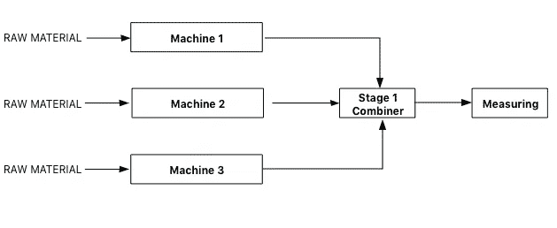
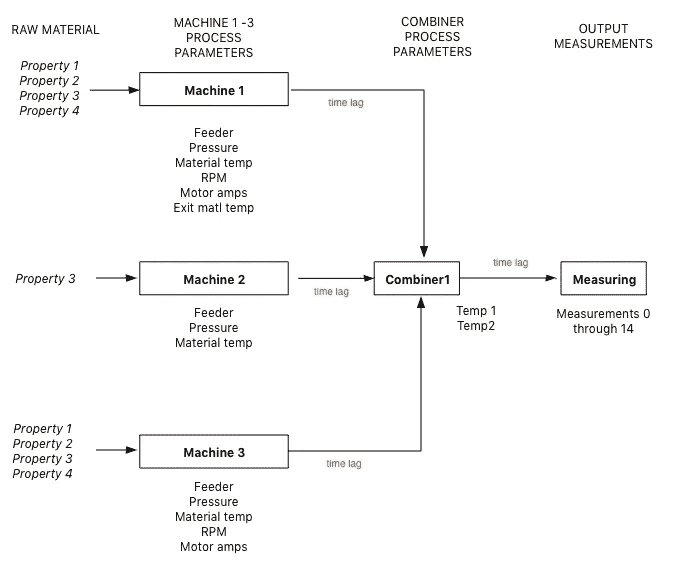
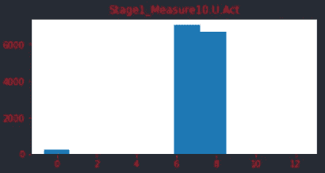

# 数据科学在制造业中的应用:第三部分——连续过程:方法和经验教训

> 原文：<https://medium.com/analytics-vidhya/applying-data-science-in-manufacturing-part-iii-continuous-process-methodology-and-lessons-463021c33b05?source=collection_archive---------18----------------------->

在这篇文章的第二部分([https://medium . com/@ ryandmonson/applying-data-science-in-manufacturing-Part-II-batch-process-methodology-and-lessons-learned-d18d 360d 8953](/@ryandmonson/applying-data-science-in-manufacturing-part-ii-batch-process-methodology-and-lessons-learned-d18d360d8953))中，创建了几个用于从批量制造过程中预测合金等级的模型。在预测训练目标变量方面，分类建模远比回归建模准确。在文章的最后，记录了事后分析，概述了在使建模结果对批处理制造操作有用方面的经验教训和想法。

第三部分将分析一个连续的制造过程。该过程与分批过程的不同之处如下:

*   处理是连续的，在处理步骤之间有时间滞后
*   与一次测量相比，在加工后对产品进行多次测量
*   处理数据是原始的，而不是标准化的 t/z 统计数据
*   数据集包含 14K+行，而批处理总共有大约 880 行。

这个连续制造过程的数据集可以在 Kaggle 上找到，网址是[https://www . ka ggle . com/super gus/multi stage-continuous flow-manufacturing-process](https://www.kaggle.com/supergus/multistage-continuousflow-manufacturing-process)。在阅读了数据集注释后，我决定将分析局限于通过第一阶段组合器测量引入的原材料。下游流程步骤的数据列将从数据集中删除。将分析以下工艺流程:



图 1-第三部分连续工艺的平行和连续步骤

在这种分析中，x 变量被称为“特征”，y 变量被称为“目标”。所有编码都是 Python。

阅读和总结数据集

导入 Numpy、Pandas 和 OS 的代码与第二部分相同，唯一的变化是数据集的路径(/ka ggle/input/multi stage-continuous flow-manufacturing-process/continuous _ factory _ process . CSV)。检查数据类型发现日期时间戳是一种对象数据类型。它被转换为 datetime 数据类型。

Kaggle 上提供了 dataframe 列中的数据直方图。从这些我们了解到:

*   除了日期时间列，所有其他数据类型都是数字
*   没有丢失的值
*   列名很长
*   许多温度特征列几乎没有变化

来自阶段 1 组合器测量下游过程的数据列被丢弃。剩余的列重命名如下:

```
*#replace these column title words...*
col_list_old =["Actual","AmbientConditions.","AmbientHumidity","AmbientTemperature","Machine","RawMaterial", "Property", "RawMaterialFeederParameter",          "Zone","Temperature","MotorAmperage","MaterialPressure","ExitZoneTemperature",'FirstStage.CombinerOperation.Temperature','Stage1.Output.Measurement','Stage2.Output.Measurement']*#...with these*
col_list_new = 
["Act", "Amb", "_Hum", "_Temp", "Mach", "RM", "Prop", "RM_Feed_Param","Zone", "Temp", "Amps", "Mat_Press", "Exit_Zone_Temp","Stage1_Temp",'Stage1_Measure', 'Stage2_Measure']*#function to modify column names*
def clean_column_names(df):
    df.columns = df.columns.str.strip() *#strip whitespace*

    *# zip the lists as tuples, then into a dictionary*
    col_dict = dict(zip(col_list_old, col_list_new)) 

    #*items - list of tuple key/value pairs (old,new)*   
    for i, j in col_dict.items(): 
        new_columns = [column.replace(i, j) for column in        df.columns] *# replace old with new*
        df.columns = new_columns
    return dfdf = clean_column_names(df)
```

如前所述，许多温度特性变化很小(范围为 2 摄氏度或更小)。不管刻度是摄氏度还是华氏度，这个范围都在制造过程中用来测量温度的热电偶、热敏电阻或红外设备的测量误差范围内。观察色谱柱的最小值和最大值表明，对于许多色谱柱来说，温度可变性只是测量误差。这些列对预测目标值和进行工艺调整没有好处(它们实际上是常数)。它们将从分析中删除。

Kaggle 直方图表明其他特征具有极低的变异系数。这些列也不利于预测目标值(变化太小),也将被删除。

有人可能会认为这是一个糟糕的统计方法，即标准化或规范化将所有特征放在一个关于大小和变化的“水平竞技场”上。这是真的，并且被删除的特征可能在模型中具有预测能力。但是，当参数“非标准化”并可操作时，操作者能够进行模型建议的微小调整吗？这些微小的 tweeks 会超出测量误差的幅度吗？某些功能的微小变化可能会对输出产生影响，但我将删除以下几列:

*   Amb 气温。u .行动
*   Mach1。第一区临时法案
*   Mach1。第二区温度 C.Act
*   Mach2。建议 1 室
*   Mach2。建议 2 室
*   Mach2。建议 4
*   Mach2。第一区临时法案
*   Mach2。第二区温度 C.Act
*   Mach2。安培 U.Act
*   Mach2。电机转速 C.Act
*   Mach2。ExitZoneTemp.C .法案
*   Mach3。第一区临时法案
*   Mach3。第二区温度 C.Act
*   Mach3。ExitZoneTemp.C .法案
*   第一阶段。combine operation . temp 3 . c . act

删除列后，Python 列表创建了要素和目标:

*   特性:原材料列(rm_cols)
*   特征:机器 1 -3 参数列(mpp_cols)
*   功能:第一级组合器参数列(fspp_cols)
*   目标实际值:实际测量值(meas_cols)
*   目标:测量设定值(meas_cols_sp)

这些列表将对即将进行的分析有用。

预处理

与数据集所有者的电子邮件交流表明这是一个聚合物挤出过程。过程存在时滞:物料进入 1、2 或 3 号机→物料离开 1、2、3 号机→物料进入一级组合器→物料离开一级组合器→物料被测。

考虑进入机器 1 的一段 1 英寸的材料。这 1 英寸的材料在移动过程中经历了绝对时间的滞后。数据帧的结构没有考虑这些滞后。日期时间戳在绝对时间的*点索引机器特征、第一阶段组合器特征或测量目标，而不是 1 英寸材料段所经历的*。测量值(目标实际值)是针对一段经历了特定温度、电流、压力等的材料。我们想要一个模型，它能根据所经历的特征值来预测材料目标是什么。

如果特征/目标相对于它们的采样率变化缓慢，这可能是一个有争议的点。此外，数据集所有者不能/不愿意为此过程提供线速度或设备物理尺寸。

我们决定继续创建新的数据集，这会带来时间延迟。以下显示了具有时滞和特征的过程:



图 2 —显示保留功能和时间延迟的流程图

如图 2 所示，将处理工序/机器之间的时移*，而不是*机器内的时移*。假设时间偏移是均匀的。将创建具有 3 秒和 5 秒位移的数据帧。*

对我来说，这个分析过程已经有了相当多的“挥手动作”(当我妻子问起这篇文章时，我的回答是模仿电影《马达加斯加》中的企鹅:“你什么也没看见”)。专栏被删除了，因为我认为小的流程图不重要或者不可行(我无法接触到工程师/操作员，所以我不知道这是不是真的)。当我不知道时间滞后是什么的时候，我把时间滞后放入数据列。我确实有在聚合物挤出机周围工作的经验，但是 3 和 5 秒的时滞是猜测。此外，我还必须处理测量列中的负值和零值(实际值和设定值)。鉴于数据集注释指出所有测量值都以毫米为单位，负测量值和零测量值没有意义。

如果这个分析是“真实的”，我就不会做出这些假设/猜测。在进行分析之前，我会从操作员/工程师那里找到答案。

因为本文旨在提供指导，所以我将继续并完成对这些数据的分析，最终得出一个根据这些特征预测目标的模型。

以下代码用于创建反映 3 秒和 5 秒时滞的新数据帧:

```
*#create 3 sec shift dataframe*
df_init3 = df_init.copy()
df_init3[fspp_cols] = df_init3[fspp_cols].shift(-3, axis = 0, 
                                      fill_value = "shifted") 
df_init3[meas_cols] = df_init3[meas_cols].shift(-6, axis = 0, 
                                      fill_value = "shifted")
df_init3[meas_cols_sp] = df_init3[meas_cols_sp].shift(-6, axis = 0, 
                                      fill_value = "shifted")*#shifted columns dtype changed to 'object'.  Change back to float*
cols = df_init3.select_dtypes(exclude=['float64', 'int64']
                             ).columns.to_list() cols.remove('time_stamp')
df_init3[cols] = df_init3[cols].apply(pd.to_numeric, 
                          downcast='float', errors='coerce')*#repeat for 5 sec shift dataframe*
df_init5 = df_init.copy()
df_init5[fspp_cols] = df_init5[fspp_cols].shift(-5, axis = 0) 
df_init5[meas_cols] = df_init5[meas_cols].shift(-10, axis = 0)
df_init5[meas_cols_sp] = df_init5[meas_cols_sp].shift(-10, axis = 0)cols = df_init5.select_dtypes(exclude=['float64', 'int64']
                             ).columns.to_list()cols.remove('time_stamp')
df_init5[cols] = df_init5[cols].apply(pd.to_numeric, 
                   downcast='float', errors='coerce')
```

以下代码用于检查 3 秒时间延迟 df 的时间延迟偏移是否正确:

```
*#check the shift on df_init3\. 1st stage combiner temps shift by 3s,
#1st stage measurements shift by 6s*df_test = pd.concat(objs = [df_init.loc[3,:],
                            df_init3.loc[0, : ],
                            df_init.loc[14087,:], 
                            df_init3.loc[14081, : ]],
                    axis=1, join='outer', ignore_index= True,
                    keys=None, levels=None, names=None, 
                    verify_integrity=False, copy=True)
df_test.columns = ['df_init', 'df_init3(3)', 
                   'df_init', 'df_init3(6)']
df_test3 = df_test.loc[fspp_cols, : ]
df_test6 = df_test.loc[meas_cols, :]print(df_test3)
print(df_test6)#checked
```

基于这些结果，假设 5 秒时间滞后数据帧也是正确的。

进一步的数据清理

如前所述，测量实际值和设定值中有负值和零值。使用 3 秒时间滞后数据框，计算每个设定点栏中的零的数量:

```
*#count the number of values == 0 in each setpoint column*sp_dict_0 = {}
for i in meas_cols_sp:
    value = (df_init3[i] == 0).sum()
    sp_dict_0[i] = value

print(sp_dict_0)
```

每个测量设定点列包含 56 个零。他们是同一排的吗？数据库所有者指出，当测量系统“退出”时，设定点中的行全为零。可以编写代码来验证设置点 0 是否都来自同一行，但是考虑到数据库所有者的反馈，我将只删除这些行。

```
*#drop all zero setpoint rows*df_init3 = df_init3.loc[(df[meas_cols_sp] > 0).all(axis=1)]
```

执行`shape`方法显示数据帧中的行数正好减少了 56。所有测量设定点列零点都在同一行。

由于时间延迟偏移，3 秒数据帧尾部的某些列包含“偏移”而不是数值。使用了`drop`和`tail`方法来删除数据帧的最后 6 行。

在 3 秒数据帧上执行`describe`方法。即使在删除了某些行之后，测量实际列中仍然有负数和零。

分析将简化为单一目标变量。完成分析的下一步是:

1.  选择包含大量非零值的单个目标实际列。
2.  删除剩余的目标实际值和设定值列
3.  将数据帧划分为训练和测试数据集，选择特征，创建模型，拟合并进行目标预测

选择一个目标变量

应用于以下代码中 meas_cols 和直方图的`describe`方法用于选择目标变量:

```
# Import library and write function for histogram plottingimport matplotlib.pyplot as pltdef hist_plot(df,columns):
    fig = plt.figure(figsize = (20, 20))
    for counter,sp in enumerate(columns):
        ax = fig.add_subplot(5,3,counter+1)
        ax.set_title(sp, color = 'red')
        ax.tick_params(color = 'red', labelcolor = 'red')
        bins = 10
        plt.hist(df[sp],bins, align = 'left') plt.subplots_adjust(hspace = 0.5)
    plt.show()
    returnhist_plot(df_init3, meas_cols)
```

生成了所有 15 个测量实际值的直方图。下面是测量 10 的实际直方图:



测量 10 值> 0 的范围从 4.2mm 到 13.1mm，相对少数值≤ 0。测量值 10 被选为目标变量。所有其他测量列(实际值和设定值)被删除。测量值 10 ≤ 0 的行也被删除:

```
#drop measurement columns (Act and Setpoint) != 10
rm_col = meas_cols.copy()
rm_col.remove('Stage1_Measure10.U.Act')
df_init3.drop(rm_col, axis = 1,inplace = True)rm_colsp = meas_cols_sp.copy()
rm_colsp.remove('Stage1_Measure10.U.Setpoint')
df_init3.drop(rm_colsp,axis = 1, inplace = True)# `checked`#drop rows where Measure10 <= 0df_init3 = df_init3[df_init3['Stage1_Measure10.U.Act'] > 0]
df_init3['Stage1_Measure10.U.Act'].describe() 
```

从 3 秒时间滞后 DF 创建训练、测试数据集

```
#create train, test datasets
from sklearn.model_selection import train_test_split
from sklearn.preprocessing import MinMaxScaler
from sklearn.linear_model import LinearRegressiontrain3,test3 = train_test_split(df_init3, 
                                test_size = 0.25,
                                random_state = 1)
#create min/max scaled train X, also a train yX_train3df = train3.drop(['Stage1_Measure10.U.Setpoint',
                       'Stage1_Measure10.U.Act',
                       'time_stamp'],
                      axis = 1)
scaler_train = MinMaxScaler()
scaler_train.fit(X_train3df)
X_train3 = scaler_train.transform(X_train3df)# scale
y_train3 = train3.pop('Stage1_Measure10.U.Act')#create test X, test y (will scale test X after choosing
#model features)X_test3 = test3.drop(['Stage1_Measure10.U.Setpoint',
                       'Stage1_Measure10.U.Act',
                       'time_stamp'],
                      axis = 1)
y_test3 = test3.pop('Stage1_Measure10.U.Act')
```

建模

遵循以下步骤来创建用于预测测量值 10 的模型:

-创建递归特征消除函数(RFE)
-创建线性回归函数
-执行 RFE 函数以选择特征
-使用从训练和测试数据集中选择的 RFE 特征对 3 秒时间滞后数据帧执行线性回归函数

以下是 RFE 和线性回归函数的代码:

```
from sklearn.feature_selection import RFE
from sklearn.linear_model import LinearRegressiondef choose_features(X, y):

    lr = LinearRegression()
    grid = RFE(lr, n_features_to_select = 5, step = 1)
    grid.fit(X,y)
    rem_X = grid.transform(X)
    num_features = grid.n_features_
    column_rank = grid.ranking_
    return num_features, column_rank, rem_X#function for linear regression
def lr_reg(X_train, X_test, y_train, y_test):
    lr = LinearRegression(fit_intercept = False)
    lr.fit(X_train, y_train)
    prediction = lr.predict(X_test)
    Rsq = lr.score(X_test, y_test)
    coefs = lr.coef_
    return Rsq, coefs, prediction
```

调用 RFE 函数，并使用结果为测试功能创建 numpy 数组:

```
# call the RFE function (_rem indicates "remaining")num_features, column_rank, X_train3_rem = choose_features(X_train3,
                                                          y_train3)#Get list of remaining features columns after RFE by
#zipping together column_rank boolean, column names. 
#Then sort ascending, put the no. of columns equal to
#number of features into a listzipped = dict(zip(X_train3df.columns, column_rank))
sort_zip = sorted(zipped.items(), 
                  key=lambda x: x[1], reverse=False)
sort_list =[]
for i in range(0,num_features):
    sort_list.append(sort_zip[i][0])

print(sort_list)#Create X_test w/ reduced feature set
X_test3_temp = test3[sort_list]
scaler_test = MinMaxScaler()
scaler_test.fit(X_test3_temp)
X_test3_rem = scaler_test.transform(X_test3_temp)# scale# Now have reduced, scaled train and test feature arrays
# for regression and have sort_list giving the feature names
```

调用线性回归函数并打印结果:

```
#call linear regression function
Rsq, coefs, prediction = lr_reg(X_train3_rem, 
                    X_test3_rem, 
                    y_train3, 
                    y_test3)
print("Number of features (3s lag):", num_features, '\n',
      num_features,"Regression Rsq (3s lag):", Rsq, '\n',
      "Model coefficient names:", sort_list, '\n'
     "Model coefficents (3s lag):", coefs)
```

使用所有功能将结果与回归模型进行比较:

```
# what's the difference in R2 between 5 feature and all
# feature model?scaler_test_all = MinMaxScaler()
scaler_test_all.fit(X_test3)
X_test3_sall = scaler_test_all.transform(X_test3)# scale all
Rsq, coefs, prediction = lr_reg(X_train3, 
                                 X_test3_sall, 
                                 y_train3, 
                                 y_test3)
print("All features regression Rsq (3s lag):", Rsq, '\n',
     "All features model coefficents (3s lag):", coefs)
```

建模的结果:

*   5 特征模型，3 秒滞后 df，给出 0.30 的 R。*‘mach 3。RM.Prop1 '，' Mach3。RM.Prop2 '，' Mach3。RM.Prop3 '，' Mach3。RM.Prop4'* 系数为 1E11，1E12 级。其他系数量级 1E-01。
*   26 特征模型，3 秒滞后 df，给出 0.52 的 R。*‘mach 3。RM.Prop1 '，' Mach3。RM.Prop2 '，' Mach3。RM.Prop3 '，' Mach3。RM.Prop4* 系数的大小为 1E00，1E01。其他系数为 magnitude1E-01、1E-02。

R 值较低，表明与总可变性相比，模型解释的可变性比例较小。

为什么 4 个斜体特征与其他特征相比具有如此大的系数？我不知道。机器 1 的原材料属性是模型的一部分，其值是数字序数(类似于机器 3 的原材料属性)，但没有非常大的系数。为什么 Machine3 与 Machine1 不同令人费解。

整个分析可以在 https://www.kaggle.com/ryandmonson/rmonson-multistep-mfg[的一个笔记本上找到。](https://www.kaggle.com/ryandmonson/rmonson-multistep-mfg)

后现代——思考，经验教训

*   在目标/特征选择方面可以做更多的工作。可能需要重新考虑在模型中包含原材料属性。Kaggle 列显示这些特征是数字序数(它们可能是连续的，但是数据集对于每个原材料属性只有 3 或 4 个值)。
*   初始特征移除包括测量误差解释测量可变性的特征。这个想法有更广泛的应用，将在第四部分进一步讨论。
*   校准解决了测量数据的有效性问题，但在这种情况下，似乎没有解决校准问题。这个想法有更广泛的应用，将在第四部分进一步讨论。
*   在评估要包含在模型中的要素时，我完全忽略了检查多重共线性。这在本系列的第二部分(批处理分析)中已经完成，但本部分没有完成。当分析的要素与以前的经验紧密联系时(在我的案例中是测量误差和校准)，其他基本要素可能会被忽略。清单可以帮助避免这种错误。
*   除了测量误差和校准之外，制造车间的应用也与我的经验密切相关。根据我的评估，运营商无法做出有效的调整，所以这些功能被取消了。分析结果需要具有可操作性。
*   很多时候，我们只关注 R 或其他一些准确性分数来判断我们的模型。在这种情况下，系数本身也讲述了一个应该调查的故事。对模型的完整理解将导致对过程变更做出更稳健的决策。
*   许多故障排除时间都花在了 LinearRegression 实例的输出上。最初，StandardScaler 用于预处理，LinearRegression 的`predict`方法提供了荒谬的结果。经过相当多的思考、研究和发誓，我意识到当数据呈正态分布时，使用 StandardScaler。我切换到 MinMaxScalar，得到了合理的结果。这一经历如此令人沮丧，以至于激发了我在本系列完成后撰写并发表的下一篇文章。
*   我最初考虑根据特征与目标的相关性来选择特征，这是我在学习数据科学课程时教授的一种方法。这种方法需要对相关截止值进行判断。为了避免判断失误，我走了 RFECV 路线(带交叉验证的递归特征消除)。RFECV 根据交叉验证的最高平均准确度分数选择特征的数量。毫不奇怪，来自 RFECV 的最精确的模型使用了所有的特性。最后，我选择了 RFE 路线，对 5 个特征做出了判断。通过 RFE 和相关系数确定特征，哪个“更好”？两者都需要判断，计算结果也不同。尽管数据科学是由数字和客观性驱动的，但仍然需要做出判断。

*****

测量误差是测量结果的不确定性。假设热电偶的测量误差为±1℃。热电偶读数为 25℃。真实温度在 24–26℃范围内(这是一个置信区间，因此真实温度的概率在此范围内是一致的)。对于这个例子，由于测量误差，不能说 24℃的温度读数与 26℃的不同。根据我在制造业的经验，测量误差经常被忽视(甚至被反对)。