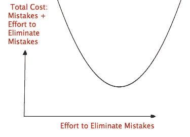
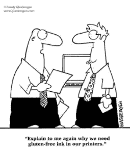

# 数据科学在制造业中的应用:第四部分——总结和结论

> 原文：<https://medium.com/analytics-vidhya/applying-data-science-in-manufacturing-part-iv-summary-and-conclusions-1080fced7f1d?source=collection_archive---------27----------------------->

*注:对本文的修改是为了纠正打字错误和语法错误*

在这篇文章的第一部分([https://medium . com/@ ryandmonson/applying-data-science-in-Manufacturing-Part-I-background-and-introduction-CCB 15743 e 001](/@ryandmonson/applying-data-science-in-manufacturing-part-i-background-and-introduction-ccb15743e001))中，我讨论了制造过程是一个数据丰富的环境，以及通过应用机器学习技术来改善过程的可能性。特别感兴趣的是一种新的过程控制范例的可能性:通过参数关系进行控制，而不是按照一个值范围来控制过程参数。

在第二部分([https://medium . com/swlh/applying-data-science-in-manufacturing-Part-II-batch-process-methodology-and-lessons-learned-d18d 360d 8953](/swlh/applying-data-science-in-manufacturing-part-ii-batch-process-methodology-and-lessons-learned-d18d360d8953))中，建立参数关系的模型是在批处理数据集上进行的。建立了一个分类模型，该模型显示了极好的预测准确性。

对于第三部分([https://medium . com/analytics-vid hya/applying-data-science-in-manufacturing-Part-III-continuous-process-methodology-and-lessons-463021 c 33 b 05](/analytics-vidhya/applying-data-science-in-manufacturing-part-iii-continuous-process-methodology-and-lessons-463021c33b05))，对连续流程数据集进行了评估。这个数据集在行和列上都比批处理大一个数量级。目标测量值的校准是一个问题，该作者认为需要流程负责人提供更多信息，以构建一个有用的模型。完成了一项带有该警告的分析。

第四部分将更深入地讨论第二部分和第三部分的后现代思想和经验教训。将讨论以下内容:

*   关注部分而忽略整体
*   为您的分析的消费者搭建舞台
*   模型精度拷问
*   分析结果的实际应用
*   了解你的数据类型(不仅仅是 Python 的叫法……)
*   解决测量流程问题
*   判断总是无法避免的
*   了解数学/统计基础知识

关注部分而忽略整体

在第二部分中，提供给 Kaggle 的特征数据已经标准化为 z 统计量，并分成训练和测试数据帧。`shape`函数用于比较每个数据帧中的行数。`shape`、`describe`、`info`、`head`和`value_counts` 提供了一个数据帧的基本信息。需要保留函数结果，以便在数据清理、预处理和建模步骤中进行检索。

在这种情况下，我没有记住`shape`分析显示测试数据帧比训练数据帧少一列。数据集作者以 Kaggle 竞赛格式构建数据集。关注于`shape` *行*输出，我忽略了*列*输出。我没有留出验证数据框架来评估我的训练数据模型。

在第三部分中，没有检查特征变量的多重共线性。我错过了一些重要的分析。

有人可能会说，这些类型的错误将会发生。我同意。犯错误是有代价的，但是确保错误永远不会发生也是有代价的。我相信下面图表中的故事是有效的:在成本与“防错”曲线中有一个最小成本。我相信通过清单*可以达到最低要求*。

在容易出错和完美之间找到最小成本

清单可能是增加不了多少价值的官僚旧车，也可能是有用的精神触发器。停下来想一想，填一张表格，这是有话要说的。如果清单是死记硬背的，没有任何价值。但如果不是死记硬背，我们的大脑会思考刚刚检查的内容。它可以引发新的思维模式。创造力可以被激发。开始时有价值的验证活动也可以成为创新的种子。

为分析的消费者搭建舞台

太多的 stem 人都很糟糕，尤其是在与非 stem 人沟通方面。在向非 STEMers 演示时，我们不会从左脑数据驱动的思维模式转向右脑思维模式。我们认为图表是答案。如果你的分析要有任何实用价值，与你的听众联系是一项基本技能，需要的不仅仅是漂亮的图表。这需要理解你的听众的关注点*，并让他们成为你的关注点*。真正地，而不仅仅是在半个小时的演讲中用词。这需要放下自我，为他人着想，当你没有得到你应得的荣誉时不要变得不正常。

我们在与同事的沟通方面也做得不好。在第二部分和第三部分，我讨论了让工程师接受数据科学/机器学习思维训练的必要性。工程师在技术上和数据科学家一样称职，但没有学习过大型数据集分析。他们可能已经经历了将小数据集分析技术应用于大数据集的挫折。你引入的技术理念不仅是外来的，而且容易被误解为“错误的”。一旦给人留下了不好的第一印象，你就会让事情变得更糟。

因此，尽早开始数据科学/机器学习思维方式的教育。一步一步来。在向人们展示你的分析结果之前，给他们时间来思考这些概念。给他们时间让他们相信你，而不是仅仅相信你。

模型准确性的折磨

在我的数据科学教育项目和 Kaggle 竞赛经验中，我们努力通过优化模型(最佳特征数量、超参数优化、不同模型等)来尽可能提高 1%的准确度。).与小数据集相比，大数据集预测的统计不确定性减少。对于大型数据集，最小的精度改进是真实的，也就是说，你真的会对未来数据有更准确的预测。但是总的来说，这值得吗？组织内还发生了什么，例如，由于您的模型改进工作，看法发生了变化，态度发生了转变？你有一个被正确的人理解和接受的模型吗，但是你为了一个只有你理解的模型而放弃了它？这样做的后果是什么？

分析结果的实际应用

第一至第三部分已经着重强调了这一点。数据分析建议的改变/行动必须在身体上、精神上/情感上(见上文)、文化上可行。如果需要，修改建议，至少取得一些成功。我犯了一个错误，也看到其他人犯了同样的错误，那就是给决策者推荐一些他们并不喜欢的行动。有时我们留给他们一个二元的，要么全有要么全无的选择，其中“所有”太多了。小步前进，局部胜利总比失败好。

了解您的数据类型

在 Python 中，数据被标识为数字(float，int)、字符(string)或日期时间(一种数字)。数字意味着区间或比例尺度。然而，仅仅因为它被确定为一种方式，并不意味着它应该被如此对待。在第三部分中，12 列原材料属性中的每一列只有 2 -4 个唯一值。很可能这些属性是在一个数值区间或数值比例尺度上测量的(例如杂质的浓度)，但我们在数据集中实际拥有的*不能被归类为这样。我们选择的模型会恰当地利用它从数据集接收的数据吗？我们都知道一种将字符转换成数字的热编码，但是对于这个模型，还有其他的数据考虑吗？考虑数据集中的实际数据类型。*

地址测量

在本系列的第三部分，测量结果引发了校准问题。此外，温度测量装置的测量误差消除了一些特征列。由于测量误差，这些列值无法相互区分。被记录的测量值被测量误差*混淆*。

测量混淆不仅仅适用于制造业。这里有一个虚构的例子:

假设一个组织提供了一个被金融行业和零售行业使用的服务。管理层想知道客户是如何看待这项服务的。将创建一个调查。该调查会邮寄给金融行业客户填写，而零售客户会亲自收到该调查。分析表明，零售客户比金融客户对服务更满意。进一步的资源花费在找出为什么差异，*而实际上没有*。这两个客户群之间的数据收集方式不同，客户满意度的任何差异都与数据收集方式有关。你不能把两者分开。

了解您的数据是如何收集的。寻找可能的偏见。寻找矛盾之处。当抽样是必要的，不要被随机抽样万灵药所诱惑。随机样本中仍可能存在偏差。想想取样。思考分析正在回答的问题。想想吧。

判断总是无法避免的

分析中的纪律是好的，但在极端情况下，它也可能导致分析瘫痪，一种不健康的依赖，一种对数字适得其反的投入。在我的职业生涯中，有几次有人问我“你怎么知道这是一个异常值？”“真的吗？我们收集了这些数据点。这个值与其他值相差甚远，显然是一个异常值。收集数据的实验室技术人员告诉我是什么造成了这个异常值。你不想称之为离群值？”

我完全同意有时需要确定异常值的原因。通过研究，你可能会学到一些有价值的东西。如果你不想让这种异常情况再次发生，你需要采取一些行动。但是这种“数字不会说谎”的精神上的懒惰态度，当物理、化学和常识告诉我们不是这样的时候，是适得其反的。在 STEM 技能的实际应用中，总是需要判断力和相应的勇气。是的，有时你不得不接受数据，即使每个人都承认存在数据收集错误。你将不得不忍受它。但是不要躲在“你怎么知道的”后面精神懒惰。

了解数学/统计基础知识

在第三部分中，我用一个相当简单的概念体验了这种故障排除的困难，这启发了以后关于缩放方法的一篇文章。对于这篇即将发表的文章，我不会深挖数学/统计理论，然后写下我的发现。我打算花些时间学习不同缩放方法的基本原理。然后我会编造一些数据集，重现我所经历的问题。

我发现这种经验性的“展示给我看，而不是告诉我”的方法很有用。我家里有小说作家，写小说的原则之一就是“秀”而不是“讲”。深奥的数学公式令人印象深刻，如果你想深入研究，那就去做吧。但是商业价值是由“有效”的东西产生的。想要说服力？学习你需要的东西，然后证明它是有效的。

作者目前居住在宾夕法尼亚州的匹兹堡，曾在航空航天、半导体、纺织和医疗设备行业工作。可以在 ryandmonson@gmail.com 找到他。