# 应用快速 R-CNN 进行疟疾细胞目标检测

> 原文：<https://medium.com/analytics-vidhya/applying-faster-r-cnn-for-object-detection-on-malaria-cells-723c11a45448?source=collection_archive---------8----------------------->

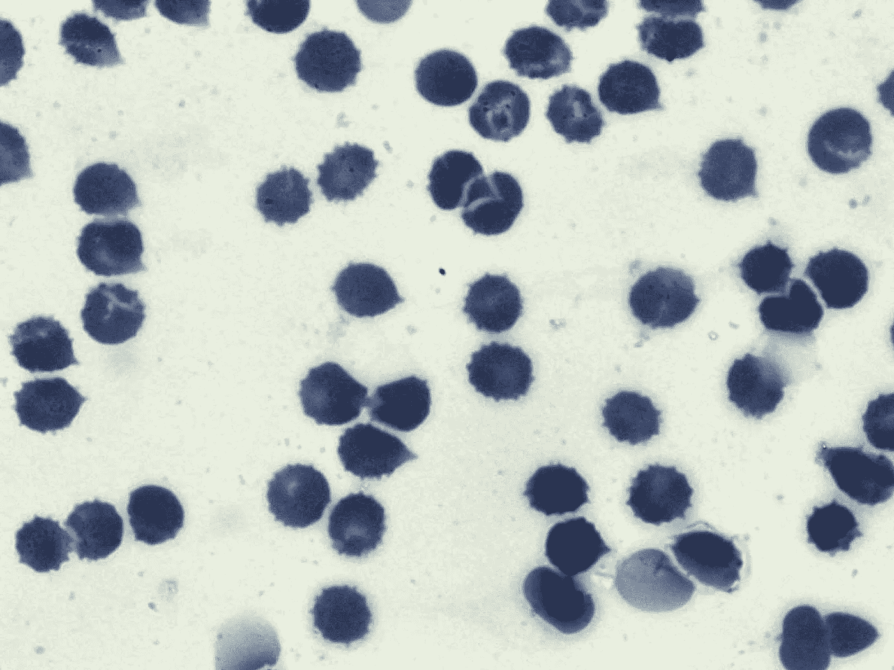

疟疾细胞

# 内容:

1.  语境
2.  关于图像和目标
3.  评估指标
4.  培训和测试数据
5.  使用的库
6.  映象分析
7.  应用更快的 R-CNN
8.  测试数据评估
9.  参考

# 1.语境

疟疾是一种由疟原虫寄生虫引起的疾病，它仍然是全球健康的主要威胁，每年影响 2 亿人，导致 40 万人死亡。影响人类的主要疟疾种类是恶性疟原虫和间日疟原虫。

对于疟疾和其他微生物感染，由训练有素的显微镜专家人工检查厚血涂片和薄血涂片仍然是寄生虫检测和阶段确定的金标准，因为其试剂和仪器成本低且灵活性高。尽管手动检查的处理量极低并且容易受到人为偏差的影响，但由于明视野显微镜图像的变化范围很大，自动计数软件仍然很大程度上未被使用。然而，一个强大的自动计数和细胞分类解决方案将提供巨大的好处，因为更快和更准确的定量结果，没有人为的可变性；研究人员和医疗专业人员可以更好地表征特定阶段的药物靶标，并更好地量化患者对药物的反应。

部分由于复制、比较和扩展的困难，以前将疟疾的识别和量化过程自动化的尝试没有获得主要的关注。作者也很少让他们的图像集可用，这排除了结果的复制和潜在改进的评估。缺乏一套标准的图像，也没有一套用于报告结果的标准指标，这阻碍了这一领域的发展。

# 2.关于图像和目标

**图像**已输入。png 或者。jpg 格式。共有 3 组图像，由 1364 幅图像(约 80，000 个细胞)组成，每组图像由不同的研究人员准备:来自巴西(斯蒂芬妮·洛佩斯)、来自东南亚(Benoit Malleret)和时间进程(Gabriel Rangel)。血液涂片用吉姆萨试剂染色。

**标签:**数据由两类未感染细胞(红细胞和白细胞)和四类感染细胞(配子体、环、滋养体和裂殖体)组成。注释者被允许将一些单元格标记为困难的，如果在某个单元格类中不清楚的话。数据显示未感染的红细胞与未感染的白细胞和感染的细胞之间存在严重的不平衡，后者占所有细胞的 95%以上。

给每个单元一个类标签和一组边界框坐标。对于所有的数据集，海托尔·维埃拉·多拉多热带医学基金会医院的疟疾研究员斯蒂芬妮·洛佩斯给受感染的细胞贴上了类别标签，表明发育阶段或标记为困难。

**目标:**这个项目的目标是训练一种**更快的 R-CNN 目标检测技术**对疟疾细胞进行检测，并使用【https://arxiv.org/abs/1804.09548】的研究论文中的思想，以最大可能的精度将每幅图像中的目标分类到上述细胞类别中。

# 3.评估指标

平均精度(Mean Average Precision):这是一个衡量物体检测技术准确性的流行指标，比如更快的 R-CNN，SSD..等等。当一个对象被错误分类或者没有被检测到时，MAP 会扣分。

# 4.培训和测试数据

1.  培训和测试数据的图像在中提供。jpg 和。图像文件夹中的 png 格式。
2.  JSON 文件是为训练和测试图像提供的，由以下几列组成。

**训练和测试中的列**

a.校验和— ID

b.路径名—图像的路径

c.整形器—图像的整形器

d.ShapeC —图像的 ShapeC

e.通道—图像的通道

f.bbminR 边界框坐标 minR

g.bbminC 边界框坐标 minC

h.bbmaxR 边界框坐标 maxR

i. bbmaxC 包围盒坐标 maxC

j.类别—图像中对象的类别

# 5.使用的库

1.  **Pandas** : Pandas 是一个 python 语言的软件库，用于数据编程和分析。使用 pandas 库，我们将训练和测试 csv 文件读入 pandas 数据帧和任何数据操作。
2.  **JSON**:JSON 库可以从字符串或者文件中解析 JSON。该库将 JSON 解析成 Python 字典或列表。它还可以将 Python 字典或列表转换成 JSON 字符串。在这个项目中，训练和测试文件是 JSON 格式的。使用 JSON 库，JSON 文件被转换成 csv 文件。
3.  **Imagesize** :解析图像文件头，返回图像大小。使用 Imagesize 库，我们可以读取图像来检索图像的高度和宽度。
4.  Keras 是一个用 Python 编写的开源神经网络库。它能够在 TensorFlow 上运行。Keras 包含许多常用神经网络构建块的实现，如层、[目标](https://en.wikipedia.org/wiki/Objective_function)、[激活函数](https://en.wikipedia.org/wiki/Activation_function)、[优化器](https://en.wikipedia.org/wiki/Mathematical_optimization)，以及许多工具，使处理图像和文本数据更容易，以简化编写深度神经网络代码所需的编码。
5.  **Pickle** : Python pickle 模块用于序列化和反序列化 Python 对象结构。Python 中的任何对象都可以被腌制，以便保存在磁盘上。在这个项目中，我们使用 pickle 保存训练好的模型。

# 6.映象分析

1.  JSON 格式的图像的训练和测试数据应该被写入 csv 文件以供进一步分析。使用下面的代码可以读取并保存为 csv 文件。

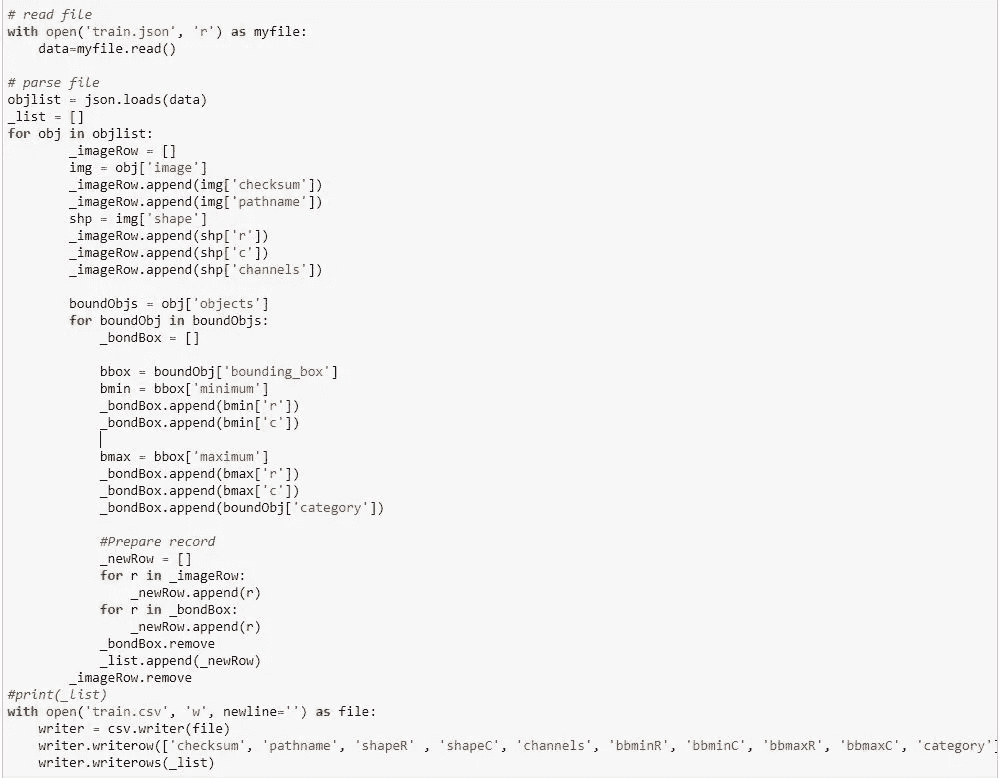

JSON 到 CSV

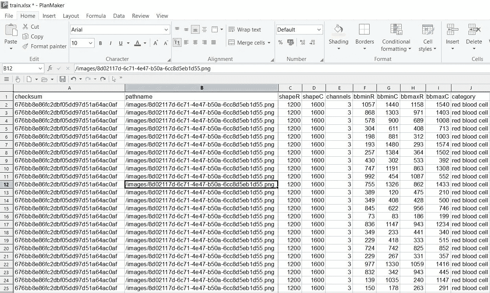

列车 CSV

2.训练数据有 7 个标签，测试数据有 6 个标签。数据高度不平衡。在训练和测试图像中，红细胞的数量都非常高。

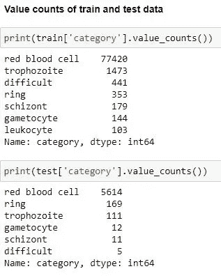

标签计数

3.为所有图像中的每个对象提供边界框坐标及其标签。通过这些边界框，我们可以看到一个训练和测试图像是什么样子的。

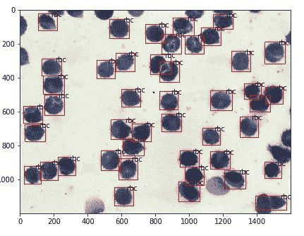

列车图像

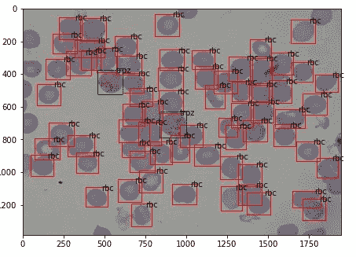

测试图像

4.用于训练更快的 R-CNN 技术的输入格式将是注释文本文件，该文件将具有图像文件名、边界框坐标及其类别值。可以使用下面的代码创建训练和测试注释文本文件。

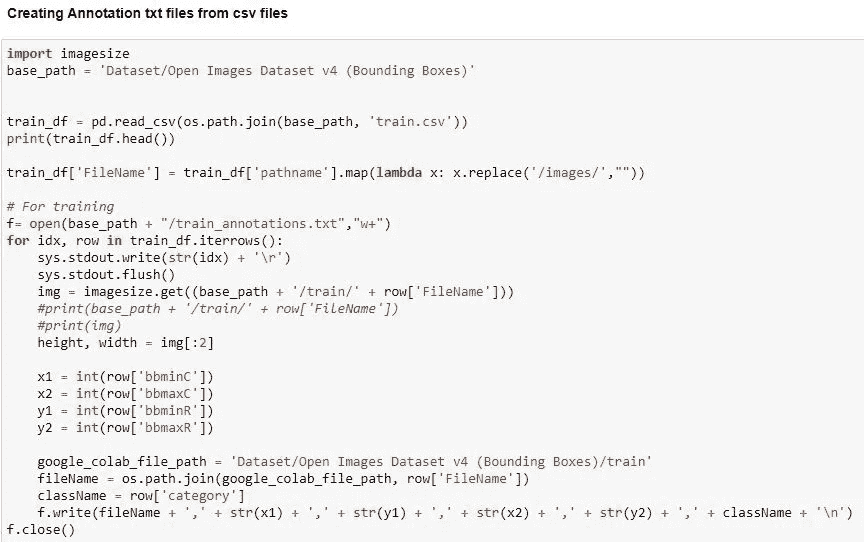

csv 到文本文件

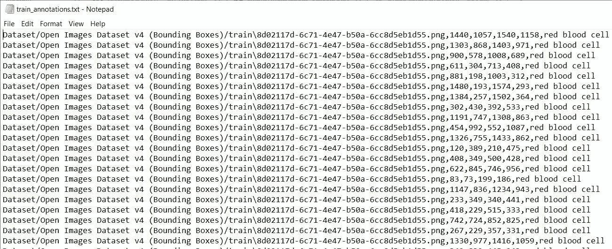

注释文件

5.我们现在可以着手建立更快的 R-CNN 模型，并在疟疾图像上进行训练。

# 7.应用更快的 R-CNN

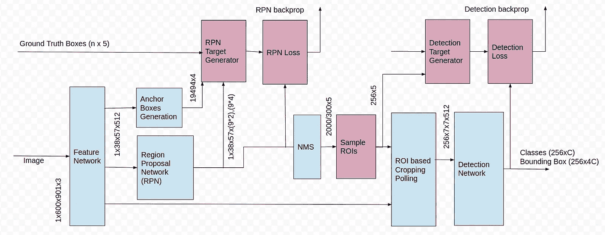

更快的 R-CNN

1.  **基本型号:**更快的 R-CNN 使用 VGG-16、ResNet 之类的基本 CNN 型号..以提取图像的特征。在这个项目中，在 ImageNet 数据集上训练的 VGG-16 模型被用作提取特征的基础模型。由于更快的 R-CNN 使用单独的分类层来对带有标签的对象进行分类，因此中间卷积层的输出被用于将其传递到下一层。

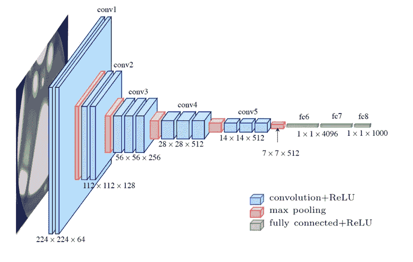

VGG-16

2.**锚点:**这些是固定的边界框，它们以不同的大小和长宽比放置在整个图像中，在首次预测对象位置时将用作参考。由于每个疟疾图像中的对象都非常小，锚定框比例是一个超参数，可以调整它以通过图像创建锚定框。用于这些图像的锚定框比例为[8，16，32]。

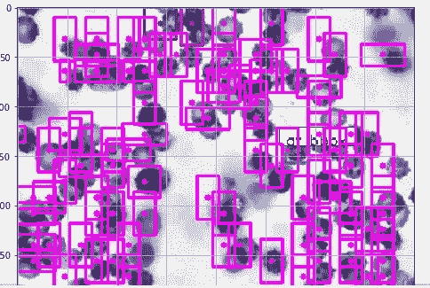

正面锚

3.**区域建议网:** RPN 把所有的参考框(主播)放入两个不同的类别。那些与具有大于 0.5 的并集 (IoU)上的 [**交集的地面实况对象重叠的对象被认为是“前景”，而那些不与任何地面实况对象重叠或者具有小于 0.1 IoU 的地面实况对象的对象被认为是“背景”，并且输出一组良好的对象提议。**](https://www.pyimagesearch.com/2016/11/07/intersection-over-union-iou-for-object-detection/)

RPN 以完全卷积的方式有效地实现，使用由基础网络返回的卷积特征图作为输入。首先，我们使用一个具有 512 个信道和 3x3 内核大小的卷积层，然后我们有两个使用 1x11 *x* 1 内核的并行卷积层，其信道数量取决于每个点的锚数量。对于分类层，我们输出每个锚点的两个预测:它是背景(不是对象)的得分和它是前景(实际对象)的得分。

对于回归或边界框调整层，我们输出 4 个预测:deltas \Delta_{x_{center}} 、\Delta_{y_{center}} 、\Delta_{width} 、\ Delta _ { height }δ*x**中心*、δ*y**中心*、δ*宽度*、δ*高度*，我们将这些预测应用于锚点以获得最终提议。

使用最终的提议坐标和它们的“对象性”分数，我们就有了一组好的对象提议。

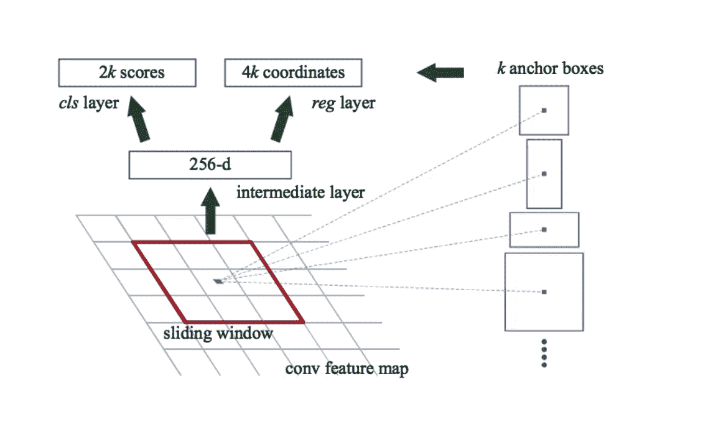

4.**非最大抑制:**由于锚点通常会重叠，所以提议最终也会重叠在同一个对象上。为了解决重复建议的问题，我们使用一种简单的算法方法，称为非最大抑制(NMS)。NMS 获取按分数排序的提案列表，并遍历排序后的列表，丢弃那些 IoU 大于阈值 0.9 的提案，而使用具有更高分数的提案。应用 NMS 后，考虑前 300 个建议。

5.**兴趣池区域:**现在我们有一堆没有分配给它们的类的对象提议。在这一步中，我们获取每一个建议，对其进行裁剪，然后将其传递到最终的分类 R-CNN 层，以标记这些建议。

一种更简单的方法，被对象检测实现广泛使用，包括 Luminoth 的更快的 R-CNN，是使用每个建议裁剪卷积特征地图，然后使用插值(通常是双线性的)将每个裁剪调整为固定大小的 14×14× *convdepth* 。裁剪后，使用 2x2 内核的 max pooling 为每个建议获得最终的 7×7× *convdepth* 特征图。

选择这些精确形状的原因与下一个块如何使用它有关(R-CNN)。重要的是要明白，这些是可定制的，取决于第二阶段的使用。

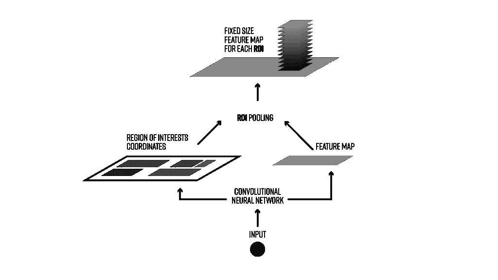

投资收益率

6.**基于区域的卷积神经网络:**基于区域的卷积神经网络

基于区域的卷积神经网络(R-CNN)是更快的 R-CNN 管道中的最后一步。从图像中获得卷积特征图后，使用它来获得具有 RPN 的对象提议，并最终为这些提议中的每一个提取特征(通过 RoI Pooling)，我们最终需要使用这些特征进行分类。R-CNN 试图模仿分类 CNN 的最后阶段，其中全连接层用于输出每个可能的对象类的分数。

R-CNN 有两个不同的目标:

1.  将提案分类为一个类别，加上一个背景类别(用于删除不良提案)。
2.  更好地根据预测的类别调整提议的边界框。

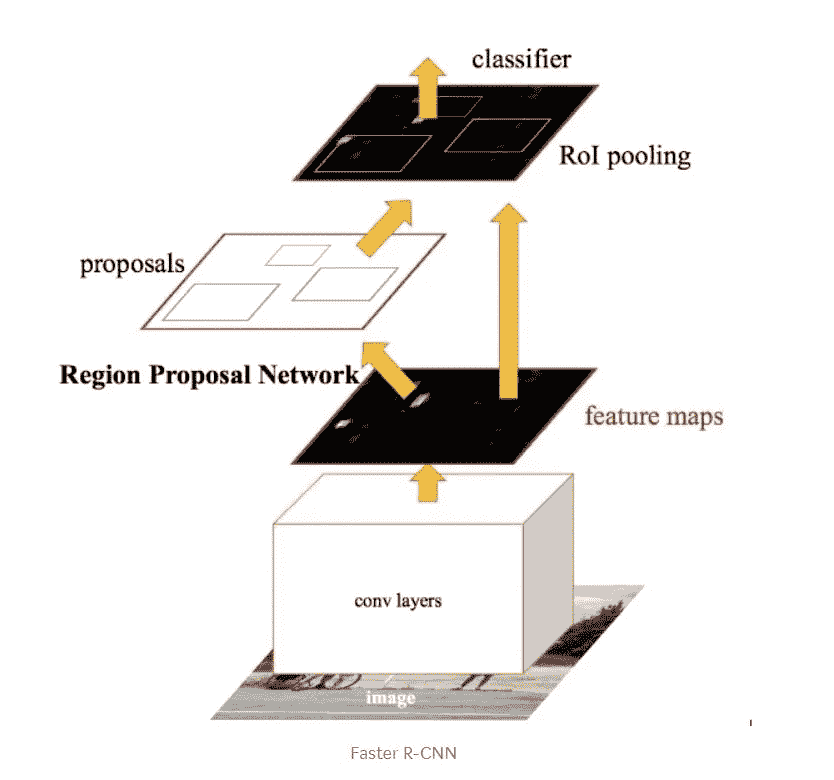

7.**训练:**一旦模型准备好了，我们通过传递 train_annotation.txt 文件开始训练，初始化基本模型权重并将类的数量传递给模型。准确性是训练模型时使用的度量标准。训练了 100 个时期，其中每个时期花费大约 2 小时，并且实现了 93%的准确度。记录了 4 种不同的损耗，RPN 层两种，R-CNN 层两种。使用随机梯度下降来训练该模型，这导致

```
Classifier accuracy for bounding boxes from RPN: 0.934
Loss RPN classifier: 0.08543467678808205
Loss RPN regression: 0.02398829758935608
Loss Detector classifier: 0.1817812535882481
Loss Detector regression: 0.03701828640169697
Total loss: 0.3282225143673832
```

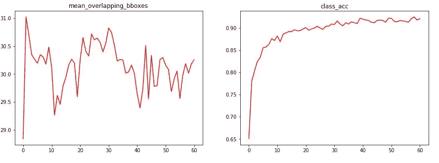

准确(性)

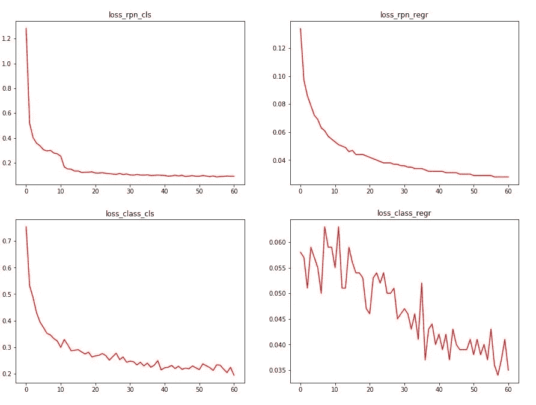

损耗

# **8。测试数据评估**

评估是在特定 IoU 阈值为 0.7 时使用标准平均精度(mAP)完成的。使用在上一步骤中保存的训练模型，通过传递测试注释文件及其类标签来预测测试图像的边界框。

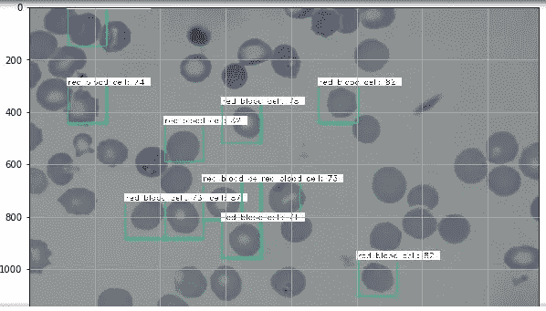

计算所有 120 幅测试图像的精度，以查看每幅图像中疟疾细胞的预测。

```
Elapsed time = 3.3739821910858154
red blood cell AP: 0.9098086551867395
gametocyte AP: 0.7333333333333333
trophozoite AP: 0.7837234722362358
ring AP: 0.7036900726267535
schizont AP: 0.44
difficult AP: 0.056179775280898875
mAP = 0.6044558847773268
112/120
Elapsed time = 3.3699944019317627
red blood cell AP: 0.9095687056598919
gametocyte AP: 0.7333333333333333
trophozoite AP: 0.7884311726729429
ring AP: 0.7036900726267535
schizont AP: 0.4230769230769231
difficult AP: 0.053763440860215055
mAP = 0.60197727470501
113/120
Elapsed time = 3.3679988384246826
red blood cell AP: 0.9098503831773301
gametocyte AP: 0.7333333333333333
trophozoite AP: 0.7884311726729429
ring AP: 0.7068164731280739
schizont AP: 0.4230769230769231
difficult AP: 0.053763440860215055
mAP = 0.6025452877081364
114/120
Elapsed time = 3.742985725402832
red blood cell AP: 0.9101059579135993
gametocyte AP: 0.7333333333333333
trophozoite AP: 0.7884311726729429
ring AP: 0.7135207354597167
schizont AP: 0.4230769230769231
difficult AP: 0.053763440860215055
mAP = 0.6037052605527884
115/120
Elapsed time = 3.854698419570923
red blood cell AP: 0.9101823806717539
gametocyte AP: 0.7333333333333333
trophozoite AP: 0.7884311726729429
ring AP: 0.7146642333156751
schizont AP: 0.4230769230769231
difficult AP: 0.053763440860215055
mAP = 0.6039085806551406
116/120
Elapsed time = 3.3181307315826416
red blood cell AP: 0.9095249366698459
gametocyte AP: 0.75
trophozoite AP: 0.7899554367201427
ring AP: 0.7146642333156751
schizont AP: 0.4230769230769231
difficult AP: 0.05319148936170213
mAP = 0.6067355031907148
117/120
Elapsed time = 3.3460564613342285
red blood cell AP: 0.9097258074309477
gametocyte AP: 0.7058823529411765
trophozoite AP: 0.7914580101784912
ring AP: 0.7169115123945246
schizont AP: 0.4230769230769231
difficult AP: 0.05319148936170213
mAP = 0.6000410158972942
118/120
Elapsed time = 3.3121471405029297
red blood cell AP: 0.9099155549306795
gametocyte AP: 0.7058823529411765
trophozoite AP: 0.7914580101784912
ring AP: 0.7186625010102929
schizont AP: 0.4230769230769231
difficult AP: 0.05263157894736842
mAP = 0.6002711535141553
119/120
Elapsed time = 3.4268405437469482
red blood cell AP: 0.9094612324851495
gametocyte AP: 0.7058823529411765
trophozoite AP: 0.7858513244702504
ring AP: 0.7220951977234226
schizont AP: 0.4230769230769231
difficult AP: 0.05263157894736842
mAP = 0.5998331016073818
```

对于使用训练模型的所有测试图像，实现的平均精度约为 60%。

# 9.参考

1.  GitHub 代码库:[https://GitHub . com/Sri luk 9/malaria cells-object detection-Using-fasterr CNN](https://github.com/sriluk9/MalariaCells-ObjectDetection-Using-FasterRCNN)
2.  参考链接:[https://tryo labs . com/blog/2018/01/18/faster-r-CNN-down-the-rabbit-hole-of-modern-object-detection/](https://tryolabs.com/blog/2018/01/18/faster-r-cnn-down-the-rabbit-hole-of-modern-object-detection/)
3.  [https://towards data science . com/faster-r-CNN-object-detection-implemented-by-keras-for-custom-data-from-Google-open-images-125 f62b 9141 a](https://towardsdatascience.com/faster-r-cnn-object-detection-implemented-by-keras-for-custom-data-from-googles-open-images-125f62b9141a)
4.  [https://www . analyticsvidhya . com/blog/2018/11/implementation-faster-r-CNN-python-object-detection/](https://www.analyticsvidhya.com/blog/2018/11/implementation-faster-r-cnn-python-object-detection/)

谢谢你