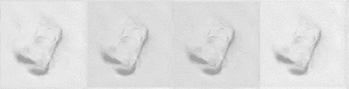

# 应用生成对抗网络生成新颖的三维图像

> 原文：<https://medium.com/analytics-vidhya/applying-generative-adversarial-network-to-generate-novel-3d-images-ba70e1176dac?source=collection_archive---------3----------------------->

这项基于研究的实验研究产生了一些新的汽车

在这篇文章中，我将展示 3D 图像上的生成敌对网络(GANs)的行为，以及它如何帮助生成新颖的 3D 图像。首先，我将这篇文章分成以下几个部分:

1.  问题陈述
2.  介绍
3.  拟议解决方案
4.  密码
5.  结果
6.  观察
7.  限制
8.  未来范围
9.  确认

# 问题陈述

三维模型因其在工业产品设计、文物修复、医疗诊断、3D 游戏等领域的广泛应用而变得越来越流行。传统的三维模型设计和构建方式非常复杂，这阻碍了普通用户进行创意设计的热情和满足他们要求的三维模型的满意度。设计和构建 3D 模型的现代方法包括使用一些流行的 3D 建模软件，如 NX、CATIA、SolidWorks 或 3D 扫描仪来获得数字 3D 模型。然而，为现有的 3D 模型快速开发一些创造性或创新性的设计通常是一项非常费力的任务。因此，探索有效的三维图像生成方法是计算机图形学和计算机视觉领域的一个重要方面。

为了解决上述生成新颖 3D 图像的需求，我应用了传统的生成式对抗网络(GAN)，引入了三种不同类别的网络，即卷积神经网络(CNN)、胶囊网络(CapsNet)和在 [NORB 数据集](https://cs.nyu.edu/~yann/research/norb/) (NYU 对象识别基准)上的自动编码能力。

# 介绍

## NORB 数据集

[smallNORB 数据集](https://cs.nyu.edu/~ylclab/data/norb-v1.0-small/)被认为是测试三维领域中生成模型功效的主要数据集。该数据集包含 5 类玩具的灰度立体图像:飞机、汽车、卡车、人类和动物。每个类有 10 个物理实例。一个类的 5 个物理实例被选择用于训练数据，另外 5 个被选择用于测试数据。每一个玩具都在 18 个不同的方位(0-340)，9 个仰角和 6 种照明条件下拍摄，因此训练和测试集都包含 24，300 对 96×96 的立体图像。

图 smallNORB 数据集训练集的快照

## 甘斯

GANs 是深度学习领域的一项强大的最新创新，用于无监督学习。GANs 由两个模型组成，即生成模型和鉴别模型。生成模型负责创建与您的训练数据相似的虚假数据实例。另一方面，鉴别器模型充当分类器，从生成器的输出中区分真实数据实例。生成器试图通过生成尽可能真实的图像来欺骗鉴别器，鉴别器试图保持不被欺骗。鉴别器惩罚了产生荒谬输出的发生器。在训练过程的初始阶段，生成器生成假数据，鉴别器很快学会辨别这是假的。但是随着训练的进行，生成器更接近于产生一个可以欺骗鉴别器的输出。最后，如果生成器训练顺利，那么鉴别器性能会变差，因为它不能快速辨别真假。它开始将虚假数据分类为真实数据，并且其准确性降低。下面是整个系统的图片:

图 2:一个 GAN 框架

## DCGAN

[DCGANs](https://arxiv.org/abs/1511.06434) 与 GANs 非常相似，但特别侧重于使用深度卷积神经网络(CNN，或 ConvNet)来代替普通 GANs 中使用的全连接网络。[CNN](https://papers.nips.cc/paper/4824-imagenet-classification-with-deep-convolutional-neural-networks.pdf)常用于图像内的模式识别领域。下面是整个系统的图片:

图 3: DCGAN 架构

## 卡普斯甘

对于图像分类任务，像 CNN 这样的深度学习技术已经胜过了经典的机器学习技术。然而，一个名为 [CapsNet](https://www.cs.toronto.edu/~hinton/absps/transauto6.pdf) 的新网络在这项任务上胜过了 CNN。CNN 用于物体识别任务的局限性在于，其神经元的激活是基于检测特定图像特征的机会。神经元不考虑图像的属性或特征，例如图像中对象的姿势、纹理和变形。换句话说，CNN 是没有能力的，因为它们的不变性是汇集操作的结果。基本上，胶囊是一组神经层。典型的神经元输出单个标量值，而胶囊输出表示相关对象属性的广义集合的向量。胶囊试图捕捉许多对象属性，如姿势(位置、视角、大小)、变形、图像内部的纹理，以定义某些对象存在的概率。变换自动编码器(*参考 AEGAN 部分对自动编码器的简要介绍*)利用这种称为胶囊的复杂特征检测器，来明确捕捉图像中每个特征的精确姿态，这就是他们如何尝试学习整体变换矩阵的。胶囊允许自动编码器保持平移不变性，而不会丢弃重要的位置信息。它们不仅能够识别不同姿态和光照条件下的特征，而且能够输出姿态特定的变量以供更高的视觉层使用，而不是丢弃它们。目标不是识别图像中的对象，而是接受图像及其姿态作为输入，并以原始姿态输出相同的图像。

因此，我将基于胶囊网络的架构用于鉴别器模型，如下所示:

图 4: [CapsGAN 鉴频器架构](https://www.vdu.lt/cris/bitstream/20.500.12259/36302/3/huseyn_gardirov_md.pdf)

我使用的是基于动态路由算法的第二版胶囊网络。发电机模型的架构与 DCGAN 架构中概述的架构相同。

## 艾根

自动编码生成对抗网络(AEGAN)是一个四网络模型，由两个 GAN 和两个自动编码器组成，如下所示:

图 5: [高层 AEGAN 架构。四个网络用方框表示，样本/向量用圆圈表示，损失函数用菱形表示。颜色展示了组成模型:(红色)图像生成 GAN，(蓝色)图像自动编码器，(黄色)潜在矢量生成 GAN，(绿色)潜在矢量自动编码器](https://arxiv.org/abs/2004.05472)

就像 GANs 一样，自动编码器也是一种无监督学习算法。自动编码器在其网络中包括两个虚拟组件，即编码器模型和解码器模型。编码器模型将输入数据映射到网络的内部表示，就像数据压缩操作的概念一样，而解码器模型试图从网络的内部数据表示重构输入，就像数据解压缩操作的概念一样。因此，自动编码器的输出形状与输入形状相同，这允许网络更好地学习基本表示。

AEGAN 通过稳定 GAN 训练来利用 GAN 和自动编码器的优点，从而克服了 GAN 的常见问题，即模式崩溃和缺乏收敛性。

# 拟议解决方案

生成新颖的 3D 图像的任务是一个活跃的研究领域。在文献中很少有研究集中于在 3D 图像上应用 GANs。因此，我在 smallNORB 数据集上基于上述三种架构训练了 GAN，即 DCGAN、CapsGAN 和 AEGAN，并进行了一些微调。

在当前的文献中有一些技术可以[评估](https://arxiv.org/abs/1802.03446)由 GANs 模型生成的样本。然而，我使用了一种最常见和最直观的技术“目测”来评估样品。

# 密码

## DCGAN

1.  加载 smallNORB 数据集

2.可视化 smallNORB 数据集

3.预处理图像

4.创建发电机模型

5.创建鉴别器模型

6.定义损失

7.定义优化器

8.训练模型

9.生成预测

完整的代码可以在我的 [GitHub 库](https://github.com/hsomaiya/machinelearning/tree/master/DL-GANs-NORB/DCGAN)中找到。

## 卡普斯甘

1.  加载 smallNORB 数据集

加载 smallNORB 数据集的过程与 DCGAN 相同

2.创建发电机模型

发电机模型的架构与 DCGAN 的发电机模型相同

3.创建鉴别器模型

4.创建生成器和鉴别器的堆叠模型

5.定义损失

发生器、鉴别器和堆叠模型使用与 DCGAN 相同的损失函数

6.定义优化器

生成器、鉴别器和堆栈模型使用与 DCGAN 相同的优化器功能

7.训练模型

8.生成预测

生成预测的逻辑几乎与 DCGAN 相同

完整的代码可以在我的 [GitHub 库](https://github.com/hsomaiya/machinelearning/tree/master/DL-GANs-NORB/CapsGAN)中找到。

## 艾根

长话短说，AEGAN 架构的代码可以在我的 [GitHub 库](https://github.com/hsomaiya/machinelearning/tree/master/DL-GANs-NORB/AEGAN)中找到。

# 结果

## 0 类——四足动物

1.  生成的图像

*阿德根*

*b .艾根*

2.模型损失图

*a. DCGAN*

*b. AEGAN*

## 第 1 类—人体模型

1.  生成的图像

*a. DCGAN*

b. AEGAN

2.模型损失图

*a. DCGAN*

*b .艾根*

## 第 2 类——飞机

1.  生成的图像

*a. DCGAN*

b .艾根

2.模型损失图

*a. DCGAN*

b .艾根

## 3 级—卡车

1.  生成的图像

*a. DCGAN*

*b .艾根*

2.模型损失图

*a. DCGAN*

*b .艾根*

## 第 4 类—汽车

1.  生成的图像

*a. DCGAN*

*b. CapsGAN*

*c. AEGAN*

2.模型损失图

*a. DCGAN*

*b .平头钉*

*c .艾根*

# 观察

## DCGAN

1.  从损失图来看，这个经过训练和调整的体系结构对于所有的类都是稳定的。
2.  从生成图像的视觉检查来看，似乎模型为所有类别生成了似是而非的结果。
3.  每节课的平均培训时间为 3 小时。
4.  当整个数据集被用作训练数据集时，这种架构不能生成好的图像。
5.  为了训练和调整这个架构，进行了几次迭代和尝试。

## 卡普斯甘

1.  从损失图来看，这个经过训练的架构对于其中一个职业来说是不稳定的。
2.  因为其中一个类的结果不理想，所以这个架构没有应用到其余的类。
3.  为了训练和调整这个架构，进行了几次迭代和尝试。

## 艾根

1.  从损失图来看，这种经过训练和调整的架构对于某些类来说是稳定的。
2.  从生成图像的视觉检查来看，似乎模型为某些类生成了似是而非的结果。
3.  每节课的平均培训时间为 6 小时。
4.  当整个数据集被用作训练数据集时，这种架构不能生成好的图像。
5.  为了训练和调整这个架构，进行了几次迭代和尝试。

# 限制

1.  上述 GAN 架构的性能是相对于 smallNORB 数据集而言的，并且相同的性能可能不适用于其他 3D 图像数据集。
2.  上述所有模型的源代码都不是生产就绪的。
3.  上述所有模型的训练时间都很长，并且可能因不同的硬件配置、映像大小和训练数据集长度而异。
4.  训练和调整 GAN 架构是最棘手的部分，因为人们可能会陷入以下问题:[模式崩溃](https://arxiv.org/abs/1611.02163)(例如——4-cars 的 CapsGAN 和 AEGAN 架构)、缺乏收敛性和不稳定性(例如——4-cars 的 CapsGAN 架构)、[消失梯度](https://arxiv.org/abs/1701.04862)(可能的例子——4-cars 的 CapsGAN 架构)。

# 未来范围

1.  调整上述 GAN 架构以获得更好的结果。
2.  使用统计指标进行评估。
3.  扩展上述用于自动 3D 图像生成和分类的半监督 GAN 和辅助分类器 GAN 的架构。
4.  自上而下部署最佳的 GAN 架构。
5.  在其他 3D 图像数据集上训练模型。

# 确认

[1] Google Colab —为执行这项基于研究的实验研究提供了平台和 GPU。

[2]在这项基于研究的实验研究中使用的所有深度学习架构和编程库的作者。

[3]应用课程团队。

*感谢您阅读我的文章。*

*如果你想联系我，请随时通过*[*LinkedIn*](http://www.linkedin.com/in/harshsomaiya)*联系。*

*请不要忘记为我的文章鼓掌:-)*

