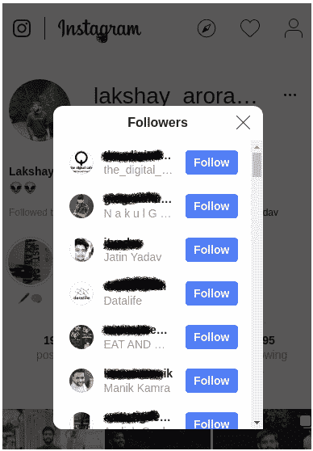
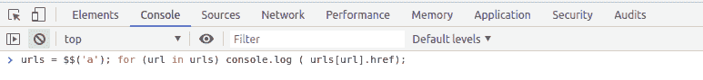
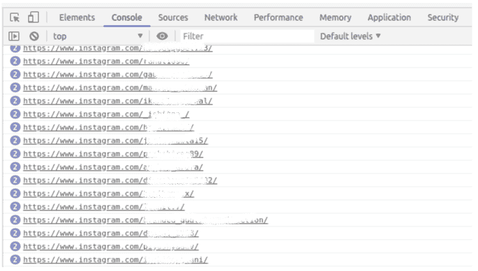

# 追踪你的 Instagram 粉丝的方法

> 原文：<https://medium.com/analytics-vidhya/approach-to-track-your-instagram-followers-580f04c154dd?source=collection_archive---------16----------------------->

假设您想要跟踪我们的 Instagram 关注者，并想知道取消关注您帐户的人的用户名。


*   首先，登录你的 Instagram 账户(不要用手机)，点击关注者查看名单:



*   一直向下滚动，这样我们就可以将所有用户名加载到浏览器内存的后台
*   右键单击浏览器窗口，然后单击“检查元素”
*   在控制台窗口中，键入以下命令:

```
**urls = $$(‘a’); for (url in urls) console.log ( urls[url].href);**
```



*   只需一行代码，我们就可以找出该特定页面上的所有 URL:



*   接下来，用两个不同的时间戳保存这个列表，一个简单的 Python 程序会让你知道这两者之间的区别，你还能知道取消关注我们账户的人的用户名！

*原载于 2019 年 10 月 10 日*[*【https://www.analyticsvidhya.com】*](https://www.analyticsvidhya.com/blog/2019/10/web-scraping-hands-on-introduction-python/)*。*