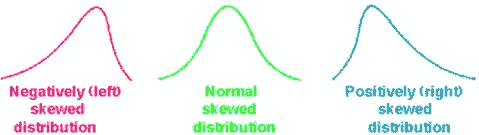
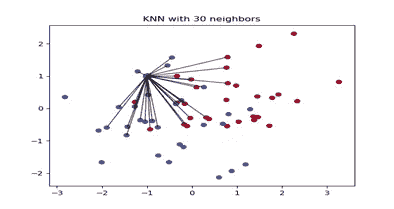
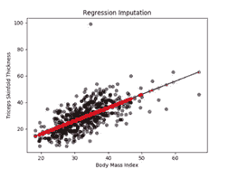

# 处理缺失值的适当方法

> 原文：<https://medium.com/analytics-vidhya/appropriate-ways-to-treat-missing-values-f82f00edd9be?source=collection_archive---------13----------------------->

众所周知，面向数据的行业大部分时间都花在数据准备和数据清理上。在某些情况下，数据专业人员准备数据的时间消耗可能高达 90%。处理缺失数据是数据准备阶段最困难的部分之一。

它们通常在数据中表示为 NaNs、空格或 0。

如果缺失值处理不当，结果可能会导致对数据的推断不准确，并产生有偏差的估计值。

可以使用以下命令计算每列中缺失的值:

`data.isnull().sum()`

**数据中如何出现缺失值？**

缺失数据可以是缺失序列、不完整特征、文件缺失、信息不完整、数据输入错误、数据收集问题等。

**缺失值类型:**

**MCAR** :完全随机失踪

缺失值随机分布在所有观测值中。

**例子:**一份血液样本在实验室中被损坏。

**标记**:随机缺失

缺失值不是随机分布在观测值中，而是分布在一个或多个子样本中。

一个孩子因为生病而没有去接受检查。

**NMAR:** 没有随意失踪

当数据不是随机丢失时，丢失与丢失的内容特别相关。

一个人没有参加英语水平测试，因为他的英语语言能力很差。

**以下是处理缺失数据最常见的方法:**

**1。** **丢弃数据-**

这是最直观简单的方法之一。如果大型数据集中的缺失值计数不够大，则可以使用以下命令删除这些行:

`df.dropna()`

如果一个变量中有大量的观察值缺失，那么在这种情况下，该变量应该被删除。

这不是推荐的方法，因为它可能会导致样本量的显著减少。

**2。** **均值，模式插补-**

插补是用缺失值的统计估计值替换缺失数据的行为。

应在考虑数据分布后决定插补方法:正态分布和偏斜分布(无论是右偏斜还是左偏斜)。

如果分布为正态分布或高斯分布，均值插补效果更好，而对于偏斜分布(无论是右还是左)，中位数插补更好。

**数据插补完全取决于数据类型。**

如果列的数据类型是数值型，则在正态分布的情况下用平均值替换这些值，在偏态分布的情况下用中值插补替换这些值。如果列的数据类型是分类的，那么模式插补方法是合适的方法。

3.**K-最近邻插补(KNN)-**

该方法使用 k-最近邻算法来估计和替换缺失数据。使用某种距离度量来选择 k 个邻居，并且将它们的平均值用作插补估计。应该使用不同的距离度量来尝试不同的 k 值，以找到最佳匹配。使用 KNN 的优点是易于实现。但是它遭受了维数灾难。它对于少量的变量很有效，但是当变量数量很大时，计算效率就变得很低。

**4。** **回归插补**

这种方法用基于回归线的预测值替换缺失值。

回归是一种显示因变量和自变量之间关系的统计方法。它表示为
`y = mx + b`

`For Example:` 三头肌皮褶厚度是我们发现一些缺失值的变量之一。该变量中的缺失值可以通过使用所有其他变量信息作为预测值来估算。

**5。** **填充缺失值**

填充缺失值的方法之一是通过以下方法用标量值替换 NA:

`df.fillna(0)`

使用与[重新索引](https://pandas.pydata.org/pandas-docs/stable/getting_started/basics.html#basics-reindexing)相同的填充参数，我们可以向前或向后传播非 NA 值:

`df.fillna(method=’pad’)`

**结论:**

有不同的方法来处理缺失值，这在很大程度上取决于数据的性质。因此，在训练模型后，您对缺失值处理得越仔细，预期的准确度就越高。