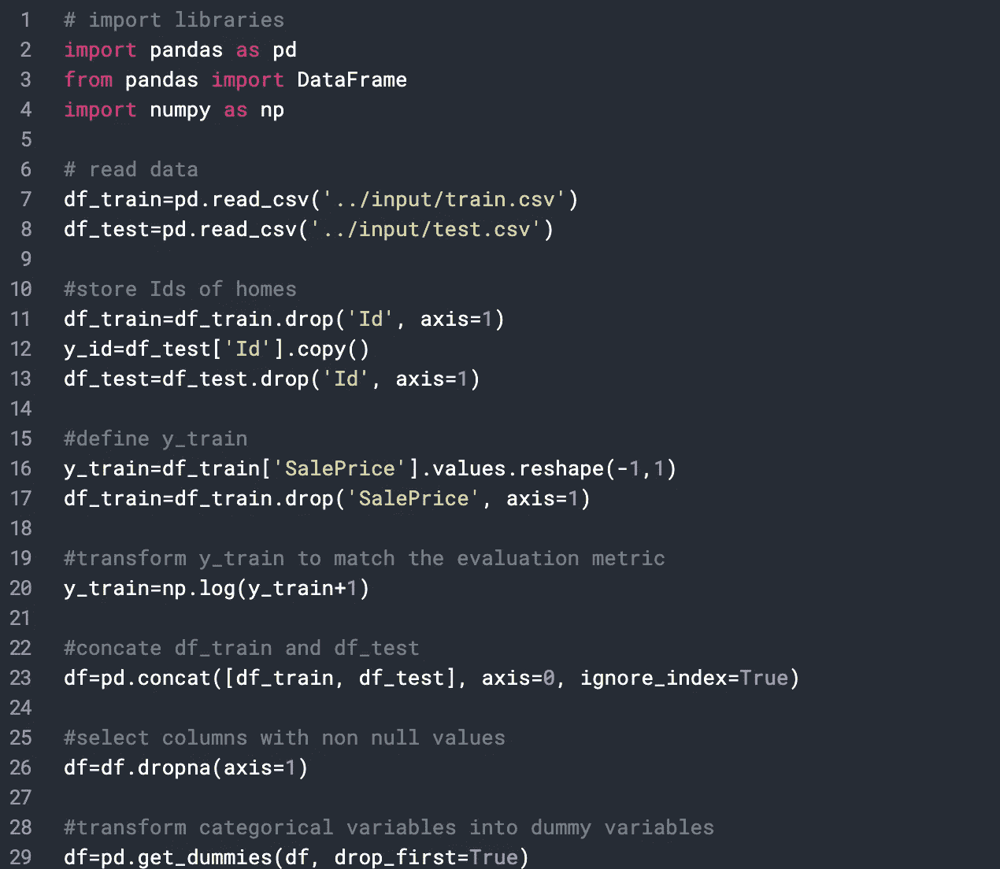

# 利用吉洪诺夫正则化(岭回归)

> 原文：<https://medium.com/analytics-vidhya/appropriating-tikhonov-regularization-ridge-regression-c91680b66dfc?source=collection_archive---------20----------------------->

由[安德烈·蒂霍诺夫](https://en.wikipedia.org/wiki/Andrey_Nikolayevich_Tikhonov)首创的岭回归是一种对[不适定问题](https://en.wikipedia.org/wiki/Ill-posed_problem)进行[正则化](https://en.wikipedia.org/wiki/Regularization_(mathematics))的方法。这对于缓解[线性回归](https://en.wikipedia.org/wiki/Linear_regression)中的[多重共线性](https://en.wikipedia.org/wiki/Multicollinearity)问题特别方便。这种障碍偶尔会出现在具有大量特征的模型中。除了这些好处，你什么时候应该考虑应用这种正则化方法？

Joshua Earle 在 [Unsplash](https://unsplash.com/s/photos/mountain?utm_source=unsplash&utm_medium=referral&utm_content=creditCopyText) 上拍摄的照片

在我们进入何时以及如何应用吉洪诺夫正则化之前，让我们剖析岭回归的核心。该回归模型将正则化项添加到目标函数中，以便在所谓的 L2 惩罚中导出更接近原点的权重。考虑到没有偏差参数，这种类型的正则化的行为可以通过正则化的目标函数的梯度来研究。用于更新权重的梯度步骤可以简单地说明如下:

因此，正则项的添加修改了学习规则，并在初级梯度更新之前降低了每一步的权重因子。然后，通过目标函数的[二次近似](https://www.sciencedirect.com/topics/mathematics/quadratic-approximation)简化分析，该目标函数在具有最小非归一化训练成本的权重附近。考虑到 *w* *为最小值，ĵĵ的近似值为

以上仅适用于…

为了应用重量衰减梯度方法，使用最小值(正则解)w~的位置，并且我们有

当 *α* 接近 0 时，w~接近 *w* *权重衰减沿着由 *H* 的[特征向量](https://www.sciencedirect.com/topics/mathematics/eigenvector)定义的轴重新调整 *w* *它保留了参数显著降低目标函数的方向。换句话说， *H* 的小特征值指示沿该方向移动在最小化目标函数方面不是很有效，因此，当在模型训练期间利用正则化时，相应的权重向量将衰减。如下所示，正则化的效果随着 *λi* 的增加而减小，而分量的大小随着 *λi* 的减小而减小。

*L* 2 正则化对 *w* 最优值的影响。

在 ML 的上下文中， *L* 2 正则化帮助算法区分具有较高方差的输入。因此，当特征与目标的[协方差](https://www.sciencedirect.com/topics/mathematics/covariance)与增加的方差相比不显著时，其权重将在训练过程中缩小。这在机器学习中如何翻译？

**简单岭回归问题**

下面的 python 代码演示了一个简单的岭回归部署，用于在 [Kaggle](https://www.kaggle.com/jsaadani/simple-ridge-regression-in-python) 上找到的房价预测。虽然这个问题没有突出的复杂性，本能地排除了一个简单的线性回归模型没有 L1 或 L2 惩罚，这个例子描述了岭回归的工作。让我们看看这是如何实现的…

上面的代码显示了数据的加载，声明了目标变量并删除了数据集中缺少的值。

应用特征缩放，然后使用三重交叉验证进行 GridSearchCV 超参数调整。

最后，以 RMSE 作为评价指标进行模型拟合。输出带有预测结果的文件。

***包裹岭回归建模***

岭适应正则化(“或收缩”)的系数估计线性回归(OLS)。因此，估计的系数被推向 0，以使它们在新的数据集上更好地工作(“为预测而优化”)。这允许使用复杂的模型，同时避免过度拟合。尽管 OLS 是最好的线性无偏估计量，但岭估计量作为一个有偏估计量，可以证明比 OLS 估计量有更低的均方误差。

现在让我们讨论一下不复杂的情况，比如上面说明的房价线性问题。在机器学习中，如果我们想进行预测，注意力不仅限于模型本身，还包括看不见的数据(测试数据)。当然，模型和训练数据可能表明一切都符合线性回归，我们不必求助于岭或套索，但这并不能阻止新的看不见的数据与你在样本中看到的明显不同的潜力，所以岭仍然会有一些好处，而不是 OLS，关于你在训练时不具备的东西:测试数据。因为测试数据是您进行预测的依据，而不是训练数据。然而，当要素中存在多重共线性时，岭最为有用，因为它的主要目的是处理要素中的多重共线性。

# **在** C **结论**

然而，不管给定的场景如何，只要任务是预测，与 OLS 相比，岭将积极地工作以减少过拟合，这可以在岭的目标函数中看到。更好的问题是:对于一个给定的预测问题，最优𝜆∗λ∗是什么，它与𝜆=0λ=0 有多大的不同，在那里山脊塌缩成 OLS？如果你使用交叉验证，发现𝜆∗λ∗离𝜆=0λ=0 很远(“远”的定义可能对𝜆λ潜在的非常小的值很棘手，这取决于数据本身的单位和规模)，那么它将显示岭得到了回报。否则，如果𝜆∗≈0λ∗≈0，那么岭可能只提供了一个小的优势 OLS。