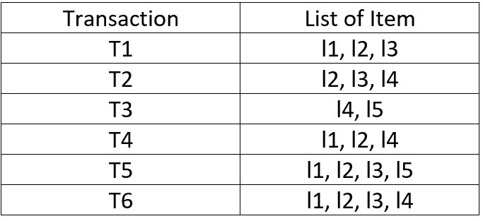
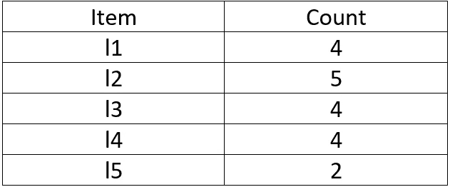
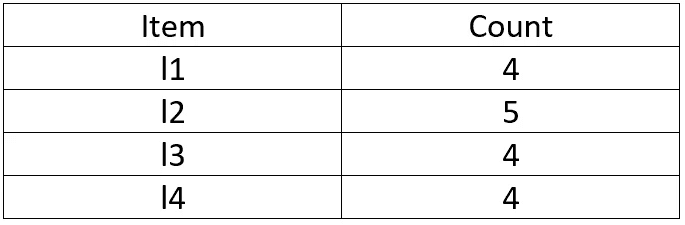
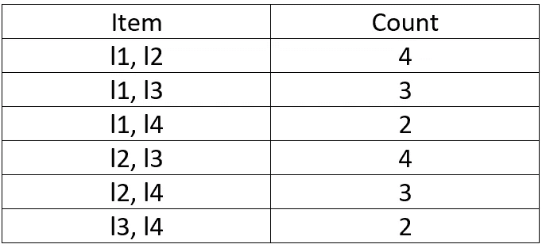
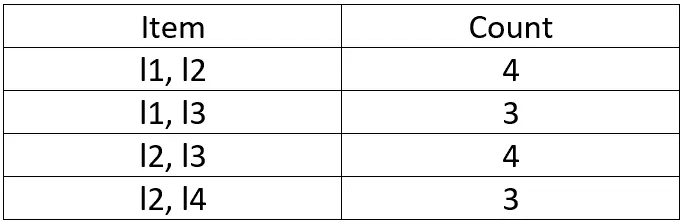
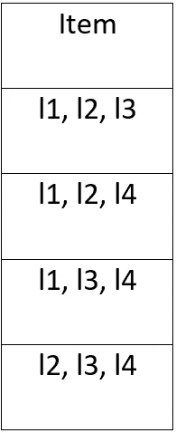
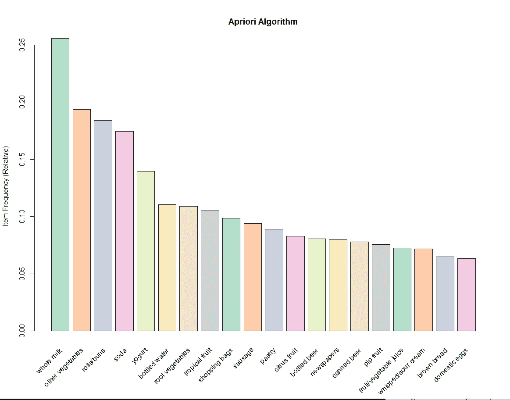

# Apriori 算法

> 原文：<https://medium.com/analytics-vidhya/apriori-algorithm-a1f8589f32a0?source=collection_archive---------17----------------------->

Apriori 算法是一种机器学习算法，用于挖掘频繁项集，并从事务数据集中创建关联规则。

它主要用于推荐目。

考虑你去哪家超市，比如 Bigbazzar、Dmart、Reliance store 等。)你会看到有很多优惠活动正在进行，例如买一送一或买二送一:—如果你买一个洗手液，你就可以免费得到一个肥皂，如果 Apriori 算法出现的话。在 Apriori 算法的帮助下，我们可以推荐与任何其他产品高度相关的产品。

## **关联规则**

关联规则是一种技术，用于检查我们的项目如何彼此高度相关。

当你购买产品 A 时，你会花多少钱购买产品 b。

例如:如果你从商店里买牛奶，那么人们会花多少钱买奶油或黄油。

为了检查它们之间的关联，我们使用关联规则。

在关联规则中出现了三个概念:—

1.支持

2.信心

3.电梯

***支持***:-在一个支持的帮助下我们可以计算一个项目集有多受欢迎。

为了计算支持度，我们有一个公式

支持(A) =

(出现 A 的交易数)/(交易总数)

**置信度:**-有了置信度，我们就可以计算出当购买物品 X 时，购买物品 Y 的可能性有多大。

为了计算置信度，我们有一个公式

信心(A->B) =支持(AUB)/支持(A)

***提升:-*** 是置信度和除外置信度之间的比值

为了计算升力，我们有一个公式

升力=支撑(A-> B)/支撑(A)*支撑(B)

## Apriori 算法的工作原理

考虑下面的市场篮子交易数据集。找出哪一项彼此之间有很强的关联。

## 第一步:-

这里，

支持度= 50%

信心= 60%

支持度= 50% = 0.5*6 = 3

## 第二步:-

现在支持= 3

## 第三步:-

这里，

我们有支持= 3

在上表中，如果计数小于 3。然后我们移除那个项目。

## **第四步:-**

现在，我们遵循与 2 个项目相同的步骤

## **第五步:-**

这里，

Support = 3 现在，我们移除计数小于 3 的项目，这里(l1，l4)，(l3，l4)计数为 2，2，因此我们移除该项目。

从上表我们可以说 l1，l2，l3 是频繁的。

## **第六步:-**

现在我们准备应用关联规则

信心= 60%

1.l1，l2，=> l3

**置信度** =3/4*100

= 75%

2.l1，l3 => l2

**信心** =3/4*100

= 75%

3.l2，l3 => l1

**置信度** =3/4*100

= 75%

现在我们可以说 l1，l2，l3 有一个强关联规则。

## 应用

1.我们可以用这个在超市从推荐。

2.我们可以在电子商务中使用它。

3.我们可以把这个用在软件行业。

4.我们也可以将此用于营销目的。

## **优缺点**

## **优势**

1.易于理解的算法

2.易于在大型数据库的大型项目集上实现

## **缺点**

1.需要扫描整个数据库

2.它需要很高的计算能力

## **结论**

在 apriori 算法的帮助下，我们可以看到产品如何在关联规则的帮助下相互关联，并向他们推荐产品。