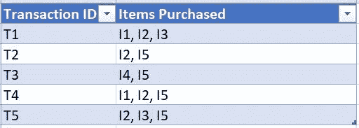
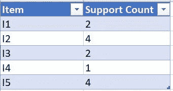
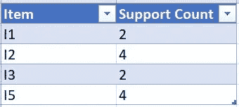
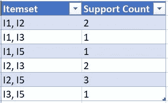
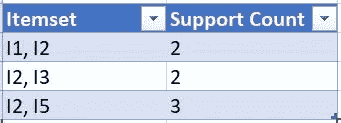
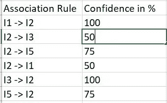
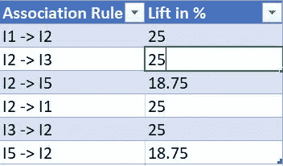
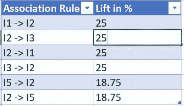

# 关联规则学习中的 Apriori 算法

> 原文：<https://medium.com/analytics-vidhya/apriori-algorithm-in-association-rule-learning-9287fe17e944?source=collection_archive---------0----------------------->

在我们进入 Apriori 算法之前，我建议您访问这个链接，以便对关联规则学习有一个清楚的了解。

> ***什么是 Apriori 算法？*** Apriori 算法是关联规则学习中用于事务数据的算法之一。它允许我们挖掘频繁项集，以产生它们之间的关联规则。
> 示例:客户购买的商品列表、经常访问的网站详情等。

这个算法是由 Agrawal 和 Srikant 在 1994 年提出的。

【Apriori 算法背后的原理

1.  频繁项集子集是频繁项集。
2.  非频繁项目集的超集是非频繁项目集。

我知道你想知道这太技术性了，但是不要担心，一旦我们看到它是如何工作的，你就会明白了！

Apriori 算法有三个部分:
1 .支撑
2。信心
3。电梯

> 支持(I )=
> (包含第 I 项的交易数)/(总交易数)
> 
> 置信度(I1 -> I2 ) =
> (包含 I1 和 I2 的交易数)/(包含 I1 的交易数)
> 
> 提升(I1 -> I2 ) =(信心(I1 -> I2 ) /(支持(I2))

**算法简单地说** 1。设定最低支持和信心。
2。取事务中支持度高于最小支持度的所有子集。
3。取这些子集的所有具有比最小置信度更高置信度的规则。
4。按升力递减对规则进行排序。

**Apriori 算法的数学方法**

考虑一个商店的事务数据集，其中每个事务都包含客户购买的商品列表。我们的目标是找到客户购买的频繁项目集，并为他们生成关联规则。

我们假设最小支持计数为 2，最小置信度为 50%。

**步骤 1** :创建一个表，该表包含交易数据库中存在的所有项目的支持计数。

我们会将每个项目的支持计数与我们设置的最小支持计数进行比较。如果支持计数小于最小支持计数，那么我们将删除这些项目。

I4 < minimum support count.

**步骤 2** 的支持计数:找到上一步中所有项目中有 2 个项目的所有超集。
检查一个项目集的所有频繁或非频繁子集，并删除不频繁子集。(例如{ I2，I4 }子集是{ I2 }和{ I4 }，但是因为在前面的步骤中没有发现 I4 是频繁的，所以我们不考虑它)。

因为 I4 在前一个中被丢弃了，所以我们没有使用任何包含 I4 的超集

现在，删除所有支持计数小于最小支持计数的项目集。因此，最终的数据集将是

**第 3 步**:在最后一个事务数据集中找到每个集合中有 3 个项目的超集。检查一个项集的所有频繁或非频繁子集，并删除不频繁子集。

在这种情况下，如果我们选择{ I1，I2，I3 }，我们必须拥有所有的子集，即，
{ I1，I2 }，{ I2，I3 }，{ I1，I3 }。但是我们的数据集中没有{ I1，I3 }。{ I1，I3，I5 }和{ I2，I3，I5 }也是如此。

因此，我们在这里停下来，因为没有频繁项集。

**第四步**:由于我们已经发现了所有的频繁项集。我们将生成强关联规则。为此，我们必须计算每个规则的置信度。

所有可能的关联规则都可以，
1。I1 - > I2
2。I2 - > I3
3。I2 - > I5
4。I2 - > I1
5。I3 - > I2
6。I5 - > I2

所以，置信度(I1-> I2)= support count(I1 U I2)/support count(I1)
=(2/2)* 100% = 100%。

同样，我们将计算每个规则的置信度。

因为所有这些关联规则都具有≥50%的置信度，所以它们都可以被认为是强关联规则。

**第五步**:我们将计算所有强关联规则的 lift。

提升(I1 -> I2 ) =信心(I1 -> I2 )/支持(I2 ) = 100 / 4 = 25 %。

现在，我们将按降序对电梯进行排序。

我知道你在想我们做这些计算是为了什么？相信我，我也没有在第一时间得到它。

> 这意味着购买 I1 的客户有 25%的可能性购买 I2。

给你。这就是 Apriori 算法，我们在其中找到不同项目之间的关联。

参考文献:
1。[https://www.geeksforgeeks.org/apriori-algorithm/](https://www.geeksforgeeks.org/apriori-algorithm/)
2。[https://www . udemy . com/course/machine learning/learn/lecture/6455322 #问题](https://www.udemy.com/course/machinelearning/learn/lecture/6455322#questions)