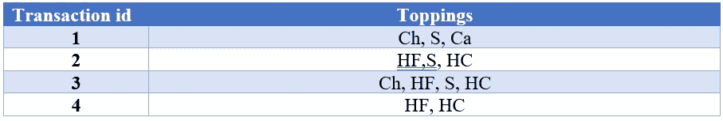

# 数据挖掘中的 Apriori 算法

> 原文：<https://medium.com/analytics-vidhya/apriori-algorithm-in-data-mining-8d2db1b4b14e?source=collection_archive---------19----------------------->

**简介**

Apriori 算法被设计成在给定的数据集中寻找频繁项目集。这种算法被命名为“Apriori ”,因为我们需要预先了解特定数据集中的数据。该算法基于 Apriori 概念，即给定频繁项集的子集必须是频繁的，如果特定数据集的项集不是频繁的，那么超集也将是不频繁的。反单调性的支持度是该算法的主要概念。该算法的主要目的是发现项目之间的关联，无论它是强关联还是弱关联。我们使用这种强调数据集趋势和模式的算法来确定关联规则。

**举例**

假设，给定一个冰淇淋店的最后 4 次交易，我们必须找到一个显示最常供应的浇头。下面列出了配料:

巧克力，热软糖，糖屑，焦糖，热巧克力

交易和项目如下表所示。

表 1

最低支持— 50%

阈值置信度— 70%

现在，计算每个项目的支持计数，

创建一个包含数据集中每个项目的支持计数的表，称为候选集。

交易总额— 4

表 2

由于焦糖(Ca)的支持计数小于 50%，因此我们在进一步计算时将忽略它。

现在，我们将每个项目配对，并计算每个项目集的支持度。

表 3

我们将忽略支持度低于 50%的项目集。

现在，我们将制作 3 个项目的项目集，并计算每个项目集的支持度。

表 4

同样，我们将忽略支持度低于 50%的项目集。

所以，这里我们总结出最频繁的项目集是 ***(HF，S，HC)***

现在，我们将找到关联规则，这样我们就可以向客户提供建议，将这些浇头添加为组合套餐。

70%的置信度意味着 70%的要求热软糖和糖粉的顾客也添加了热巧克力作为他们的配料。

**置信度(A->B)=支持计数(A∪B)/支持计数(A)**

通过从项目集中分离项目，我们将找到置信度%。

[hf^s]=>[hc]//信心= sup(hf^s^hc)/sup(hf^s)= 2/2 * 100 = 100%

[s^hc]=>[hf]//信心= sup(s^hc^hf)/sup(s^hc)= 2/2 * 100 = 100%

[hf^hc]=>[s]//信心= sup(hf^hc^s)/sup(hf^hc)= 2/3 * 100 = 66%

[hf]=>[s^hc]//信心= sup(hf^s^hc)/sup(hf)= 2/3 * 100 = 66%

[hc]=>[hf^s]//信心= sup(hc^hf^s)/sup(hc)= 2/3 * 100 = 66%

[s]=>[hf^hc]//信心= sup(s^hf^hc)/sup(s)= 2/3 * 100 = 66%

因此，最小置信度是 70%，那么前 2 个规则应该被认为是给定示例集的关联规则。

我们可以得出结论，[HF^S]=>[HC]和[S^HC]=>[HF]彼此紧密相关。

**优点**

1.算法很好理解。

2.在大型数据集上实现连接和修剪相对容易。

3.结果提供了直观的规则，使最终用户易于理解。

**缺点**

1.数据库需要彻底扫描

2.当最低支持度很低时很难解释。

**应用**

1.作为谷歌和亚马逊的推荐系统。

2.用于分析病人的病史。

3.教育部门根据给定的标准录取学生。

4.在市场分析中。

**结论**

它提供了良好的性能，因为它减少了项目集的项目，最终在每一个新的候选集。该算法工作高效，因为它只扫描整个数据库一次。由于其在销售和工业领域的决策能力，它是首选。