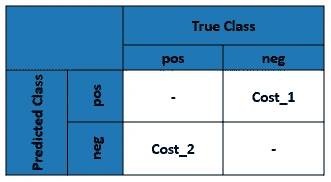
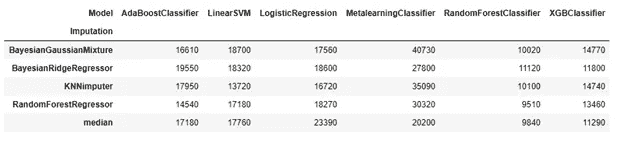
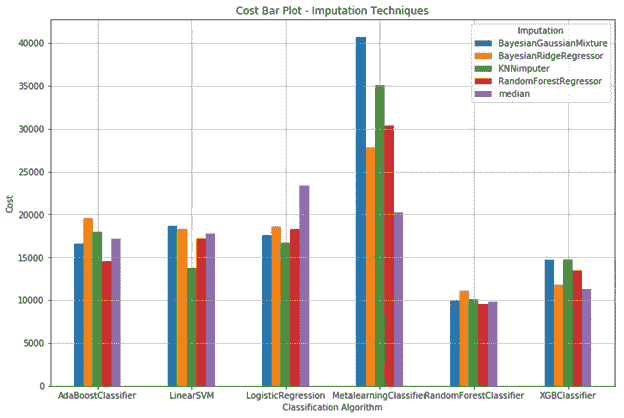
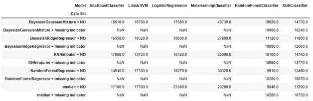
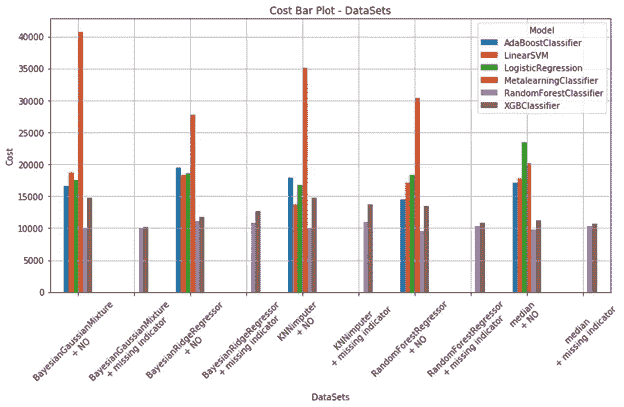

# 斯堪尼亚卡车 APS 部件故障分类

> 原文：<https://medium.com/analytics-vidhya/aps-component-failure-classification-in-scania-trucks-a971fcf71846?source=collection_archive---------11----------------------->


# 商业问题

> 该数据集包括从日常使用的重型斯堪尼亚卡车上收集的数据。重点介绍的系统是空气压力系统(APS ),它产生压缩空气，用于卡车的各种功能，如制动和换档。数据集的正类由 APS 系统特定组件的组件故障组成。负类包括与 APS 无关的部件出现故障的卡车。这些数据由专家选择的所有可用数据的子集组成。
> 
> 在这项工作中，我们使用了由斯堪尼亚 CV AB 在 UCI 机器学习知识库上发布的数据集——斯堪尼亚卡车数据集上的 [APS 故障。](https://archive.ics.uci.edu/ml/datasets/APS+Failure+at+Scania+Trucks)
> 
> 我们在这项工作中的目标是预测卡车是否需要维修，并最大限度地降低以下相关成本:
> 
> I .机械师进行不必要的检查。(Cost _ 1:10 $)-如果负标注点被分类为正标注点。
> 
> 二。错过一辆有故障的卡车，这可能会导致故障。(Cost _ 2:500 $)-如果正标记点被标记为负。



错误分类的成本度量

# **数据集详情**

> 训练集总共包含 60000 个样本，其中 59000 个属于负类，1000 个属于正类。测试集包含 16000 个例子。
> 
> 属性数量:171
> 
> 属性信息:出于专有原因，数据的属性名称已被匿名化。它由单个数字计数器和直方图组成，直方图由不同条件的仓组成。通常，直方图在每一端都有开放式条件。例如，如果我们测量环境温度‘T ’,那么直方图可以用 4 个箱来定义，其中:
> 
> bin 1 收集温度 T < -20
> 
> bin 2 collect values for temperature T > = -20 和 T < 0
> 
> bin 3 collect values for temperature T > = 0 和 T < 20
> 
> bin 4 collect values for temper
> 
> The attributes are as follows: class, then anonymized operational data. The operational data have an identifier and a bin id, like ‘Identifier_Bin’. In total there are 171 attributes, of which 7 are histogram variables. Missing values are denoted by ‘na’.

```
class,aa_000,ab_000,ac_000,ad_000,ae_000,.......,ee_007,ee_008,ee_009,ef_000,eg_000
neg,76698,na,2130706438,280,0,.....,339156,157956,73224,0,0,0
neg,33058,na,0,na,0,0,.....,133654,81140,97576,1500,0,0
neg,41040,na,228,100,0,0....,409564,320746,158022,95128,514,0,0
.
.
pos,153204,0,182,na,0,0,......,22472,34362,0,0,0,0,0
.
.
```

So the dataset is highly imbalanced. And also most of the columns found to (from visual inspection) have missing data values.

# **的值，将现实世界的问题映射到 ML 问题**

我们可以利用机器学习在这个数据集的基础上建立一个分类模型，以满足我们预测卡车是否需要维修的目标。

*   这是一个二元分类问题。对于给定的数据点，我们需要预测故障的发生是否是由于 APS。
*   这里我们需要最小化错误分类的成本，也就是说，我们的模型应该有很低的假阴性和假阳性。
*   回忆分数或 F1 分数或成本函数(总成本=成本 1 *无功能+成本 2 *无功能)
*   错误分类的代价应该被最小化，特别是假阴性(Cost_2= 500)
*   没有严格的延迟问题

# **现有方法**

[1].[APS 故障预测中缺失值插补技术的实证比较](https://www.researchgate.net/publication/330854331_An_Empirical_Comparison_of_Missing_Value_Imputation_Techniques_on_APS_Failure_Prediction):

*   ***缺失值*** *:删除数据缺失 50%以上的特征(8 个)。并使用 5 种不同的技术处理缺失值:I)通过链式方程的多重插补 ii)软插补 iii)期望最大化和 iv)均值插补 v)基于奇异值分解的方法(SVD 方法)并形成数据集的 5 种不同变化。*
*   *数据集的这些变化中的每一个都用于基于 5 种算法来训练模型:I)朴素贝叶斯 ii) KNN iii)随机森林 iv)支持向量机和 v)梯度提升树。*
*   ***不平衡数据*** *:平衡数据集(使用随机欠采样)，发现所有模型的表现分别优于不平衡数据。*
*   *在这项工作中，模型的性能是根据假阴性的数量进行评估的，而不是根据成本最小化方程。*
*   *所有成本中最小的是 12210(鼠标插补和随机森林分类器)。*

[2].[斯堪尼亚卡车数据集的 APS 故障:预测卡车是否需要维修](/analytics-vidhya/aps-failure-at-scania-trucks-data-set-1eb97b12812)

*   ***缺失值*** *:使用均值、中值和众数进行估算，形成数据集的 3 个变量。*
*   ***不平衡数据*** *:使用 SMOTE 对数据进行过采样，处理不平衡数据*
*   *使用逻辑回归、线性 SVM、随机森林和 GBDT 算法训练这些数据集。*
*   在所有用中间值估算数据训练的 GBDT 中，表现良好，成本最低 8660。

[3].[斯堪尼亚卡车的 APS 故障](/swlh/aps-failure-at-scania-trucks-203975cdc2dd)

*   ***缺失值*** *:删除缺失数据值超过 70%的特征。在剩余的 160 个特征中，使用平均值、中值和众数估算缺失值，形成数据集的 3 个变体。*
*   ***不平衡数据*** *: SMOTE 用于向上采样正类数据点。*
*   使用逻辑回归、随机森林和 GBDT 算法训练这些数据集。在每种情况下，超参数都是通过以“F1”分数为目标进行调整来选择的。甚至为较低成本函数值选择了优化的阈值。
*   *用中位数估算数据训练的随机森林表现良好，成本最低 9920。*
*   ***特征工程技术*** *: i)创建缺失的指示器特征 ii)使用 PCA 降低尺寸。即使这些数据变化表现相对较好。*

> *由于平衡数据在之前的案例中给出了更好的结果，我们将通过上采样或过采样仅尝试平衡数据的案例。我们将使用 SMOTE 对正类数据点进行上采样。*
> 
> *为了处理缺失值问题，我们可以尝试一些基于模型的估算器或多变量估算器，以及中值估算器(因为这在之前的工作中取得了更好的结果)。*

# **EDA**

从 EDA 分析来看，很明显，训练和测试数据集都非常不平衡，并且包含许多缺失值。我们观察到大多数列和行都有缺失值:在训练数据中，171(98.83%)列中的 169 列和 60000(99.02%)行中的 59409 行包含缺失值。如果我们删除所有缺失值或缺失值百分比较高的行/列，我们可能会丢失大量信息和数据，这可能会使模型过拟合。

因此，我们不是删除行/列，而是尝试用不同的插补技术对数据进行插补。

# **第一次切割解决方案**

*   我们会将可用的训练数据集(60000 个点)分成训练(51000 个点)和 cv(9000 个点)数据，其 Y 值的分层比例为 85:15。测试数据集是 16000 个点。
*   我们将使用 sklearn 的 [StandardScaler 通过移除平均值并缩放至单位方差来标准化特征。我们将使用训练数据来训练标准缩放器模型。然后，我们将使用经过训练的 StandardScaler 模型转换所有 3 个训练、cv 和测试数据集。](https://scikit-learn.org/stable/modules/g enerated/sklearn.preprocessing.StandardScaler.html)
*   除了中位数输入器，我们还可以使用 sklearn 的 KNNImputer 和 IterativeImputer。我们还可以尝试实现 2 个基于模型的估算器。因此，我们将能够用这些插补技术形成数据集的 5 种不同变化。
*   我们还可以创建具有布尔/二进制值的新要素，以指示数据集中是否存在缺失值。我们会将这些缺失的指标列连接到数据集的 5 个变体中的每一个，这又形成了数据集的 5 个变体。通过这样做，我们将能够保存这些值丢失的信息。
*   我们将通过使用分类算法(如朴素贝叶斯、逻辑回归、线性 SVM、随机森林、Adaboost 和 XGBoost 算法)训练不同的模型，来试验这 10 种不同的数据。
*   在使用训练数据集训练这些模型之前，我们将使用[合成少数过采样技术 SMOTE](https://en.wikipedia.org/wiki/Oversampling_and_undersampling_in_data_analysis#SMOTE) 对它们进行上采样。

# **处理缺失数据——插补**

## 1.中位数估算值

我们使用 sklearn 的[simple imputr 实现，策略参数选择为“中值”。在这种插补技术中，每一列中的缺失值由一个常数值(相应列的中值)进行插补。](https://scikit-learn.org/stable/modules/generated/sklearn.impute.SimpleImputer.html)

## 2.KNNImputer

我们使用 sklearn 的 [KNNImputer 实现，将权重参数作为“距离”，并将 n_neighbors 参数值保留为默认值(即 5)。在这种插补技术中，使用训练集中找到的 n_neighbors(= 5)个最近邻的加权平均值来插补每个样本的缺失值。](https://scikit-learn.org/stable/modules/generated/sklearn.impute.KNNImputer.html)

## 3.带贝叶斯岭回归器的迭代估算器

我们使用 sklearn 的[迭代输入器实现，将估计值留给 sklearn 的 BayesianRidge](https://scikit-learn.org/stable/modules/generated/sklearn.impute.IterativeImputer.html) 回归模型的默认对象。在这种插补技术中，缺失值用模型的预测值进行插补，该模型用其他特征的值进行训练。

迭代估算器是一种多变量估算器，通过所有其他要素来估算每个要素。而简单估算是一个单变量，用于估算要素中缺失的值。

## 4.基于回归模型的插补–RandomForestRegressor(基于监督学习模型的插补)

这种基于模型的插补是自动实现的，如下所示:

1.  计算每一列中缺失值的百分比。
2.  过滤(median_imp_cols)出缺失值百分比小于阈值(这里我们取 3%)的列，并使用 SimpleImputer 对这些具有中值的已过滤列中的缺失值进行估算。
3.  缺失值%大于阈值的列(model_imp_cols)将使用监督学习回归模型进行估算。
4.  对于 model_imp_cols 中的每一列:使用该列的非缺失行(每行包含 model_imp_cols 之外的列)和作为该列值的目标值来定型回归模型。此列中缺少的值是使用此训练模型的预测值估算的。

由于我们的数据集有很高比例的缺失值，我们在第二步中使用中位数而不是模型来输入缺失值。如果缺失值的比例较小，我们可以直接对所有列使用基于模型的插补。

这里我们使用 RandomForestRegressor 进行插补。在训练阶段保存的 median _ imputer、median_imp_cols 和 reg_model 的值作为转换数据的函数的参数传递。

## 5.基于贝叶斯高斯混合模型的插补(基于无监督学习模型的插补)

参考工作实现了以下模型:[基于物联网高斯混合模型的缺失值插补](https://www.researchgate.net/publication/276834803_Missing_Value_Imputation_Based_on_Gaussian_Mixture_Model_for_the_Internet_of_Things)。

1.  过滤没有任何缺失值的行，并使用这些行拟合 BayesianGaussianMixture(无监督学习模型)。这里，我们考虑 n_components = 5，因此它形成具有 5 个相应平均值的 5 个混合成分。
2.  计算所有行中每一行的所有 5 个平均值的距离(使用 sklearn 的 nan_euclidean_distances，因为我们的数据包含 nan 值),并找到每一行的最近平均值。
3.  用最接近平均值的相应值填充每行的缺失值。
4.  初始插补后，使用全部数据来拟合 BayesianGaussianMixture 模型，并使用其最近平均值的相应值(在该迭代中形成)不断更新缺失值位置处的值。重复这个步骤几次，数据点就可以稳定到最合适的混合成分。

参考这篇文章来理解和更好地洞察贝叶斯高斯混合:[高斯混合模型解释](https://towardsdatascience.com/gaussian-mixture-models-explained-6986aaf5a95)。

## 插补方法的质量检查

*   出于质量检查的目的，我们有意将列中的已知值替换为 NaN 值，并在训练模型的帮助下预测它们。
*   然后使用这些已知值和预测值，计算均方误差(作为插补质量的衡量标准)。
*   在这个数据集中，有更多的列缺少值，所以只考虑 10 个随机列进行质量检查。

*   所有基于模型的估算都比中位数估算产生更小的误差值。
*   KNN 估算结果与所有最小均方误差。

## **特征工程(缺失指标—特征生成)**

我们使用 sklearn 的 [MissingIndicator 来创建新的特征，其布尔/二进制值指示数据集中缺失值的存在。](https://scikit-learn.org/stable/modules/generated/sklearn.impute.MissingIndicator.html)

我们可以用这个数据集连接以上 5 种不同的数据集，形成另外 5 种新的数据形式。通过这种方式，我们将能够保存这些值丢失的信息。

# **机器学习模型**

我们将使用以下算法训练模型，使用每个估算数据集，并对所有模型执行超参数调整，以优化结果。

在训练之前，使用 [SMOTE 实施 imblearn](https://imbalanced-learn.org/stable/generated/imblearn.over_sampling.SMOTE.html) 对训练数据集进行上采样。它从 minor 类创建合成样本，而不是创建副本。

## 1.物流回收

我们使用了 sklearn 的 [LogisticRegression 实现。用于超参数调整的参数分布为:](https://scikit-learn.org/stable/modules/generated/sklearn.linear_model.LogisticRegression.html)

```
{
  "C" : [10**-4, 10**-3, 10**-2, 10**-1, 1, 10**1, 10**2, 10**3, 10**4],
  "penalty": ['l1', 'l2']
}
```

*   使用 [sklearn 的 RandomizedSearchCV](https://scikit-learn.org/stable/modules/generated/sklearn.model_selection.RandomizedSearchCV.html) 对上述参数进行超参数调谐。
*   并且以优化召回分数为目标来选择最佳参数。
*   用最佳参数值训练模型后，我们发现如果能减少漏报数量，就有降低成本的余地(成本= fp*10 + fn*500)。
*   因此，我们通过基于 CV 数据选择优化的阈值来进一步降低成本值。
*   该模型的性能与基于测试数据的成本值一起报告。在这里，物流对中间估算数据的回归实现了 23390 的成本值。

类似地，我们执行了相同的调整步骤，以获得针对所有数据变化的所有以下算法的优化成本值。

你可以在我的 [Github repo](https://github.com/AkhilPenta/APS-component-failure-classification) 中找到所有的实用函数和其他算法代码实现。

## 2.线性 SVC

我们使用了 sklearn 的 [LinearSVC 实现。用于超参数调整的参数分布为:](https://scikit-learn.org/stable/modules/generated/sklearn.svm.LinearSVC.html)

```
{
  "C" : [10**-4, 10**-3, 10**-2, 10**-1, 1, 10**1, 10**2, 10**3, 10**4],
  "penalty": ['l1', 'l2']
}
```

## 3.随机森林分类器

我们使用了 sklearn 的 [RandomForestClassifier 实现。用于超参数调整的参数分布为:](https://scikit-learn.org/stable/modules/generated/sklearn.ensemble.RandomForestClassifier.html)

```
{
  "max_depth": [2, 3, 4, 5, 6, 7, 8, 9, 10, 11, 12],
  "n_estimators": [100, 200, 300, 400, 500, 600, 700, 800, 900, 1000],
  "min_samples_split": [2,3,4,5,6,7,8,9,10,11,12],
  "min_samples_leaf": [1,2,3,4,5,6,7,8,9,10,11]
}
```

## 4.XGBClassifier

我们使用了[XGBoost](https://xgboost.readthedocs.io/en/latest/python/python_api.html#module-xgboost.sklearn)的 XGBClassifier 实现。用于超参数调整的参数分布为:

```
{
  "learning_rate":[0.01,0.03,0.05,0.1,0.15,0.2],
  "n_estimators":[100, 200, 300, 400, 500, 600, 700, 800, 900, 1000],
  "max_depth":[3,4,5,6,7,8,9,10, 11, 12],
  "colsample_bytree":[0.1,0.3,0.5,1],
  "subsample":[0.1,0.3,0.5,1]
}
```

## 5.AdaBoost 分类器

我们使用 [AdaBoostClassifier 实现 sklearn](https://scikit-learn.org/stable/modules/generated/sklearn.ensemble.AdaBoostClassifier.html) 。用于超参数调整的参数分布为:

```
{
  "n_estimators": [50, 75, 100,150,200,250,400,500],
  "learning_rate":[0.01,0.03, 0.05, 0.075, 0.1, 0.3, 0.5, 0.75, 1],
  "algorithm" : ['SAMME', 'SAMME.R']    
}
```

## 6.金属分类器

这是一个定制的集成分类器模型(参考工作[基于集成分类器的元学习研究](https://www.semanticscholar.org/paper/A-Study-of-Meta-Learning-in-Ensemble-Based-Rani-Kumari/449e7116d7e2cff37b4d3b1357a23953231b4709) [)](https://www.semanticscholar.org/paper/A-Study-of-Meta-Learning-in-Ensemble-Based-Rani-Kumari/449e7116d7e2cff37b4d3b1357a23953231b4709)) 如下:

*   训练阶段:

1.  将列车组分成 D1 和 D2(50:50)。
2.  从 d1 表格 k 样本 D1，d2，d3，… dk。
3.  创建 K 个基本分类器模型，并用 K 个样本中的每一个来训练这些模型中的每一个。
4.  现在把 D2 传给 k 个模特。这给了你每个模型对 D2 的 k 个预测。
5.  使用这些 k 个预测创建新的数据集，并使用 D2 的相应目标值在这个新的数据集之上训练元分类器模型。

*   测试阶段:

1.  将测试传递给 k 个基础模型中的每一个，并使用这些 k 个预测创建一个新的数据集。
2.  将这个新的数据集传递给元模型，这就给出了最终的预测。
3.  使用这些最终预测以及测试集的相应目标值来计算模型性能得分。

在这里，我们调整基本模型的参数数，即 k。

# **车型对比**

这些是用这 6 种分类算法对前 5 种数据进行实验后的结果。



*   在这些试验中，RandomForestRegressor 用 RandomForestClassifier 估算数据的成本最低，为 9510。



*   从上面的柱状图可以明显看出，RandomForest 和 XGBoost 分类器的成本值明显较低。

因此，对于后续数据集(与缺失指标连接的估算数据集的 5 种变体)，我们将仅尝试使用 RandomForest 和 XGBoost 分类器。

这些是所有实验后的结果:



*   对于与使用 RandomForestClassifier 训练的缺失指标列连接的 BayesianGaussianMixture 估算数据，在与缺失指标连接的数据集中获得的最低成本值是 10000。
*   当比较估算数据集和相同数据集以及连接的指示列的性能时，很明显没有绝对的赢家。
*   因此，性能最佳的模型保持不变，即，用 RandomForestRegressor 训练的 RandomForestClassifier 估算的数据的成本值为 9510。



*   在使用 RandomForest 和 XGBoost 分类器进行训练时，估算数据集及其串联的缺失指标列都以相对较小的成本值表现得更好。

从这个实验中得到的关键收获是，所有的插补技术和中值插补技术表现相对更好。因此，对于其他一些包含缺失值的数据集，有可能获得更好的结果。

# 参考

1.  [https://www . researchgate . net/figure/Overall-workflow _ fig 1 _ 330854331](https://www.researchgate.net/figure/Overall-workflow_fig1_330854331)
2.  [https://medium . com/analytics-vid hya/APS-failure-at-Scania-trucks-data-set-1 EB 97 b 12812](/analytics-vidhya/aps-failure-at-scania-trucks-data-set-1eb97b12812)
3.  [https://medium . com/swlh/APS-failure-at-Scania-trucks-203975 CDC 2d](/swlh/aps-failure-at-scania-trucks-203975cdc2dd)
4.  [https://www.appliedaicourse.com](https://www.appliedaicourse.com)
5.  [https://wallpapercave.com/w/2GFdZrW](https://wallpapercave.com/w/2GFdZrW)

**详细代码参考我的**[**GitHub repo**](https://github.com/AkhilPenta/APS-component-failure-classification)**。**

[](https://github.com/AkhilPenta/APS-component-failure-classification) [## AkhilPenta/APS-组件-故障-分类

### 这是一个关于斯堪尼亚卡车 APS 部件故障分类的端到端案例研究…

github.com](https://github.com/AkhilPenta/APS-component-failure-classification) 

**联系我上**[**LinkedIn**](https://www.linkedin.com/in/akhil-penta-63468511a/)**🙂**。****