# 斯堪尼亚卡车数据集的 APS 故障:预测卡车是否需要维修

> 原文：<https://medium.com/analytics-vidhya/aps-failure-at-scania-trucks-data-set-1eb97b12812?source=collection_archive---------5----------------------->

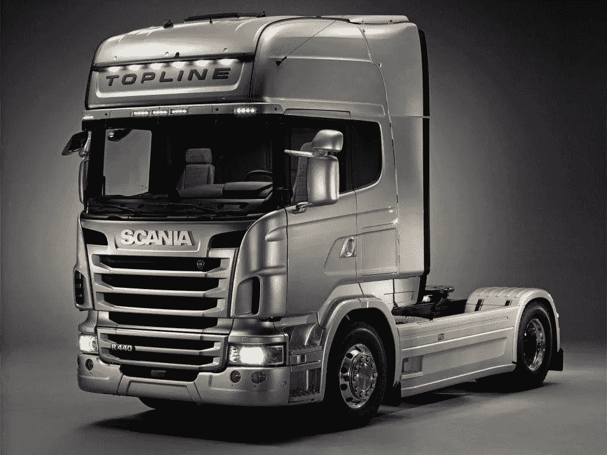

在本文中，我们将建立一个分类器，从斯堪尼亚卡车数据集的 APS 故障中检测斯堪尼亚卡车是否需要维修。

> **概要:**
> 
> 该数据集包括从日常使用的重型斯堪尼亚卡车上收集的数据。重点介绍的系统是空气压力系统(APS ),它产生压缩空气，用于卡车的各种功能，如制动和换档。数据集的正类由 APS 系统特定组件的组件故障组成。负类包括与 APS 无关的部件出现故障的卡车。这些数据由专家选择的所有可用数据的子集组成。
> 
> 我们的目标是最大限度地降低以下相关成本:
> 
> 1)机械师进行不必要的检查。(10$)
> 
> 2)遗漏故障货车，可能导致故障。(500$)

**目标:-我们的主要目标是正确预测卡车是否需要维修，并将维修成本降至最低。**

**数据集详情:**

训练集总共包含 60000 个样本，其中
59000 个属于负类，1000 个属于正类。测试集包含 16000 个例子。

*   属性数量:171
*   属性信息:出于专有原因，数据的属性名称已被匿名化。它由单个数字计数器和直方图组成，直方图由不同条件的仓组成。通常，直方图在每一端都有开放式条件。例如，如果我们测量环境温度‘T ’,那么直方图可以用 4 个箱来定义，其中:
*   bin 1 收集温度值 T < -20
*   bin 2 collect values for temperature T > = -20 和 T < 0
*   bin 3 collect values for temperature T > = 0 和 T< 20
*   bin 4 collect values for temper
*   The attributes are as follows: class, then anonymized operational data. The operational data have an identifier and a bin id, like ‘Identifier_Bin’. In total there are 171 attributes, of which 7 are histogram variables. Missing values are denoted by ‘na’.

**GitHub Repo:**[**https://GitHub . com/subhande/APS-Failure-at-Scania-Trucks-Data-Set**](https://github.com/subhande/APS-Failure-at-Scania-Trucks-Data-Set)

**项目概述:**

这里我们将构建一个分类器，它将最小化服务成本。在第一步中，我们将使用平均值、中值和众数估算法估算缺失值。在第二步中，我们将应用逻辑回归、线性回归、随机森林、GBDT 来最小化成本。在第三步中，我们将使用过采样数据，并应用随机森林和 GBDT 来最小化服务成本。

这是一个二元分类问题。

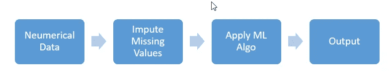

**为模型准备数据:**

从 EDA 分析，我们知道这是一个非常高度不平衡的数据。该数据集有许多缺失值。几乎每一列都有一些缺失值。我们将估算缺失的值。各种技术可用于估算缺失值。

在这里，我们将使用三种最常见的估算技术，即均值、中值和最频繁(模式)。我们将使用 [sklearn SimpleImpute](https://scikit-learn.org/stable/modules/generated/sklearn.impute.SimpleImputer.html) 来估算缺失值。

这里我们将使用标准化数据进行逻辑回归。SVM 和非标准化随机森林和 XGBoost(基于树的方法取决于相对顺序)。

**ML 车型:**

我们将训练逻辑回归，线性 SVM，随机森林和 XGBoost 的平均，中位数，模式估算数据。我们将对均值、中值、模式数据进行过采样，并对过采样数据训练随机森林和 XGBoost，即总计我们将总共训练 4*3 + 2*3 = 18 个模型。我们将使用以下三条管道来训练模型。我们将训练数据分为两部分:训练、cv 部分。我们将使用 cv 零件数据进行概率校准。

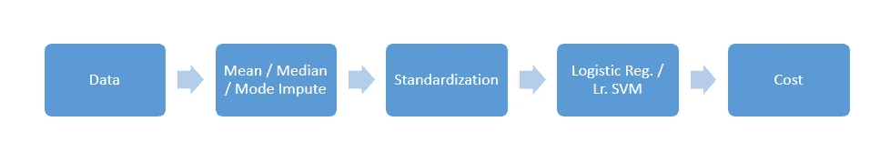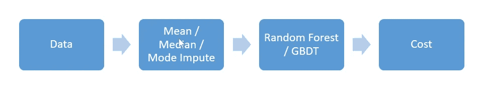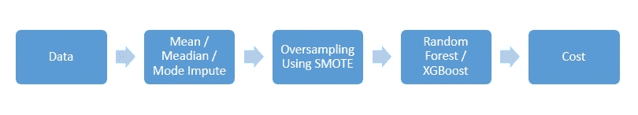

这里我们使用了逻辑回归、线性 SVM、随机森林和 XGBoost。我们观察到基于树的方法工作得更好(我们知道对于表格数据，随机森林和 XGBoost ),如随机森林和 XGBoost。

**中值估算数据的 XG boost:-**

这里我们使用中位数估算数据，因为我们有很多缺失值。我们正在使用 RandomSearchCV 和 10 倍交叉验证进行超参数训练。

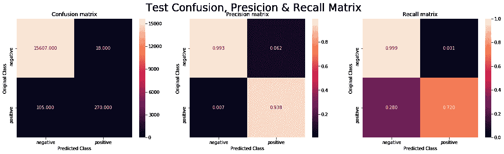

## **训练费用:25000 ||测试费用:52680**

现在，我们将使用验证数据校准概率得分，以进一步最小化成本。这里，我们将使用 precision_recall_curve 来获取阈值，并使用不同的阈值来最小化成本。我们将选择成本最低的阈值。

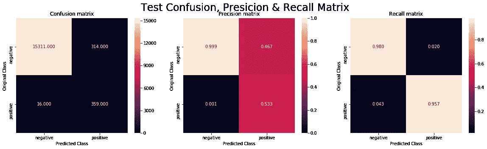

## 培训费用:15570 ||测试费用:11140

经过概率校准后，我们已经大大降低了成本。

**XGBoost 对过采样中值估算数据:-**

这里我们使用中位数估算数据，因为我们有很多缺失值。我们使用 SMOTE 对中位数估算数据进行了过采样。我们正在使用 RandomSearchCV 和 10 倍交叉验证进行超参数训练。

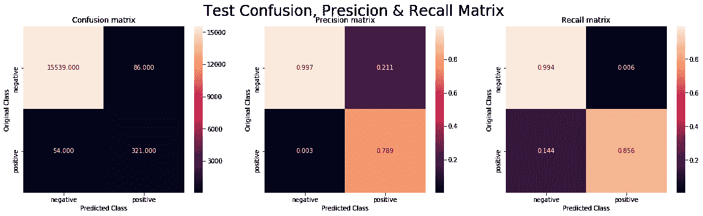

## 训练费用:19420 ||测试费用:27860

现在，我们将使用验证数据校准概率得分，以进一步最小化成本。这里，我们将使用 precision_recall_curve 来获取阈值，并使用不同的阈值来最小化成本。我们将选择成本最低的阈值。

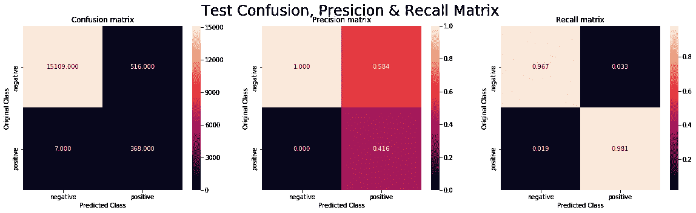

## 培训费用:13740 ||测试费用:8660

经过概率校准后，我们已经大大降低了成本。

# **所有车型的性能对比**

**不平衡数据:-**

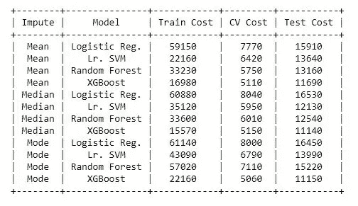

**平衡数据(过采样):-**

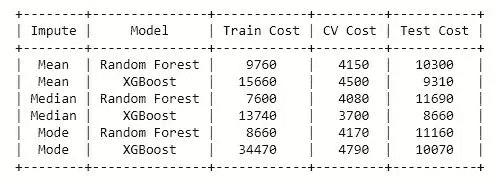

*   使用 SMOTE 的中值估算和过采样数据的 XGBoost 模型表现最佳。
*   比其他估算执行的中位数估算数据。
*   XGBoost 和 Random Forest 的表现优于其他模型。
*   测试数据的最低成本现在是 8660 美元，这是一个巨大的进步。
*   详细代码参见 [Github Repo](https://github.com/subhande/APS-Failure-at-Scania-Trucks-Data-Set) 。

# 鸣谢:-

1.  [https://www . ka ggle . com/UC IML/APS-failure-at-Scania-trucks-data-set](https://www.kaggle.com/uciml/aps-failure-at-scania-trucks-data-set)
2.  [https://ida2016.blogs.dsv.su.se/?page_id=1387](https://ida2016.blogs.dsv.su.se/?page_id=1387)
3.  [https://www.appliedaicourse.com/](https://www.appliedaicourse.com/)
4.  [https://wallpapercave.com/scania-trucks-wallpapers](https://wallpapercave.com/scania-trucks-wallpapers)