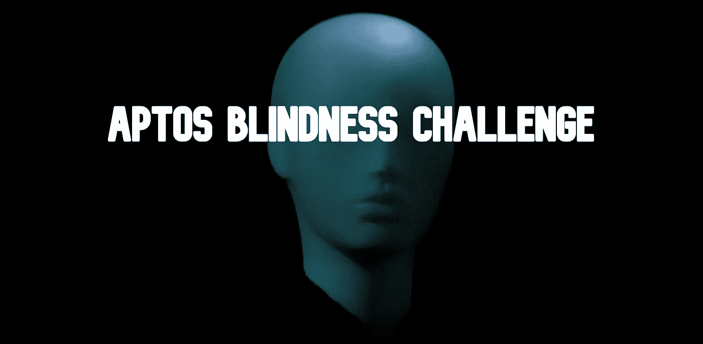
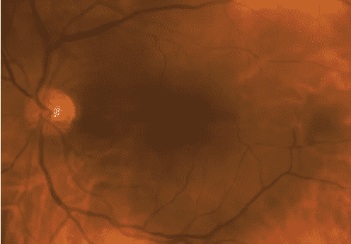
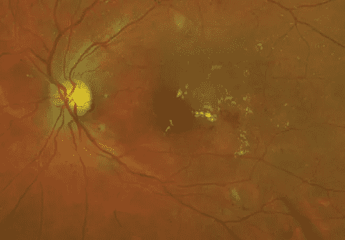
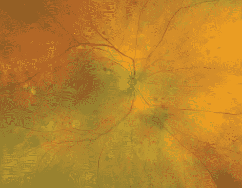
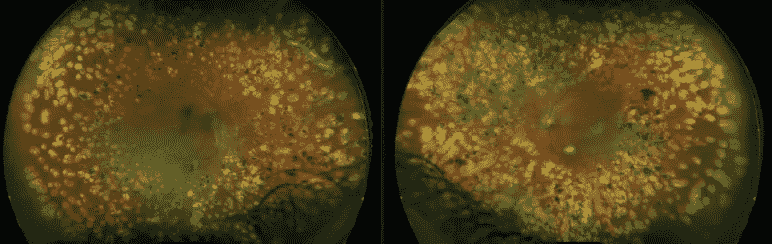
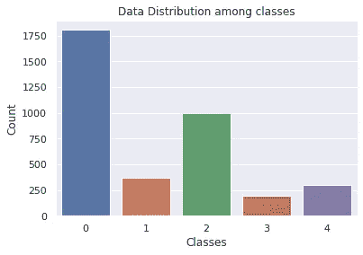
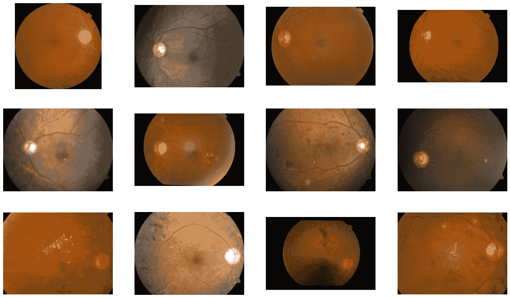
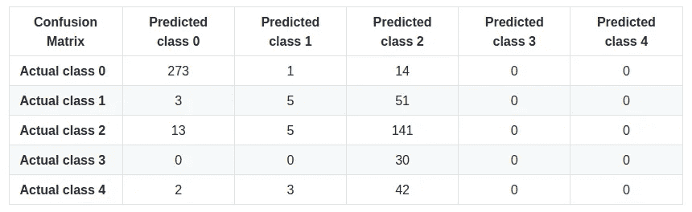

# Aptos 失明挑战—第 1 部分(基线—效率网)

> 原文：<https://medium.com/analytics-vidhya/aptos-blindness-challenge-part-1-baseline-efficientnet-c7a256daa6e5?source=collection_archive---------15----------------------->



Kaggle 在 2019 年 9 月举办了 [Aptos 失明挑战赛](https://www.kaggle.com/c/aptos2019-blindness-detection)。虽然我参加聚会已经很晚了，但我想我还是要试试。该比赛是关于从印度各医院拍摄的瞳孔图像中检测糖尿病视网膜病变。实现可以在我的 GitHub(【https://github.com/preeyonuj/Aptos-Blindess-Challenge】)上找到。

我将分多个部分发布我的实现。第一部分需要在默认图像上实现一个基本的 EfficientNet(没有图像预处理)。本文将分为 3 个主要部分:

1.  数据探索
2.  系统模型化
3.  测试集上的推断
4.  改进的余地

# 数据探索

**什么是糖尿病视网膜病变？**

糖尿病视网膜病变是一种影响眼睛的糖尿病并发症。它是由眼睛后部(视网膜)感光组织的血管受损引起的。这种情况可能发生在任何 1 型或二型糖尿病患者身上。患糖尿病的时间越长，血糖控制得越差，患这种眼部并发症的可能性就越大。

**从瞳孔图像中检测糖尿病视网膜病变**

从技术上讲，医学来源声称糖尿病视网膜病变有 2 个阶段。

1.  早期糖尿病视网膜病变:这一阶段有一个更常见的名字，非增殖性糖尿病视网膜病变(NPDR)——新血管不再生长(增殖)。当你患有 NPDR 时，你视网膜中的血管壁会变弱。微小的凸起(微动脉瘤)从较小血管的血管壁突出，有时会将液体和血液泄漏到视网膜中。较大的视网膜血管也会开始扩张，直径变得不规则。随着更多的血管堵塞，NPDR 可以从轻度发展到重度。
2.  晚期糖尿病性视网膜病变:糖尿病性视网膜病变可以发展为这种更严重的类型，称为增生性糖尿病性视网膜病变。在这种类型中，受损的血管会关闭，导致视网膜中新的异常血管的生长，并会泄漏到充满眼睛中心(玻璃体)的透明胶状物质中。



温和的 NDPR



温和的 NDPR



重度 NDPR



增生性 DR

**探索数据集**

临床医生对每张图像的糖尿病性视网膜病变的严重程度进行了评级，等级为 0 到 4:

0 —无灾难恢复

1 —轻度 DR

2 —中度灾难恢复

3 —严重灾难恢复

4 —增生性 DR

据说数据集在类之间会有一定量的污染。图像可能包含伪像、失焦、曝光不足或曝光过度。这些图像是在很长一段时间内使用各种相机从多个诊所收集的，这将引入进一步的变化。

由于这个数据集是从 Kaggle 竞赛中获取的，因此提供的测试集没有标签来验证结果，因此我将训练集划分为 train-test。这样，我们可以在更精细的层次上分析结果。图像的名称以及它们的诊断也与数据集一起提供。



不同类别之间的数据分布(全部数据)

据观察，0 类(无 DR)有大量数据。3 级(重度 DR)的数据量最少。

这里是一个小的数据示例，以便熟悉数据集。这些图像实际上非常大，需要缩小。



不同班级的样本

# **建模**

在本节中，我们将在 PyTorch 中准备一个基本的高效 Net B0 模型。我们将按原样使用这些图像(未经预处理)。这可以被认为是一个基线，我们将在这个过程中进行多次修改，并希望在每次迭代后改进结果。

**什么是高效网？**

EfficientNet 是一种理念，而不是单一的架构。作者在这种方法中试图利用的是复合缩放的力量。众所周知，更高的缩放比例导致更好的精度，通常有三种缩放比例:
1 .深度:缩放网络深度是许多卷积网络最常用的方式。直觉是，更深的卷积网络可以捕捉更丰富和更复杂的特征，并在新任务上进行很好的概括。
2。宽度:更宽的网络往往能够捕捉更细粒度的特征，也更容易训练。
3。分辨率:对于更高分辨率的输入图像，卷积网络可以捕获更精细的模式。从早期网络的 224x224 开始，现代网络倾向于使用 299x299 或 331x331 以获得更好的准确性。最近，GPipe 实现了 480x480 分辨率的一流 ImageNet 精度。

为了追求更高的准确性和效率，在扩展过程中平衡网络宽度、深度和分辨率的所有维度至关重要。因此，他们提出了一种新的缩放方式，用一个系数来控制三维空间。他们对这些维度的完美系数进行网格搜索，并将系数应用于这些维度。然后，这些系数被用于扩大基线移动网络，称为 EfficientNet-B0。在这里，我已经开始与高效-B1，这是一个比基础模型高一个档次。

**实现**

我们将使用 PyTorch 实现一个 EfficientNet-B1。首先，我们将导入一些库。

```
**import** **warnings**
warnings.filterwarnings('ignore')

**import** **numpy** **as** **np**
**import** **pandas** **as** **pd**
**import** **matplotlib.pyplot** **as** **plt**
**import** **cv2**
**import** **random**
**import** **os**

**from** **torch.utils.data** **import** WeightedRandomSampler
**from** **torchvision** **import** datasets, transforms
**import** **torch**
**import** **torch.optim** **as** **optim**
**import** **torch.nn.functional** **as** **F**
**import** **torch.nn** **as** **nn**
**from** **efficientnet_pytorch** **import** EfficientNet
**from** **torch.optim.lr_scheduler** **import** StepLR**from** **sklearn.metrics** **import** accuracy_score
**from** **sklearn.metrics** **import** confusion_matrix
**from** **sklearn.metrics** **import** cohen_kappa_score
```

虽然，我没有在这段代码中植入任何东西，但是我还是喜欢包含这段代码。

```
**def** seed_everything(seed):
    random.seed(seed)
    os.environ['PYTHONHASHSEED'] = str(seed)
    np.random.seed(seed)
    torch.manual_seed(seed)
    torch.cuda.manual_seed(seed)
    torch.backends.cudnn.deterministic = **True**

SEED = 42
seed_everything(SEED)
```

接下来，我们将定义一个为我们训练模型的函数。我输入以下变量:

*   log_interval:在每个 log_interval 之后打印训练统计数据
*   型号:PyTorch 型号
*   设备:定义在其上分配张量的设备的对象。不是 CPU 就是 GPU。
*   train_loader:训练数据集上的 Python iterable
*   优化器:训练时使用的优化器
*   历元:训练的历元数

```
**def** train(log_interval, model, device, train_loader, optimizer, epoch):
    model.train()
    **for** batch_idx, (data, target) **in** enumerate(train_loader):
        data, target = data.to(device), target.to(device)
        optimizer.zero_grad()
        output = model(data)
        output = nn.LogSoftmax(dim=1)(output)
        loss = F.nll_loss(output, target)
        loss.backward()
        optimizer.step()
        **if** batch_idx % log_interval == 0:
            print('Train Epoch: **{}** [**{}**/**{}** (**{:.0f}**%)]**\t**Loss:**{:.6f}**'.format(epoch, batch_idx * len(data), len(train_loader.dataset),100\. * batch_idx / len(train_loader),loss.item()))
```

然后，我们将定义一个测试函数，以检查在每个时期之后，经过训练的模型如何在验证集上执行。

```
**def** test(model, device, test_loader):
    model.eval()
    test_loss = 0
    correct = 0
    **with** torch.no_grad():
        **for** data, target **in** test_loader:
            data, target = data.to(device), target.to(device)
            output = model(data)
            output = nn.LogSoftmax(dim=1)(output)
            test_loss += F.nll_loss(output, target, reduction='sum').item()
            pred = output.argmax(dim=1, keepdim=**True**)  
            correct += pred.eq(target.view_as(pred)).sum().item()

    test_loss /= len(test_loader.dataset)

    print('**\n**Test set: Average loss: **{:.4f}**, Accuracy: **{}**/**{}** (**{:.0f}**%)**\n**'.format(
        test_loss, correct, len(test_loader.dataset),
        100\. * correct / len(test_loader.dataset)))
```

现在，定义训练的参数。上面我已经说了大部分。其余的是:

*   lr:初始学习率
*   γ:学习率衰减的乘法因子
*   类的数量:类的数量(对于这个问题陈述，是 5)

```
batch_size = 30
epochs = 50
log_interval = 10
save_model = **True**
lr = 0.01
gamma = 0.7
no_of_classes = 5
```

由于类别不平衡，我们将使用加权样本来提供跨类别的平等感。这里的“train.csv”包含每个图像的路径及其标签。该 CSV 提供每个类别中的样本总数。权重是根据每个类别中的样本数量计算的。但是权重需要在 WeightedRandomSampler 函数中分配给每个样本。

```
class_info  = pd.read_csv("./data/train/separated/train.csv")
class_count = class_info['labels'].value_counts().values.tolist()
target_list = class_info['labels'].values.tolist()

target_list = torch.tensor(target_list)
target_list = target_list[torch.randperm(len(target_list))]

class_weights = 1./torch.tensor(class_count, dtype=torch.float)
class_weights_all = class_weights[target_list]
weighted_sampler = WeightedRandomSampler(
    weights=class_weights_all,
    num_samples=len(class_weights_all),
    replacement=**True**
)
```

接下来，我们定义存储数据的路径。数据以特定的方式存储。“train”文件夹包含 5 个文件夹，每个文件夹代表一个类。这 5 个文件夹的名称对应于我们分配的标签名称。我们还检查 GPU 是否可用，如果可用，我们用它定义“设备”变量。“kwargs”只是定义了用于训练和验证的投料批量。“kwargs”可以有多个其他参数。
“transform”变量依赖于 PyTorch，并在将训练图像输入模型之前存储要对其进行的图像转换。
最后,‘Train _ loader’是训练集上的可迭代的，而‘val _ loader’是验证集上的可迭代的。这些用于将数据输入模型进行训练或验证。

```
traindir = "./data/train/separated/train"
valdir = "./data/train/separated/val"

use_cuda = torch.cuda.is_available()
device = torch.device("cuda" **if** use_cuda **else** "cpu")

kwargs = {'batch_size': batch_size}transform=transforms.Compose([
    transforms.Resize([224, 224]),
    transforms.ToTensor()])dataset1 = datasets.ImageFolder(traindir,transform=transform)
dataset2 = datasets.ImageFolder(valdir,transform=transform)

train_loader = torch.utils.data.DataLoader(dataset1, sampler=weighted_sampler, **kwargs)
val_loader = torch.utils.data.DataLoader(dataset2, **kwargs)
```

接下来，我们定义效率网络模型。我安装了一个库，它允许我调用一个简单的函数来加载 EfficientNet 模型。我们还在模型的末尾定义了全连接层，以将预先构建的模型的输出转换为 5 维向量，该向量表示我们的问题陈述中的 5 个类。
然后，我们将模型加载到所用的设备上。

```
model = EfficientNet.from_name('efficientnet-b1')
**for** param **in** model.parameters():
    param.requires_grad = **True**

num_ftrs = model._fc.in_features
model._fc = nn.Linear(num_ftrs, no_of_classes)
model = model.to(device)
```

作为标准，我决定使用交叉熵损失。它将 Softmax 和 NLL 损耗合并为一个函数。当有多个类需要考虑时，这是一个有用的标准。对每个迷你批次的观测值进行平均。我已经决定使用 Adam optimizer，因为它们通常表现很好。可以理解的是，不同的优化器可能会有更好的性能，但我还没有研究它。
StepLR 是在每个“步长”时期后修改学习率的函数。这里的“步长”设置为 1。“gamma”设置为 0.7，这基本上意味着在每个时期后将 0.7 乘以学习率，从而在此过程中降低学习率。

```
criterion = nn.CrossEntropyLoss(weight=class_weights.to(device))
optimizer = optim.Adam(model.parameters(), lr=lr)
scheduler = StepLR(optimizer, step_size=1, gamma=gamma)
```

这是一个主循环，其中我们调用训练函数来训练模型，调用测试函数来测试验证集上的模型，并调用调度程序来在一定数量的时期后改变学习。最后，一旦训练完成，我们使用 torch.save 保存模型。

```
**for** epoch **in** range(1, epochs + 1):
    train(log_interval, model, device, train_loader, optimizer, epoch)
    test(model, device, test_loader)
    scheduler.step()

**if** save_model:
    torch.save(model.state_dict(), "aptos_blindness_effnet_b1_weighted.pt")############# OUTPUT #############
After 50 epochs, the results were:
Test set: Average loss: 0.7208, Accuracy: 528/733 (72%)
```

# **测试集上的推理**

推理代码片段只是上面定义的测试函数的修改版本。要加载一个保存的模型，这个模型必须已经在某个变量中定义了(这里是“模型”)。我们只需要将 state_dict 上传到那个变量上，瞧，我们的模型就可以进行推理了。

```
model_path = "aptos_blindness_effnet_b1_weighted.pt"
use_cuda = torch.cuda.is_available()
device = torch.device("cuda" **if** use_cuda **else** "cpu")
model = EfficientNet.from_name('efficientnet-b1').to(device)
model.load_state_dict(torch.load(model_path))
```

我们用测试数据集的路径来定义“testdir”变量。我们也在测试集上保持相同的转换，因为我刚刚裁剪了图像，并在函数中对其进行了归一化。

```
testdir = "./data/train/separated/test"transform=transforms.Compose([
    transforms.Resize([224, 224]),
    transforms.ToTensor(),
    transforms.Normalize((0.1307,), (0.3081,))
    ])dataset1 = datasets.ImageFolder(testdir, transform=transform)
test_loader = torch.utils.data.DataLoader(dataset1)

model.eval()
test_loss = 0

true_labels = []
preds = []

**with** torch.no_grad():
    correct = 0
    total = 0
    **for** images, labels **in** test_loader:
        images = images.to(device)
        labels = labels.to(device)
        true_labels.append(labels)
        output = model(images)
        output = nn.LogSoftmax(dim=1)(output)
        test_loss += F.nll_loss(output, labels, reduction='sum').item()
        pred = output.argmax(dim=1, keepdim=**True**)
        preds.append(pred)
        correct += pred.eq(labels.view_as(pred)).sum().item()

        total += labels.size(0)

    print('Test Accuracy of the model on the test images: **{}** %'.format(100 * correct / total))
```

测试结果并不是很好。



测试集的混淆矩阵

```
Overall Accuracy : 0.71869 
Kappa Score : 0.54697
```

很明显，该模型未能根据数据进行适当的训练。该模型偏向于类别 2，即它预测大多数测试样本为类别 2。3 类和 4 类几乎没有正确的预测。准确率在 71%左右，但看起来它是由主导类的正确预测推动的。从流行的观点来看，如果类的比例实际上类似于真实世界的场景，那么“重要”类被正确分类可能是个好消息。但这也是一种直觉，在这个特殊的问题中，如果一个人患有增殖性 DR(4 级),这是严重的，可以导致失明，但被诊断为中度 DR(2 级),这将是一个严重的疏忽。

# **改进空间**

现在，我们已经成功地在我们的数据集上实现了一个 EfficientNet-B1。但是结果并没有那么好。当然，我们可以关注很多方面来提高我们的成绩。以下是这些要点的列表(我可能会漏掉一些要点，但都是我自己想出来的):

1.  图像增强:在我上面提供的例子中，我们可以看到类之间的差异并不明显。差异非常小，模型很有可能(很有可能)无法捕捉到这些差异。例如，特定的图像变换——调整图像的亮度、伽玛或色彩映射，可能有助于突出差异。另一种基于图像的解决方案可以是数据增强，使用 SMOTE 或一些高级神经架构，如 GANs 或 VAEs。
2.  修改模型参数:模型中有多个可编辑的参数。首先是模型本身。EfficientNet 有多种变体，更复杂的版本有更大的架构足迹，所以这一切都取决于你的 GPU。第二，有像学习率、学习率衰减的伽马、模型的标准、使用的优化器、学习率衰减的特定方法等参数。这些参数在模型的成功中起着巨大的作用，我非常确定微调它们会改善我的结果。

所以，我想在这里结束我的文章。这只是我未来工作的一个基线，我将分部分发布，解释我所做的改变。这就像一次问题陈述之旅，随着我们的前进，发现它的各个方面。请继续关注第二部分。感谢您的阅读！

GitHub 链接:[https://github.com/preeyonuj/Aptos-Blindess-Challenge](https://github.com/preeyonuj/Aptos-Blindess-Challenge)

领英:【www.linkedin.com/in/pb1807 

以下是我提到的信息来源的链接:

1.  卡格尔比赛:【https://www.kaggle.com/c/aptos2019-blindness-detection 
2.  糖尿病视网膜病变相关信息:[https://www . mayo clinic . org/diseases-conditions/Diabetic-Retinopathy/symptoms-causes/syc-2037 16 11](https://www.mayoclinic.org/diseases-conditions/diabetic-retinopathy/symptoms-causes/syc-20371611)
3.  EfficientNet PyTorch 库:[https://pypi.org/project/efficientnet-pytorch/](https://pypi.org/project/efficientnet-pytorch/)
4.  使用 Pixlr 在线编辑器编辑的图像