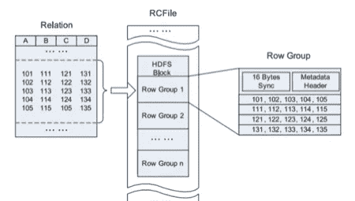

# 构建大数据存储— AWS S3、Hadoop HDFS

> 原文：<https://medium.com/analytics-vidhya/architecting-hadoop-storage-service-4265373d2ffc?source=collection_archive---------9----------------------->

弗兰克·麦肯纳在 [Unsplash](https://unsplash.com?utm_source=medium&utm_medium=referral) 上拍摄的照片

随着大数据的接收和存储呈指数级增长，迫切需要精心设计存储，以获得更快的查询体验并避免查询成本。在某个时候，您可能遇到过如何在您的数据科学管道中有效且高效地设计存储的问题。在这篇博客中，我们将首先讨论设计大数据存储时应该考虑的因素。然后，我们将进一步详细讨论这些因素。并且最终缩小到对于不同的情况应该优选哪些因素。

虽然在数据组织、数据存储和压缩方面有很大的选择灵活性，但我们需要明白，这对 Hadoop 文件存储的搜索、性能和可用性有很大的影响。

> 本质上，这是影响大数据存储的三个因素:
> 
> 1.文件格式
> 
> 2.压缩技术
> 
> 3.基于访问模式的数据存储

# **1。文件格式**

我们有很多选择，从标准文本文件到序列化格式和列格式，如 Avro 和 Parquet，人们很容易被这些淹没。在了解这些文件可以在哪里使用之前，让我们了解这些格式的基础，以及是什么导致了其他格式的发展，以及为什么我们不能简单地使用文本文件。

**标准和序列文件格式**

标准文本文件可以从 CSV、TSV 和 JSON 数据、XML 文件加载数据。在文本文件中，每条记录由分隔符分开。文本文件的主要缺点是它会消耗大量的磁盘空间，并且有大量的类型转换开销。

这也是 Hadoop 提出称为序列文件的特定文件格式的根本原因。这些是基于文件的数据结构，包含二进制键值对形式的数据。它们具有用户定义的序列化。此外，不支持语言中立性，这意味着如果你用 Java 写这个文件，你需要用 Java 读这个文件。序列文件也可以分割，因为它们有同步标记。为什么你需要文件是可分割的？为了利用并行处理的优势，数据应该易于分割和组合。

**Avro 文件格式**

Avro 是一个语言中立的数据序列化系统。这是一种基于行的序列化数据的存储格式。存储时，这些行保持彼此靠近。Avro 文件也是自描述的，这意味着它们包含模式(JSON)和数据(二进制)。

Avro 文件中与语言无关的数据序列化

创建 Avro 文件格式的主要目标是支持模式进化，这使得文件格式能够适应数据源上的变化，而没有麻烦。Avro 文件在很大程度上支持模式演变，从适应添加和删除列的变化到更改列名。

Avro 文件中的模式演变

由于 Avro 文件支持各种数据结构，如映射、数组和其他基本数据结构；因此，将纯文本吸收到复杂的 XML 吸收中，也可以很好地适应模式演化。它们用于在数据到达数据管道中的数据着陆区时写入数据。

**拼花文件格式**

我们都很清楚 Avro 的优势，以及它们如何很好地处理写密集型工作，但它们在阅读时的表现是否相似？不尽然！当我们读取 Avro 文件时，它们花费的时间几乎与读取文本文件的时间相同，这真的很高。

这就产生了拼花锉刀。它们是列格式，即消除了不需要的列的 I/O。它们更适合于分析环境和用例——一写多读。这使得拼花文件更适合读取密集型应用程序。

Parquet 文件格式在每个文件中都定义了一个基于现有列的模式。

拼花地板还支持:

**谓词下推**:读取时过滤。

**投影下推**

**优化的行列文件格式**

它们是 RC 文件的优化版本。对于 RC 文件，查找分割是非常昂贵的。ORC 是带条纹的列主格式。它只读取和解压缩你需要的字节。像 Avro 和 Parquet 一样，ORC 文件也是自描述的。兽人和拼花地板有什么不同？Parquet 存储嵌套数据的能力更强。如果您的数据有很深的层次结构。

总之，在考虑文件格式时，您应该比较读取强度、写入强度、文件是否可分割、文件是否支持模式演进支持以及这些文件的压缩支持如何？

# **2。选择压缩算法**

有很多文件格式，如 Gzip，Bzip2，Snappy，LZO，但在某个阶段，你会想评估这些压缩算法。这实际上是压缩能够大幅减少磁盘占用空间。本质上导致读和写操作。但与此同时，你所放弃或交换的是 CPU 时间。

> 这些是应该影响你选择的参数。
> 
> 1.压缩比
> 
> 2.吞吐量
> 
> 3.压缩和解压缩速度
> 
> 4.受大数据平台和文件格式支持
> 
> 4.分裂能力

由于 Hadoop 作业受 I/O 限制，因此一个轻量级的快速压缩编解码器实际上会提高性能。在所有的压缩技术中，Snappy 是为速度而设计的，它不会对你的 CPU 内核造成很大影响，但 Snappy 本身是不可分割的。我们心中的问题是，快速压缩真的是一种好的压缩技术吗？Snappy 适用于包含容器文件格式(如序列文件或 Avro 文件)中的块的文件，以及像 Parquet 文件这样的块边界分隔符。

# **3。基于访问模式的数据** **存储**

> 1.是否需要随机存取数据
> 
> 2.如果需要频繁更新

你应该在考虑这些因素的同时回答这些问题。什么是数据生命周期。是热数据还是冷数据？由于 Hadoop 中的数据是不可变的，在 Hadoop 中保留需要频繁更新的数据真的值得吗？或者我们应该将这些数据分成像 Hbase 这样的存储，这是一个非 SQL 数据库。

**推荐**

列格式通常用在需要查询几列而不是行中所有字段的地方，因为它们面向列的存储模式非常适合这种情况。

另一方面，行格式用于需要访问行中所有字段的地方。所以通常 Avro 被用来存储原始数据，因为在处理过程中通常所有的字段都是必需的。