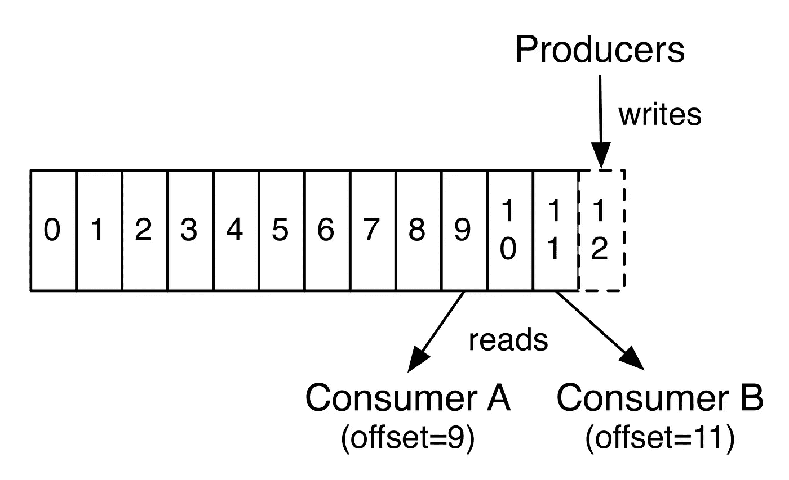
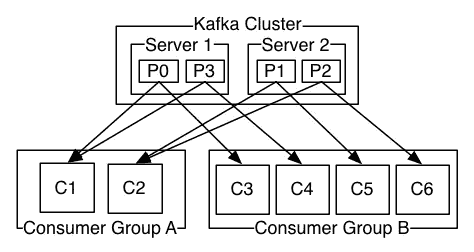

# 卡夫卡的建筑

> 原文：<https://medium.com/analytics-vidhya/architecture-of-kafka-f124d198bbec?source=collection_archive---------21----------------------->

我在以前的一篇文章中试图解释什么是 [**卡夫卡**](https://kafka.apache.org/) 以及使用它的一些好处。现在，我将把它分成一些更小的部分，称为组件。之后，我们将看看卡夫卡的建筑。我将在这里削减介绍，让我们继续挖掘。

**信息系统**

消息传递系统有两个不同的概念:排队和发布-订阅。他们之间总是有贸易往来。如果您使用排队系统，那么您将能够如此快速地接收传入的数据，因为许多消费者能够从队列中读取数据，但是这种系统仍然有一个缺点。在其使用者处理完一条消息后，该消息将被推入队列以立即删除，其他使用者将无法处理同一条记录。该特性确保了速度，但是不可能将源数据分布在不同的系统上。另一个概念是发布-订阅(pub-sub ),这也是将信息从发送者移动到消费者，但与排队相反，发布-订阅消息传递允许多个消费者阅读一个主题中的每条消息。发布-订阅用户 btw，按照消息系统收到数据相同顺序读取数据。然而，发布订阅不容易横向扩展。Kafka 作为一个解决方案出现在这个阶段，它结合了这两个概念，为任何消息传递问题提供了最佳实践。

# 首先，“什么是组件？”

组件基本上是软件系统的离散部分，它们也是描述它们做什么的关键词。在我们的概念里；“组件”是指一段代码，用于执行一组工作。不同类型的组件可以组合在一起形成一个集成的系统，换句话说，一个集成的软件可以包含组件来完成不同类型的操作。对于我们感兴趣的软件，卡夫卡；有许多组件用来完成与数据管道相关的不同类型的问题。

# **卡夫卡的成分**

> **生产者:**该组件负责将消息转发给相关的 Kafka 组件。这是以下组件。
> 
> **主题:**这是生产者保存消息的地方。主题负责在 Kafka 内部存储数据。

对于每个主题，Kafka 集群维护一个类似于上面的****方案的分区日志****

> ******消费者:**当你想从一个或多个主题中读取数据时，消费者从主题中执行读取操作。****

********

****上面这个方案 [**解释了**](https://kafka.apache.org/documentation/#gettingStarted) 的读写操作是在一个分区上进行的****

> ******消费群:**读取操作有消费群特性。比方说，您需要从许多不同的系统中读取相同的数据，您可以创建消费者组，并在它们下面创建消费者，以便您可以决定将哪个消费者分配到哪个组。还可以通过使用使用者组来扩展密集型读取操作。****

********

****连接到 [**集群**](https://kafka.apache.org/documentation/#gettingStarted) 中相同服务器的消费者群组****

> ******集群:**从组件的名字就可以理解(就像前面的一样)这个组件说卡夫卡可能是集群的。也就是说，在不同服务器上运行的 Kafka 实例可以相互通信，并行执行操作。一个 Kafka 集群由多个 Kafka 代理组成。****
> 
> ******代理:**代理存储发送给主题的消息，并为消费者请求提供服务。****
> 
> ******分区:**每个主题都由分区组成，我们可以说分区使主题成为了一个数据仓库。****
> 
> ******副本:**复制在 Kafka 中是可能的，以确保容错。根据项目的需要，复制可能是同步的，也可能是异步的。****
> 
> ******领导者:**每个分区都有一个领导者服务器。这些组件执行每个读写操作，并管理复制过程。****
> 
> ****追随者:追随者听他们的领袖说什么。它们存储复制的数据。如果跟随者在同步复制模式下工作，这意味着它可以在主导者失败的情况下成为下一个主导者。****

# ******依赖关系******

****要运行 Kafka，必须在服务器上安装 java 环境。java 环境基本上控制着任何用 java 语言开发的软件的 java 基础结构，它使得在任何支持 java 的操作系统上运行 Java 成为可能。****

****另一个依赖就更棘手了，**动物园管理员。等一下，什么？动物园管理员？是的，它依赖于服务协调和配置，我们已经谈了一些组件，我们可以理解这些组件必须相互对话以共享它们的状态，例如，消费者必须与代理对话以从主题中获取数据，并且它必须共享关于它在代理中进行的操作的知识。再比如，如果集群中的领导者失败了会怎么样？在进行领导人选举之前，Zookeeper 会与其他经纪人交谈，因此 Zookeeper 会处理这种协调任务。******