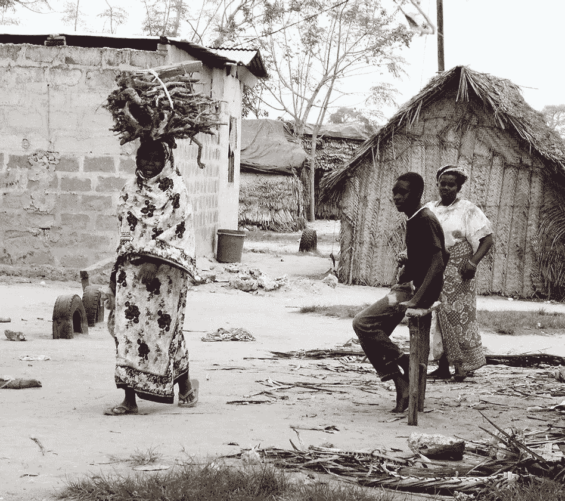

# 农民达到生活收入了吗？机器学习方法

> 原文：<https://medium.com/analytics-vidhya/are-cocoa-farmers-reaching-a-living-income-f7724af574c4?source=collection_archive---------26----------------------->

**简介**

[生活收入实践社区](https://www.living-income.com/)在制定更具挑战性的生活标准参考值方面做了大量工作:一个家庭维持基本但体面的生活标准所需的最低金额。

这高于 T4 的贫困线，因此更难实现。然而，我们都…