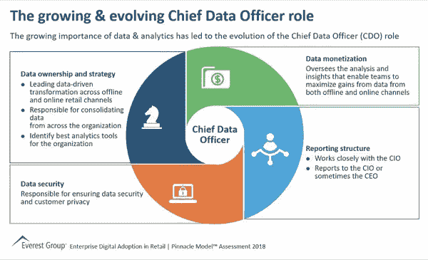
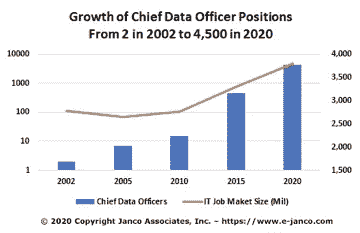

# 数据科学家是未来的 CEO 吗？

> 原文：<https://medium.com/analytics-vidhya/are-data-scientists-the-future-ceos-af5ec7c2d183?source=collection_archive---------8----------------------->

简而言之，是的。**数据** **科学家是未来的 CEO。为什么？因为企业正变得越来越受数据驱动，而首席执行官在利用数据优化业务运营方面是强者，这对于实现企业目标至关重要。**

虽然他们可能不会整天编写代码和钻研数据，但他们的职能与数据科学家高度相关，但处于更高的战略层面。像数据科学家一样，数据驱动的 CEO 在考虑之前先寻找数据中的模式，例如；值得收购 X 公司还是 Y 公司？不言而喻，数据分析正在重新定义 CEO 的角色。让我们讨论一下这条职业道路能让你站在公司食物链顶端的一些原因。

随着技术和数据分析在现代业务流程中的重要性日益增加，企业高管(尤其是首席执行官)必须非常了解企业如何利用这些技术和生成的大量数据来获得超越竞争对手的优势，并直接增加收入或降低成本。

根据最近的[德勤调查](https://www2.deloitte.com/us/en/pages/about-deloitte/articles/press-releases/deloitte-survey-analytics-and-ai-driven-enterprises-thrive.html)，尽管在过去的十年里大数据分析最近很热门，但报告发现大多数大公司在业务分析方面还不成熟，62%的公司仍然依赖电子表格。虽然越来越多的组织在其业务流程中采用了高级分析，但大多数组织只是数据分析的涉猎者，只有少数组织真正接受了数据素养，采用了分析、人工智能和自动化，并系统地转变了整个企业的工作方式。

有趣的是，在组织中采用数据科学的最大障碍是公司文化。为了获得真正的好处，数据科学必须从上到下渗透到公司文化中。

# 是什么造就了一个伟大的 CEO？

根据这篇[福布斯文章](https://www.forbes.com/sites/forbescoachescouncil/2017/03/29/the-evolving-executive-five-skills-all-modern-ceos-should-have/#1504bbcc5d14)，所有现代 CEO 都应该具备这五种技能:

1.  对歧义的高容忍度
2.  理解和接受新技术的能力
3.  激励的力量
4.  敏捷决策技能
5.  组建伟大团队的能力

在大多数组织的当前业务设置中，当开发和实施复杂的人工智能和人工智能系统时，有权转变业务的首席执行官与完全了解技术的数据科学家密切合作。首席执行官的数据科学专业知识通常有限，并且依赖于数据科学家的专业知识。

为了在业务运营中有效利用数据分析，首席执行官必须推动公司文化，在日常业务运营中全面采用数据分析。首席执行官还必须向相关利益相关者传达公司的数据驱动愿景，为数据科学家提供支持和基础设施，并用数据驱动的决策取代直觉和本能。

# 数据科学家担任首席执行官

首席执行官的职位需要领导力、商业敏锐度、战略思维、沟通技巧等的结合。数据科学家通常是数据黑客、分析师、调查员和业务专家的混合体。拥有 CEO 特质的数据科学家无疑会成为一名出色的 CEO，因为他/她对业务有着完美的理解，能够有效地利用数据分析来转变业务运营并超越业务目标。最棒的是，这些 CEO 技能可以随着时间的推移而发展。

有趣的是，有几个 CEO 是从数据科学家起家的。[巴斯蒂安·特龙](https://blog.udacity.com/author/sebastianthrun)是一名数据科学家、教育家、发明家和企业家，目前是全球领先的在线教育机构之一 [Udacity](https://en.wikipedia.org/wiki/Udacity) 的执行主席。 [Thomas Thurston](https://www.thomasthurston.com/) 是一名数据科学家和风险投资家，他利用数据科学资助颠覆性的初创公司，目前是 WR [Hambrecht+Co](https://www.wrhambrecht.com/) 的合伙人兼首席技术官，也是 [Growth Science](https://www.growthsci.com/) 的创始人。[李家杰](https://rapidminer.com/us/leadership/)是 [RapidMiner Inc](https://rapidminer.com/us/) 的总裁兼首席执行官，这是一个开放且可扩展的数据科学平台。其他数据科学家兼首席执行官包括[KNIME](https://www.crunchbase.com/person/michael-berthold#section-overview)总裁兼创始人迈克尔·贝特霍尔德、 [H2O.ai](https://www.h2o.ai/company/) 联合创始人兼首席执行官[斯里·萨蒂什·安巴蒂](https://www.crunchbase.com/person/srisatish-ambati#section-overview)，以及 SAS 联合创始人兼首席执行官吉姆·古德奈特等人。

需要注意的是，上面提到的 CEO 都是自己创立的公司的 CEO。尽管如此，当今世界上大多数著名的首席执行官都是利用数据分析实现有效业务转型的专家。Alphabet(谷歌母公司)的联合创始人兼合伙人拉里·佩奇(Larry Page)曾任该公司首席执行官，被一些人认为是世界上最顶尖的数据科学家。其他首席执行官，如[迪安·阿博特](https://www.crunchbase.com/person/dean-abbott)(雅培分析公司创始人兼总裁)、巴斯蒂安·特龙(Udacity)和[吴恩达](https://www.crunchbase.com/person/andrew-ng#section-overview)(首席执行官[兰丁·艾](https://www.crunchbase.com/organization/landing-ai))被认为是世界上最顶尖的数据科学家。

# CDO 还是首席执行官？

首席数据官(CDO)是一个对有领导抱负的数据科学家同样有吸引力的领导角色。CDO 是负责组织的数据使用和数据治理的高级管理人员。CDO 通过监督和管理公司的所有大数据计划，从公司数据中创造价值。在大多数组织中，CDO 向首席执行官或其他高层管理人员报告。CDO 的一个重要职责是让所有相关利益方了解公司的数据战略、政策和程序。

首席数据官角色

尽管是一个新职位，但首席数据官的职位数年来已从 2002 年的 2 个增加到 2020 年的约 4500 个。

CDO 头寸的增长

大多数首席数据官最终会成为首席执行官，因此 CDO 的角色是有领导抱负的数据科学家在通往首席执行官职位的路上可以瞄准的角色。

# 首席执行官是这一变化的主要驱动力

总的来说，随着技术和数据在现代商业中的重要性日益增加，商业必须是数据驱动的。这需要在业务运营的各个方面全面采用数据分析。首席执行官是这一变化的主要驱动力，但尽管最近大数据分析引起了轰动，但只有少数组织在其业务运营中成功采用了数据分析。

全面采用数据驱动的业务运营的最大障碍是公司文化，数据驱动的首席执行官成功推动这一变革的重要性怎么强调都不为过。越来越有可能的是，在不久的将来，拥有数据科学家背景的首席执行官将会出现。然而，这些具有数据科学家背景的首席执行官需要具备首席执行官的基本特质，从而对业务有完美的理解，并能够有效地利用数据分析来转变业务运营。

# 关于作者

**Obinna Iheanachor** 是一名创新型数据专家，拥有丰富的分析经验，成功处理大量数据集来分解信息、收集相关见解并解决高级业务问题。*你会发现他处于数据分析、科学和艺术的交汇点*。

你可以在 [LinkedIn](https://www.linkedin.com/in/obinnaiheanachor/) 和 [Twitter](https://twitter.com/DatascientistOb) 上和我联系。

*原载于 2020 年 8 月 18 日 https://mathamagicians.co**的* [*。*](https://mathamagicians.co/2020/08/18/are-data-scientists-the-future-ceos/)