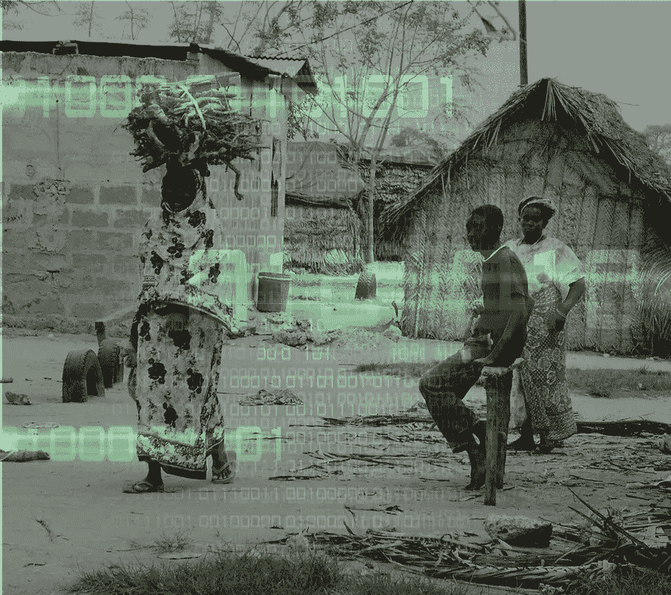
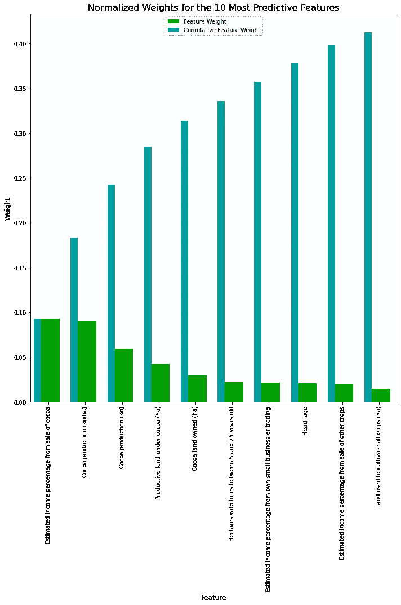
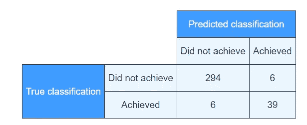
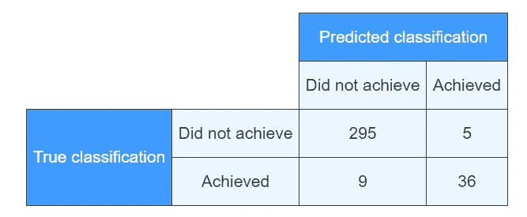
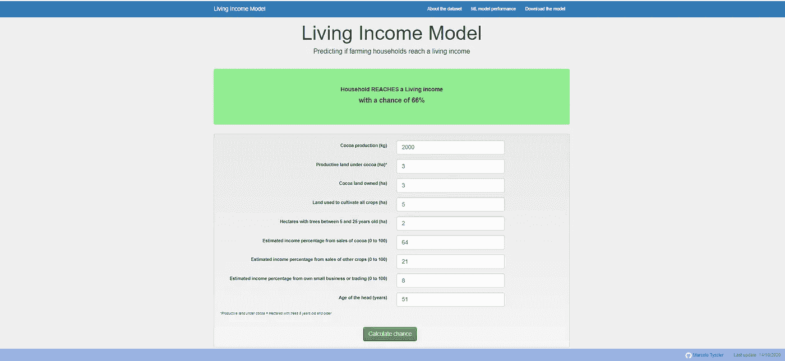

# 农民达到生活收入了吗？只有 9 个指标的机器学习模型(和一个 web 应用程序)

> 原文：<https://medium.com/analytics-vidhya/are-farmers-reaching-a-living-income-c15523a564b2?source=collection_archive---------24----------------------->

**动机**

2020 年 9 月 9 日，我写了一篇 [**的帖子**](/analytics-vidhya/are-cocoa-farmers-reaching-a-living-income-f7724af574c4?sk=344c18d46a7fd402d3a137061c6ba89a) ，在那里我讨论了机器学习模型是否可以预测农民是否达到生活收入，以及为什么这很重要。

成绩哪里有前途！该模型在 96.5%的时间 *(准确度)内**正确。***然而，由于数据集中只有 15%的农民达到了生活收入，仅通过猜测没有人会达到生活收入，模型就可以非常准确。但即使在这里，模型也是正确的:**预测一个农民将达到生活收入**(困难的情况)**在 87%的时间里是正确的** *【精确】***87%的农民达到生活收入**(很难找到)**被模型** *(回忆)正确标记出来。*

> 然而有一个巨大的问题:这个模型使用了 838 个变量！

好吧，230 个只是分类变量到虚拟变量的扩展，但是这个模型仍然基于 608 个变量做出决定。

建立机器学习模型的一个关键动机是，收集数据来衡量农民的实际收入和生活收入基准既昂贵又耗时。

> **因此，机器学习模型在现实世界中的可用性与它在多大程度上简化了原始数据收集的需求直接相关，即，它基于很少且(相对)容易收集的变量。**

只有几个变量的模型

然后我转向下一个问题:**如果我只取前 10 个特性**并重新校准模型会怎么样？

我首先研究了最具预测性的特征:

**十大**特性依次为:

*   可可销售的估计收入百分比
*   可可产量(公斤/公顷)
*   可可产量(公斤)
*   可可生产用地(公顷)
*   拥有的可可土地(公顷)
*   树木树龄在 5 至 25 年之间的公顷数
*   来自自己的小企业或交易的估计收入百分比
*   头像:年龄
*   其他作物销售的估计收入百分比
*   用于种植所有作物的土地(公顷)

由于*可可产量(公斤/公顷)=可可产量(公斤)/可可生产用地(公顷)*实际上我有 9 个特征。

我对此感到非常高兴。这些变量中没有一个特别难收集。大多数公司、认证方案、开发项目等会发现，收集可可产量、土地面积、户主年龄和收入份额的数据(相对而言)比收集每个农民的具体支出数据更容易。事实上，除了收入份额之外，大多数与农民打交道的组织可能手头都有(大部分)这种数据。

> 然而，前 10 个特征仅占该模型解释力的 40%以上。**所以真正的问题是:只有 9 个特征的模型性能如何？**

**有 9 个变量的模型做得很好！**

结果很有希望。请记住，完整模型的准确率为 96.5%，精确度为 87%，召回率为 87%。

> 具有 9 个变量的(重新校准的)模型具有 96%的**准确度**、90%的**精确度**和 80%的**召回率**

这意味着，当从 838 个变量下降到 10 个变量(实际上是 9 个变量)时,(重新校准的)模型几乎没有损失准确性，以稍差的回忆为代价获得了多一点的准确性。

为了理解这种权衡，我喜欢看所谓的混淆表(不要混淆😉).*混淆表*显示了正确标签和来自模型的预测标签之间的比较。

**全模型**具有以下混淆表:

**而具有 9 个变量的模型**具有以下内容:

你会发现两张表非常相似。

> **只有 9 个变量的模型比完整的模型**(这几乎是构造上的，并不奇怪)**稍差一些，但是损失是最小的，因为它使用了大约 1%的完整特性！**

**将模型变成网络应用**

> 为了让这个模型对生活收入实践社区的利益相关者更加有用，我把这个只有 9 个变量的模型变成了一个网络应用，可以在[https://living-income-model.herokuapp.com/](https://living-income-model.herokuapp.com/)获得

在 web 应用程序中，你只需要输入一个(有代表性的)农民的价值观，你的模型就会告诉你这个家庭达到生活收入的可能性有多大:

**[**web app**](https://living-income-model.herokuapp.com/)**还附带了一些更多的** [**数据描述**](https://living-income-model.herokuapp.com/dataset)**[**技术信息**](https://living-income-model.herokuapp.com/performance) **，并允许您** [**下载模型**](https://living-income-model.herokuapp.com/download)****

******提醒一句******

****尽管我对这个模型非常满意，并且希望您能使用它，但我需要提醒您:这是一个仍处于起步阶段的模型。它显示出了希望，但它还没有在更大的数据集上进行彻底的审查、测试或验证，也没有在另一个数据集中进行真正的测试。****

> ****使用它，并给我你的反馈！****

******延伸阅读******

****如果你还没看，请看看我的[上一篇](/analytics-vidhya/are-cocoa-farmers-reaching-a-living-income-f7724af574c4?sk=344c18d46a7fd402d3a137061c6ba89a)****

****如果你更愿意阅读一篇技术性更强的帖子，在那里我解释了找到这个模型的所有技术步骤，请到[这里](https://mtyszler.medium.com/are-farmers-reaching-a-living-income-the-machine-learning-technical-companion-c8e4574868da)****

****这篇博文使用的起始数据集可以在[这里](https://doi.org/10.7910/DVN/82TWZJ)找到****

****更大的项目有自己的[网站](https://www.kit.nl/project/demystifying-cocoa-sector/)****

****数据争论和数据分析在本 [jupyter 笔记本](https://github.com/mtyszler/LivingIncomeModel/blob/master/analysis%20notebooks/LivingIncomeAnalysis.ipynb)中有详细描述****

****完整的机器学习模型拟合和调整可以在这个 [jupyter 笔记本](https://github.com/mtyszler/LivingIncomeModel/blob/master/analysis%20notebooks/LivingIncome_MachineLearning.ipynb)中找到****

****限于 9 个变量的机器学习模型拟合和调整可在本 [jupyter 笔记本](https://github.com/mtyszler/LivingIncomeModel/blob/master/analysis%20notebooks/LivingIncome_Model.ipynb)中找到****

****与这篇博文相关的所有数据和文件都可以在这个 [Github 页面](https://github.com/mtyszler/LivingIncomeModel/)中找到****

****来[这里](https://www.living-income.com/)了解更多关于收入实践社区的生活****

****关于生活收入价值差距分析的具体(半技术性)报告，请点击[这里](https://c69aa8ac-6965-42b2-abb7-0f0b86c23d2e.filesusr.com/ugd/0c5ab3_fc3386a550b94a898c7757ee13ab59e6.pdf)和[这里](https://c69aa8ac-6965-42b2-abb7-0f0b86c23d2e.filesusr.com/ugd/0c5ab3_93560a9b816d40c3a28daaa686e972a5.pdf)。还有关于如何计算和可视化差距的[指南](https://c69aa8ac-6965-42b2-abb7-0f0b86c23d2e.filesusr.com/ugd/0c5ab3_74a43f3647724bc58caf4daaa570482b.pdf)(我是这些报告的主要作者)****

*******参见我的专业*** [***网页***](https://www.marcelotyszler.com/)****