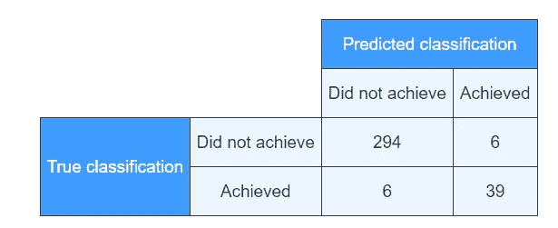

# 农民达到生活收入了吗？机器学习技术伙伴

> 原文：<https://medium.com/analytics-vidhya/are-farmers-reaching-a-living-income-the-machine-learning-technical-companion-c8e4574868da?source=collection_archive---------26----------------------->


# **1。简介**

2020 年 9 月 9 日，我写了第一篇[](/analytics-vidhya/are-cocoa-farmers-reaching-a-living-income-f7724af574c4?sk=344c18d46a7fd402d3a137061c6ba89a)****的文章，讨论了机器学习模型是否可以预测农民(在加纳和科特迪瓦)是否达到生活收入，以及为什么这很重要。2020 年 12 月 16 日，我写了一篇[后续文章](https://mtyszler.medium.com/are-farmers-reaching-a-living-income-c15523a564b2)，其中我展示了一个仅使用 9 个变量解决相同问题的机器学习模型，以及使用该模型的 [web app](https://living-income-model.herokuapp.com/) 。****

> ****本帖是技术伴侣。在这里，我深入到上面两篇文章背后的技术细节，并从头到尾解释我的道路。****

# ****2.项目定义****

## ****2.1 项目概述****

****正如在第一篇 [**帖子**](/analytics-vidhya/are-cocoa-farmers-reaching-a-living-income-f7724af574c4?sk=344c18d46a7fd402d3a137061c6ba89a) 中介绍的那样，[生活收入实践社区](https://www.living-income.com/)在制定更具挑战性的生活标准参考值方面做了大量工作:一个家庭拥有基本但体面的生活标准所需的最低金额。****

****然而，制定生活收入基准并收集数据来计算农民是否达到生活收入既昂贵又耗时。****

****此前，我主持了两份关于加纳和科特迪瓦生活收入值差距分析的报告(此处[此处](https://c69aa8ac-6965-42b2-abb7-0f0b86c23d2e.filesusr.com/ugd/0c5ab3_fc3386a550b94a898c7757ee13ab59e6.pdf)和[此处](https://c69aa8ac-6965-42b2-abb7-0f0b86c23d2e.filesusr.com/ugd/0c5ab3_93560a9b816d40c3a28daaa686e972a5.pdf))。这些报告得益于我们的资助者公开提供的[数据](https://dataverse.harvard.edu/dataset.xhtml?persistentId=doi:10.7910/DVN/82TWZJ)(见[项目网站](https://www.kit.nl/project/demystifying-cocoa-sector/))。****

****我和我的同事们现有的数据和分类可以很容易地形成一个有监督的机器学习模型的训练数据集。即使数据集包含许多变量(这不是机器学习模型的阿瑟问题)，**在这种特殊情况下，模型的现实世界可用性与它在多大程度上简化了原始数据收集的需求直接相关，即，它基于很少且(相对)容易收集的变量。******

> ****最重要的是，我的目标是使模型(公开)在 web 应用程序中可用且易于使用(对于技术水平较低的用户)和可下载(对于技术水平较高的用户)。****

## ****2.2 问题陈述****

> ****该项目的目标是创建一个具有不超过 10 个变量的高度稳健的机器学习模型，以预测农民是否达到生活收入。****

****为了解决这个问题，首先对原始数据进行处理，并为机器学习模型拟合做准备，对变量的数量没有限制。然后使用最佳模型来识别最具预测性的特征，从中选出前 10 个特征。然后，受限模型被重新校准以提高性能。****

****在 75%的完整数据集中进行了训练，剩下的 25%用于测试。以目标标签的分层方式进行分割，以保证训练集和测试集具有相似的成功/失败份额。使用 5 重分层交叉验证优化超参数。交叉验证是分层的，以保证每个折叠也有相似的关键变量分布。****

****预期的结果是一个模型，它将成功地根据农民是否达到生活收入对他们进行分类。成功通过测试集上的**准确度、精确度、召回率**和**f-beta 分数** (beta=0.05)来衡量。****

## ****2.3 指标****

****如上所述，这些模型在以下方面进行了比较:****

*   ****准确性:有多少预测是正确的？****
*   ******精度**:as`true`的预测有多少是正确的？****
*   ******回忆:**有多少`true`次观测被正确预测为`true`****
*   ******F-score:** 精确度和召回率调和平均值****

****在这个项目中，达到生活收入的农民人数很少。所以准确度不能成为关键指标。原因是猜测没有人达到生活收入仍然产生一个高度准确的模型，只是因为大多数农民没有达到生活收入****

****因此，精确度和召回率都非常重要。**精确度稍微重要一点**，因为我们不想在这里犯容易的错误:一旦模型说一个农民达到了生活收入，我们希望这实际上是真的。该模型的用户可能会用它来衡量进展，即在某项具体的发展/政策/经济举措实施后，有多少农民获得了生活收入。因此，在这里犯错误是有害的。****

****但是，回忆也很重要。我们不希望模型选择性太强，错过重要案例。一旦一个农民成为少数几个达到生活收入的人之一，我们希望这个模型能够很容易地发现这一点。****

> ****因此，为了将**精度**和**召回**与精度的重要性稍微结合起来，我在机器学习训练中使用了 **f-score (beta=0.5)** 作为**关键优化指标**。****

# ****3.方法学****

# ****3.1.机器学习模型****

## ****数据预处理****

> ****数据的争论和数据的分析可以在这个 [jupyter 笔记本](https://github.com/mtyszler/LivingIncomeModel/blob/master/analysis%20notebooks/LivingIncomeAnalysis.ipynb)中看到****

****我首先以 STATA 14 二进制格式从[https://doi.org/10.7910/DVN/82TWZJ](https://doi.org/10.7910/DVN/82TWZJ)提取数据集。我随后使用 pandas 的`read_stata`方法读取数据及其属性。****

******太多变量**(和观察值)****

****下载的数据有 3045 和 1252 个变量。观察到的一些情况是，农民不生产可可，或者不知道自己的土地面积或产量数字。因为无法计算这些农民的收入，所以他们被从数据集中剔除。****

****因为这些显然是太多的变量(特别是相对于观察的数量而言)，我开始了移除我不感兴趣用于机器学习模型的变量的过程。其中包括:****

*   ****地点变量，国家除外，因为国家一级的分析就足够了****
*   ****同意指示符，因为对于该数据集中包含的所有观察，这必须为“是”****
*   ****实例 id，唯一标识符****
*   ****关于被调查者的数据，如关于户主和整个家庭的数据就足够了****
*   ****使用估算值(前缀为`fm_`)的变量，因为估算仅基于国家级别，我更喜欢通过更详细的子组来完成****
*   ****利润和生产价值的变量，因为这些可以在这里重新计算****
*   ****价格详情，因为将只使用以美元计的每公斤通用价格****
*   ****生产给定作物的农民子集的作物销售指标:该变量通过构造携带许多缺失值(那些没有生产给定作物的值),因此不感兴趣****
*   ****由于原始报告确认使用雇佣成本中值来调整回答中的噪音，因此报告了雇佣劳动日费率的变量****
*   ****关于人工活动或其他活动的“已知天数”的问题，因为这些是过滤人工天数的中间变量，因此不需要进行此分析****
*   ****土地单位偏好，因为所有数据都已转换为公顷****
*   ****`cocoa_certification_yn`，因为已经有一个`cocoa_certification_clean_yn` 是更好的版本****
*   ****每项生产活动都有两个工人性别指标(`_gender_1, _gender_2`)，外加一个综合指标(`_gender`)。我可以晚点再谈****
*   ****对于每项生产活动，有四种类型的工人指标(`hhhiredcom_`)，外加一个综合指标(`hh_hi`)。我可以放弃后者。****
*   ****产量分配有 3 组特征:公斤、公斤/公顷和占总产量的份额。我只保留了一份股份。****
*   ****为了进行分析，我决定只包括了解自己土地和产量的可可种植户。因此，在过滤掉那些回答了这些变量的人之后，我可以去掉这些变量****
*   ****对于这个分析，我只对一年的总产量感兴趣，而不是按季节分解。因此，特定季节的变量也可能被删除****
*   ****由于我只研究可可家庭，我也可以去掉一些其他家庭类型指标****

****去掉所有这些变量和观察值后，数据集现在有 1455 个观察值和 871 个变量****

******计算年收入******

****我计算的家庭总收入为:****

*****家庭总收入=(可可净收入)/(可可收入份额)*****

****换句话说，我计算了可可净收入，并通过使用可可收入在总收入中所占份额的信息来推断家庭收入****

****Te *可可净收入*计算如下:****

*****可可净收入=(总产量(公斤/公顷)*价格(美元/公斤)-投入成本(美元/公顷)-劳动力成本(美元/公顷)*生产用地(公顷)*****

****为了计算投入成本和劳动力成本，我需要检查不同的投入类型和生产活动。对于每一项生产活动，投入和/或劳动力成本都有可能缺失。为了在这些情况下不丢弃观察值，我的策略是，如果活动没有完成，则强制值为 0，否则，根据进行活动的同一个分析组中农民每公顷的中值来填充缺失值，并可以指定成本。****

> ******分析小组******
> 
> *****根据差距分析研究(* [*此处*](https://c69aa8ac-6965-42b2-abb7-0f0b86c23d2e.filesusr.com/ugd/0c5ab3_fc3386a550b94a898c7757ee13ab59e6.pdf) *和* [*此处*](https://c69aa8ac-6965-42b2-abb7-0f0b86c23d2e.filesusr.com/ugd/0c5ab3_93560a9b816d40c3a28daaa686e972a5.pdf) *)，我为每个国家创建了 3 个组:*****
> 
> *****女户主*****
> 
> *****男户主，典型:多产可可土地达 4 公顷*****
> 
> *****男性户主，大:可可生产用地大于 4 公顷*****
> 
> *****由于组* `*Côte d'Ivoire: Female-headed*` *太小(N = 15)，我将把它从分析中删除*****

******数值随时间的调整******

****由于这种分析的主要目标是将总收入与生活收入基准值进行比较，因此它们需要在购买力方面具有可比性。****

****生活收入基准值参考 Q1 2018 年(加纳)和 Q2 2018 年(科特迪瓦)。另一方面，农户和生产数据参考了 Q1 2016 年数据。因此使用了一个 [CPI 修正系数](http://data.imf.org/regular.aspx?key=61545849)来得出 2016 年至 2018 年的调查数据值。****

******生活收入基准值******

****我创建了一个包含生活基准值的特性。这些值可以在[这里](https://c69aa8ac-6965-42b2-abb7-0f0b86c23d2e.filesusr.com/ugd/0c5ab3_fc3386a550b94a898c7757ee13ab59e6.pdf)和[这里](https://c69aa8ac-6965-42b2-abb7-0f0b86c23d2e.filesusr.com/ugd/0c5ab3_93560a9b816d40c3a28daaa686e972a5.pdf)找到。****

******达到生活收入指标******

> ****最后，使用*总收入值*和*生活收入基准值*，我可以创建**机器学习目标指标。******

```
**data['Living Income Achieved'] = data['Estimated total household income (USD/household/year)'] >= data['Living Income Benchmark']**
```

******进一步的特征选择和缺失值填充******

****我通过移除 ML 模型不应该使用的**特征或者有**太多丢失值**而无法使用的**特征，进一步减小了数据集的大小。********

> **目标是预测农户是否达到生活收入基准，而不知道他们的家庭总收入(如果知道家庭总收入，或者能够计算，就不需要分类器模型)。**

**因此，我放弃了我刚刚构建的所有计算收入变量，加上劳动力和投入的合计和详细成本。我只保留了活动、性别和劳动类型的虚拟指标特征。此外，我:**

*   **删除了调查中所有仅作为过滤器的`yes/no`问题**
*   **删除了关于最重要作物的问题，因为这些都是种植可可的农民**

**接下来，我创建了一个函数来计算每个变量中缺失值的数量，作为总数的一部分。这将有助于决定是填充缺失值还是删除要素。我注意到:**

*   **树木数量和间距的变量也可以删除，因为它们有太多的缺失值**
*   **灌溉水源变量缺失(因为没人灌溉可可)。这些可以放弃。**
*   **大多数观察缺少最低膳食多样性(MDD)变量。这是一种解释，因为这些问题只问女性受访者。尽管它是一个潜在的好指标，但对于大多数样本来说，它被忽略了，所以我放弃了这些指标**
*   **出租土地的许多缺失值。仔细观察就会发现，只有那些租赁了土地的人才有价值。因此，如果土地没有租出去，我就实行`0`。**

**缺失值调查还显示`times`、`hh_hi`、`gender`在施肥中有很多缺失值。这可能是因为对大多数农民来说，施用粪肥是第五年。这实际上是许多`yes/no`指标的情况，在第一个指标为`no`的情况下，详细的问题会丢失。因此，我将`no`应用于与之前`yes/no`问题的`no`答案相关的所有缺失特征。**

**在处理孩子们的`yes/no`问题时我注意到了其他几个相关案例:**

*   **`cocoa_credit_whom`有许多缺失值。这是来自`cocoa_credit_yn`的一个规范，因为它只为那些赊账的人提供了一些额外的信息，我将省略它。**
*   **有与`noloan`相关的特性。因为这对于那些贷款的人来说是未定义的，所以我将去掉它，只保留对整个样本有意义的特征。类似的论点也适用于`loan collateral`和`loan repayment success`**
*   **`loan_amount_`也有许多缺失值，如果没有贷款，这应该是 0**
*   **如果没有进行培训，则`cocoa_training_days_cat`应为 0**

**对缺失值的重新检查导致以下决定:**

*   **`_affect`变量缺失。他们测量不同类型损失对农民的影响。因为这仅在它们发生时相关，所以我放弃了它们。**
*   **放弃所有的`DHS`和`PPI`指数变量，因为它们是基于资产的指数，我想预测是否达到基准，而不考虑那些**
*   **`cocoa_intercrop_25yo`上的功能似乎有太多缺失，即使是在逻辑气势如虹之后。我把它丢了一整盘**
*   **该功能`cocoa_land_inc_how_5ago`仅适用于增加土地的农民。所以我放弃了它，以保持特性的通用性**
*   **`all children at school`的指标只适用于有学龄儿童的农民。为了完整起见，如果没有孩子在场，我将`all children at school`设置为`yes`,因为这是上下文中更中性的答案**
*   **当`crops_important2`缺失时设置无**

****最终预处理步骤****

**在为机器学习管道保存数据之前，我做了以下工作:**

*   **用数值(0 或 1)替换二进制类别，以简化扩展到虚拟对象时的特征数量**
*   **使用 STATA 字典将列重命名为更有意义的值**

> **最终数据集包含 1377 个观测值和 608 个要素**

## **3.1.2 使用完整数据集的机器学习**

> **完整的机器学习模型拟合和调整可以在这个 [jupyter 笔记本](https://github.com/mtyszler/LivingIncomeModel/blob/master/analysis%20notebooks/LivingIncome_MachineLearning.ipynb)中找到**

**现在数据(几乎)准备好了，我可以进入项目的机器学习部分了**

****无缺失数据****

**为了确保数据完全适合任何机器学习算法，我确保没有遗漏值。在数据处理中，我做了大量的预处理，但仍然有一些缺失值。我按照以下策略填写了这些表格:**

*   **对于分类变量，模式**
*   **对于数值变量，中位数**

****一键编码****

**此外，为了确保数据完全适合任何机器学习算法，我应用 pandas 的`get_dummies`将所有分类变量扩展为多个类别虚拟变量。**

**608 个功能扩展为 838 个。**

****列车测试分割****

**然后，我将数据分成训练集和测试集。这是使用`sklearn` `train_test_split`方法完成的，训练规模为 75%。**

****基线分类器****

**我创建了一个`baseline classifier`，它只是一个预测多数类的分类器。这样一个分类器有 85%的**准确率**，我可以用这个作为参考来看看不同分类器带来的改进。**

****初始分类器****

**我首先探索了几个算法:**逻辑回归**、 **ADAboost** 和**K-最近邻**，因为这三个算法都适用于手头的问题。**

**在使用 1%、10%和 100%样本的训练和测试集中，使用默认超参数比较算法的性能后，很明显 **ADAboost** 是最有希望的分类器。**

****网格搜索****

**然后，我使用网格搜索来为 ADABoost 分类器找到最佳超参数值。我首先应用了标准的 5 折交叉验证。但是，因为在这个问题中成功的几率太小，观察的数量也相对较少，所以我决定应用一个**分层洗牌分裂**交叉验证。这保证了目标的每个折叠都有相似的类分布。**

**网格搜索旨在优化 f 值(β= 0.5)。**

****TPOT 前奏曲****

**我还用 TPOT 搜索了非常广泛的模型空间。TPOT 的优势是能看到我可能没有的模型，但缺点是它不了解手头的问题和难以编程的细微差别。**

****型号选择****

**我在测试集上比较了最佳 ADAboost 和最佳 TPOT 模型的性能**

****

**因为 **ADAboost** 型号在精确度和召回率上更平衡，我更喜欢那个型号，而不是最好的 TPOT。**

## **3.1.3 具有受限特征的机器学习**

> **限于 9 个变量的机器学习模型拟合和调整可在本 [jupyter 笔记本](https://github.com/mtyszler/LivingIncomeModel/blob/master/analysis%20notebooks/LivingIncome_Model.ipynb)中找到**

**使用具有完整数据集的最佳模型，我的目标是找到一个具有有限数量特征的良好性能的模型**

****选出十大特色****

**使用最好的 **ADAboost** 模型，我使用`features_importances_`来识别前 10 个特性。**

**我意识到其中一个特征(`cocoa production (ha/kg)`)实际上可以由另外两个特征(`cocoa production (kg)`和`productive land(ha)`)来计算，但我决定保持原样，因为它们在数据集中，并且我想考虑算法中的非线性。**

****重新装配模型****

**使用只有 10 个特征的数据集，我使用类似的网格搜索和分层洗牌分割优化 f 值(β= 0.5)，以找到(新的)最佳超参数。**

**这里，出现了我没有预料到的复杂情况:最佳超参数位于搜索参数空间的极端。将最佳超参数置于极端情况并不是一个好的选择，因为它们次优的可能性很大。因此，我扩展了参数搜索并重新运行 GridSearch，现在在搜索参数空间内找到了一个解决方案。**

****TPOT 预赛，第二轮****

**与具有所有功能的模型类似，我允许 TPOT 进行广泛搜索，以确保我没有遗漏任何重要的算法**

****型号的最终选择****

**我在测试集上比较了最佳 ADAboost 和最佳 TPOT 模型的性能**

****

**请记住以下几点:**

*   ****准确性**告知模型正确的频率。这衡量了所有预测中(即，每个农民被预测是否达到生活收入)，有多少是正确的。**

**这里我没有那么多可以选择的。这两个模型在精确度上非常相似。此外，正如已经讨论过的，任何模型都至少有 85%的准确性，但只是猜测，没有人达到生活收入。**

*   ****精度**告诉你当模型告诉你某人达到生活收入时，你能有多确定。**

> ***ADABoost 模型有 90%的精度。因此，从 100 个农民达到生活收入的预测中，90%实际上是正确的。考虑到这实际上是一个困难的案例，这已经很不错了！TPOT 模型有 97%的准确率，更好***

*   ****回忆**告诉你你的模型在寻找达到生活收入的农民方面有多好**

> **ADABoost 的召回率为 80%。因此，从 100 个实际达到生活收入的农民中，ADABoost 模型将找到其中的 80 个。再说一次，这很好，因为这些很难找到！TPOT 车型的召回率为 73%，这更糟糕。**

**所以现在我有了一个模型( **ADABoost** )精度差，召回好，另一个模型( **TPOT** )精度好，召回差。**

**为了结合精确度和召回率，我们可以使用 f 值。正如在 2.3 指标中提到的，f-score 是精确度和召回率的调和平均值。 **TPOT** 的 f 值更高。**

**然而，我需要考虑现实世界的影响。我们不希望模型在这里犯容易的错误:一旦模型说一个农民达到了生活收入，我们希望这实际上是真的( *precision* )。但是，我们也不希望模型选择性太强，遗漏了重要的案例。一旦一个农民成为少数几个达到生活收入的人之一，我们希望这个模型能够很容易地发现这一点。**

**TPOT 更加精确:它犯的错误更少:一旦做出预测，我们就非常有信心。然而，这样做是因为过于保守，错过了更多的案例。由于我使用的是β= 0.5 的 f 值，所选的 TPOT 模型通过过度降低召回率来优化 f 值。总而言之，因为 ADAboost 在精确度和召回率上更加平衡，我选择了它。**

****概率****

**除了预测农民是否达到生活收入，我还对预测农民达到生活收入的概率感兴趣。**

**一开始我想用 ADAboost 模型`predict_proba`。然而，我遇到了一个复杂的问题，那就是概率的可变性太小了。此外，当我知道大约 12%的预测是`true`并且我直觉地预期平均概率在 12%左右时，计算每个观察的平均概率给了我 47.5%的概率。在搜索了文档和论坛之后，我了解了概率校准。关于概率校准的详细信息可在[概率校准](https://scikit-learn.org/stable/modules/calibration.html#calibration)和本交叉验证[帖子](https://stats.stackexchange.com/questions/110981/why-is-adaboost-predicting-probabilities-with-so-little-standard-deviation)中找到。**

**然后我使用`CalibratedClassifierCV`和`isotonic` 方法实现了概率校准。校准模型的`predict_proba`如我所料，即平均概率与成功概率相似。**

****对比完整版和限制版****

**完整模型的准确率为 96.5%，精确度为 87%，召回率为 87%。**

> **具有 9 个变量的(重新校准的)模型具有 96%的**准确度**、90%的**精确度**和 80%的**召回率****

**这意味着，当从 838 个变量下降到 10 个变量(实际上是 9 个变量)时,(重新校准的)模型几乎没有损失准确性，以稍差的回忆为代价获得了多一点的准确性。**

****全型号**有如下混淆表:**

****

****而具有 9 个变量的模型**具有以下内容:**

****

**在混淆表中，我们希望左上角和右下角的单元格具有最多的值(这些是正确的预测)。你会发现两张表非常相似。**

> ****只有 9 个变量的模型比完整的模型**(这几乎是构造上的，并不奇怪)**稍差，但损失是最小的，因为它使用了大约 1%的完整功能！****

# **3.2.WEB 应用程序**

**为了让感兴趣的用户容易使用该模型，该模型被打包在一个 web 应用程序中**

****设置****

**使用 **Flask** 框架结合 **Bootstrap 来设置 web 应用。**使用 **Plot.ly** 制作图表**

****首页(=登陆页)****

****

**该页面有表格输入 9 个农户特征。点击`Calculate chance`后，app 返回实现生活收入基准的预测和概率。**

**这是 app 的主要用途。这是使用校准模型的`predict`和`predict_proba`方法完成的。**

****关于数据集****

**这个页面有一些关于训练和测试数据集的基本信息，以及关于所有特性的图表。它包含一个条形图，显示在训练和测试集中有多少观察值达到了生活收入基准。**

****

**它还具有所有 9 个特征的直方图，比较了在训练和测试集中达到和未达到生活收入基准的特征。**

****

**所有这些图形都是用 python 代码和 plotly 完成的。使用 flask 将它们传递给模板。**

****ML 车型性能****

****

**这个页面有一些关于 ML 模型性能的信息。它显示了一些指标和一个混淆表。**

****下载模型****

****

**在该页面中，用户可以在`python`中下载自己使用的模型。它包含解释如何使用模型的基本脚本。**

# **4.结论**

**该模型表现相当好，实现了它的目标:仅使用少数(相对)容易收集的变量，稳健地预测农民是否实现了生活收入。**

**尽管我对结果很满意，但仍需谨慎:这是一个仍处于起步阶段的模型。它显示出了希望，但是它还没有在更大的数据集上进行彻底的审查、测试或验证，也没有被带到训练/测试环境之外的另一个数据集上。因此，我不确定它的预测能力有多强。这里，可以通过在更大的数据集中进行(重新)训练来改进模型**

**从技术上讲，有一些改进是可能的:例如，可以制作一个更容易复制的预处理管道，模型可以更好地封装在 python 类中。然而，我相信 web 应用程序和 pickle 文件对于当前的需求是非常好的。一般来说，web 应用程序之外的模型仅限于 python，这对一些用户来说可能是一个障碍。让它在其他语言(比如 R、STATA)中也可用会增加它的可用性。**

****参考文献****

**与这篇博文相关的所有数据和文件都可以在这个 [Github 页面](https://github.com/mtyszler/LivingIncomeModel/)中找到**

*****参见我的专业*** [***网页***](https://www.marcelotyszler.com/)**