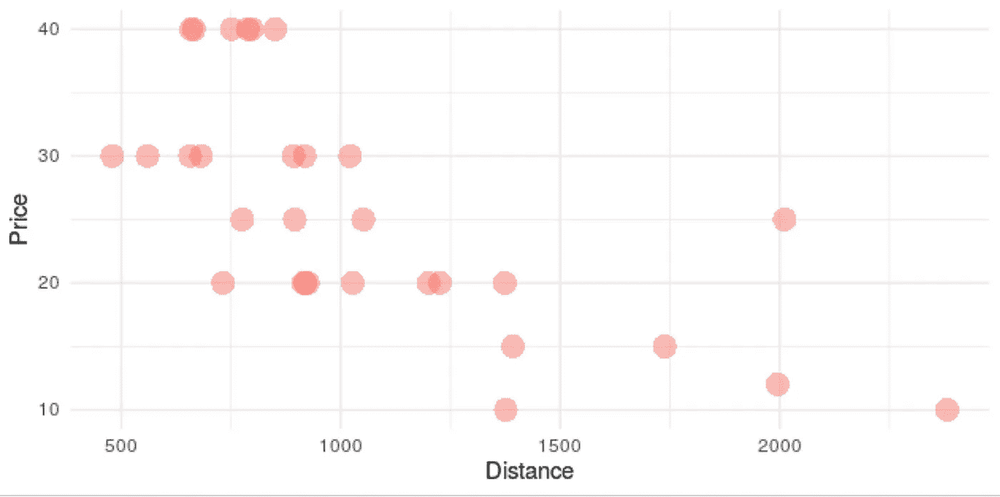
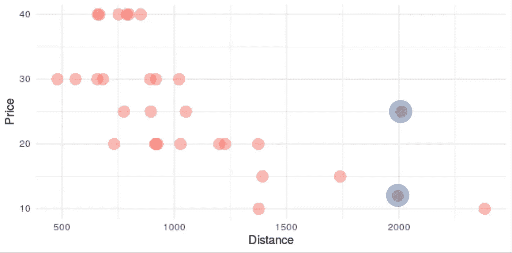
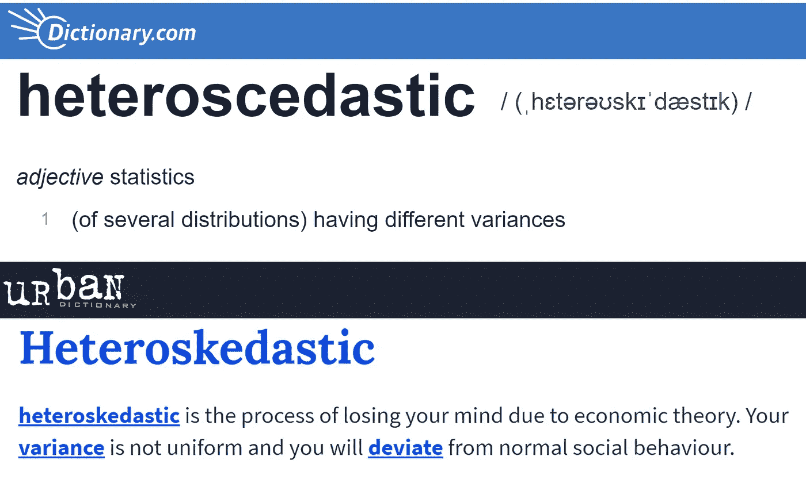
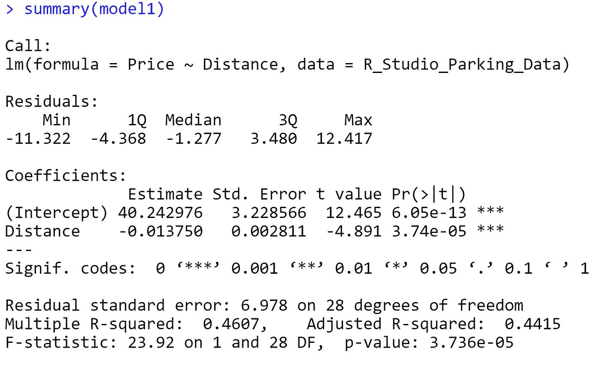
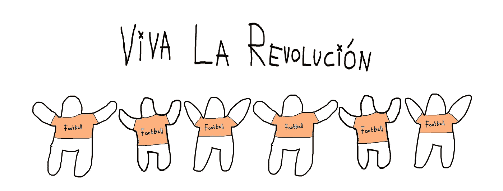
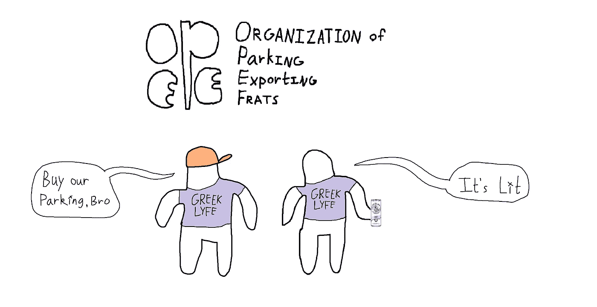

# 足球迷是糟糕的经济学家吗？

> 原文：<https://medium.com/analytics-vidhya/are-football-fans-bad-economists-33267428dae1?source=collection_archive---------19----------------------->

## 用 R 解决足球比赛停车的秘密

***项目时间框架:*一个周末**

***摘要:*说到足球比赛中的停车定价，实际上*是*一种疯狂的方法。**

住在大学校园里的人最害怕的事情之一就是遇到比赛日的交通堵塞。每当有主场比赛时，诺克斯维尔市中心的人口似乎会在一天内增加两倍，给城市的基础设施带来压力。然而，这也让有抱负的企业家利用这一人口流入。

许多在体育场附近有房子的人会向球迷收取一大笔钱，让他们把车停在靠近体育场的草坪上。靠近足球场的停车场通常更贵。*通常。*

在这项研究中，我想回答这个问题:

*到足球场的距离和停车价格有很强的相关性吗？*

# 距离体育场的距离与停车价格

开了几个小时的车后，我收集了 30 个停车场的 GPS 位置，这些停车场是为足球比赛准备的。使用谷歌地图，我能够测量从体育场到停车位的距离。这是我在 R Studio 制作的一张图表，比较了这些距离和停车费用:

将我的 R Studio 知识用于课外，仅此一次:)

我们可以看到，停车的价格一般遵循预期的趋势:离内兰球场越近，停车越贵。然而，有一些异常值证明这种关系相当弱。

蓝色突出显示的两个点距离体育场的距离相同，但价格分别为 12 美元和 25 美元。相差 48%！

这两个点的价格都是 20 美元，但它们距离体育场分别是 732 米和 1373 米……53%的差距。从统计学的角度来看，这被认为是异方差的。

来自两个同等著名来源的定义

除了通过不经意的观察发现这些不一致，我们还可以做一些基本的统计分析。

在 R 中运行了几个测试后，我发现这两个变量之间的相关性是-0.67 ******* ，R 的平方值是 0.46。这意味着这两个变量(停车价格和距离体育场的距离)之间的相关性强度为 0.67，距离足球场的距离占价格差异的 46%。

这给了我们问题的答案:

> 停车价格和离体育场的距离有很强的相关性。

我们在这里得到的另一个有趣的信息是 R 平方值(46%)，它表明距离体育场的距离决定了特定停车位价格的不到一半。

我在这种差异背后的理论是，足球比赛停车需求缺乏弹性…也就是说，停车价格的变化对停车需求几乎没有影响。从逻辑上讲，这是有道理的。在多付 5 美元和多走一英里之间，大多数人可能会选择多付 5 美元。

我们还可以计算出我们离开足球场每一米的停车费是如何变化的:

创建一个公式来确定每米的价格变化

首先，P 值明显低于 5%，所以这里有一个关系。其次，我们现在知道了另外两个有趣的事实:

> 最近的停车费应该是 40 美元，离体育场每远一米，停车费应该减少 0.01375 美元(或者大约 1 美分)。更简单地说，你停车的地方离体育场每英里减少 22.12 美元。

# 可能的结果

考虑到这些数据，我预测可能会出现两种结果:

1.  **所有足球迷组成工会，要求更低、更可预测的比赛日停车价格。**

平面设计是我的激情所在

2.**在自家草坪上提供停车位的兄弟会联合起来，开始定价。**

平面设计是我的激情，第 2 部分

******* *统计学上，大于|0.7|的相关性定义为“强”。但是 0.67 很接近，可以说这里有很强的相关性。*