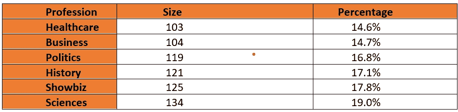
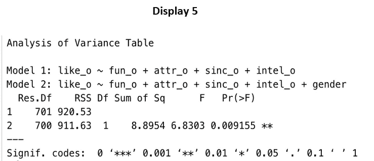

# 男人被女人高估了吗？

> 原文：<https://medium.com/analytics-vidhya/are-men-overrated-by-women-9b3b926e0a8b?source=collection_archive---------15----------------------->

**摘要**

这项研究是一项观察性研究的一部分，该研究记录了自愿参加速配实验的人对几种性格特征的评价。这篇论文的重点是发现，对于相同水平的各种性格特征，男性是否比他们给予女性更多的爱。这项研究的结果表明，一个男性比一个相似角色的女性高 0.23 分(在 0-10 分的范围内)。

**简介**

一些研究表明，男人高估了自己的魅力，而另一项研究则认为进化让女人更有魅力。这篇论文的目的是看看性别在人们如何看待他们的伴侣方面是否有差异。

**问题陈述**

重点是发现性别是否会影响一个人对自己伴侣的评价。此外，还要找出与伴侣总体相似的最重要的个性特征。

**研究方法**

哥伦比亚商学院的雷·菲斯曼教授和希娜·艾扬格教授进行了初步研究。大约 552 名来自不同职业的异性恋者参加了这项实验，他们每人与不同性别的参与者有一次四分钟的约会。在短暂约会之前、之中和之后，他们会根据吸引力、真诚、智力、有趣和雄心等参数进行评估。然后给出一个相似度等级，表示对伴侣的总体喜爱程度。该实验还包括对约会的兴趣和偏好，人们如何根据这些参数对自己进行评级，等等。这些结果可以在 Kaggle 上获得，可以用来回答各种各样关于交配行为的问题。本文关注的是五种个性特征和给予参与者的总体相似性评级。所有的评分都是按 0 到 10 分制记录的。

**假设**

无效假设是具有相似个性的男性和女性，即，在五个属性上获得相同评级的男性和女性，也从他们各自的伴侣获得相同的总体相似性评级。另一个假设是，被评分相同的男性和女性，会从伴侣那里得到不同的相似度评分。

Ho:性格标准相似的男性和女性会得到相似的评分。

哈:性格标准相似的男性和女性会得到不同的相似度评分。

**解决方案**

分析分为四个步骤。第一步是分析数据集并进行数据预处理。它包括检查观察值，以确保从真实总体随机扩散，使样本没有偏差。第二步是对自变量和因变量进行可视化，如果需要的话，执行转换。第三步是列出有助于解释总体相似性评级的最重要变量。用最重要的变量得到的模型称为简化模型。然后添加性别指标变量，即男性 1，女性 0，以创建一个完整的模型。最后，进行方差分析以比较简化模型和完整模型，并发现性别在确定总体相似性评级中的显著性。

**分析**

**数据选择**

原始数据集有大约 2000 个观察值。在删除随机丢失的行后，发现数据集不成比例地基于职业，因为几乎一半的数据集包含属于法律或商业领域的参与者。大约。从医疗保健、政治等各种职业中随机选择相同比例和样本量的男性和女性。创建 706 个观测值的平衡数据集。

**分析、可视化和转换**

大约有。女性占 45%，男性占 55%。属于同一种族的夫妇比例为 51%，属于不同种族的夫妇比例为 49% ( [表 1](#Table1Open) )。

表 1

来自 6 种职业的参与者各自对总样本量的贡献在 14–19%的范围内(表 2)。

表 2

在可视化中，因变量(显示 1)和自变量(显示 2)看起来近似正常，偏斜度在-0.4 到-0.6 的范围内。箱线图显示了朝向较低尾部的一些异常值，但没有偏斜。因此，数据集不需要转换。

雄心-真诚的四分位距和中位数；和吸引力-乐趣大约是。一样。智力的分布显示，总的来说，它比其他属性更高。

比较每个独立变量的方差的性别差异 f 检验表明诚意、有趣和雄心的方差不相等([表 3](#Table3Open) )。

表 3

有趣的是，双样本 t 检验在 5%的显著性水平上表明，女性在吸引力和风趣方面的平均评级高于男性，而平均而言，男性在智力和雄心方面的评级更高([表 4](#Table4Open) )。

表 4

**变量选择**

初始模型输入了九个独立变量，即吸引力、智力、雄心、真诚、乐趣、年龄、种族、同一种族，并且还包括种族和同一种族的交互项，因为人们可能更喜欢来自同一种族的伴侣，因此，它可能是模型的重要变量。

逐步模型选择标准已用于 AIC 和 BIC 值，以确定模型的最重要变量。选择从逐步创建的每个 AIC 和 BIC 模型的最小 Cp 统计值。所有的技术、AIC、BIC 和 Cp 统计表明了 4 个解释变量([表 5](#Table5Open) )。

表 5

因此，遵循 Occum 剃刀原理和模型选择标准的结果，选择具有四个独立变量的模型。最终选择的变量是乐趣、吸引力、智力和真诚。从该模型解释的总体相似性评级的 R 平方或变化约为。64%.

**模型创建**

相关图([显示 6](#Display6Open) )显示了总体“喜欢”评级与独立变量之间的相关性，也为模型建议了相同的四个解释变量。这就是所谓的缩减模型([缩减模型](#Display3Open))。

显示器 6

感兴趣的变量“性别”，表示 1 代表男性，0 代表女性，然后被添加到简化模型中以创建完整模型，产生 5 个独立变量([完整模型](#Display4Open))。加入性别变量后，智力的重要性降低了。

缩小模型:相似度= b0 + b1.fun + b2。attr + b3。sinc + b4。军事情报

全型号:相似度= b0 + b1.fun + b2。attr + b3。sinc + b4。英特尔+ b5。性别

**型号对比**

在完整和简化模型上进行不适合测试 ANOVA，以发现性别的显著性([显示 5](#Display5Open) )。

零假设是性别系数不显著，Ho : b5 =0

另一个假设是性别上的系数显著，哈:b5！=0

方差分析

在 5%的显著性水平上，F 统计量为 6.83，双尾 p 值<0.05, (being 0.0092), suggests that the gender variable is significant for the model.

**结论**

这项研究提供了足够的证据来驳斥无效假设，即对于相同的个性标准，男性和女性在被他们的伴侣评价时没有区别。估计的性别斜率系数为 0.232(在 0-10 的范围内)，这意味着，在总体相似度评分中，男性比女性高出约 0.23 个百分点。此外，在这项研究中判断的五个特征中，有趣、有吸引力、聪明和真诚是决定对一个人总体喜欢程度的最重要因素。

**推断范围**

因为这是一项观察性研究，是作为志愿者的实验进行的，所以无法推断真实的人群。它由异性恋男性和女性组成，这意味着分配是天生的，而不是随机的，因此，因果推断不能用结果来建立。

**参考文献**

1.雷蒙·菲斯曼；艾扬格，贾芳，2006 年。择偶中的性别差异:来自速配实验的证据。*经济学季刊*

2.Regan，Pamela C .，1998，“最低择偶标准与感知的择偶价值、关系背景和性别的关系”，*心理学杂志&人类性*。

3.快速约会实验，“什么样的品质会影响对浪漫伴侣的选择？”，[https://www.kaggle.com/annavictoria/speed-dating-experiment](https://www.kaggle.com/annavictoria/speed-dating-experiment)