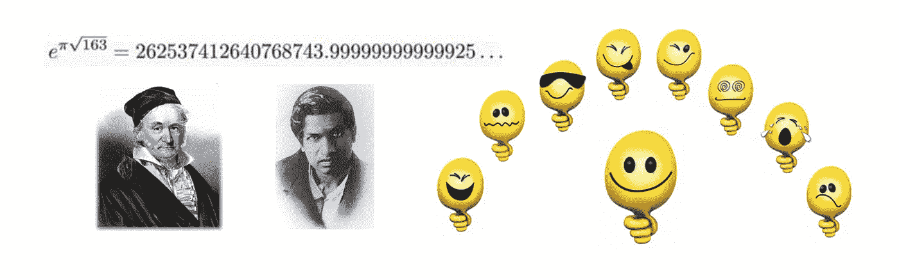

# Ramanujan 常数是整数吗？

> 原文：<https://medium.com/analytics-vidhya/are-ramanujan-constants-whole-2c2213744a2e?source=collection_archive---------23----------------------->



## 让我们看看如何使用 Haskell 的数字包

在这段 YouTube 视频中 [163 和 Ramanujan 常数——数字迷](https://youtu.be/DRxAVA6gYMM?t=519) Alex Clark 提到了 3 个非常接近整数的 Ramanujan 常数。让我们用 GHCi 来计算它们。显然，我们需要高精度的数字来做这样的计算。

如果我们运行`Data.Number.CReal.showReal 100 pi`在 GHCi 中直接用 100 位数显示𝜋，就会失败。

```
👍 ghci
GHCi, version 8.2.1: [http://www.haskell.org/ghc/](http://www.haskell.org/ghc/)  :? for help
Loaded GHCi configuration from /Users/zhijunsheng/.ghci
λ: Data.Number.CReal.showReal 100 pi<interactive>:623:1: error:
    Not in scope: ‘Data.Number.CReal.showReal’
    No module named ‘Data.Number.CReal’ is imported.
```

Haskell 的`numbers`包就是我们需要的。使用 cabal 安装它。先跑`cabal update`:

```
👍 cabal update
Downloading the latest package list from hackage.haskell.org
```

检查我们是否已经有这个包:

```
👍 cabal list --installed numbers 
No matches found.
```

在实际安装软件包之前，运行以下命令:

```
👍 cabal install --dry numbers   
Warning: --root-cmd is no longer supported, see
[https://github.com/haskell/cabal/issues/3353](https://github.com/haskell/cabal/issues/3353) (if you didn't type --root-cmd,
comment out root-cmd in your ~/.cabal/config file)
Resolving dependencies...
In order, the following would be installed (use -v for more details):
numbers-3000.2.0.2
```

好的，我会按照说明注释掉`root-cmd`。

```
👍 vim ~/.cabal/config
```

找到该行并用破折号注释掉:

```
-- root-cmd: sudo
```

再次尝试看到警告消失:

```
👍 cabal install --dry numbers
Resolving dependencies...
In order, the following would be installed (use -v for more details):
numbers-3000.2.0.2
```

开始安装:

```
👍 cabal install numbers      
Resolving dependencies...
Downloading numbers-3000.2.0.2...
Configuring numbers-3000.2.0.2...
Building numbers-3000.2.0.2...
Installed numbers-3000.2.0.2
Updating documentation index
/Users/zhijunsheng/Library/Haskell/share/doc/x86_64-osx-ghc-8.2.1/index.html
```

现在我们可以看到𝜋有很长的数字:

```
👍 ghci                 
GHCi, version 8.2.1: [http://www.haskell.org/ghc/](http://www.haskell.org/ghc/)  :? for help
Loaded GHCi configuration from /Users/zhijunsheng/.ghci
λ: Data.Number.CReal.showCReal 100 pi
"3.141592653589793238462643383279502884197169399375105820974944592307816406286208998628034825342117068"
```

比较正常 pi 和 CReal pi 的默认显示，我们还检查常数 e:

```
λ: import Data.Number.CReal
λ: pi
3.141592653589793
λ: pi :: CReal
3.1415926535897932384626433832795028841972
λ: exp 1 :: CReal
2.7182818284590452353602874713526624977572
```

最后，我们可以检查ℯ^(𝜋√43、ℯ^(𝜋√67 和ℯ^(𝜋√163)与整数的接近程度:

```
λ: (exp 1) ** (pi * sqrt 43) :: CReal
884736743.9997774660349066619374620785853768473991
λ: (exp 1) ** (pi * sqrt 67) :: CReal
147197952743.9999986624542245068292613125786285081833
λ: (exp 1) ** (pi * sqrt 163) :: CReal
262537412640768743.9999999999992500725971981856888793538563
```

顺便说一句，如视频所示，43、67 和 163 是高斯猜想中的最后三个数字:

√-1, √-2, √-3, √7, √-11, √-19, √-43, √-67, √-163

这九个数字也被称为“希格纳数”:1，2，3，7，11，19，43，67，163。