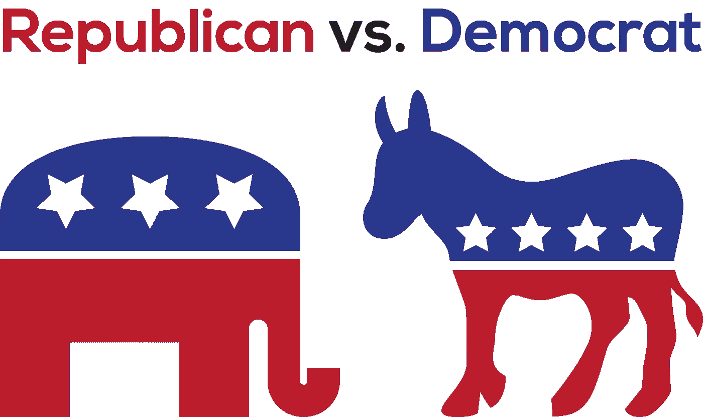
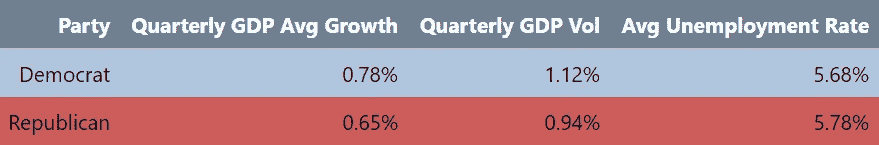
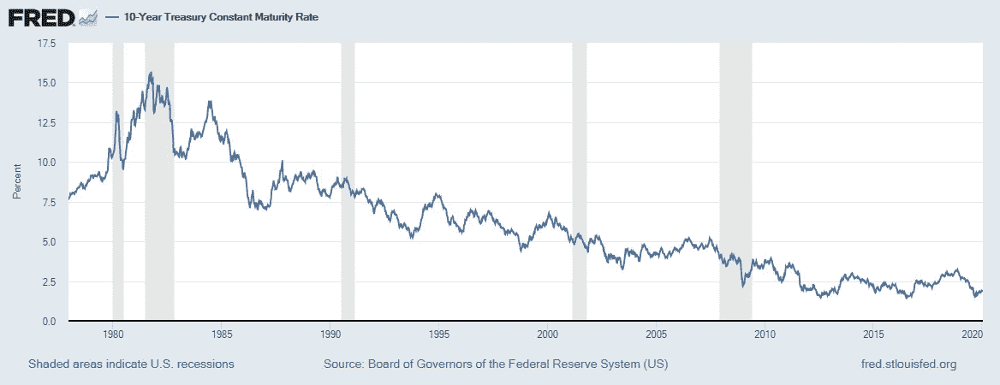
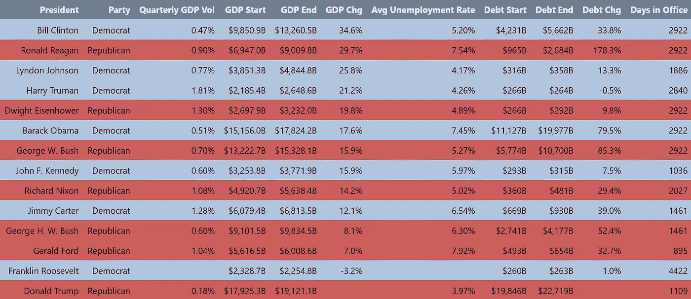
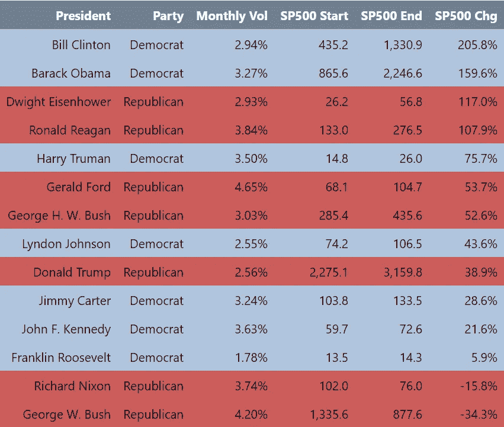

# 共和党人更擅长管理经济吗？

> 原文：<https://medium.com/analytics-vidhya/are-republicans-better-at-managing-the-economy-5445c76166da?source=collection_archive---------20----------------------->

# 摘要

简短的回答大概是不会。民主党政府下的经济增长通常比共和党政府下的要快。这是否意味着民主党是更好的经济管理者？同样，可能不会。

1945 年至 2019 年第三季度按政党分列的二战后经济增长(Vol =标准差)。

当我们深入挖掘细节时，很明显，尽管总统确实对经济增长有一些影响，但几乎不可能找到数据显示总统在其任期内采取的行动与经济整体表现之间的因果关系。

对于那些感兴趣的人来说，完整的要点和来源在文章的末尾。Python 图表的交互式版本可在[这里](https://drive.google.com/drive/folders/1sxeLx1cTlNHBSm4c9JhzKlI_wgy0zGaK?usp=sharing)获得。

# 在过去的 10 年里，增长一直……相当平缓

像今天的许多事情一样，政治派别倾向于决定你认为哪个政党更擅长管理经济。尽管如此，总的来说，似乎总是把经济管理等同于共和党。例如，尽管特朗普政府在很大程度上以与奥巴马政府相同的速度增长经济，但不难找到与此相反的故事。

尽管两位总统都通过了刺激经济的大规模刺激计划，但在特朗普减税的情况下，经济增长的飙升是短暂的，最终推高了赤字，对长期增长没有任何实质性影响；相比之下，奥巴马政府实施了反周期刺激方案，以帮助从大衰退中复苏，然后实际上开始略微减少支出(尽管这可能主要是由于预算封存和政府内部政治阻止了患者保护与平价医疗法案法案通过后的大部分工作)。2008 年后，美联储在保持经济增长方面发挥了比任何一届政府都更大的作用，这是非常合理的。

## 交互式图表的说明

自特朗普上任以来，经济增长仍然没有发生太大变化。注意:时间刻度滑块只适用于台式电脑。

> 链接也在这里，[https://codepen.io/tkpca/pen/wvBENQg](https://codepen.io/tkpca/pen/wvBENQg)。

尽管特朗普总统不断表示这是历史上最好的经济体，但在特朗普政府的领导下，美国政府债务总额继续增加。川普政府也将债务占 GDP 的比例保持在奥巴马时代的水平附近，尽管这一比例在 2019 年底开始再次上升。

(注意:借更多的钱并不一定是坏事，因为自上世纪 80 年代以来，利率也一直在下降，并保持在历史低点附近，见下图。)

自 20 世纪 80 年代以来，债务水平迅速上升。注意:时间刻度滑块只适用于台式电脑。

> 链接也在这里，【https://codepen.io/tkpca/pen/RwNYvmW】。

债务成本继续保持在低位

# 那么，每位总统对经济的看法如何呢？

居民克林顿和里根在任期间都显著地发展了经济，尽管克林顿政府能够在没有同等杠杆的情况下做到这一点。虽然里根总统在任期间确实刺激了经济增长，但他也导致政府债务增加了 3 倍:另一方面，克林顿总统是通过实际减少净债务来实现这一点的，所以这件事就此了结？不完全是。

尽管艾森豪威尔总统可以说是最谨慎的，但民主党人实际上比共和党人更成功地发展了经济。GDP 数据经过通胀调整，其中 2012 年=100。债务完全基于名义价值，而富兰克林·罗斯福的数据只涵盖了 1945 年前四个月。

事实上，艾森豪威尔总统是对财政更负责任(如果不是最负责任)的总司令之一。在艾森豪威尔政府期间，经济快速增长，失业率保持在低水平，大规模的公共工程问题，如 1956 年的联邦援助高速公路法案得以实施，政府债务几乎没有增加。艾森豪威尔在他的告别演说中也证明了他的先见之明:

> “在政府委员会中，我们必须防止军事工业联合体获得不必要的影响，无论是寻求的还是不寻求的。错位权力灾难性崛起的可能性存在，并将持续下去。”

然而，上述数据并没有提供总统管理经济的全貌。还有许多其他因素使这一分析变得复杂。

1.  里根总统和奥巴马总统都监督了政府债务的大幅增加，但他们也都继承了停滞不前的经济。
2.  总体增长忽略了经济不平等和生活成本等细微差别。虽然上述国内生产总值数据已经对通货膨胀进行了调整，但通货膨胀指标很难考虑到可能是最重要的成本住房、医疗和教育成本继续飙升，而工资却停滞不前(参见 [Pew](https://www.pewresearch.org/fact-tank/2018/08/07/for-most-us-workers-real-wages-have-barely-budged-for-decades/) 了解更多关于工资的信息)。
3.  总统(至少在理论上)和国会是平等的。上面的数据没有根据哪个政党控制众议院或参议院来划分统计数据(因为数据已经很少了，那就更少了)。
4.  在大多数情况下，很难理清政策变化的因果关系。比如，你可以说克林顿总统受益于里根时代的去监管化和老布什时代的增税，这让他继承了一个繁荣的经济。相反，有人可能会说，里根从中受益，因为卡特总统任命了保罗·沃尔克，让里根在头两年应对经济增长疲软，同时也有助于抑制通货膨胀。

# 股市呢？

纵观历史，股票市场一直对共和党比较友好，尽管奥巴马和克林顿政府在任期间，标准普尔 500 指数大幅上涨。

矛盾的是，尽管经济增长相对不温不火，但股票市场的资本总额却在继续增加，这是由企业利润大幅增加以及低利率环境使股票投资相对具有吸引力所推动的。这也可能解释了收入平等的增长，因为工资水平保持不变，而股票市场表现非常好(只有大约一半的美国人拥有股票，而所有权相对集中在富裕家庭中)。

标准普尔 500 演出，1945 年至 2019 年。注意:时间刻度滑块只适用于台式电脑。

> 链接也在这里，[https://codepen.io/tkpca/pen/RwNYvmW](https://codepen.io/tkpca/pen/RwNYvmW)。

此图表的互动版本可在[此处](https://drive.google.com/open?id=1E8UwR58XJl8IWsOWwoHcfLi4_-8R-fXM)获得。

与国内生产总值和大多数宏观经济指标相反，股票市场具有前瞻性:它是投资者对股票未来价值的总体预期。如果共和党人被视为更好的经济管理者，这一点在股价中得到体现是有道理的。根据标准普尔 500 指数，民主党政府往往对股市更有利(然而，这种声明也受到前面提到的警告的限制)。

特朗普总统要赶上其前任的表现还有很长的路要走。

此外，这些类型的指标没有考虑到集中。事实上，标准普尔 500 指数中排名前五的[公司](https://www.bloomberg.com/news/articles/2020-01-13/big-companies-have-never-dominated-the-s-p-500-like-they-do-now)通常占其价值的 15-20%，比尔·盖茨、史蒂夫·乔布斯和马克·扎克伯格(实际上是互联网)在股市中的表现比克林顿总统和奥巴马总统更好(这使得乔治·w·布什总统任期内的可怕回报更加引人注目)，甚至可能是阿尔·戈尔，他因促进采用[互联网而受到广泛批评(合理的):](https://www.vox.com/2014/6/16/18076282/the-internet)

> 但是发明互联网的人，TCP/IP 的设计者鲍勃·卡恩和温顿·瑟夫，在 2000 年为戈尔辩护时写道。他们认为戈尔是“第一个认识到互联网重要性并促进和支持其发展的政治领袖。”
> 
> “早在 20 世纪 70 年代，国会议员戈尔就提出了高速电信的想法，”两人写道。“20 世纪 80 年代，作为一名参议员，戈尔敦促政府机构将当时几十个不同的、互不关联的网络整合成一个‘机构间网络’戈尔发起了 1991 年的高性能计算和通信法案，卡恩和瑟夫称该法案“成为互联网在计算机科学领域之外传播的主要工具之一”。"

这并不是说总统对股市没有影响:特朗普总统可能通过与中国的贸易战减少了股市的部分涨幅，里根总统通过放松监管帮助普通投资者更容易进入股市。

直接将强劲的经济归因于现任总统是很困难的。很明显，总统的所作所为会对经济产生影响，尽管如此，归因仍然非常困难。在某些情况下，就像乔治·w·布什的情况一样，衡量表现更容易一点(不好)，但在很大程度上归结为细微差别——对我们生活的两极分化的世界来说不太理想。

*请注意，由于弗雷德数据的局限性，该数据主要关注 1945 年以后当选的总统。因为富兰克林·罗斯福在 1945 年 4 月由哈里·杜鲁门继任，所以他的数据只持续了 3 个月。还要注意，下面的 Github 要点不保存来自 Pandas styler 的格式。源代码见 https://github.com/tkpca/Python-Scripts.git 的[。](https://github.com/tkpca/Python-Scripts.git)

[https://github . com/tkp ca/Python-Scripts/blob/master/Presidents % 20 和% 20 经济/经济 _ 分析. ipynb](https://github.com/tkpca/Python-Scripts/blob/master/Presidents%20and%20the%20Economy/Economic_Analysis.ipynb) 为源文件。请注意，Python Styler 对象不在 gists 中呈现。