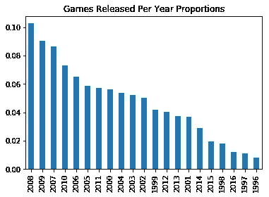
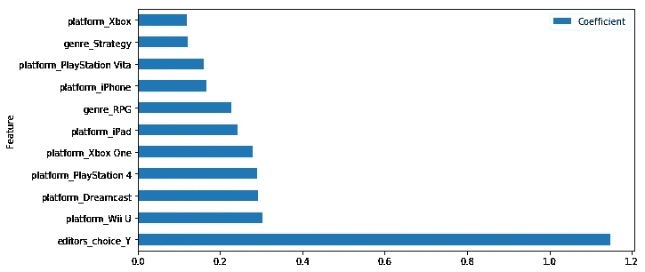
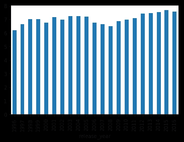
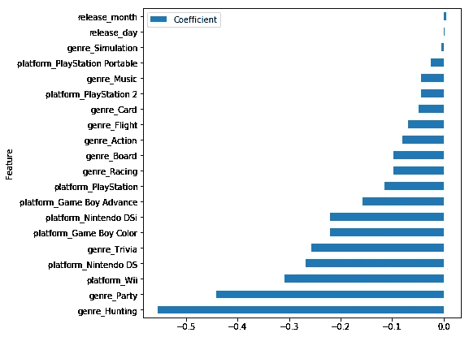
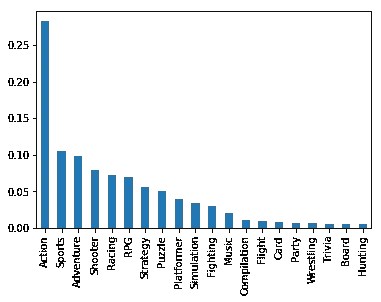
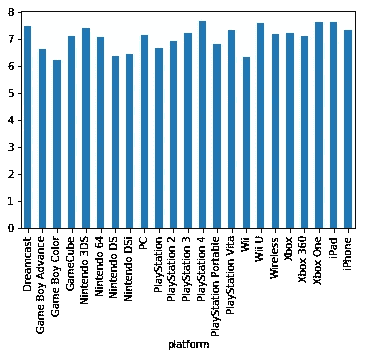
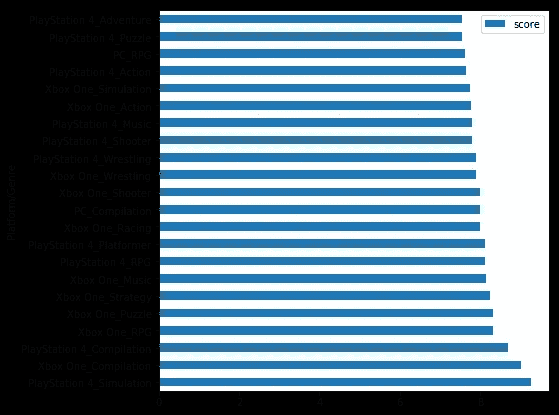

# 有些游戏已经成功了吗？

> 原文：<https://medium.com/analytics-vidhya/are-some-games-already-set-to-succeed-2be98dcb6db3?source=collection_archive---------3----------------------->

## 对博彩业的一点看法

阿列克谢·萨维琴科在 [Unsplash](https://unsplash.com?utm_source=medium&utm_medium=referral) 上的照片

## 介绍

作为一个狂热的游戏玩家、电子工程师和潜在数据科学家，我总是想知道一些游戏类型是否比其他类型有更高的成功概率。我还想知道发行日期，无论是月还是日，是否会影响游戏销售和整体成功。使用的主机是否影响哪些游戏成功？今天，我将试图通过从 [*IGN*](https://ca.ign.com/) *收集的数据来回答这些问题。*

来自[*IGN*](https://ca.ign.com/)***的数据涵盖了~ 19000 款游戏**，发售日期从 1996 年到 2016 年。这意味着这份报告中包含了许多平台，从世嘉 1998 年发布的 Dreamcast 到索尼 2014 年发布的 Playstation 4。*

*有趣的是，在 2008 年**到 2016 年**之间，每年发布的游戏数量都有所下降。大约有 10%的游戏是在 2008 年发行的(游戏的黄金时代！).有意思的是，1997 年和 2016 年发布的游戏**量相当**，~1.2%。然而，我怀疑在堡垒之夜取得巨大成功后，2017 年游戏行业出现了激增。*

**

*图 1:每年发布的游戏*

# *1.影响一个游戏分数的主要因素是什么？*

*当我问自己这个问题时，我在想，除了“好游戏”之外，高分游戏是否有某种模式。令我惊讶的是，有多个指标表明了一些游戏将如何被游戏社区评分和接收。*

**

*图 2:最强积极指标的权重系数*

*图 2 显示了游戏得分最高的 10 个指标。被标记为编辑选择的游戏比其他游戏有更大的机会获得更高的分数。这可以归因于市场营销和这些游戏经常出现在主页上的事实。一般来说，这可能是因为这些游戏有更多的可见性。*

**

*图 3:分数与发布年份*

*有趣的是，尽管 2016 年发布的游戏比往年少，但**游戏在后来的几年里得分更高**。一个显而易见的原因是游戏和引擎的质量在过去的几年里有了很大的提高。*

# *2.某些游戏类型更有可能获得更高的分数吗？*

*这个问题的简短回答是:**是的**！有趣的是，与高分相关的**最强积极指标之一是 RPG 和 Strategy** 类型，如图 2 所示。*

**

*图 4:最强负面指标的权重系数*

*图 4 显示了最强的**指标，这些指标可能会对游戏得分产生负面影响**，导致游戏得分低于其他游戏。引领这些特色的是狩猎和派对类型。然而，让我惊讶的是，占据**第三位的，是 Wii 主机本身**。*

**

*图 5:流派分布*

*另一个令人惊讶的发现是，动作片也是游戏评分的另一个负面驱动力。动作类型也恰好是最大的类型，**占 1997 年至 2016 年间发布的游戏的近 30%**。这导致了这种类型非常拥挤，因此在这一部分有更多的竞争，更难得到更高的分数。*

# *3.游戏发布日期会影响游戏的接收方式吗？*

*尽管当我问自己这个问题时，我直觉地认为发行日期会影响游戏的评分，但事实并非如此。**事实上，特性 release_day 和 release_month 在整个数据集中的权重最低，**如图 4 所示。这意味着他们不提供任何关于比赛是否会以任何方式得分的指示。*

*不幸的是，这个数据集不包括游戏销售额，这让我提出了以下问题:*

> *游戏发布日期(日和月)影响游戏销量吗？*

*我怀疑他们会！从个人经验来看，作为一名学生，我倾向于在夏季购买更多的游戏，因此可能会有一些值得探索的东西！*

# *4.某些平台是不是分数普遍较高？*

**

*图 6:平台平均得分*

*独立的主机游戏，无论是 Wii U 和 Dreamcast 这样的老游戏，还是 Playstation 4 和 Xbox One 这样的新游戏，往往都比 PC 游戏得分高。这可能是因为独立游戏机提供了一个公平的竞争环境。*

*由于硬件规格不同，PC 用户可能会有不同的体验，这一事实可以解释为什么主机游戏通常被评为更高。*

*此外，许多游戏机提供独家，这往往是一个巨大的成功。*

# *5.哪些游戏在某些主机上更容易成功？*

**

*图 7:每个平台和类型的平均分数*

*我在想，某些游戏是否因为它们的类型和发布平台而有更大的成功机会，事实证明是这样的！为此，我将重点介绍 PC、Xbox One 和 PlayStation 4。*

***领先最高平均分的是 PlayStation 4 的模拟游戏**。*

*此外，**编译版本在所有平台上都有很高的分数**。编译发行是指游戏工作室将所有之前发行的游戏打包发行。这些似乎很受欢迎。*

*如上面问题 2 所述，RPG 类型也在这里悄然兴起。这种类型被证明是最通用的一种，也是一个游戏会有更高分数的有力指标。*

## *结论*

1.  *RPG、策略和平台游戏往往比其他游戏类型得分更高。另一方面，琐事、狩猎和聚会游戏往往得分最低。*
2.  *发布日期不影响游戏分数。然而，他们有可能影响游戏销售！*
3.  *主机游戏往往比 PC 游戏得分高。*
4.  *PS4 上的模拟游戏往往会成功。*
5.  *编译版本往往也有很高的分数。*
6.  *RPG 很可能是最通用的游戏类型，并且是一个游戏分数的积极驱动力，不管平台如何。*

*要了解更多关于这个分析的内容，请点击这里查看我的 Github 链接[。](https://github.com/adhamelkhouly/gaming_industry)*