# 我们的人口中有没有人，对冠状病毒有抵抗力？

> 原文：<https://medium.com/analytics-vidhya/are-there-people-in-our-population-resistant-to-coronavirus-414078be8e1?source=collection_archive---------9----------------------->

继续研究冠状病毒的问题，以及与此相关的生物信息学联系可以做些什么我找到了一篇关于病毒附着在肺细胞 ACE2 蛋白上的文章。所有的病毒都必须繁殖，每种病毒都需要穿透宿主细胞，而这一过程的第一步是连接到细胞表面。在冠状病毒的情况下，这是 ACE2 蛋白，由同名基因编码。

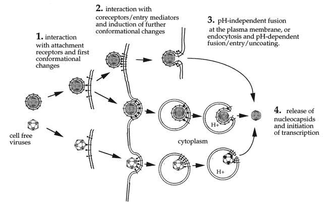

病毒从[https://www.ncbi.nlm.nih.gov/pubmed/10811925](https://www.ncbi.nlm.nih.gov/pubmed/10811925)渗透进细胞

ace 2:[https://www.proteinatlas.org/ENSG00000130234-ACE2/tissue](https://www.proteinatlas.org/ENSG00000130234-ACE2/tissue)

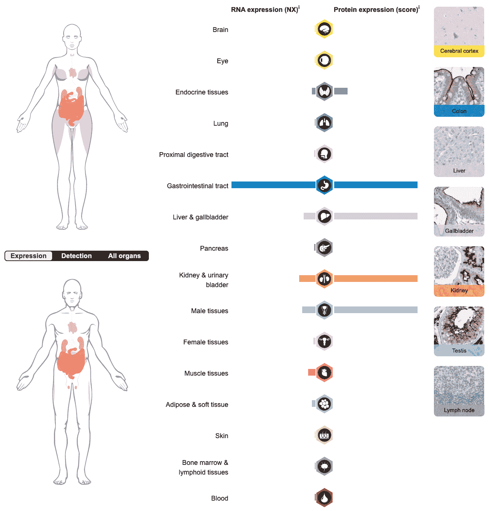

与小肠相比——在肺中，ACE2 在细胞中的比例非常小。我们有机会观察单个细胞——让我们看看肺和肠的细胞，它们的细胞中有 ACE2 类型。PanglaoDB:要回答这个问题

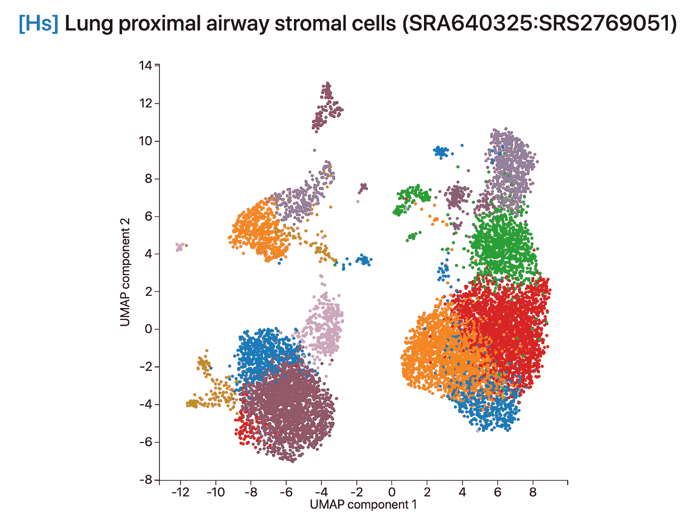

在这张图片中，我们看到了来自人类肺部的 11000 个细胞，这些细胞根据细胞的类型分为不同的簇——肺部由许多不同类型的细胞组成[https://panglaodb.se/view_interactive_tsne_data.html?SRA = SRA 640325&SRS = SRS 2769051&plot = umap&overlay = ace 2](https://panglaodb.se/view_interactive_tsne_data.html?sra=SRA640325&srs=SRS2769051&plot=umap&overlay=ACE2)

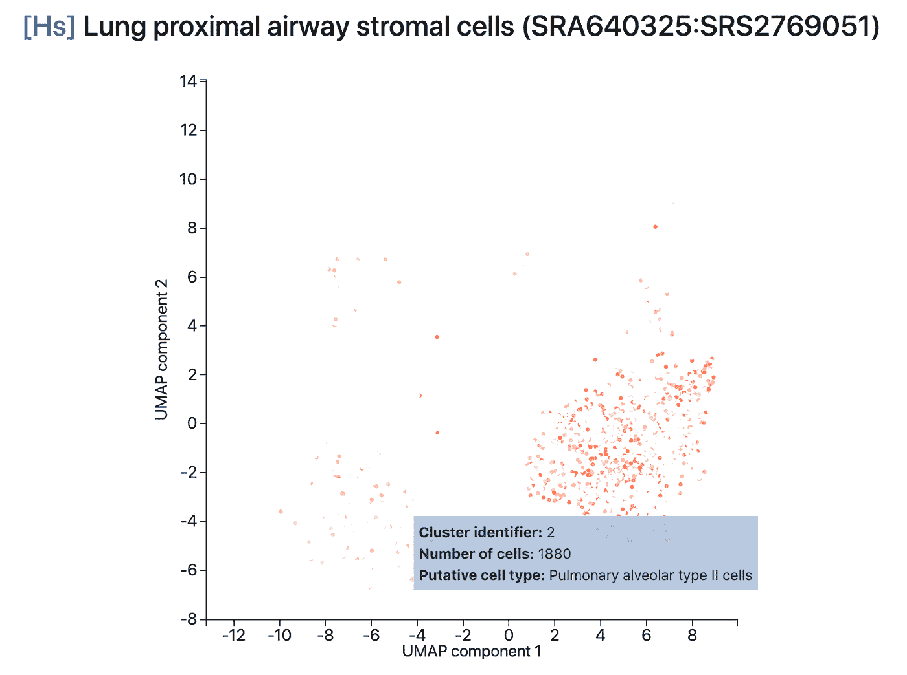

可以看出，真的很少有基因产物，而且只在 2 型成纤维细胞和肺泡细胞中发现(不管那是什么意思)

现在，让我们稍微回顾一下病毒以及它们是如何附着在我们的细胞上的。科学家研究了附着在人类细胞 CCR5 受体上的人类免疫缺陷病毒。甚至还有一个通过 x 射线衍射分析获得的 3D 模型 HIV 是如何附着在 CCR5 上的:

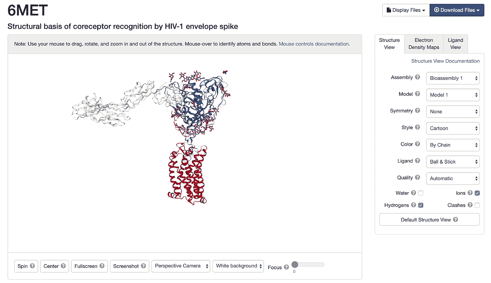

下面的红色蛋白是人类 CCR5 受体，其中一种艾滋病病毒蛋白附着在它上面[http://www.rcsb.org/3d-view/6MET/1](http://www.rcsb.org/3d-view/6MET/1)

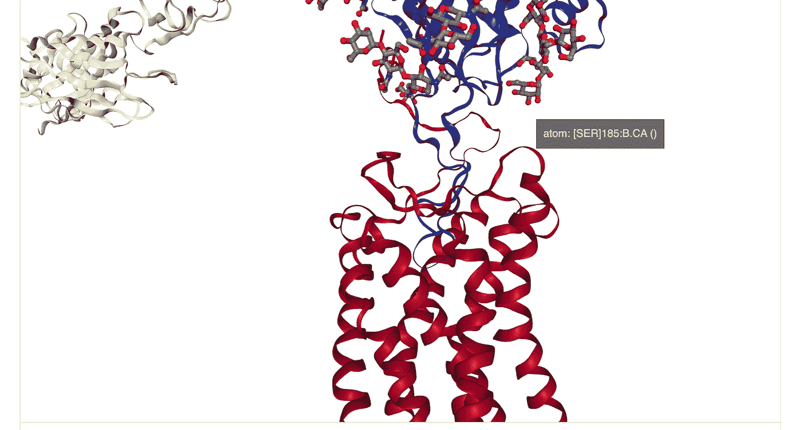

直接缩放到附着点

因此，事实证明，有一定比例的人在遗传上携带略有不同的 CCR5 基因版本——他们有 32 个核苷酸的缺失，这并不真正影响一个人的生活，但可以防止艾滋病毒附着在这样一个人的细胞上，使其在某种意义上对病毒更具抵抗力。这种变异有一个吸引人的名字——RS 333

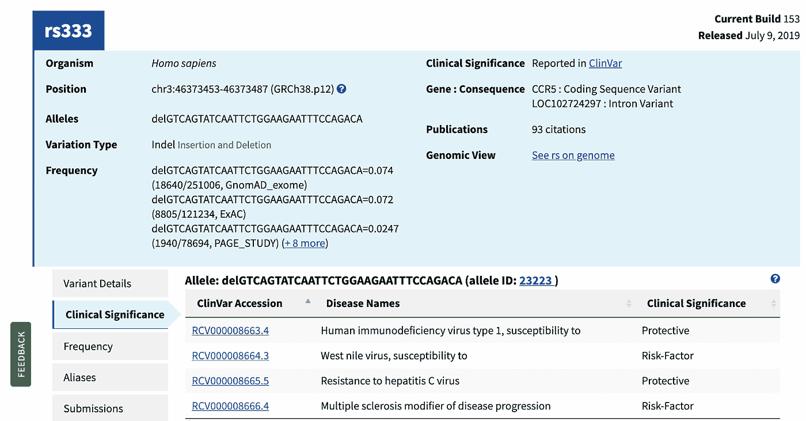

[https://www . NCBI . NLM . NIH . gov/SNP/RS 333 # clinical _ significance](https://www.ncbi.nlm.nih.gov/snp/rs333#clinical_significance)

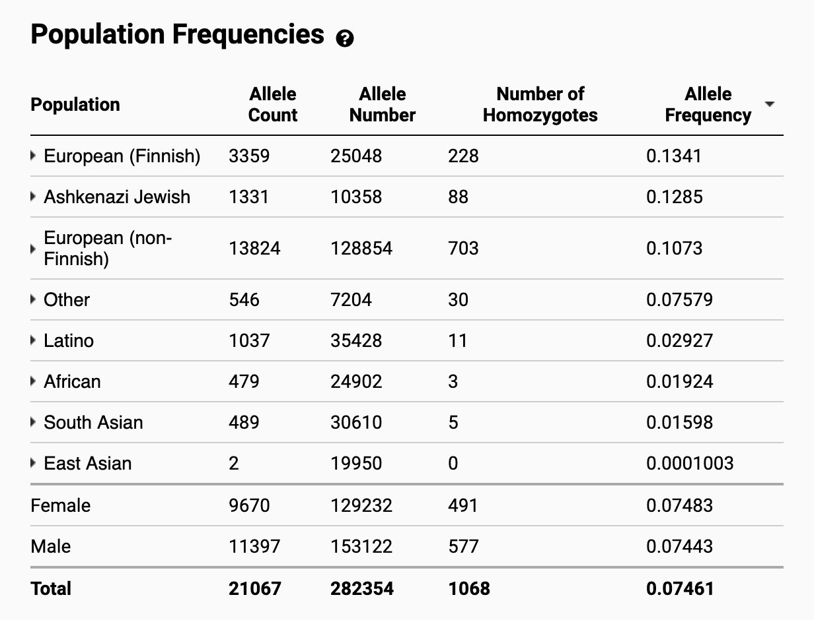

根据 gnomAD[https://gnomAD . broad institute . org/variant/3-46414943-TACAGTCAGTATCAATTCTGGAAGAATTTCCAG-T 不同人群中的频率？数据集=gnomad_r2_1](https://gnomad.broadinstitute.org/variant/3-46414943-TACAGTCAGTATCAATTCTGGAAGAATTTCCAG-T?dataset=gnomad_r2_1)

手头有了所有这些数据库，就很容易看出 ACE2 基因是否有任何相似之处——分别是——是否至少有潜在的人对冠状病毒有抵抗力。至少我们有所有的信息——首先，有冠状病毒与 ACE2 结合的 X 射线衍射分析结果，让我们看看

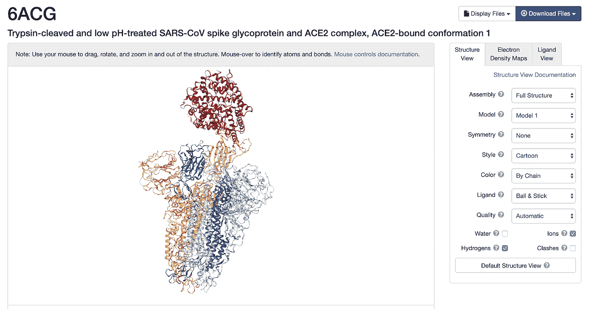

这一次，附着在 http://www.rcsb.org/3d-view/6ACG/1[ace 2](http://www.rcsb.org/3d-view/6ACG/1)上的红色冠状病毒颗粒

我们看到冠状病毒在第 488 个氨基酸区域与 ACE2 结合

现在我们打开 gnomAD 基因多态性数据库中的 ACE2 基因，我们之前在其中观察了 HIV 耐药性的突变频率:

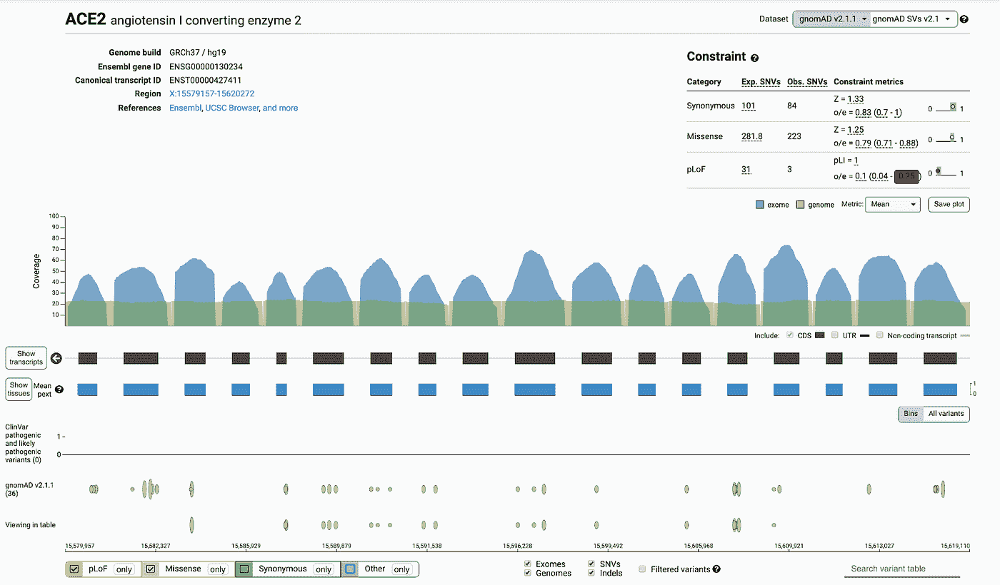

【https://gnomad.broadinstitute.org/gene/ENSG00000130234? 数据集=gnomad_r2_1

现在我们来看看第 450–500 个氨基酸区域的突变有什么有趣的:

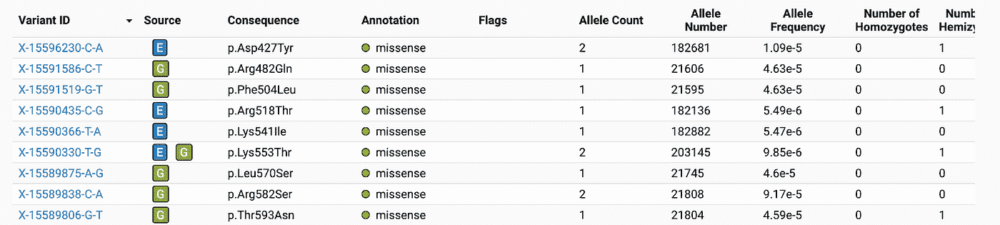

我们看到大自然并没有在这个地方创造出什么杰出的东西，但是为了比较，我们来看看 cc r5——第 180 个氨基酸的区域:

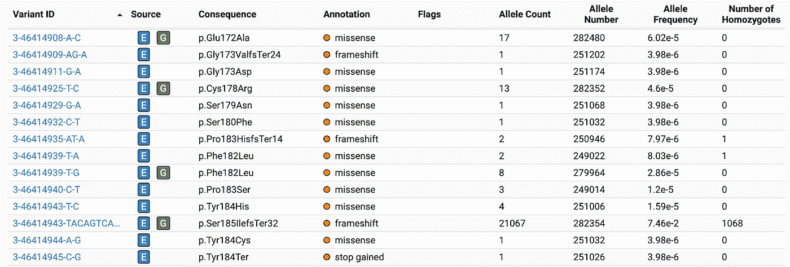

我的预测是，由于现在编辑基因组非常流行，最有可能的是，在一些实验室中，他们将制造一种 ACE2 版本，虽然保持功能活性，但对冠状病毒来说是不可见的。

我们将看到这个预测是否成真，并感谢您的关注！