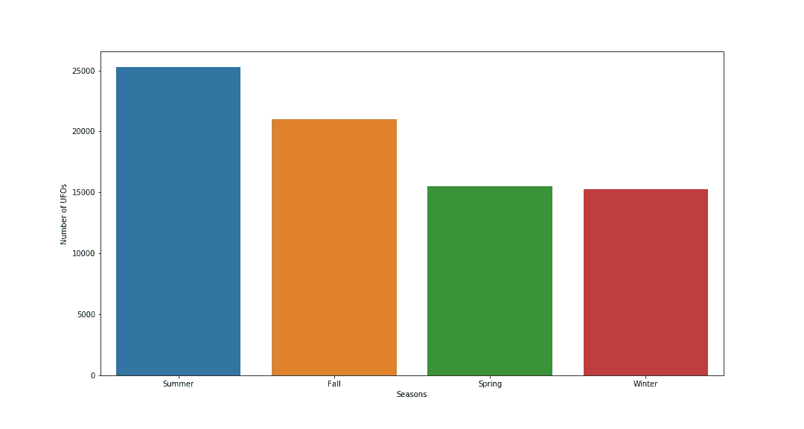
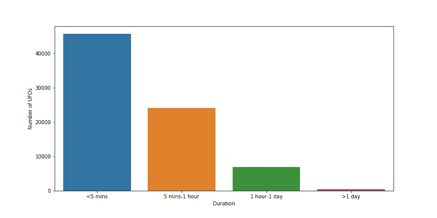
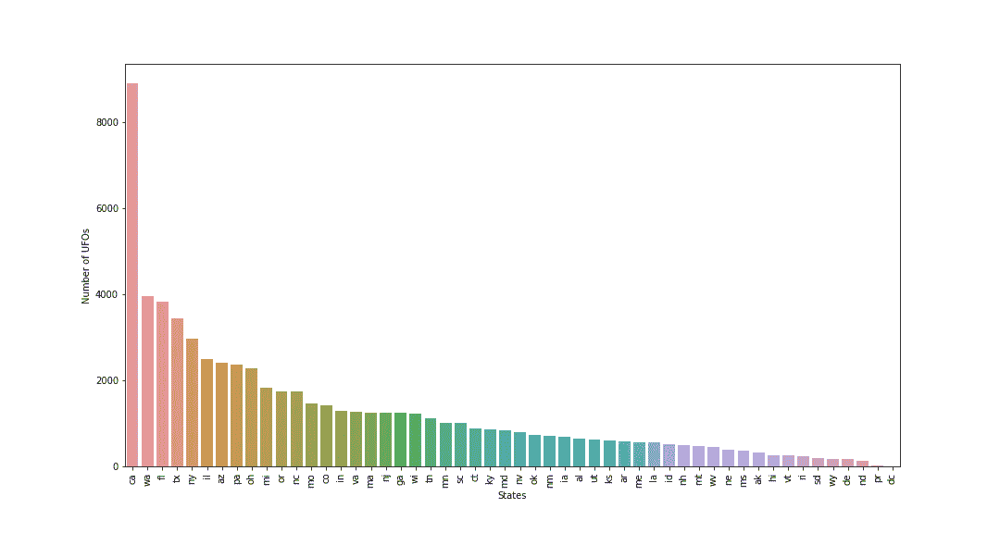

# 不明飞行物是真的吗？以数据科学为后盾

> 原文：<https://medium.com/analytics-vidhya/are-ufos-real-backed-by-data-science-7070b3867fd7?source=collection_archive---------23----------------------->

几周前，我有机会处理一个名为“UFO 目击”的非常有趣的数据集。对于数据科学方面的工作面试来说，这是一个挑战。虽然可能的结果在开始时看起来有点模糊，但随着我继续前进，我注意到挑战是多么有趣和有益。在这篇文章中，我将分享我所有的分析，并试图让数据集更有意义。


UFO 图像

不明飞行物是否真实一直是一个有争议的话题。有时我们听到来自地球上任何地方的一些人声称他们看到了不明飞行物，他们试图尽可能详细地描述这些景象。该[数据集](https://www.kaggle.com/NUFORC/ufo-sightings)包含这些过去报告的大部分(如果不是全部的话)。自 1910 年以来的几十年里，它有 80，000+的 UFO 报告。让我们深入细节，探索数据集告诉我们什么。

# 预处理

```
#The dataset is located in scrubbed.csv file
df= pd.read_csv(“scrubbed.csv”,sep=’,’)
df.head()
```


数据集的前 5 行

通过查看上表，我们可以探索数据集的特性，即“列”。有 11 个栏目向我们展示了时间、地点、形状细节以及一些关于 UFO 景象的评论。这些专栏将帮助我们分析 UFO 景象的性质和模式。因此，我们应该尽可能地利用它们。

正如我们在表中看到的，一些条目是“空”的，因此没有携带任何有用的信息。处理这个问题最简单的方法是调用 Pandas 库中可用的“dropna”方法。然而；如果我们有更聪明的解决方案，“dopna”功能会导致我们丢失有用的信息，而不是解决一个问题。例如，我们可以通过简单地查看相关行的经纬度交叉点来恢复“空”国家。

```
In: df[“country”].unique()
Out: array(['us', nan, 'gb', 'ca', 'au', 'de'], dtype=object)
```

上面的代码向我们展示了数据集中唯一的国家名称。除去“南”，我们剩下 5 个独特的国名。因此，如果我们可以找到这 5 个国家的坐标范围，我们就可以提取国家名称并用正确的字符串替换空值。

```
#US Coordinate Range
#Replaces null values with string "us" if the location is within the #US bordersdf.loc[(df[“latitude”]>19.5) & (df[“latitude”]<64.86) &(df[“longitude “]>-161.75) & (df[“longitude “] <-68.01),”country”].fillna(“us”,inplace=True)#Same procedure is applied for AU,CA,UK and DE as well
```

这样，我们可以恢复未知的国家名称，并在分析之前处理数据集。最后一步是提取州名，就像我们提取国家名一样。但是由于州的数量相当多，我们将不处理提取州名的问题。相反，我们可以用“？”替换所有空值。如果仍有一些国家缺失，并且该行中的州也缺失，我们可以选择删除该行，因为它对我们的分析没有太大帮助。

# 分析

现在，我们准备好分析数据集了！为了找出 UFO 目击事件的本质，我提出了一些问题来询问数据集。我们可以将这些问题分为四大类:

> 1 次
> 
> 双位置
> 
> 三字形
> 
> 4-一致性/依赖性

先从时间说起吧！

## 1 次

我们可以立即想到的前几个问题是:

> 分配 w.r.t .年
> 
> 一天的配送工作时间
> 
> 分销 w.r.t .月
> 
> 季节性分销
> 
> 发生时间和发布时间之间的差异
> 
> 持续时间

## 分配水资源年份

我们可能想看看 UFO 目击事件在几年内的分布情况，以及报道的数量如何随时间变化。

```
#Yearly data
years_most_sightings = df[‘datetime’].dt.year.value_counts()year_index=years_most_sightings.index
year_values=years_most_sightings.get_values()plt.figure(figsize=(15,8))
plt.xticks(rotation = 90)
plt.xlabel(‘Years’)
plt.ylabel(‘Number of UFOs’)sns.barplot(x=year_index[:50],y=year_values[:50], palette = “GnBu”)
plt.savefig(‘years.png’)
```


多年来的不明飞行物目击事件

上图描绘了过去 50 年的情况。我们可以看到随着时间的推移有一个上升的模式。虽然几年间参观人数有所下降，但总体趋势是上升的。这种趋势可能有几个理由。人口增长就是其中之一。20 世纪 50 年代的人口将近 25 亿，是现在人口的 1/3。然而，景点数量的变化是如此之大，以至于不能仅仅用人口来解释。

我们知道，航空业是随着时间前进的。更多的飞机被生产出来，新的航空公司诞生，军用飞机被更普遍地使用，等等。有时人们倾向于把飞机比作不明飞行物，这引起了混淆。不明飞行物报道的增加可能也与这一事实有关。

此外，科幻小说是当今文学和电影业的重要组成部分。对这样的话题感兴趣或接触到这样的话题可能会增加看到不明飞行物的可能性。

## 一天的配送工作时间

关于时间的另一个方面是一天中什么时候 UFO 最常被看到。考虑到这种分布，我们对这些报告作出合理的评论。

```
#Hourly data
hours_most_sightings = df[‘datetime’].dt.hour.value_counts()#Visualize hourly data
hour_index=hours_most_sightings.index
hour_values=hours_most_sightings.get_values()plt.figure(figsize=(15,8))
plt.xlabel(“Hours”)
plt.ylabel(“Number of UFOs”)sns.barplot(x=hour_index,y=hour_values, palette = “GnBu”)
plt.savefig(‘hours.png’)
```


UFO 目击事件一天中的几个小时

从上面的图表中可以快速推断出 UFO 在晚上 7-12 点最常出现。人们在一天的其他时间不是睡觉就是工作/学习。通常，人们在晚上 7-12 点之间是自由的，他们有更多的时间花在社交活动上，如在外面散步，坐在阳台上或看天空:)同样，由于同样的原因，我们可以在晚上清楚地看到星星和月亮，不明飞行物在黑暗中可以看得更清楚。

为了进一步分析，可以观察地区高峰时间，以查看药物/酒精消费和 UFO 目击之间是否存在相关性。例如，拉斯维加斯将是一个很好的测试区域。

## 分销 w.r.t .月

```
#Monthly data
month_most_sightings = df[‘datetime’].dt.month.value_counts()#Visualize monthly data
month_index=month_most_sightings.index
month_values=month_most_sightings.get_values()plt.figure(figsize=(15,8))
plt.xlabel(“Months”)
plt.ylabel(“Number of UFOs”)sns.barplot(x=month_index,y=month_values, palette = “GnBu”)
plt.savefig(‘months.png’)
```


不明飞行物目击事件

在这里，我们不能谈论任何方向的一般模式。然而，一个有趣的事实是在夏季的几个月里 UFO 报告的数量。我们看到，报告数量在 6 月、7 月和 8 月达到最高点。我们将在下一部分讨论季节效应。

## 四季配送

```
### Seasonal distributionwinter=[12,1,2]
spring=[3,4,5]
summer=[6,7,8]
fall=[9,10,11]seasons=[]for element in df.datetime:
    if element.month in winter:
        seasons.append(“Winter”)
    elif element.month in spring:
        seasons.append(“Spring”)
    elif element.month in summer:
        seasons.append(“Summer”)
    else:
        seasons.append(“Fall”)#Convert seasons into Series
seasons=pd.Series(seasons)
seasons_val=seasons.value_counts()#Visualize seasonal data
season_index=seasons_val.index
season_values=seasons_val.get_values()plt.figure(figsize=(15,8))
plt.xlabel(“Seasons”)
plt.ylabel(“Number of UFOs”)season_plot = sns.barplot(x=season_index,y=season_values)
plt.savefig(‘seasons.png’)
```



不明飞行物目击季节

正如我们在前一部分所讨论的，与其他月份相比，夏季月份的报告数量最多。在上图中，我们可以更清楚地看到这种效果。夏季的报告数量最多，冬季最少。如何评价这个数据？我们能把它和气候调和起来吗？还是其他一些因素也起了作用？

我想出的证明这张图表的第一个理由是气候。夏天天气更加晴朗，云少雨少。这就是为什么，与一年中的其他时间相比，我们可以更容易地看到天空和天空中的任何东西。相反，冬天是我们白天甚至看不到太阳的季节。因此，气候似乎是一个合理的推理。

另一方面，夏天我们在户外的时间要多得多。我们出去，坐在阳台或花园里。所有这些户外活动增加了看到天空中任何东西的机会，并将其定义为 UFO。

## 发生时间和过账时间之间的差异

```
#Year of observation and year of posting
year_happened=df[“datetime”].dt.year
year_posted=df[“date posted”].dt.year#Year difference between two dates
year_difference=year_posted-year_happened
year_dif_index=year_difference.value_counts().index
year_dif_vals=year_difference.value_counts().get_values()#Visualize the distribution of year differences
plt.figure(figsize=(15,8))
plt.xticks(rotation = 90)
plt.xlabel(“How Many Years Later UFO was Reported”)
plt.ylabel(“Number Of UFOs”)sns.barplot(x=year_dif_index[:40],y=year_dif_vals[:40])
plt.savefig(‘year_diff.png’)
```


发生时间和过账时间之间的差异

这部分确实让我有点吃惊。我们想知道在 UFO 发生后，过了多少年才报道目击事件。我想看到的显然是最多的点位于 0 或 1。意思是，人们报告说他们在一年内或者最多一年后看到过不明飞行物。

但有趣的事实是，即使在 30 年后，仍然有一些人报告说他们在 30 年前看到了不明飞行物。为什么你会在 30 年后报道这样的事件而不是尽快去做？我认为这与过去通讯设备的不足有关。为了证实这一点，可以检查相关日期，看看当时有什么样的通信设备。

此外，随着年份差异的增加，报告更有可能是假的。当人们成为热门话题时，他们往往会成为阴谋论的一部分。很有可能有些人声称他们以前见过不明飞行物，即使他们实际上并没有看到。

## 持续时间

```
##### DURATION
durations=[]
for duration in df[“duration (seconds)”]:
    if duration<=300:
        durations.append(“<5 mins”)
    elif duration>300 and duration <=3600:
        durations.append(“5 mins-1 hour”)
    elif duration>3600 and duration<=86400:
        durations.append(“1 hour-1 day”)
    else:
        durations.append(“>1 day”)

durations=pd.Series(durations)#Visualize durational distribution of UFOs
plt.figure(figsize=(12,6))
plt.xticks(rotation = 0)
plt.xlabel(“Duration”)
plt.ylabel(“Number of UFOs”)sns.barplot(x=durations.value_counts().index,y=durations.value_counts().get_values())
plt.savefig(‘duration.png’)
```



持续时间分布

为了进行持续时间分析，我将持续时间分成 4 个不同的区间。大多数时候，人们观察 UFO 的时间不到 5 分钟。这个事实没有给我们提供有用的信息。因为，那可能是当时刚好经过的飞机，也可能是天空中任何其他临时的光(烟花)。然而，第二和第三个间隔可能包含一些有用的信息。在超过 5 分钟或 1 小时的时间里，天空中看不到任何飞机或烟火。我们可以专注于其他两个间隔，而不是专注于最频繁的观察持续时间，以确定 UFO 是否可能是真实的。

## 双位置

排在时间之后的第二个重要话题是地点。找出位置模式，每个位置的频率，看看是否有一致性，这是非常重要的。正如我们之前看到的，数据集中有 5 个不同的国家。我们可以专注于这些国家。

让我们制作一个饼图，看看各国的报道是如何分布的。

```
#Portions of each country is shown on a pie chart
country_sightings=df[df[“country”]!=”?”].country.value_counts()
colors = [‘red’,’green’,’blue’,’orange’,’black’]plt.figure(figsize=(12,6))
country_sightings.plot(kind=’pie’,colors=colors)
plt.savefig(“pie_chart.png”)
```


5 个国家的饼图

通过看上面的饼状图，我们可以说美国有最多的不明飞行物报告。但是，这个图表没有包括“人口”的影响。美国人口几乎是加拿大人口的 10 倍。为了有一个公平的比较，我们应该把每个国家的人口标准化。

```
#Create a dictionary for country populationscountry_populations= {“us”:327.2,”ca”:37.6,”gb”:66.4,”au”:24.6,”de”:82.8}country_normalized=country_sightings/pd.Series(country_populations)
country_normalized.name=”Countries Normalized”plt.figure(figsize=(12,6))
country_normalized.plot(kind=’pie’,colors=colors)
```


5 个国家的饼图(标准化)

现在我们有了更好的对比。每个国家都根据其人口进行了标准化。因此，我们可以自信地说，在这五个国家中，美国的不明飞行物报告率最高。一个有趣的事实是，北美国家(美国和加拿大)占整个图表的 75%以上。我们能在这里做一些似是而非的推理吗？虽然英国的人口比加拿大多，但加拿大的不明飞行物报告率要高得多。

我们能想到的第一个原因是空中交通。进一步的分析是比较北美和欧洲的空中交通。我们还可以分析这些地区阅读/观看科幻小说的比率。

对英国来说，我们必须考虑的另一个重要方面是气候。我们知道英国大部分时间都有云和雨，不容易看清天空。正如我们在《时代》中所讨论的，气候对 UFO 报道有着巨大的影响。

## 州

由于美国有最高的不明飞行物报告率，我们可以把重点放在美国，并对各州进行一些内部分析。让我们从绘制美国各州地图开始，每个州都有相关的报告密度。


美国各州 w.r.t .报告密度

在上面的地图上，我们可以看到哪些州的报告数量最多。很明显，到目前为止，加州的人数最多。我们还可以在下面的柱状图中看到数值:



有报告数量的国家

正如我们在地图上看到的，加利福尼亚的面积是最近的华盛顿州的两倍多。此外，DC 的报告数量最少。但是，和国家的情况一样，这不是一个公平的比较。我们应该再次考虑人口对报告数量的影响。例如，加利福尼亚的人数最多，是的，但它也是美国人口最多的地方。让我们根据各州人口将这些值标准化:

```
#Dictionary for each state’s population
state_populations ={‘al’:4872725.,’ak’:746079.,’az’:7044577.,’ar’:2998643.,’ca’:39506094.,‘co’:5632271.,’ct’:3568174.,’de’:960054.,’dc’:691963.,’fl’:20979964.,‘ga’:10421344.,’hi’:1431957.,’id’:1713452.,’il’:12764031.,’in’:6653338.,‘ia’:3147389.,’ks’:2907857.,’ky’:4449337.,’la’:4694372.,’me’:1333505.,‘md’:6037911.,’ma’:6839318.,’mi’:9938885.,’mn’:5557469.,’ms’:2988062.,‘mo’:6109796.,’mt’:1052967.,’ne’:1920467.,’nv’:2996358,’nh’:1339479.,‘nj’:8953517.,’nm’:2081702.,’ny’:19743395.,’nc’:10258390.,’nd’:759069.,‘oh’:11623656.,’ok’:3939708.,’or’:4162296.,’pa’:12776550.,’pr’:3661538.,‘ri’:1057245.,’sc’:5027404.,’sd’:872989.,’tn’:6707332.,’tx’:28295553.,‘ut’:3111802.,’vt’:623100.,’va’:8456029.,’wa’:7415710.,’wv’:1821151., ‘wi’:5789525.,’wy’:584447.}#Convert state populations into Series
#Divide UFO observations by state populations and find percentagestate_populations=pd.Series(state_populations)
state_density=(states/state_populations)*100#Visualize UFO distributions w.r.t states after populations are #consideredstate_density=state_density.sort_values(ascending=False)
state_index=state_density.index
state_density=state_density.get_values()plt.figure(figsize=(15,8))
plt.xticks(rotation = 90)
plt.xlabel("States")
plt.ylabel("Number of UFOs/State Population")sns.barplot(x=state_index,y=state_density)
plt.savefig("normalized_state.png")
```


有报告数量的国家(正常化)

是啊！现在发生了巨大的变化。加州排在第 17 位。我们可以理解人口对我们的主要结果有多大的影响。消除人口的影响让我们对数据集有了更多的了解。现在，华盛顿和蒙大纳有最高比率的不明飞行物报告。可以搜索这些状态，以便捕捉可能对我们的分析有用的任何模式。使用烟花的密度，空中交通，靠近军事基地或机场，气候可能是一些原因。

除了只关注最高值，我们还可以检查最低值。它们也很有趣，因为与最近的州相比，它们相当低(几乎是 1/10)。华盛顿是首都，该地区的空中交通或使用烟花可能会受到更多的管制。这就是为什么我们在华盛顿很少有机会看到不明飞行物。

## 三字形

形状是数据集最重要的特征之一。它向我们展示了人们是如何描述不明飞行物的，以及这些描述是否有一致性。让我们从按降序绘制形状开始:


形状描述

前三种形状分别是浅色、三角形和圆形。事实上，光是最接近的三角形的两倍。光是一个相当笼统的表达。任何东西在晚上都可以是光的形式。飞机可以看成光，烟花甚至星星都是以光的形式出现的。这就是为什么我个人认为“光”并没有给我们提供多少有用的信息。特定的形状描述更有可能是真实的，像椭圆形或圆锥形。

下一步是检查数据集中的信息是否一致。

## *4-一致性/依赖性*

在数据集中，我们有一个名为“comments”的特性列。这部分包含了报道 UFO 的人的评论。它可能与形状、时间、位置或任何其他细节有关。我们来绘制一个 WordCloud，看看评论中有哪些要点。(WordCloud 是一个显示文本语料库中最常用单词的工具。)

```
#Create a WordCloud to see the most frequent wordswords = [i for i in df.comments.dropna()]

words = “ “.join(words)plt.figure()
plt.subplots(figsize=(30,15))
wordcloud = WordCloud(
 background_color=’black’).generate(words)
plt.imshow(wordcloud)
plt.axis(‘off’)plt.savefig(“WordCloud.png”)
plt.show()
```


这个结果并不令人惊讶。最常见的词与不明飞行物的特定形状有关。在形状部分，我们看到“光”相对于其他的比例最高。在 WordCloud 中，我们可以验证这个事实。“光”、“明亮”、“白色”、“红色光”、“橙色光”是指 UFO 被视为光的属性。这个结果使我们确认了注释和形状描述之间的一致性。

此外，我们可以制作一个双索引数据帧来检查位置-形状关系:

```
#Most popular 3 shapes in each countrytop_3_shapes_of_each_country = pd.DataFrame(df[df[“country”]!=”?”].groupby(“country”)[‘shape’].value_counts().groupby(level=0).head(3))top_3_shapes_of_each_country.columns = [‘Count’]
top_3_shapes_of_each_country
```


每个国家的前 3 种形状

在所有国家，“光”都是顶级造型。从这方面来说，我们可以说形状和位置之间有一种一致性。但是，尽管第二个形状在四个国家是“圆形”，在美国是“三角形”。进一步的分析将揭示这种差异背后的原因。

在最后一步，我想检查看到不明飞行物和靠近机场/军事基地/研究中心等之间是否有任何相关性。为了做到这一点，我选择了一些单词在评论中寻找:

```
#Define an array of important wordscritical_words=[“airport”,”airports”,”nasa”,”plane”,”airplane”,”government”,”military”,”base”,“aircraft”,”satellite”,”research”,”air port”]
```

这些词出现在所有评论的%5 中。我们不能直接谈论相关性，但使用经纬度信息的进一步分析将有助于我们。

# 摘要

在这篇文章中，我们分析了 Kaggle 的 UFO 目击数据集。我们首先探索数据集的特征，然后进行预处理，最后对其进行多方面的评估。为了让帖子尽可能简短，我发现了一些关键问题。但是欢迎您深入了解更多细节并提出其他问题。比如说；酒精/毒品消费、个人背景、历史数据、地区气候差异、圣诞节期间的不明飞行物报告可能是进一步要问的问题。

鉴于这篇文章中的所有事实和分析，让读者来决定 UFO 是真是假:)