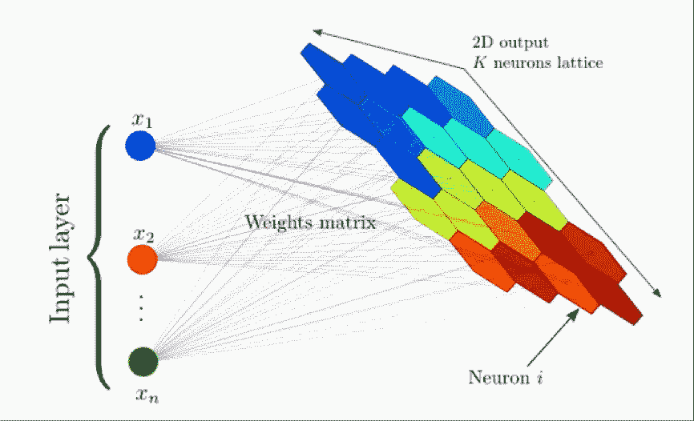
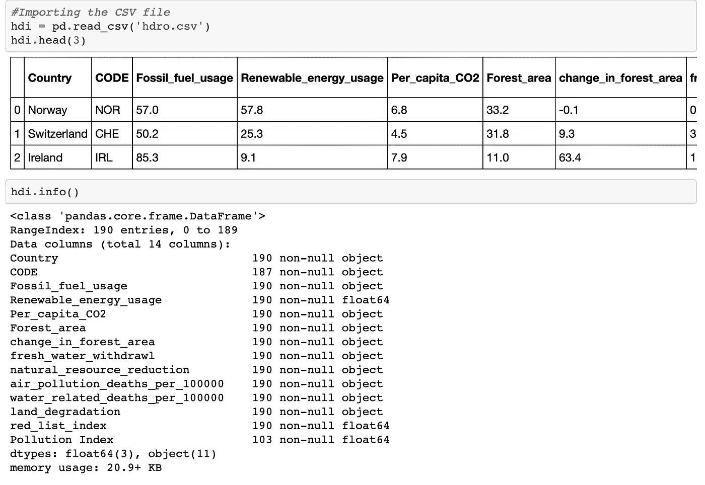
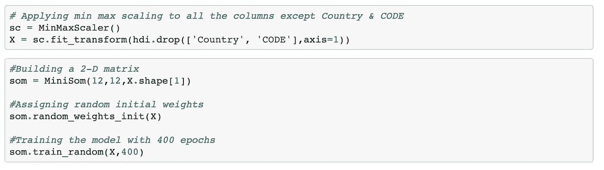
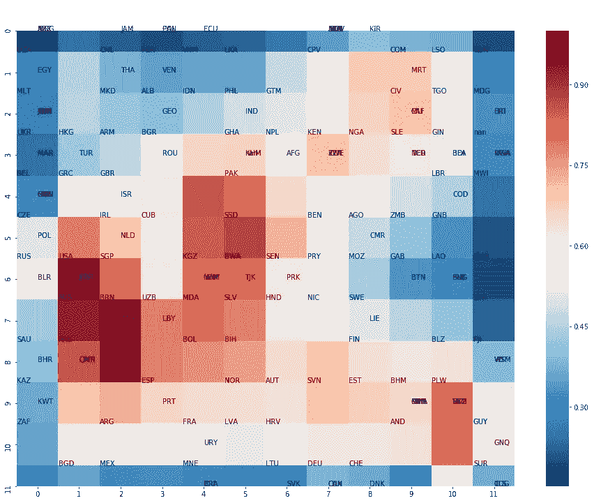
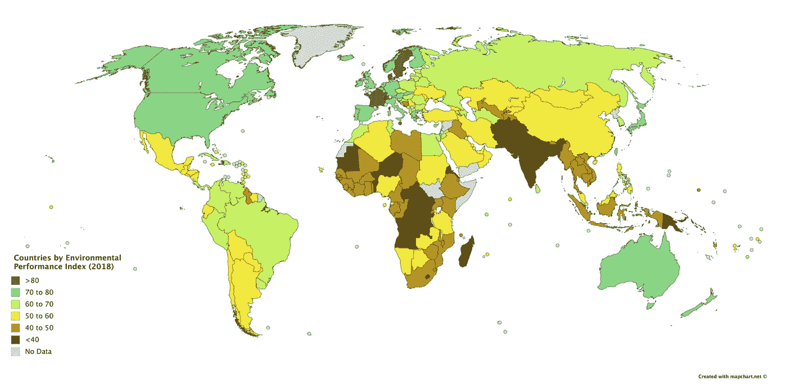
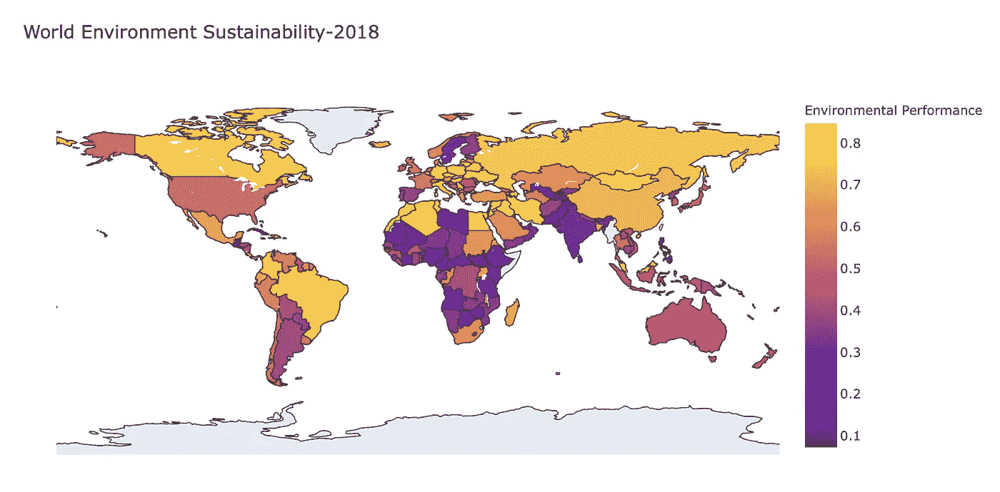

# 我们生活在一个可持续发展的世界吗？让我们用深度学习(SOM)来寻找答案。

> 原文：<https://medium.com/analytics-vidhya/are-we-living-in-a-sustainable-world-using-deep-learning-som-to-find-answers-d97ac5445ac9?source=collection_archive---------16----------------------->

可持续世界是可持续发展战略和实施的结果。在全球范围内，主要因素，如人口规模、生物圈保护区、资源存量、食物供应和环境质量必须保持平衡。这种平衡状态必须持续足够长的时间，这样它才不会仅仅是不可持续增长曲线上的一个亮点。即使我们可能无法真正实现这种平衡，但如果人类和生态系统要生存下去，我们就必须朝着这个方向前进。

因为地球是一个封闭的系统，一个可持续的世界与“可持续增长”是不相容的。一个封闭的系统可能会容纳“可持续发展”，这是世界环境与发展委员会(1987；“布伦特兰委员会”)。

# 为什么是环境可持续发展？

环境可持续性关注的是环境资源是否会为子孙后代得到保护和维护。环境可持续性涉及以下问题:

*   生态系统的长期健康。保护资源的长期生产力和健康，以满足未来的经济和社会需求，例如保护粮食供应、农田和渔业资源。
*   代际决策。在做出经济决策时，我们应该着眼于对未来几代人的影响，而不仅仅是现在。例如，烧煤带来了廉价能源的短期好处，但额外的污染却让后代付出了代价。
*   可再生资源:实现能源多样化，不依赖不可再生资源。例如，太阳能和风能。
*   防止人为全球变暖的后果。确保地球环境不会恶化到让子孙后代面临缺水、极端天气事件、温度过高的程度的政策。—所有这些因素都可能使生活在世界的某些地方变得非常困难，甚至不可能。
*   物种多样性和生态结构的保护。有时药物需要特定植物物种中的元素。如果一些物种灭绝，它会限制未来的技术创新。
*   视环境资源为固有权利和价值。换句话说，我们不应该只依赖货币价值，也就是说，我们应该保护雨林，因为它们值得保护，而不是使用成本效益分析来判断我们是否从保护雨林中获得了经济利益。
*   以社会福利、幸福和环境可持续性为目标，而非 GDP 等粗糙的衡量标准。

# 人类发展报告数据

联合国开发计划署出版《人类发展报告》,从各种来源收集有关人类发展的数据。它包含各种参数，如“人类发展质量”、“性别差距”、“妇女赋权”、“环境可持续性”等等。请点击查看最新报道[。](http://report.hdr.undp.org/?utm_source=web&utm_medium=homepage&utm_campaign=hdr19)

# 环境性能指数

资料来源——环境绩效指数(EPI ),旨在补充联合国千年发展目标中规定的环境目标。

该地图以 0 到 100 的比例描绘了这些国家的环境表现。我们将尝试使用无监督的深度学习技术来组织使用人类发展报告数据的国家，并尝试比较结果。

# 无监督深度学习(自组织地图)

自组织映射(SOM)是一种人工神经网络(ANN ),它使用无监督学习进行训练，以产生训练样本输入空间的低维(通常为二维)离散化表示，称为映射，因此是一种降维方法。自组织映射不同于其他人工神经网络，因为它们应用竞争学习，而不是纠错学习(例如梯度下降的反向传播)，并且在某种意义上，它们使用邻域函数来保持输入空间的拓扑属性。

该示例显示了一个由大量列和维度组成的复杂数据集，并演示了如何降低该数据集的维度。

因此，不必处理成百上千的行和列(因为谁会希望这样呢！)，将数据处理成简化图；这就是我们所说的自组织地图。该图为您提供了完全相同的数据集的二维表示；一本更容易阅读的书。

# 构建我们的数据集

项目中使用的大部分数据来自《2018 年人类发展报告》。数据集通过以下方法获得:

*   1:从《2018 年人类发展报告》中截取相关数据，并将其转换为 csv 文件
*   2:使用熊猫烧纸工具将[的污染指数添加到 csv 文件中。](https://www.numbeo.com/pollution/rankings_by_country.jsp)
*   3:将国家代码添加到 csv 文件中，该文件将用于使用 plotly 绘制 choropleth 地图

# 描述列

*   矿物燃料使用:矿物燃料占总能源消耗的百分比，矿物燃料包括煤、石油、石油和天然气产品。
*   可再生能源使用量:可再生能源在最终能源消费总量中所占的份额。可再生能源包括水电、地热、太阳能、潮汐、风能、生物质能和生物燃料。
*   人均二氧化碳排放量:燃烧矿物燃料、天然气燃烧和生产水泥产生的人为二氧化碳排放量。森林生物量因森林面积枯竭而排放的二氧化碳也包括在内。数据以人均吨数表示(基于年中人口)
*   森林面积:面积超过 0.5 公顷的土地，树木高度超过 5 米，树冠覆盖率超过 10%，或树木能够在原地达到这些阈值。它不包括主要为农业或城市用地的土地、农业生产系统中的林分(例如水果种植园和农林系统)以及城市公园和花园中的树木。正在重新造林但尚未达到但预计将达到 10%的树冠覆盖率和 5 米树高的地区包括在内，由于人为干预或自然原因而暂时没有树木的地区预计将再生。
*   淡水提取量:提取的淡水总量，以可再生水资源总量的百分比表示。
*   自然资源减少:能源、矿物和森林消耗的货币价值，以国民总收入的百分比表示。
*   空气污染 _ 死亡 _per_100000:因暴露于环境(室外)空气污染和烹饪用固体燃料造成的家庭(室内)空气污染而导致的年龄标准化死亡率，以每 100，000 人口表示。环境空气污染来自工业活动、家庭、汽车和卡车的排放。"
*   每 100，000 人中与水有关的死亡人数:由于不安全的水、卫生设施和卫生服务造成的死亡率:由于不安全的水、卫生设施和卫生设施造成的死亡人数，重点是不充分的饮水、卫生设施和卫生服务，以每 100，000 人表示。
*   土地退化:雨水灌溉的农田、灌溉农田或牧场、牧场、森林和林地，由于包括土地使用和管理做法在内的各种压力，它们的生物或经济生产力和复杂性下降或丧失。
*   red_list_index:衡量物种群体灭绝风险的总和。它基于国际自然保护联盟濒危物种红色名录中每一类灭绝风险中物种数量的真实变化。范围从 0 到 1，0 代表所有被归类为灭绝的物种，1 代表所有被归类为最不值得关注的物种。
*   污染指数:空气质量得分。分数越高，空气质量越差

# 构建自组织地图模型

我们将使用由“JustGlowing”开发的 minisom 库

# 可视化二维矩阵

“SOM”将每一行分配给一个节点，该节点与另一个节点相隔一定的欧几里德距离。因此，我们将绘制欧几里得距离的热图，以识别相似和不相似的节点。欧几里德距离越高，两个节点之间的差异就越大。

正如我们所看到的，这些国家是根据相似程度进行分类和分配节点的。

# 结果

1.来自环境绩效指数:

2.从模型中

我们可以看到，印度、巴基斯坦、尼日利亚、也门、沙特阿拉伯、刚果和其他非洲国家的环境绩效最低。加拿大、美国、巴西、澳大利亚和西欧国家在可持续发展指数上表现良好。我们可以将结果与环境性能指数进行比较，我们看到我们的模型产生了类似的结果。

# 结论

印度和巴基斯坦、孟加拉国等邻国人口众多，给环境带来压力。此外，众所周知，中非和西非国家拥有地球上最大部分的自然资源。

可持续发展不是一种选择，而是一种需要。世界各国政府需要采取激烈的行动来扭转环境破坏。如果我们生活在环境绩效指数较低的国家，我们应该采取措施降低个人层面的碳足迹。

如果你喜欢这篇文章，请按拍手键。你也可以在我的 [github](https://github.com/ravidahiya74/Environmental-Sustainability) 页面找到源代码。