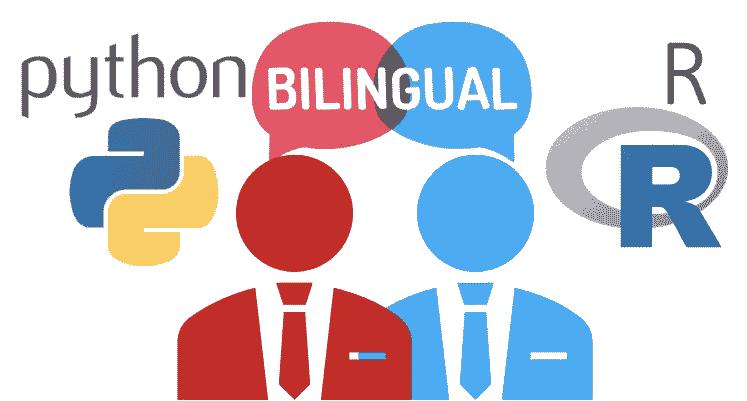

# 你会双语吗？精通 R 和 Python！

> 原文：<https://medium.com/analytics-vidhya/are-you-bilingual-be-fluent-in-r-and-python-7cb1533ff99f?source=collection_archive---------6----------------------->

如果你问我在 R 或 Python 中哪里投资你的时间，我会建议两者都要流利。我不能告诉你哪种语言更好——汉语、英语、印度语、西班牙语、阿拉伯语、马来语、俄语、希腊语或印地语。每种语言都有其悠久的发展历史和优点——就像 R 和 Python 一样。今天，R 的图书馆 CRAN 拥有超过 12，000 个图书馆。然而，几乎没有 R…