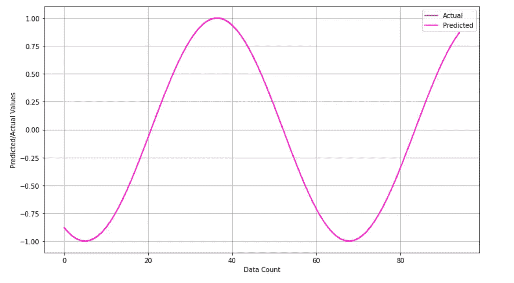
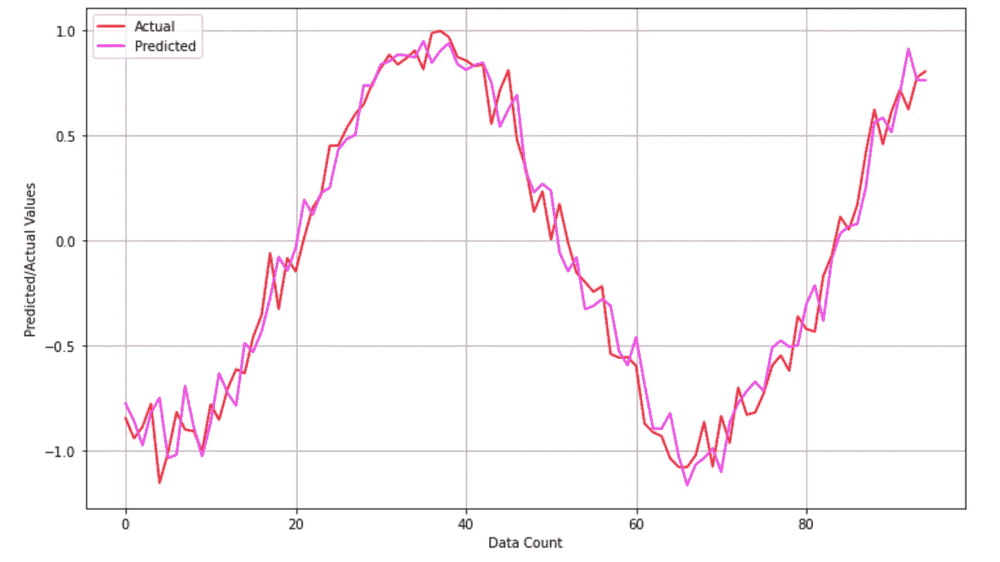
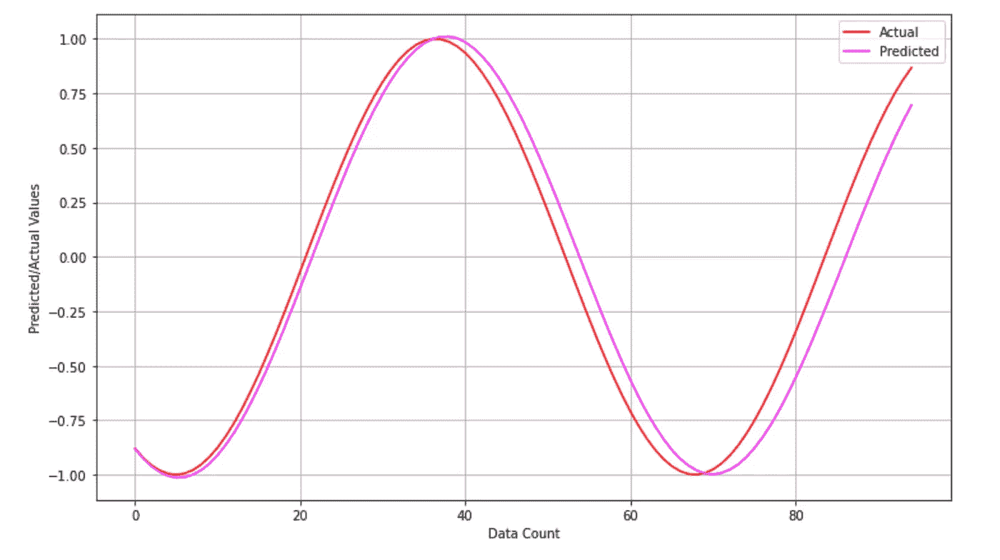
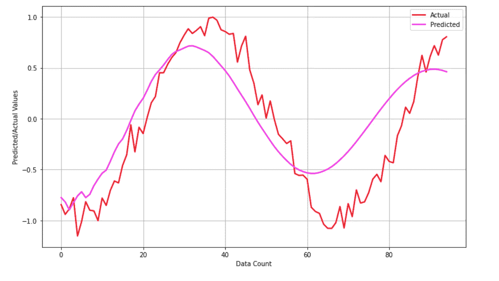

# 你是否生活在一个关于预测技术的神话中？

> 原文：<https://medium.com/analytics-vidhya/are-you-living-with-a-myth-about-the-forecasting-technique-12022b6af8f6?source=collection_archive---------27----------------------->

## 这个博客旨在澄清关于预测的神话，并解释了预测的正确含义，并提供了完整的预测示例代码，以便在更精细的层次上解释这个概念。这个概念在深度学习 RNN(递归神经网络)中起着非常重要的作用。

**来源:**[**Unsplash**](https://unsplash.com)**via**[**Mark knig**](https://unsplash.com/@markkoenig)

在我们的日常生活中，预测的例子几乎无处不在。这是几乎每个人生活中常见的一部分，即使他们知道或不知道。例如，**天气预报**使用一种预测技术来预测未来的天气。另一个例子可能是**预测未来的股票价格** s，这也是预测&使用的预测技术。同样，在日常生活中也有许多预测技术的例子。

# 什么是预测？

这是一个根据现在和/或过去的价值来计算未来任何事物的价值的过程。例如，基于一周前 5 天的天气状况，必须预测/预报一周最后 2 天的天气状况。

如果错误的方法被用于实际上是虚构的预测，那么实际的预测将不会被获得&而且它违反了实际预测的定义。

下一节将解释与预测方法相关的神话。

# 关于预测的神话！

假设有一整周的天气数据，第 6 天的天气必须根据前 5 天的天气预报。大多数人会为这个任务建立一个模型，这个模型会从周一到周五获取数据，预测周六的天气，同样，它会从周二到周六获取天气数据，预测周日的天气，这个过程以类似的方式继续。

> 但实际上，这种方法是错误的&它也违反了纯粹预测的定义。实际上，如果自动回归模型是用这种逻辑建立的，那么自动回归模型将不会学习实际的预测模式。

下图显示了自动回归模型预测的错误方法。

**用错误的方法对没有任何噪音的数据进行预测！【作者图片】**

**用错误的方法对有噪声的数据进行预测！【作者图片】**

# 正确的预测方法！

正确的预测方法考虑了已经预测的值，并将其用于未来预测。例如，如果第 6 天的天气必须根据之前的 5 天进行预测，那么采用正确方法的自动回归模型将根据周一至周五的天气数据预测周六的天气，但现在在进一步的迭代中，周二至周六的天气数据被用来预测周日的天气，但在该天气数据中，**周六的天气将是模型预测的天气，而不是数据集**中已经存在的天气。

*这是持续预测的正确方法&也符合预测的定义。*

下图显示了自动回归模型预测的正确方法。

**用正确的方法对数据进行预测，没有任何噪音！【作者图片】**

用正确的方法对有噪声的数据进行预测！【作者图片】

> 这都是在预测中，知道错误和正确的方法之间的区别是非常重要的。

要使用合成数据集查看这一概念的代码，请访问下面给出的链接。

 [## harshit dawar 55/机器和深度学习

### permalink dissolve GitHub 是超过 5000 万开发人员的家园，他们一起工作来托管和审查代码，管理…

github.com](https://github.com/HarshitDawar55/Machine_And_Deep_Learning/blob/master/Projects/Deep_Learning_Projects/AutoRegressor-Model-RNN-Basics/AutoRegressor%20Model.ipynb) 

我希望我的文章用所有深刻的概念和解释解释了与主题相关的每一件事。非常感谢你花时间阅读我的博客&来增长你的知识。如果你喜欢我的作品，那么我请求你为这个博客鼓掌！