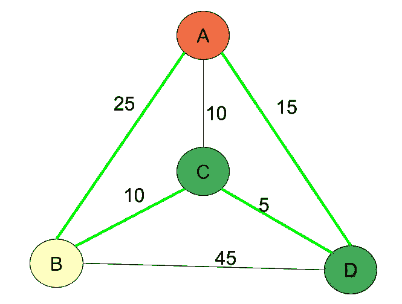
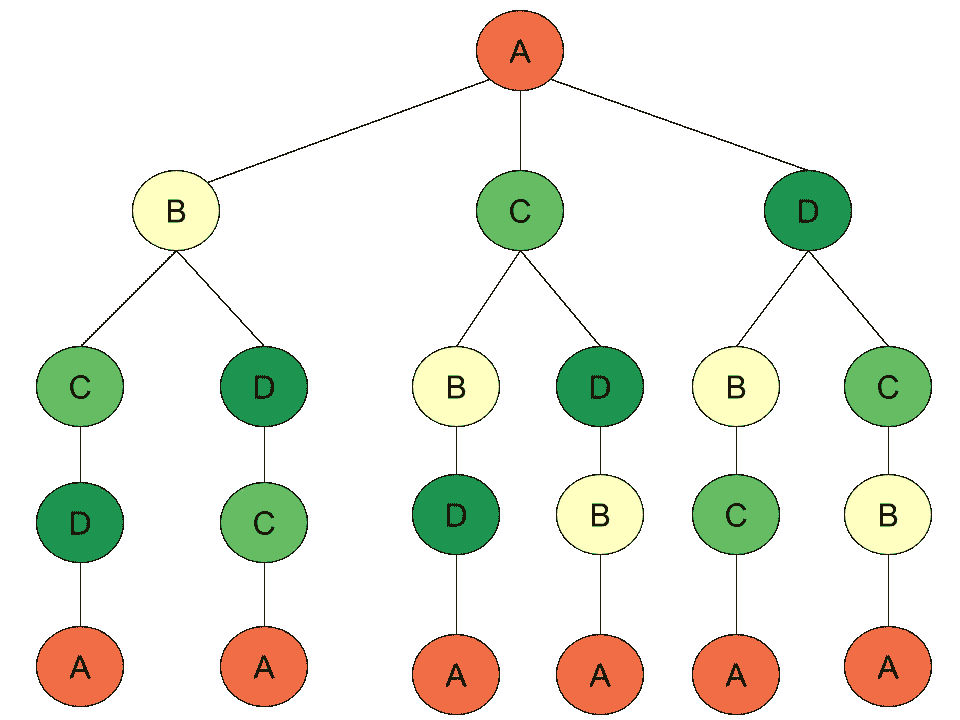
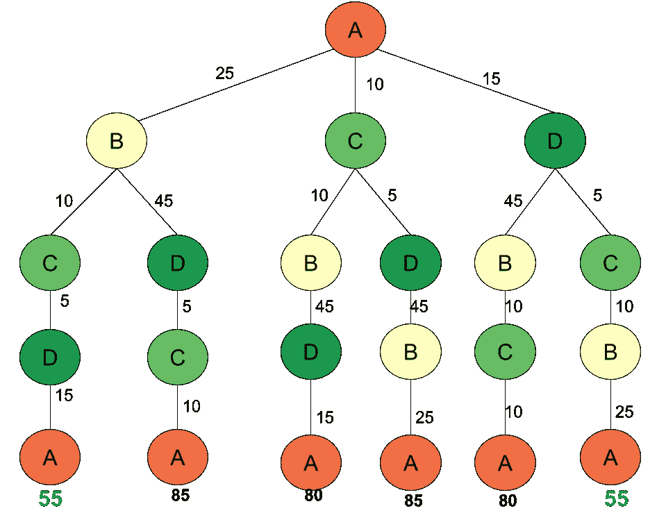
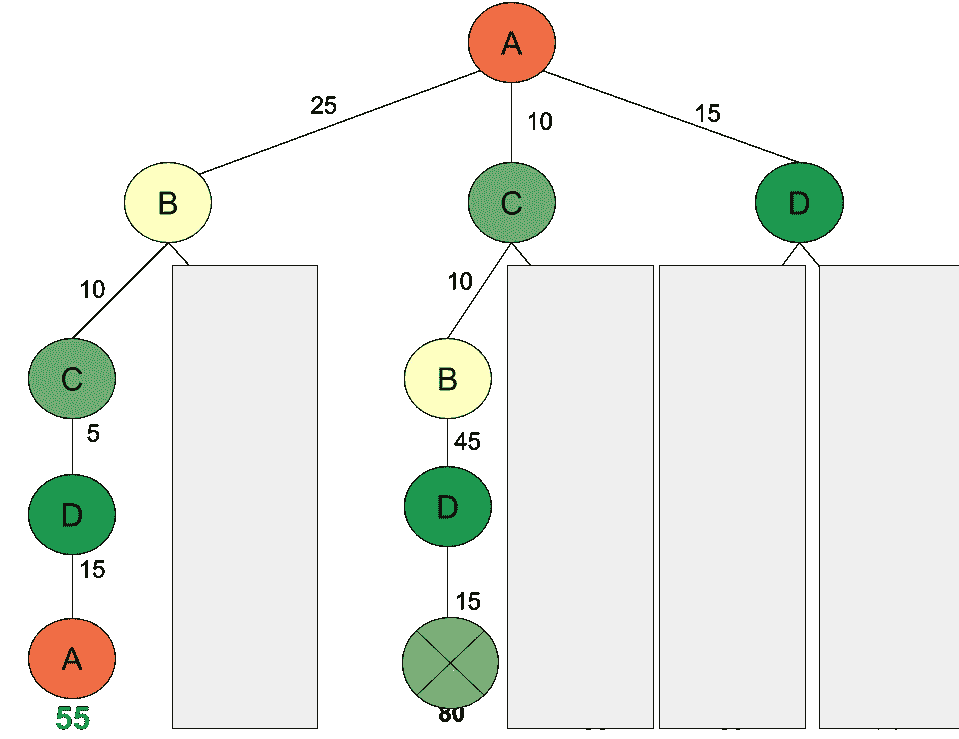
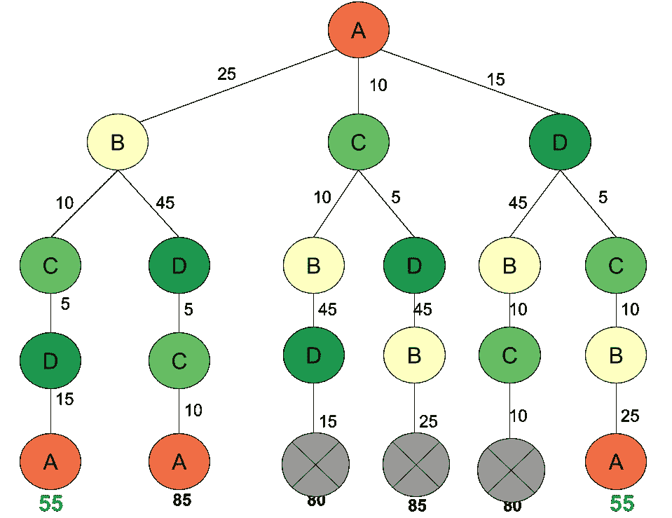

# 你准备好解决旅行推销员问题了吗？

> 原文：<https://medium.com/analytics-vidhya/are-you-read-for-solving-the-traveling-salesman-problem-80e3c4ea45fc?source=collection_archive---------0----------------------->

最近在 leetcode: 943 上遇到一个旅行商问题(TSP)。找到最短的超弦。你可以在这里找到问题。

[943。找到最短的超弦](https://leetcode.com/problems/find-the-shortest-superstring)

TSP 是一个著名的 NP 问题。简单解的复杂度是 O(n！).DP(动态规划)版本算法(贝尔曼-霍尔德-卡普算法)将具有 O(2^n * n 的复杂度。通过把复杂度从阶乘降低到指数，如果 n 的大小比较小，问题是可以解的。

我对这个问题感兴趣，正如我对 DP 问题感兴趣一样。大多数动态规划问题通过避免子问题的重复计算，将时间复杂度从指数降低到多项式。这个问题是 DP 的一个例子，它可以将时间复杂度从阶乘降低到指数级。

对于为什么天真解复杂度为 O(n！)和 DP 一个是 O(2^n*n)，从这里有一个超级好看清晰的视频。

还有，根据上面的视频有一个不错的帖子。我喜欢这个视频清晰的解释，我也从下面的帖子中发现这个问题的可视化非常好。

[](/basecs/speeding-up-the-traveling-salesman-using-dynamic-programming-b76d7552e8dd) [## 用动态规划加速旅行推销员

### 让计算机科学变得困难的很大一部分原因是，在解决问题时，很难知道从哪里开始…

medium.com](/basecs/speeding-up-the-traveling-salesman-using-dynamic-programming-b76d7552e8dd) 

但是，如果你仔细对比一下讲解视频和 leetcode 问题，我们会发现在描述 TSP 问题上有些细微的差别。我们将有两个案例。我将用一个婴儿的例子来说明这些算法的细节。这个婴儿示例包含 A、B、C、D 四个城市，如图 1 所示。为了简单起见，我们正在生成一个对称的 *TSP* ，两个城市之间的距离在每个相反的方向上都是相同的。



图一。TSP 的一个小例子

1.  每个城市参观一次，回到第一个参观的城市。ABCDA 将是这个婴儿例子的解决方案。
2.  每个城市只参观一次。ADCB 将是解决办法。

我将根据这两个案例进行逐步分析。

案例 1:每个城市访问一次，回到第一个访问的城市(ABCDA)

步骤 1:为什么朴素解具有 O(n！)

一个完整的搜索方法将给我们(N-1)！可能性。为什么？我们可以通过使用图 1 来可视化可能的选择。如果我们有 n 个城市，第一步和最后一步将是其中一个城市，那么所有可能的路径将是其余 n-1 个城市的排列。所以复杂度会是(n-1)！，复杂度将为 O(n！).



图 2:当我们只有 ABCD 4 个城市可访问时，“案例 1 每个城市访问一次，回到第一个访问的城市”的所有可能路径。



图 3:在图 2 中提供路径开销，并找到最佳路径。

如果考虑路径成本，最佳路径将是 ABCDA 或 ADCBA。实际上，这两条路径与我们正在分析的对称 *TSP 是同一条路径。*

2:能不能加快速度？

是的。



图 4:这两条未阻塞路径的前 4 项都包含 ABCD，并以 d 结束。可以删除开销较大的路径。

从图 4 中，我们看到我们可以修剪一些过于昂贵的分支。



图 5:这里显示了可以修剪的分支。

图 5 显示了当生成的路径已经包含{A，B，C，D}并且想要扩展路径以连接 A 时，3 个被修剪的分支。从该图中，我们看不到显著的修剪，但是，如果我们引入更多的城市，修剪将大大提高效率。

这个过程正是贝尔曼-赫尔德-卡普动态规划算法的关键部分。视频中解释的复杂度是 O(n *2^n).它比阶乘快得多。

我实现了一个简单的贝尔曼-赫尔德-卡普算法。大意是这样的:
如果我们有 A，B，C，D
所有路径包含 4 个元素并且以 D 结尾可以写成:
{A，B，C，D}以 D 结尾
它可以由
{A，B，C}以 A + AD
结尾{A，B，C}以 B + BD
结尾{A，B，C}以 C+ CD
然后就有了下面这个解。我使用(A，B，C) + (A，)，用 A 编码{A，B，C}结尾

解决方案 1 简单明了的贝尔曼-赫尔德-卡普算法(844 毫秒)

讨论 leetcode 的几个解决方案可以用来解决这个 TSP 问题。

解决方案 2(Bellman-hold-Karp 算法)(运行时间 936 ms)它基于 DP TSP 解决方案。

对此解决方案的引用:

[https://leet code . com/problems/find-the shortest-superstring/discuse/195077/Clean-python-DP-with-explanations](https://leetcode.com/problems/find-the-shortest-superstring/discuss/195077/Clean-python-DP-with-explanations)

```
class Solution:
    def shortestSuperstring(self, A: List[str]) -> str:
        ''' TSP: DP '''
        n, N = len(A), 1 << len(A)
        w = [[0] * n for _ in range(n)]
        for i in range(n):
            for j in range(n):
                for k in range(min(len(A[i]), len(A[j])), 0, -1):
                    if A[j].startswith(A[i][-k:]):
                        w[i][j] = k
                        break
        f = [[None] * n for _ in range(N)]
        for i in range(N):
            for k in (t for t in range(n) if (1 << t) & i):
                i1 = i ^ (1 << k)
                f[i][k] = min([f[i1][j] + A[k][w[j][k] :] 
                               for j in filter(lambda x: (1 << x) & i1, range(n))],
                               key=len, default=A[k])                              
        return min(filter(None, f[-1]), key=len)
```

解决方案 2(50 毫秒)

我仍在研究代码，在我完全理解这一点后会有一些解释。

参考:

[https://leet code . com/problems/find-the shortest-superstring/discuse/221181/A *-search-python-implementation-64 ms-pass](https://leetcode.com/problems/find-the-shortest-superstring/discuss/221181/A*-search-python-implementation-64ms-pass)

```
from heapq import heappush, heappopdef dist(v, w, eq):
    if eq:
        return 10000
    else:
        for i in range(1, len(w)):
            if v.endswith(w[:-i]):
                return i
        return len(w)def construct_seq(s, d, w):
    t = w[s[0]]
    for i in range(1, len(s)):
        t = t + w[s[i]][-d[s[i-1]][s[i]]:]
    return tdef heuristic(x, mdj):
    return sum(mdj[i] for i in range(len(x)) if x[i] == 0)def adjacent_nodes(x):
    ret = []
    for i in range(len(x)):
        if x[i] == 0:
            y = list(x)
            y[i] = 1
            ret.append((i, tuple(y)))
    return ret

class Solution(object):
    def shortestSuperstring(self, A):
        n = len(A)

        # special case
        if n == 1:
            return A[0]
        # assert n > 1

        # distance between words
        # dij := the cost in addition to add j after i
        dij = [[dist(A[i], A[j], i == j) for j in range(n)] for i in range(n)]

        # minimum cost to add j
        mdj = [min(dij[i][j] for i in range(n)) for j in range(n)]

        # A* search
        # init
        q = []          # priority queue with estimated cost
        for i in range(n):
            x = tuple(1 if j == i else 0 for j in range(n))
            g = len(A[i])            # actual cost from start
            h = heuristic(x, mdj)    # lower bound of cost till the goal
            heappush(q, (g + h, g, h, x, [i]))

        best_f = None
        best_p = None
        while len(q) > 0:
            # f, g, h, node, path
            f, g, h, x, p = heappop(q)

            if best_f is not None and f >= best_f:
                break

            for j, y in adjacent_nodes(x):
                gy = g + dij[p[-1]][j]
                py = p + [j]

                if sum(y) == n:     # is goal
                    if best_f is None or gy < best_f:
                        best_f = gy
                        best_p = py
                else:
                    hy = heuristic(y, mdj)
                    heappush(q, (gy + hy, gy, hy, y, py))

        return construct_seq(best_p, dij, A)
```

解决方案 3(不清楚的方法，但 40 毫秒)这个代码是从一个最快的提交收集。我不清楚谁是原作者。此外，我不明白的解决方案，但它是超级快速和短暂的。等我完全理解了以后再解释。

```
class Solution:
    def shortestSuperstring(self, words: List[str]) -> str:
        def concat(s, t, mink):
            for k in range(min(len(s), len(t)) - 1, 0, -1):
                if k <= mink: break
                if s[-k:] == t[:k]: return k, s + t[k:]
                if t[-k:] == s[:k]: return k, t + s[k:]
            return 0, s + t

        if not words: return ''
        while len(words) > 1:
            sharedsize = a = b = -1
            concatstr = ''
            for j in range(len(words)):
                for i in range(j):
                    k, s = concat(words[i], words[j], sharedsize)
                    if k > sharedsize:
                        sharedsize, concatstr = k, s
                        a, b = i, j
            if sharedsize > 0:
                words[b] = concatstr
                words[a] = words[-1]
            else:
                words[0] += words[-1]
            words.pop()
        return words[0]
```

# 847.访问所有节点的最短路径

[](https://leetcode.com/problems/shortest-path-visiting-all-nodes/) [## 访问所有节点的最短路径- LeetCode

### N 个节点(标记为 0，1，2，...N-1)以图表形式给出。graph.length = N 和 j！=我…

leetcode.com](https://leetcode.com/problems/shortest-path-visiting-all-nodes/) 

这个问题类似于 TSP，但是它不是 TSP，因为我们被允许多次访问一个节点。虽然这不是一个 TSP 问题，但我们可以使用解决 TSP 问题的方法来删除不需要的状态。

不修剪(TLE)

```
class Solution:
    def shortestPathLength(self, graph: List[List[int]]) -> int:
        if any(len(g)==0 for g in graph):return 0
        N = len(graph)
        def bfs():
            from collections import deque
            Q = deque([(i, 0, {i}) for i in range(N)])
            while Q:
                i, d, seen = Q.popleft()
                if len(seen)==N:return d
                for j in graph[i]:
                    this_seen = seen | {j}
                    Q.append((j, d+1, this_seen))
        return bfs()
```

带修剪(AC 348 ms)

```
class Solution:
    def shortestPathLength(self, graph: List[List[int]]) -> int:
        if any(len(g)==0 for g in graph):return 0
        N = len(graph)
        def bfs():
            from collections import deque
            Q = deque([(i, 0, {i}) for i in range(N)])
            pruning = collections.defaultdict(lambda : float('inf'))
            while Q:
                i, d, seen = Q.popleft()
                #pruning[tuple(sorted(seen))+(i,)]=d
                if len(seen)==N:return d
                for j in graph[i]:
                    this_seen = seen | {j}
                    this_key = tuple(sorted(this_seen))+(j,)
                    if pruning[this_key]>d+1:
                        pruning[this_key] = d+1
                        Q.append((j, d+1, this_seen))
        return bfs()
```