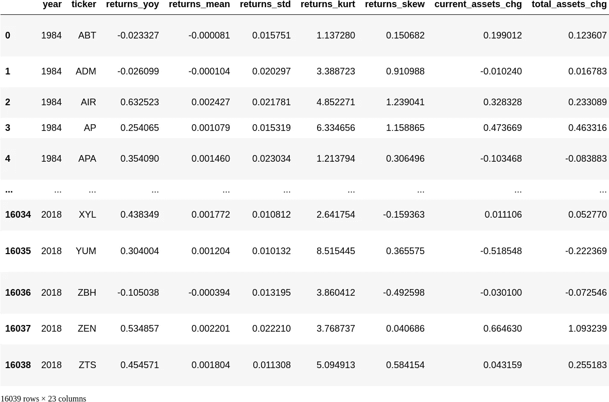
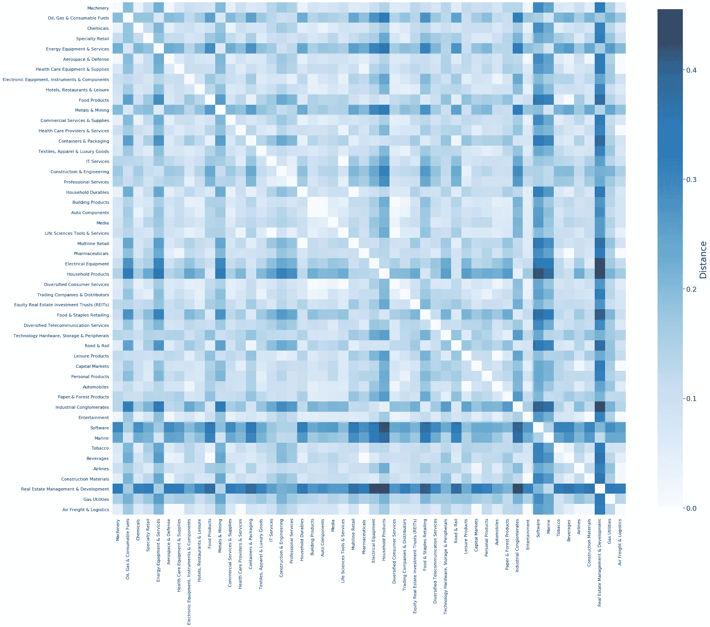
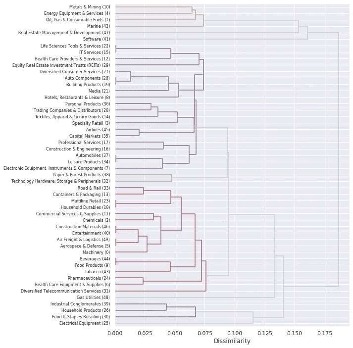

# 你还在使用 Markowitz 模型进行多元化投资吗？欢迎来到 21 世纪。

> 原文：<https://medium.com/analytics-vidhya/are-you-still-diversifying-using-the-markowitz-model-welcome-to-the-21st-century-c6f099ecdcb0?source=collection_archive---------23----------------------->

本文是多样化系列文章的第 1 部分。

大多数散户投资者也称“傻钱”不会分散投资。

相比之下，专业投资组合经理会分散投资:

1.  跨市场；
2.  跨部门；
3.  跨资产类型；
4.  跨投资策略。

专业投资组合经理比散户投资者更害怕偶尔的下跌和崩盘。理应如此。最优秀的经理人会监控自己的风险敞口，并根据他们认为的最佳投资组合权重寻求重新平衡。他们明白多样化是最小化风险的关键。

计算最优投资组合权重最流行、最常用的模型是 Markowitz 模型和有效边界。
**这是现在被认为是古老的技术。**

马科维茨模型有两个主要问题:

1.  **Markowitz 总是过度拟合训练数据。** Markowitz 的结果是对过去可能有利可图的权重进行优化的过程。马科维茨模型不是在学习一套预测未来的规则。相反，这个模型可以总结为“这个投资组合在过去 10 年里表现良好吗？那么接下来的 10 年肯定能好好干！”。你可以根据自己的喜好改变 10 年的时间步长——你仍然会过度适应。
2.  **它找到最大化夏普比率的权重。夏普比率烂透了。** “什么？！但是大家都在用夏普比率！”
    使用 Sharpe 向客户展示投资组合指标是可以的；用它来做日常的量化工作是不合适的。夏普比率的分母是回报率的标准差，这是一个很好的可变性度量，而不是一个很好的风险度量。夏普比率惩罚大的正波动，惩罚加速的回报，并且不能惩罚减速的回报。有关实验证据，请参见:[https://www . crystal bull . com/sharpe-ratio-better-with-log-returns/](https://www.crystalbull.com/sharpe-ratio-better-with-log-returns/)

# 进入机器学习。

我们可以通过几种方式将投资组合优化问题构建为机器学习问题:

1.  **强化学习**:学习投资组合权重的最优增减。
2.  **监督学习**:学习未来 N 天/月/年的最优投资组合权重。
3.  **无监督学习**:根据资产的价格和基本面相似性，学习资产集群。

今天，我将重点讨论后一个问题。为什么？因为学习资产组可以根据历史数据确定如何分散投资。

我们将从以下数据集开始:



每行描述一个实例。每个实例包含给定股票在给定年份的定量信息，以及其 GICS 部门、行业组、行业和子行业。

我们选择了包含最多实例的前 50 个行业:

```
Machinery                                         1379
Oil, Gas & Consumable Fuels                       1312
Chemicals                                          916
Specialty Retail                                   899
Energy Equipment & Services                        779
Aerospace & Defense                                634
Health Care Equipment & Supplies                   582
Electronic Equipment, Instruments & Components     485
Hotels, Restaurants & Leisure                      480
Food Products                                      463
Metals & Mining                                    452
Commercial Services & Supplies                     424
Health Care Providers & Services                   387
Containers & Packaging                             362
Textiles, Apparel & Luxury Goods                   302
IT Services                                        301
Construction & Engineering                         272
Professional Services                              270
Household Durables                                 255
Building Products                                  250
Auto Components                                    250
Media                                              241
Life Sciences Tools & Services                     226
Multiline Retail                                   223
Pharmaceuticals                                    221
Household Products                                 203
Electrical Equipment                               203
Diversified Consumer Services                      197
Trading Companies & Distributors                   194
Equity Real Estate Investment Trusts (REITs)       170
Food & Staples Retailing                           167
Diversified Telecommunication Services             166
Technology Hardware, Storage & Peripherals         160
Road & Rail                                        157
Leisure Products                                   149
Capital Markets                                    137
Personal Products                                  136
Automobiles                                        134
Paper & Forest Products                            125
Industrial Conglomerates                           125
Entertainment                                      118
Software                                           115
Marine                                             106
Tobacco                                            103
Beverages                                          101
Airlines                                            90
Construction Materials                              81
Real Estate Management & Development                80
Gas Utilities                                       65
Air Freight & Logistics                             63
Name: gics_industry, dtype: int64
```

过滤我们的数据，使其只包含那些 GICS 行业。

然后，我们将数字信息标准化:

我们现在可以计算并可视化行业间的差异，通过不同行业样本间的[最大平均差异](http://jmlr.csail.mit.edu/papers/v13/gretton12a.html)来衡量。



我们也可以将此框架为一个层次聚类问题，并使用 MMD 作为行业和行业集群之间的关联度量:



根据上面的图表，我们可以看到一些产业正与不同行业的产业聚集在一起。因此，数据表明，我们最好按行业进行多样化，而不是按部门进行多样化。

第 1 部分到此结束。
[这个实验用的 Jupyter 笔记本原件可以在这里找到。](https://github.com/diogoseca/qualitative-clustering)

在第 2 部分，我们将着眼于基于 ML 的多样化策略，并比较他们的前瞻性测试/抽样结果。这将包括来自 [MlFinLab python 包](https://github.com/hudson-and-thames/mlfinlab)的一些方法。