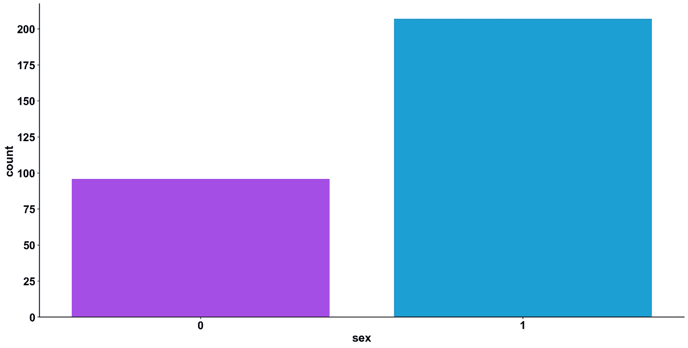
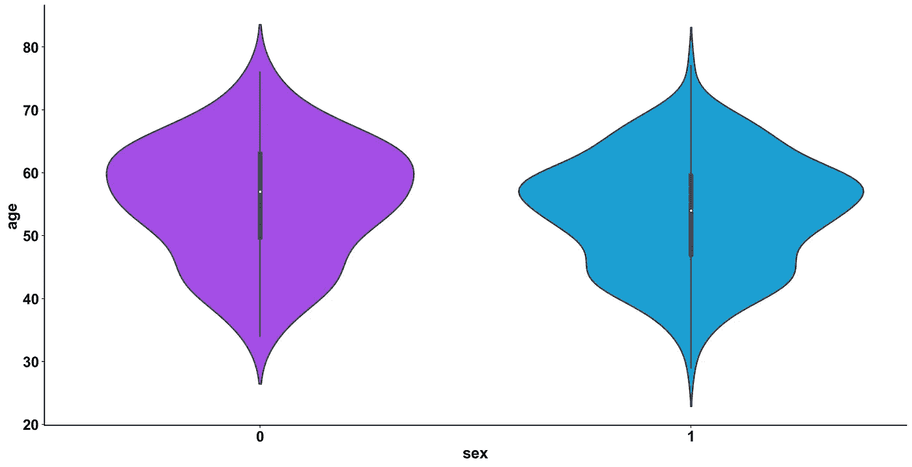
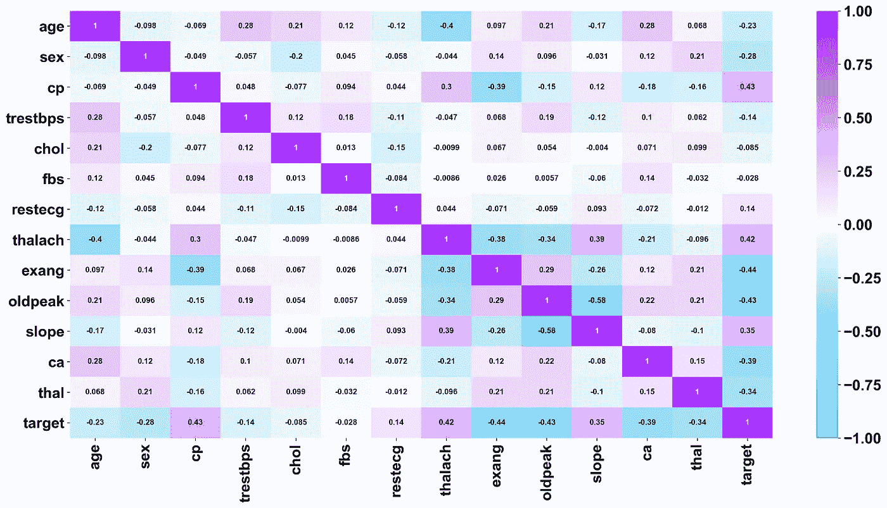
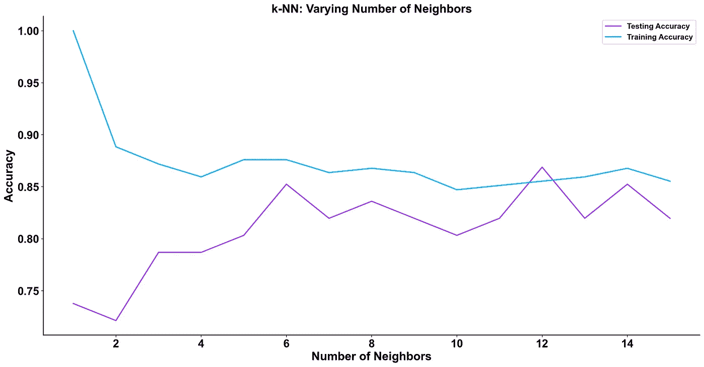
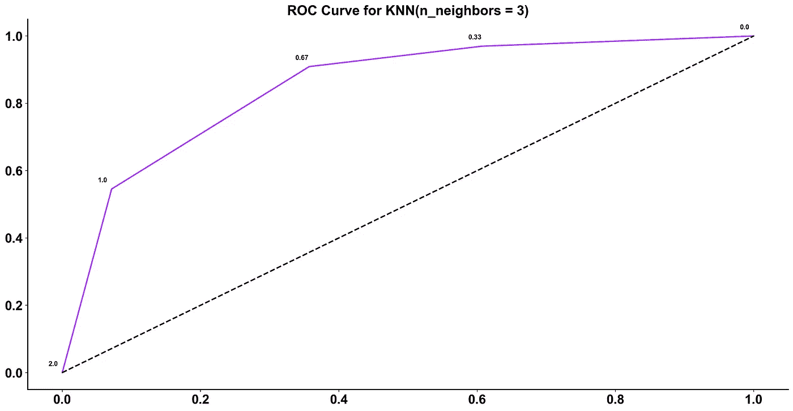
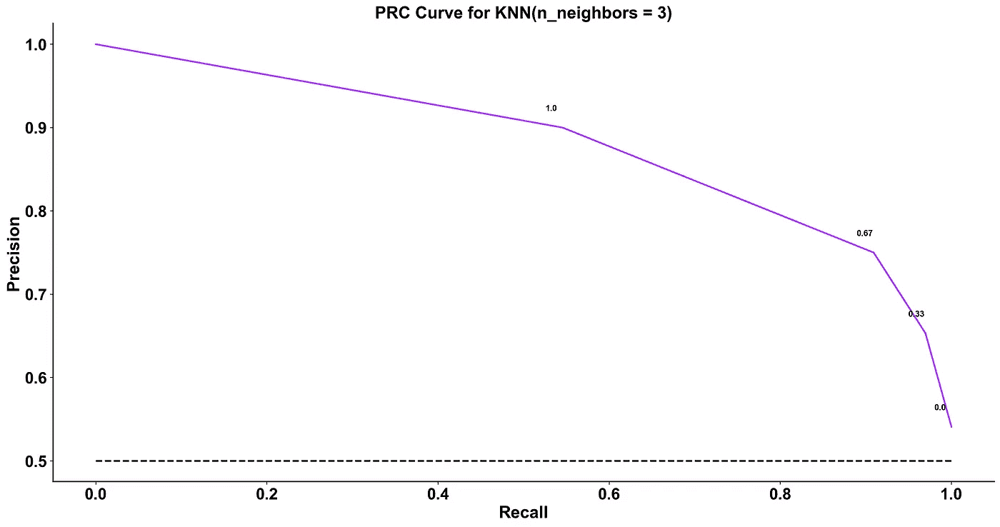

# 你容易患心脏病吗？机器学习方法

> 原文：<https://medium.com/analytics-vidhya/are-you-susceptible-to-a-heart-attack-a-machine-learning-approach-f4ed34e811fe?source=collection_archive---------20----------------------->


塔曼娜·茹米在 [Unsplash](https://unsplash.com?utm_source=medium&utm_medium=referral) 拍摄的照片

在 Datern 的数据科学课程中提出的研讨会中，有一个给我留下了特别深刻的印象。
顾名思义，这项任务是根据病人的生理状况来判断他是否患有心脏病。在本文的其余部分，我将介绍我的发现以及我实现这些发现的方法。

所使用的数据集包含 **303 名患者**，共有 14 个变量:
**年龄**，
**性别**，
**cp** *(胸痛型)*，
**trest bps****(静息血压)*，
**胆固醇** *(胆固醇)【T30
**【thal ach】***(达到最大心率)*
**exang***(运动诱发心绞痛)*
**old peak***(运动相对于休息诱发的 st 段压低)* **slope***(*运动 ST 段峰值的斜率*)，*** 

*让我们进一步研究这些数据*

*该计数图显示了数据集中男性与女性的比例:*

**

*0 表示女性，1 表示男性*

*我们可以看到女性是 98 岁，男性是 205 岁。这可能导致在男性患者中预测疾病诊断的更强准确性。*

*这张小提琴图看的是男性和女性的年龄分布:*

**

*0 表示女性，1 表示男性*

*它表明，女性在年龄上比男性更相似，而且她们往往更老。*

*该相关矩阵分析变量之间的相关性:*

**

*我们可以看到，与目标最相关的特征似乎是“exang”*(运动诱发的心绞痛)。*此外，我们观察到特征之间没有多重共线的迹象。*

*我们现在着手构建 K 最近邻模型来预测“目标”，即患者是否患有心脏病(1)或(0)。*

*在将每个观察值放置在 N 维平面中之后，其中 N 是所考虑的特征的数量，KNN 通过考虑其 K 个最近邻来确定未知数据的类别。他们每个人都有一张“选票”，投给自己所属的阶层。在投票结束时拥有更多票数的类将是未知观察的类。*

*在下面的代码中，我们创建了特征矩阵 X 和目标向量 y。然后，我们缩放数据。这对 knn 来说至关重要，因为它依赖于距离的概念。我们用 sk learn . preprocessing . standard scaler .
实现这一点，然后我们把数据分成两部分:训练和测试(20%的数据)。这是为了避免过度拟合。*

```
*# Create feature and target arrays
y = df["target"].values
X = df.drop(["target"], axis = 1)#Scaling - crucial for knn
from sklearn.preprocessing import StandardScaler
ss = StandardScaler()
X = ss.fit_transform(X)from sklearn.model_selection import train_test_split# Split into training and test set
X_train, X_test, y_train, y_test = train_test_split(X, y, test_size = 0.2, random_state=42, stratify=y)*
```

*在下面的代码中，我们创建了一个 k=3 的 knn 对象。我们用*训练它。用*配合*方法并产生结果。预测*法。在所有这些之后，精度将被打印出来。*

```
*from sklearn.neighbors import KNeighborsClassifier# Create a k-NN classifier with 3 neighbors
knn1 = KNeighborsClassifier(n_neighbors = 3)# Fit the classifier to the training data
knn1.fit(X_train,y_train)# Print the accuracy
print(knn1.score(X_test, y_test))*
```

*我们得到了 79%的准确率。让我们尝试 k 的一些其他值，并尝试提高这个精度。这是下一个代码片段的任务。*

```
*# Setup arrays to store train and test accuracies
neighbors = np.arange(1, 16)
train_accuracy = np.empty(len(neighbors))
test_accuracy = np.empty(len(neighbors))# Loop over different values of k
for i, k in enumerate(neighbors):
    # Setup a k-NN Classifier with k neighbors: knn
    knn = KNeighborsClassifier(n_neighbors = k) # Fit the classifier to the training data
    knn.fit(X_train,y_train)

    #Compute accuracy on the training set
    train_accuracy[i] = knn.score(X_train, y_train) #Compute accuracy on the testing set
    test_accuracy[i] = knn.score(X_test, y_test)*
```

*现在让我们画出每个 k 的精度*

**

*我们看到，当 k = 12 时，精度最高，但这可能会导致过拟合，因此我们还应该考虑其他指标，以确定应该使用什么样的 k 值。
为此，我们来绘制一个 ROC(接收机工作特性)曲线。这是 TPR (y 轴)和 FPR (x 轴)之间的曲线。由于我们的模型基于为每一类生成的概率将患者分类为患有心脏病或不患有心脏病，因此我们也可以决定概率的阈值。让我们用`k = 3`为我们的模型生成一条 ROC 曲线。*

**

*每个顶点上面的小数字是考虑的阈值。*

*以曲线和轴为边界的面积称为曲线下面积(AUC)。正是这个领域被认为是一个好模式的标志。这个指标的范围从 0 到 1，我们应该以较高的 AUC 值为目标。具有高 AUC 的模型被称为具有良好技能的模型。*

*该模型的 AUC 为 85%。这意味着它将能够在 85%的时间里区分心脏病患者和非心脏病患者。*

*另一个诊断工具是 PRC(精确召回曲线)。同样，它向我们展示了不同阈值的精确度和召回率，我们的目标应该是最大化曲线下的面积。*

**

*对于该模型，中国的 AUC 为 88%*

*我们现在能够在 85%的情况下正确预测新患者是否患有心脏病。这对医生来说无疑是一个有用的诊断工具。*

*我们还应该记住，模型会因过度拟合而有偏差，因此真正的准确性可能与我们获得的值不同，而且它还取决于模型接受训练的数据部分。*

*这只是项目的开始。下一步将包括尝试不同的训练/测试分割比、不同种类的距离、不同的特征组合等…*

*谢谢你的时间。*