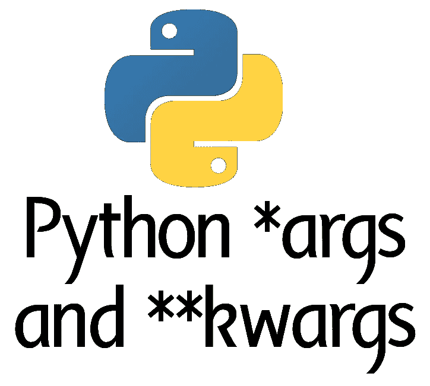
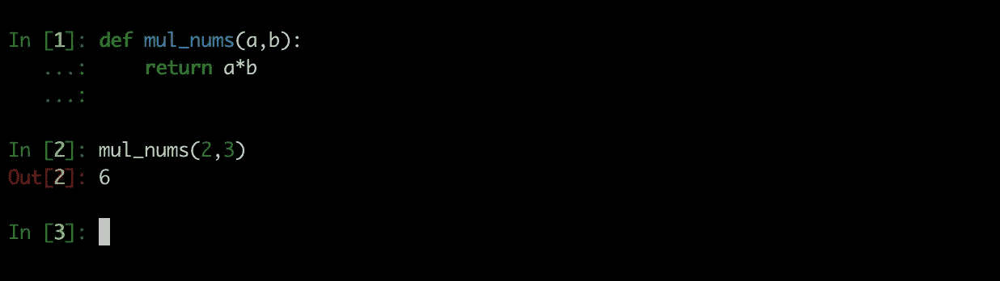
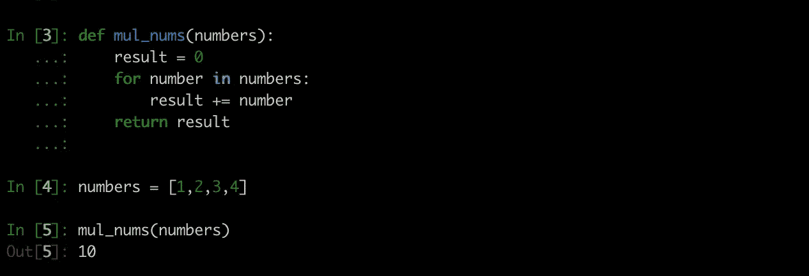
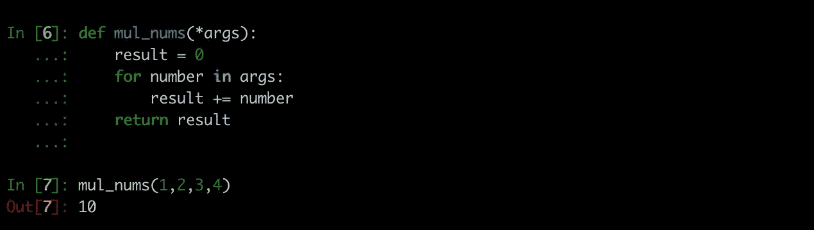
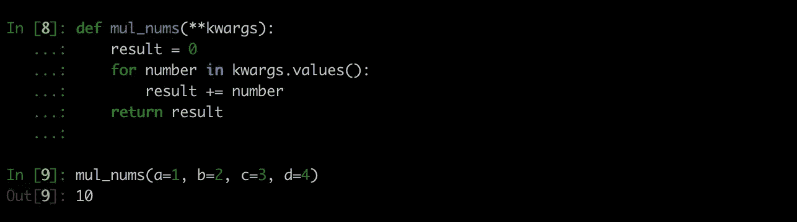
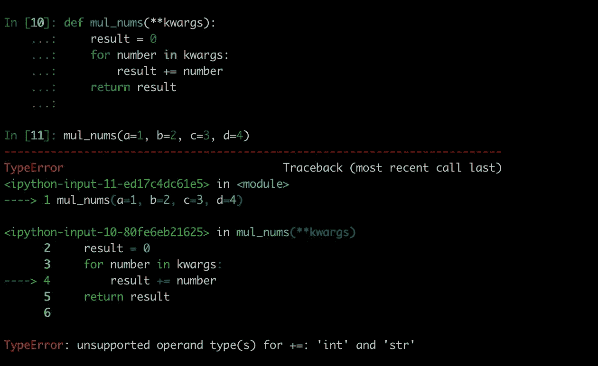
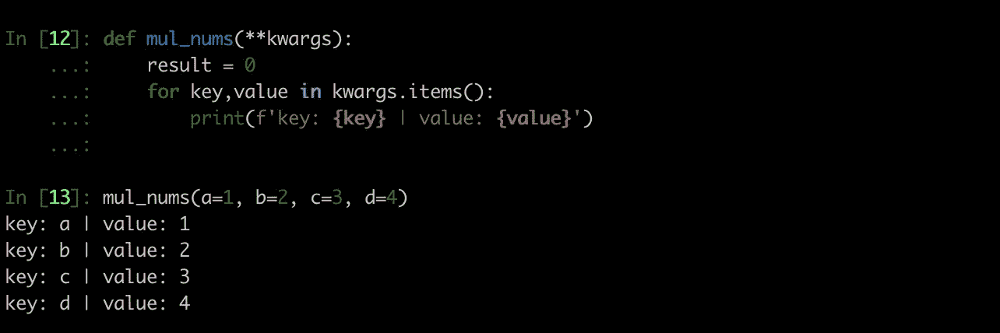
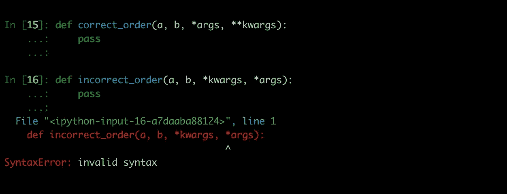

# * Python 中的 args 和**kwargs

> 原文：<https://medium.com/analytics-vidhya/args-and-kwargs-in-python-a8e4304e34b8?source=collection_archive---------4----------------------->

args 和 kwargs

有时，如果你查看 Python 中的函数定义，你会看到两个奇怪的参数 ***args** 和 ****kwargs** ，如果你想知道它是什么，想知道它是如何工作的，那么这篇文章就是为你准备的。在 Python 中，我们可以向函数传递可变数量的参数，*args 将有助于传递多个参数，**kwargs 将允许我们向函数传递关键字参数。

# *** Python 中的 args**

通常我们会像这样传递参数给一个函数:

接受两个参数并返回其乘积的函数

但是这里有一个问题，我们需要传递恰好 2 个参数来得到它们的乘积，也就是说，如果我们需要找到两个以上数字的乘积，我们就不能使用这个函数。如果我们需要找到 3 个数的乘积，我们需要修改函数或者专门为此写一个新函数。但是在现实世界中并不方便，我们不可能写出 n 个不同的函数来求 n 个数所有组合的乘积！

那么这个问题的解决方案是什么呢🤔,

对此最直观的解决方案是将数字作为列表或集合传递给函数，并在函数中迭代列表以获得所有数字的乘积，如下面的代码所示。

将数字列表传递给函数 1

是的，list 实现是可行的，但它不是最有效的解决方案，因为每当我们需要调用函数时，我们都需要使用 list 作为参数。当我们事先不知道这些数字时，这将会很棘手，在这种情况下，我们需要首先创建一个列表，然后将它传递给函数。这就是*args 有用的地方。

使用*args 的 mul_nums 函数

在上面的例子中，我们将 4 个数字作为位置参数传递给 mul_nums 函数。在 args 前面的函数*将把函数的不同参数转换成一个元组。然后，我们可以迭代元组，找到所有数字的乘积，类似于将一个列表作为参数传递。但是我们不需要在传递给函数之前创建一个列表，相反我们可以传递所有的数字作为位置参数。要注意的一点是 *args* 在这里只是一个变量名，我们可以使用我们想要的任何名称，*正在做的工作是将位置参数转换成一个元组，并将其分配给 *args。*

# * * Python 中的 kwargs

kwargs 的工作方式也类似于*args，但是这里我们需要将命名参数**或关键字参数**传递给函数，而不是位置参数。如果我们使用**kwargs 实现相同的乘法函数:

使用**kwargs 的 mul_nums 函数

在这里，**操作符将把命名参数转换成 Python 字典，并将其分配给 kwargs。我们可以遍历字典中的值，找到数字的乘积。Kwargs 只是一个变量名，在这里我们可以使用任何我们想要的名字作为函数参数。

由于 kwargs 是一个字典，我们必须使用 **values** 方法来获取字典中的所有值。如果我们没有在 kwargs 中使用 values 方法，它将遍历字典键，这里 python 将抛出一个错误，因为字典键是字符串，我们不能在 Python 中相乘字符串。

遍历不带值的 kwargs 方法

如果我们希望 for 循环中既有键又有值，那么我们可以遍历 *kwargs.items* ，如下所示:

遍历 kwargs.items

# 排序参数

在向函数传递位置参数和关键字参数时，我们需要保持一定的顺序，

1.  标准参数
2.  位置参数(*args)
3.  关键字参数(**kwargs)

排序参数

在这里，函数 **correct_order** 被正确执行，因为我们遵循了参数的正确顺序，但是在第二个函数中，**correct _ order**python 抛出了一个错误，因为**kwargs 在*args 之前使用。

# **总结**

1.  *args 和**kwargs 在向函数传递可变数量的参数时非常方便。
2.  *args 用于传递位置参数。
3.  * * kwargs 用于传递关键字参数
4.  传递不同类型的参数时，顺序应该是标准参数、位置参数(*args)和关键字参数(**kwargs)。