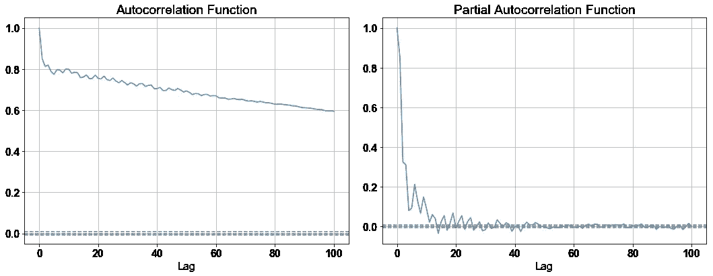
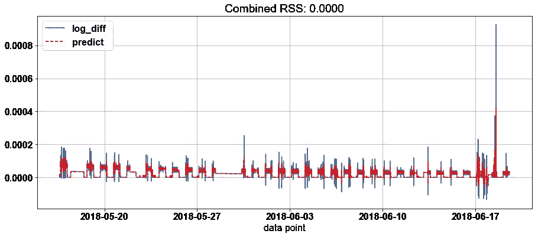
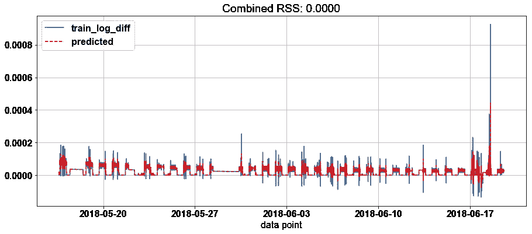
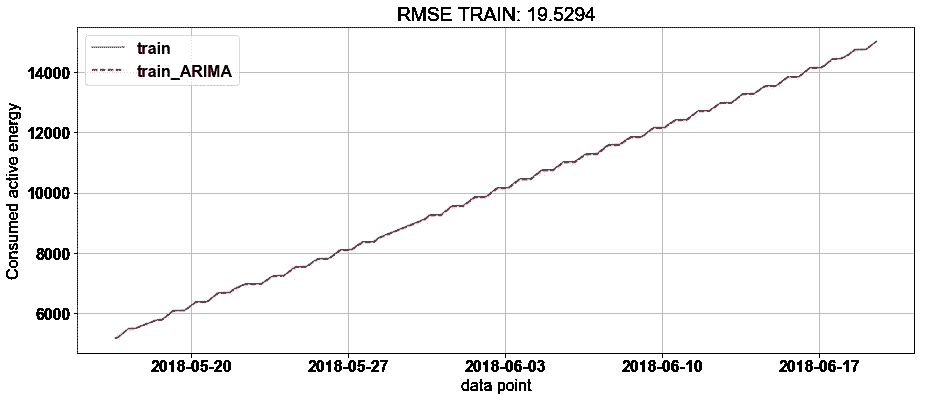
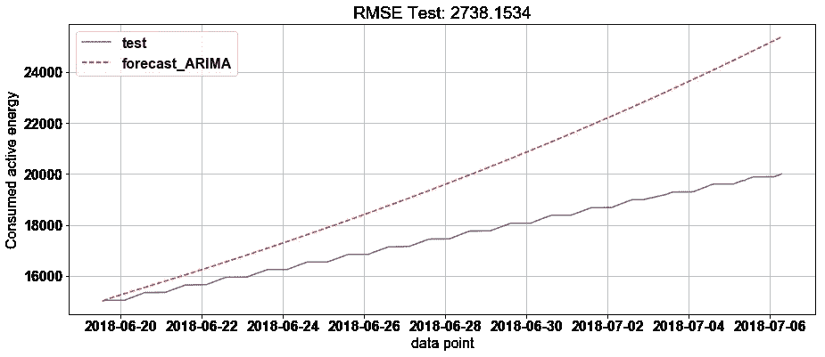
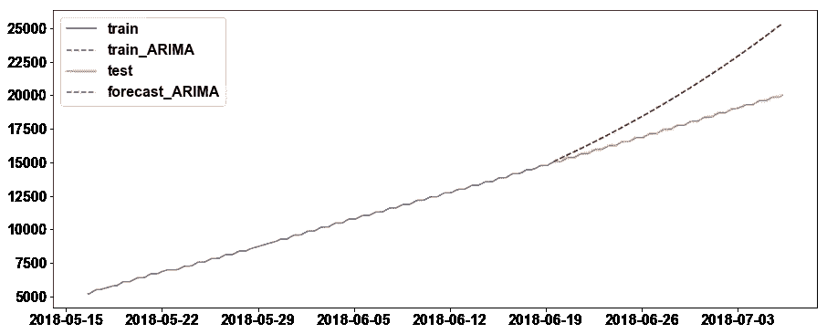
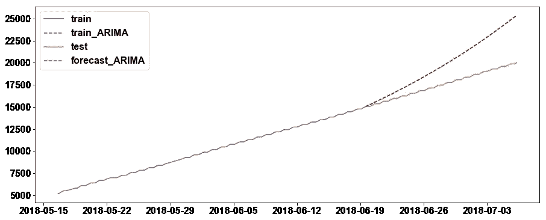

# 能源消费数据的 ARIMA:第二部分

> 原文：<https://medium.com/analytics-vidhya/arima-for-energy-consumption-data-part-ii-ac779b40586e?source=collection_archive---------1----------------------->

来自上一篇文章，[https://medium . com/@ chantrapornchai/ARIMA-for-energy-data-I-a7b 466590 af4](/@chantrapornchai/arima-for-energy-data-i-a7b466590af4)。我们分析平稳信号并分解信号。

接下来，让我们考虑如何使用 ARIMA 来创建预测模型。尽量用对数差消除平稳，其中 *ts* 为数据。

```
ts_log = np.log(ts)
ts_log_diff = ts_log — ts_log.shift()
```

我们放弃 NAN 值。

```
ts_log_diff.dropna(inplace=True)
```

读取 CRAC3.out.csv，并绘制 ts_log_diff 的 acf、pacf



图 1

使用 ARIMA，有主要参数(p，d，q)

*   **p** 是自回归项的个数，
*   **d** 是平稳性所需的非季节性差异的数量，以及
*   **q** 是预测方程中滞后预测误差的数量。

通常 d 是 y 的 dth 差，我们用 d=1。p 是 AR(自回归)项的数目。q 是噪声项。p 由 ACF 决定。我们查看值为(尖峰)正值并衰减直至稳定的滞后数。q 由 PACF 决定。尖峰被认为也是衰减的。

([http://people . duke . edu/~ rnau/Notes _ on _ non seasonal _ ARIMA _ models-Robert _ nau . pdf](http://people.duke.edu/~rnau/Notes_on_nonseasonal_ARIMA_models--Robert_Nau.pdf))

在此图中，我们分别考虑 acf 和 pacf 的截止值为 0.8 和 0.2。让我们考虑 p=2，d=1，q=2。

```
ARIMA(train_log, order=(p,d,q))
```

我们从图 2 中的残差图得到 RSS。对于 p=4，d=4，我们得到如图 3 所示。



图 2



图 3

我们计算图 3 (4，1，4)的 RMSE。训练数据的 RMSE = 19.5294(图 4)，测试数据的 RMSE=2738.1534(图 5)。图 6 结合了训练和测试数据。



图 4



图 5



图 6 (p，d，q)=(4，1，4)

如果 p=2，d=1，q=2，对于测试数据，我们得到 RMSE = 54.4374(训练数据)和 RMSE =2729.8434，稍好于(4，1，4)。



图 7: (p，d，q) =(2，1，2)

此处显示了 ARIMA 的代码。

接下来，我们尝试使用 auto-arima 来寻找最佳参数。

[https://medium . com/@ chantrapornchai/energy-consumption-prediction-with-auto-ARIMA-66e 530 a3 f 673](/@chantrapornchai/energy-consumption-prediction-with-auto-arima-66e530a3f673)