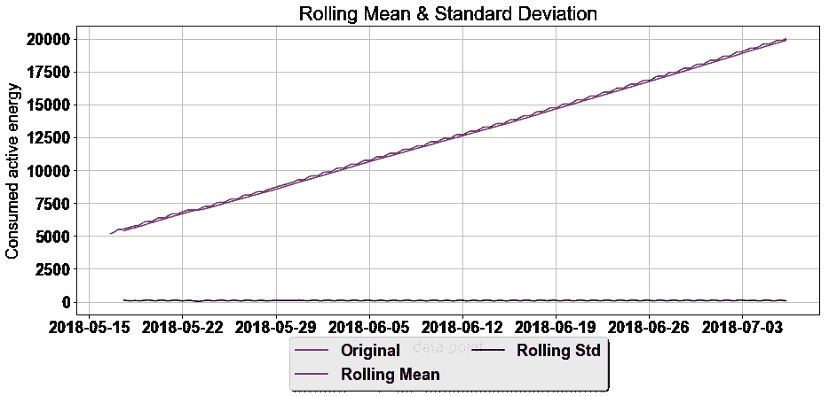
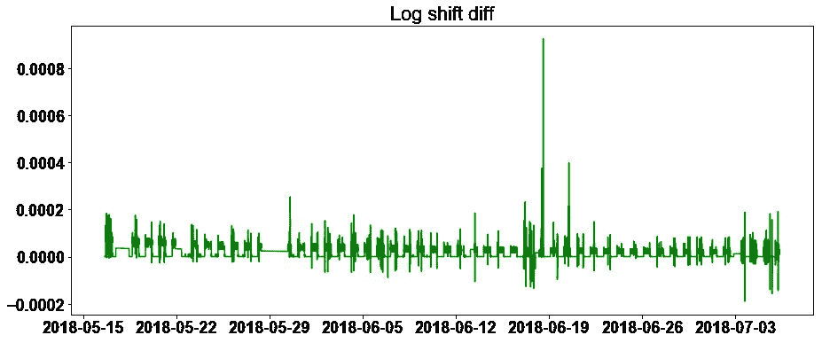
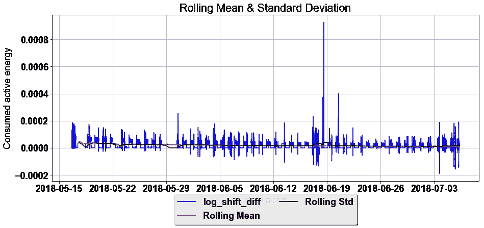
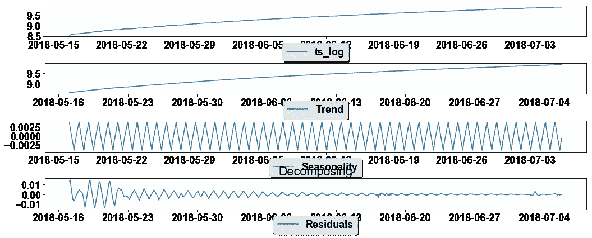

# 能源消费数据的 ARIMA:第一部分

> 原文：<https://medium.com/analytics-vidhya/arima-for-energy-data-i-a7b466590af4?source=collection_archive---------0----------------------->

为了选择预测模型，我们将时间序列分解为系统和非系统的部分([https://machine learning mastery . com/decompose-time-series-data-trend-seasonity/](https://machinelearningmastery.com/decompose-time-series-data-trend-seasonality/))

系统成分是递归的，一致的，我们可以构建模型进行预测。非系统成分是噪声。

通常，信号的分量可以分为:

*   **等级**:系列中的平均值。
*   **趋势**:序列中增加或减少的值。
*   **季节性**:序列中重复的短期周期。
*   **噪声**:系列中的随机变化。

有两种方法来组合这些成分:加法和乘法。加法模型通过以下方式构建整个信号

y(t) =水平+趋势+季节性+噪音

加性模型是线性模型，其中随时间的变化是常数。

对于乘法模型，随时间的变化是二次或指数的。这些变化不是恒定的。整个信号由。

```
y(t) = Level * Trend * Seasonality * Noise
```

在 Python 中，我们可以通过以下方式分解信号:

```
result = seasonal_decompose(series, model='multiplicative')trend = decomposition.trend
seasonal = decomposition.seasonal
residual = decomposition.residual
```

我们用数据集做了简单回归的尝试([https://medium . com/@ chantrapornchai/finding-auto regression-with-energy-data-d752d 367 D1 C5](/@chantrapornchai/finding-autoregression-with-energy-data-d752d367d1c5))。

在这里，我们将尝试用 ARIMA 来拟合模型。ARIMA 是自回归综合移动平均线。有趣的是，该模型受季节性数据的欢迎。我们发现这个关于 ARIMA 的教程非常简洁。但是，我们也尝试从来源中读取:[https://machine learning mastery . com/ARIMA-for-time-series-forecasting-with-python/](https://machinelearningmastery.com/arima-for-time-series-forecasting-with-python/)、[https://machine learning mastery . com/moving-average-smoothing-for-time-series-forecasting-python/](https://machinelearningmastery.com/moving-average-smoothing-for-time-series-forecasting-python/)或[https://www . analyticsvidhya . com/blog/2016/02/time-series-forecasting-codes-python/](https://www.analyticsvidhya.com/blog/2016/02/time-series-forecasting-codes-python/)

由于我们对这些*stat model*非常陌生，我们尝试从教程中了解。ARIMA 包含两个部分:AR 和 MA。AR 是自回归项，MA 是噪声项。要应用 ARIMA，我们需要确保数据是*稳定的。*即它有一个不变的*移动平均线*。找出答案最简单的方法是计算给定区间的移动平均线。或者一个针对平稳的统计测试叫做 *Dickey-Fuller。*

首先，让我们试着在 KU 能源数据(在带标题的 csv 时间序列下)加载来自[http://datascience.ku.ac.th/16-2/](http://datascience.ku.ac.th/16-2/)的消耗电力能源的 CSV 文件。数据具有趋势性和非平稳性。我们使用 *Dickey-Fuller 执行静态测试。*代码从 [analyticsvidhya](https://www.analyticsvidhya.com/blog/2016/02/time-series-forecasting-codes-python/) ，函数 *test_stationary(..)、*使用 *statmodels、*的功能 *adfuller* ，并使用代码 1 第 48 行的测量 AIC。请注意，还有许多其他测量方法，如 BIC。

读取数据后，我们进行静态测试。结果表明，检验统计值远小于临界值(5%)。

计算滚动平均值和 std，我们得到图 1。结果表明，这些数据具有趋势性。然后，我们使用差异来消除趋势。我们显示了对数图，并计算了对数偏移差，以消除如图 2 所示的趋势。

```
Results of Dickey-Fuller Test:
Test Statistic                     0.091927
p-value                            0.965506
#Lags Used                        55.000000
Number of Observations Used    72911.000000
Critical Value (5%)               -2.861580
Critical Value (1%)               -3.430440
Critical Value (10%)              -2.566791
```



图 1



图 2

新图表显示滚动平均值和标准差没有趋势。



图 3

我们计算了 *Dicker-Fuller 检验*，显示检验统计值远小于临界值(5%)。

```
Results of Dickey-Fuller Test:
Test Statistic                -1.054249e+01
p-value                        8.578270e-19
#Lags Used                     6.300000e+01
Number of Observations Used    7.290200e+04
Critical Value (5%)           -2.861580e+00
Critical Value (1%)           -3.430440e+00
Critical Value (10%)          -2.566791e+00
dtype: float64
```



图 4

```
 Results of Dickey-Fuller Test:
Test Statistic                -1.536391e+01
p-value                        3.582070e-28
#Lags Used                     6.200000e+01
Number of Observations Used    7.146400e+04
Critical Value (5%)           -2.861580e+00
Critical Value (1%)           -3.430442e+00
Critical Value (10%)          -2.566792e+00
```

接下来，我们展示如何使用 seasonal_decompose 提取趋势和季节分量，它返回三个分量:
包括 ts_log 在内的三个分量的图如图 4 所示。

让我们测试一下迪基-富勒的残留物。这样好多了。然后，我们可以保存季节性因素来创建 ARIMA 模型。

完整的代码是:

代码 1:分解

上述方法使用*分解*得到三个分量。趋势和季节组件也可用于创建模型。在预测之后，需要基于加法或乘法模型加回到原始信号。

另一种使数据稳定的方法是使用数据点之间的*对数差*。这种方式更容易将信号合成回原始值，我们将在下一篇文章中展示。

[https://medium . com/@ chantrapornchai/ARIMA-for-energy-consumption-data-part-ii-AC 779 b 40586 e](/@chantrapornchai/arima-for-energy-consumption-data-part-ii-ac779b40586e)