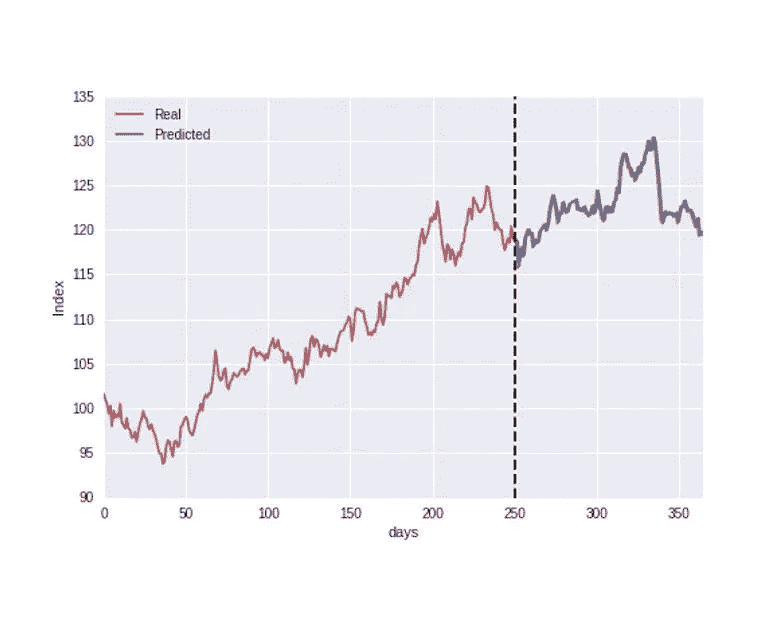
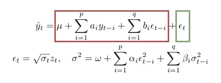

# 用 Python 实现 ARIMA-GARCH 预测

> 原文：<https://medium.com/analytics-vidhya/arima-garch-forecasting-with-python-7a3f797de3ff?source=collection_archive---------2----------------------->

ARIMA 模型是一种流行的预测方法，在金融领域有着广泛的应用。例如，使用过去回报和残差的线性组合，可以尝试预测未来的回报。可悲的是，当回报率的方差随着时间的推移而变化时，这一系列模型就遇到了问题。这种现象经常出现，也称为条件方差，或[波动率聚类](https://en.wikipedia.org/wiki/Volatility_clustering)。幸运的是，还有另一类模型能够模拟这种不规则性:(G)ARCH 模型。因此，这两种类型的模型在实践中结合起来，以优化预测性能。

Python 有很好的分别训练 ARIMA 和 GARCH 模型的包，但没有一个真正将两者结合起来(像 R 的漂亮包[rugarch](https://cran.r-project.org/web/packages/rugarch/rugarch.pdf)——*该死的 R 用户*)。让我们看看如何在 Python 中结合这些模型，同时避免过多的理论。有大量的其他教程来扩展我们在这篇文章中所涉及的内容，必要时我会方便地为您提供链接。我们来深究一下吧！

## Python 中的 ARIMA 建模

Python 有两个用于建模 ARIMA 流程的流行包: [*pmdarima*](https://www.alkaline-ml.com/pmdarima/) 和 [*statsmodels*](https://www.statsmodels.org/stable/generated/statsmodels.tsa.arima_model.ARIMA.html) 包。关于 *pmdarima* 的伟大之处在于，它会为您找到最佳的 ARIMA(p，d，q)参数，而 *statsmodels* 包会强制您手动找到最佳参数。这两个包都提供了大量可以修改的变量，所以它们的文档绝对值得一看。此外，有两个很棒的教程更深入地介绍了 Python 中的 ARIMA:一个 [statsmodels 版本](https://machinelearningmastery.com/arima-for-time-series-forecasting-with-python/)和一个 [pmdarima 版本](/@josemarcialportilla/using-python-and-auto-arima-to-forecast-seasonal-time-series-90877adff03c)。

pmdarima 与 stats 模型

## Python 中的 GARCH 建模

当谈到建模条件方差时， [arch](https://arch.readthedocs.io/en/latest/univariate/introduction.html) 是突出的 Python 包。更深入的教程可以在[这里](https://machinelearningmastery.com/develop-arch-and-garch-models-for-time-series-forecasting-in-python/)找到。请注意，没有像 pmdarima 这样的软件包可以根据给定的标准自动找到最佳参数 p 和 q。

GARCH 模型可以单独用来预测收益吗？是和不是。上面代码片段中的模型假设返回具有恒定的平均值。然而，在现实生活中，这不会完全捕捉偏度和尖峰值。这就是为什么 ARIMA 和 GARCH 模型经常被结合在一起。ARIMA 模型估计条件均值，随后 GARCH 模型估计 ARIMA 估计的残差中存在的条件方差。

## 结合 ARIMA 和 GARCH

那么我们如何结合 ARIMA 和 GARCH 模型呢？让我们简单看看 ARMA-GARCH 模型背后的数学原理:

ARMA-GARCH 模型

这个公式非常简单。通过组合 ARIMA 模型(红色)和 GARCH 模型(绿色)的输出给出最终预测。

让我们看看这在 Python 中是如何工作的！请注意，这次我们将 GARCH 模型拟合在 ARIMA 模型的残差上，而不是收益率上。

这就是全部了！然而，我们在这里的工作方式有一个警告(摘自 [stackoverflow 帖子](https://stats.stackexchange.com/questions/77925/procedure-for-fitting-an-arma-garch-model)):

> 您可以选择先拟合 ARMA 模型，然后在 ARMA 残差上拟合 GARCH 模型，但这不是首选方法。你的 ARMA 估计通常是不一致的。(在只有 AR 项而没有 MA 项的特殊情况下，估计将是一致的，但效率低。)这也会污染 GARCH 估计。因此，最好的方法是同时估计 ARMA 和 GARCH 模型。统计软件能够做到这一点(例如参见 R 的 rugarch 软件包)。

克服这个问题的一个方法是训练许多不同的 ARIMA(p1，d，q1)-GARCH(p2，q2)模型，并基于诸如 [*aic*](https://en.wikipedia.org/wiki/Akaike_information_criterion) 或 [*bic*](https://en.wikipedia.org/wiki/Bayesian_information_criterion) 的标准选择最佳工作的模型。

# 后续步骤

有大量潜在的下一步要探索。例如，我们使用 ARIMA 来模拟收益序列的均值。但是[其他均值模型](https://arch.readthedocs.io/en/latest/univariate/mean.html)存在。这同样适用于方差建模，因为有大量的其他方差模型可供选择！最后，我们在这篇文章中只考虑了单变量的情况。这里有一篇[的精彩帖子](https://freakonometrics.hypotheses.org/tag/arma-garch)如何将 ARIMA-GARCH 应用于一个多元案例(R)。