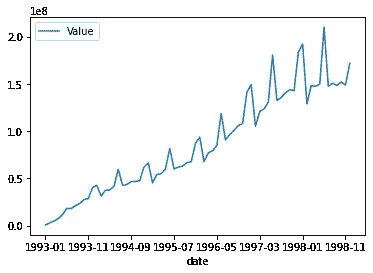
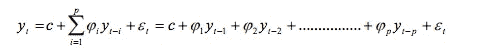
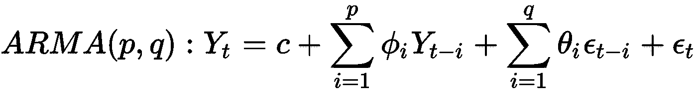
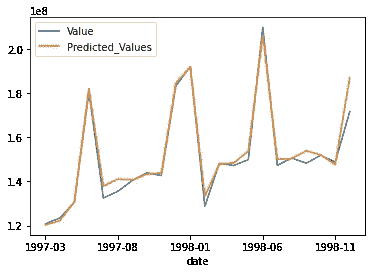

# Python 中从头开始的 ARIMA 模型

> 原文：<https://medium.com/analytics-vidhya/arima-model-from-scratch-in-python-489e961603ce?source=collection_archive---------2----------------------->

在搜索了很多之后，我意识到人们更喜欢直接使用图书馆进行 ARIMA 和预测。为了更好地理解，我决定用 numpy 和 pandas 从头开始写这个东西。如果你也有同感，继续读:)

ARIMA 是一种用于时间序列预测的模型。它有三个主要部分:使数据平稳，AR(自回归)和 MA(移动平均)。我们将从对数据求差开始，然后使用 AR 估计数据，对产生的误差使用 MA，对数据求差并检查结果。

凯西·霍纳在 [Unsplash](https://unsplash.com?utm_source=medium&utm_medium=referral) 上的照片

**以下文章包含的内容:**模型的代码和每个步骤的解释。

[链接获取代码和数据集。](https://github.com/jinit24/ARIMA-Model/)

你可以从上面的链接下载数据集。该数据集包含日常银行交易的详细信息。我们将按月对金额进行分组，并开始分析。

每月交易总额

我们可以清楚地看到，价值(趋势)具有递增性和季节性。从总趋势的增加或减少可以看出年复一年地重复自己。比如每年 5 月到 6 月都有大幅增长。

**第 1 部分:使数据稳定**

为了使数据稳定，存在许多转换。我在这里使用了对数和差分。减去前一个值并没有使它稳定，因为它有季节性趋势。因此，我将数据移动了 12，然后再次减去它。例如，对于 1998 年 6 月，我们将减去 1998 年 5 月的值和 1997 年 6 月的值。你可以尝试不同的组合，以确保你得到想要的结果。我使用 ADF 测试来确保数据是稳定的。

**第二部分:自回归模型**

对于时间 t 的值，我们假设它线性依赖于先前的 p 个滞后值，并且存在与之相关的误差项。

阿肯色州

它类似于线性回归，其中 X 是 p 滞后值，y 是时间 t 时的值。这里可以使用 ACF 和 PACF 图选择顺序 **p** ，或者如果您有足够的数据，只需将其视为超参数。我不会进入选择 p 值的细节。在这里，我将数据集分为 80%–20%的训练和测试数据集。

**第三部分:移动平均线**

现在我们已经生成了系数和截距，我们可以得到我们的预测。实际值和预测值之间的误差差将形成我们的残差。

类似于 p，这里用 q 来表示滞后观测值的数量。同样，也可以认为是线性回归，q 滞后误差为 X，误差为 y。

我们现在把 AR 和 MA 两个模型结合起来得到我们的预测

**第 4 部分:对数据进行去差分**

最终预测

所以，这就对了。如果你发现任何错误，请让我知道。完整的代码，请使用上面的链接。如果你的纯粹主义者不满意，你也可以自己实现线性回归。