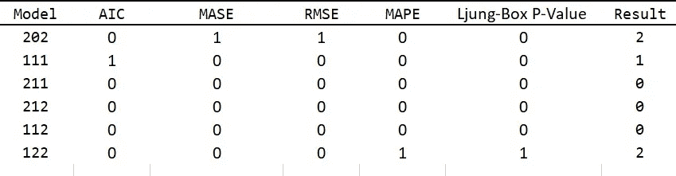
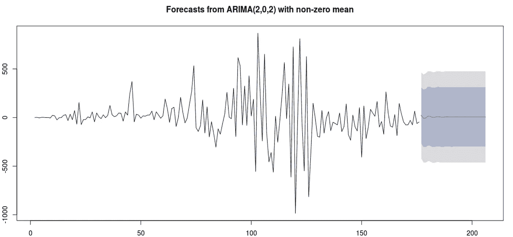

# ARIMA 模型预测沙特阿拉伯新感染病例

> 原文：<https://medium.com/analytics-vidhya/arima-models-to-predict-covid19-new-infected-cases-in-saudi-arabia-262503a53281?source=collection_archive---------36----------------------->

**摘要** —这项工作试图实证检验预测沙特王国 COVID19 感染人数的最佳 ARIMA 模型。每日感染的历史数据用于此目的。

首先，除了诸如 Ljung-BoxPierce Q 统计量和 Dickey-Fuller 检验统计量之外，还通过绘制 ACF / PACF 图来观察数据序列的平稳性。

开始时，发现数据是不稳定的，因为 ADF 的 P 值= 0.97，而 Ljung-BoxPierce 的 P 值远低于 0，这表明数据是不稳定的。

但是在数据系列的第一个差值之后，相同类型的图和统计显示数据是稳定的，ADF P 值= 0.01，Ljung-BoxPierce P 值= 0.10，这比以前的结果更好。

在将观察值分成两组 A)学习数据-B)测试数据之后，通过使用诸如 AIC、梅斯、RMSE、MAPE 的标准选择了最佳 ARIMA 模型。

标准值最适合的模型被认为是最佳模型。

因此，ARIMA (2，0，2)被认为是 AIC 和马斯方面的最佳预测模型。

根据 MAPE 和 P 值的 ARIMA 模型(1，2，2)。然后使用两个模型对数据进行预测，并在研究中预测和报告 2020 年 8 月 26 日至 2020 年 9 月 1 日期间的数值。

**一、研究目标**

沙特阿拉伯每日感染的数据是通过与沙特阿拉伯卫生部 API 建立直接联系而获得的，该 API 提供了关于 COVID19 每日病例的特定信息。

API 提供每日累积的数据，通过添加一列获取每日报告病例的差异并从第二天减去前置日，将数据突变为每日感染:

> mutate (lag = lead(acc_cases，1L))%>%

> mutate (daily = abs(acc_cases-lag))

时间序列分析的一个重要目标是研究可用数据的过去行为，然后借助数值和统计技术拟合合适的模型进行预测。因此，这项研究的具体目标如下:

1.检查所选时间序列数据是否平稳。如果不是，则使用适当的变换将数据转换为静态数据。

2.使用一些选择标准来选择最佳的 ARIMA 模型。然后应用该模型来拟合和预测下一次感染的数量。

3.在本研究中，有两个模型，一个具有较小的 AIC，另一个具有较小的 RMSE (2，0，2 ),而在将预测值与测试数据进行比较后，MAPE 非常高，P 值高于 0.05。虽然第二个模型(1，2，2)的 P 值更接近于 0.05 且 MAPE 更低，这意味着第二个模型比第一个模型的误差更小，但这两个模型都将在研究期间进行测试，并将预测值与记录和观察到的实际值进行比较。

4.最后得出预测每日感染的结论，并回答(根据当前趋势和斜率，感染人数何时将达到 3 位数)的问题。

**二。数据和方法**

使用已建立的卫生部 API 连接，我们收集了 175 天的样本量，首先用图表显示数据，以检查数据序列是否平稳。为此，基于自相关的 Ljung-Box-Pierce q statistic(1978)和 Dickey-Fuller test (DF) (1979)等统计方法用于检查数据的平稳性。

为了选择适合数据的最佳 ARIMA (p，d，q)模型，使用以下标准比较了它们的拟合优度:

Akaike 信息标准(AIC)。

b)平均绝对百分比误差(MAPE)。

c)均方根误差(RMSE)。

d)移动平均标度误差(MASE)。

**三世。讨论**

这项研究的主要结果如下:

1.尽管总体趋势并不平稳，但数据系列曲线的上升趋势是直观的。

2.在对原始数据(data_t)进行第一次 ACF/ PACF 测试后，这些图显示数据不是稳定的。但是观察到滞后随着时间变得越来越低。

3.Dickey-Fuller 单位根检验统计量和 Ljung-Box-pierce Q 统计量也表明数据序列是非平稳的。

ADF 测试 p 值= 0.9753

L-Box 测试 p 值< 2.2e-16

在获得数据的第一个差值后，进行另一个测试以查看是否已经调整了平稳性。ACF/PACF 测试表明，第一个差异足以抑制滞后。

对处理后的数据(data_s)进行另一次 ADF 和 L-Box 检验

ADF 测试 p 值= 0.01

L-Box 检验 p 值= 0.009502

测试所选的型号如下:

(2，0，2)、(1，1，1)、(2，1，1)、(2，1，2)、(1，1，2)和(1，2，2)

针对测试数据集的实际数据对每个 ARIMA 模型进行测试，测试数据集是从第 169 天到数据集长度的最后 7 天。

每个 ARIMA 模型的 AIC、梅斯、RMSE、MAPE 和永盒的 P 值记录如下:

并进行测试，以检查哪个模型符合大多数标准

在排除了不适合的模型后，我们最终得到了两个模型，用于进一步测试剩余时间的预测。

1.ARIMA 模型(2，0，2)

模型的 AIC 值仅次于(1，1，1)。梅斯和 RMSE 比其他型号少。

2.ARIMA 模型(1，2，2)

虽然模型没有最低的 AIC。它的预测值与最低 MAPE 的实际值最接近，所以我们决定选择这个模型做进一步的测试。

如下表所示，在其他模型中(1，2，2)具有最低的绝对误差

这两个模型从 2020 年 8 月 26 日到 2020 年 9 月 1 日一直在接受测试，结果将每天记录，以查看哪个模型预测的感染人数误差最小。

这是从 8 月 26 日到 2020 年 9 月 1 日的预测和实际天数的误差百分比。

预测感染、实际报告和错误

以下是每个模型相对于实际报告案例的最终结果:

决赛成绩

尽管模型(1，2，2)比(2，0，2)具有相对更高的 AIC，但在这种情况下，MAPE 是更合适的度量，因此模型(1，2，2)比其他两个模型表现得更好。

另一个模型显示了比(1，2，2)更低的 AIC 和包含残差的能力。

模型(2，1，2)

模型(1，2，2)

这是根据最后两个模型对下周的预测:

下周天气预报

注:该研究试图仅涵盖病例的定量部分，因为有许多变量可能导致感染的增加或减少。