# Python 中基于数组的序列

> 原文：<https://medium.com/analytics-vidhya/array-based-sequences-in-python-a62c4c3a6a06?source=collection_archive---------11----------------------->

数组是大多数编程语言中可用的基本数据结构，它在不同的算法中有广泛的用途。还有更多低级概念，它们在 python 中被用来实现内置数据结构，如**列表、元组**和**字符串。**

让我们更深入地研究内置列表、元组和字符串类的内部表示。

现在让我们深入研究 python 中这些数据结构的内部表示。关注这些类的内部实现似乎违背了面向对象编程的原则。对于一个优秀的程序员来说，正确理解一个类的外部语义是必要的。虽然列表、字符串和元组的基本用法可能看起来很简单，但是关于与这些类相关联的行为有几个重要的微妙之处(例如制作序列的副本或获取序列的一部分意味着什么)。对行为的误解很容易导致程序中无意的错误。因此，在本文中，我们将为每一类建立一个准确的心智模型。

要详细了解这种数据结构，我们首先需要了解底层的数组。计算机的主存储器由信息位组成，并且这些位通常被分组为更大的单元，这取决于精确的系统架构。这样一个典型的单位就是一个字节，相当于 8 位。

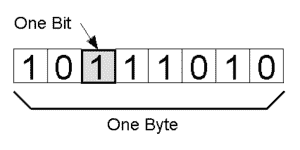

8 位= 1 字节

计算机系统将具有大量的字节和存储器，并且为了跟踪存储了什么信息以及计算机使用什么字节，抽象地称为存储器地址，并且实际上存储器的每个字节都与用作其地址的唯一数字相关联。

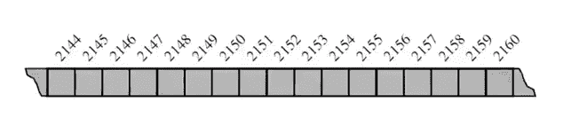

这通常是我们表示低级计算机内存的方式。它是具有连续地址的单个字节。因此，尽管编号系统循环具有顺序性，但计算机硬件在理论上是这样设计的，即主存储器的任何字节都可以根据它的存储地址有效地存取。在这种意义上，我们可以说计算机的主存储器起着随机存取存储器的作用。因此，内存的每个字节都可以按顺序一次性 O(1)存储或检索。

通常，编程语言跟踪标识符和存储相关值的存储器地址之间的关联。文本字符串“SAMPLE”存储为单个字符的有序序列，这里需要注意的是，Python 在内部用 16 位或两个字节来表示每个 Unicode 字符。如果我们真的把它画出来，它看起来像下面这样。

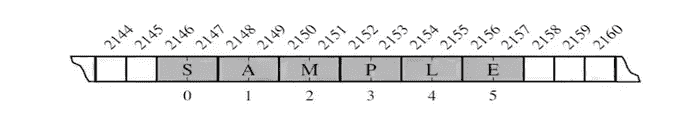

数组的每个单元使用相同数量的字节。允许在恒定时间内访问任何单元。适当的存储器地址位置可以通过下式计算

**开始+(单元格大小)*(索引)**

在更高层次的抽象中，我们简单地把数组看作是按如下顺序存储的相同数据类型的序列

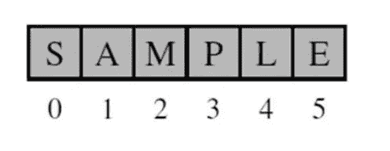

此外，阵列也有以下缺点

*   要存储在数组中的元素数量应该事先知道。
*   数组是静态结构(这意味着数组的大小是固定的)。一旦声明，数组的大小就不能修改。分配给它的内存不能增加或减少。
*   在一个数组中插入和删除是非常困难的，因为元素存储在连续的存储单元中，并且移位操作代价很高。
*   分配比需求更多的内存会导致内存空间的浪费，分配更少的内存也会导致问题。

为了克服这个问题，python 使用引用数组来存储组织中所有雇员的姓名和他们的 id，每个雇员自然有不同的长度，因此 Python 使用对象引用数组的内部存储机制来表示列表或元组实例，这就是**引用数组。**

为了在一个数组中存储所有的雇员姓名，我们要做的是初始化一个数组，但是我们将引用每个单元格中雇员姓名的对象，而不是数组中的值或字符，如下图所示。

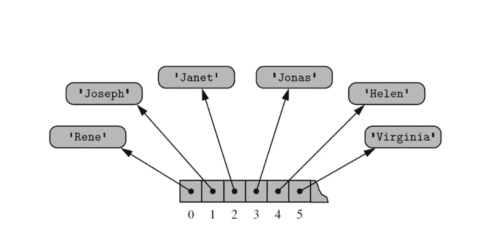

一个实例可能有多个对同一个对象的引用，作为列表中的元素，一个对象可能是两个或更多列表的元素，非常令人困惑，让我们看看下图

素数= [2，3，5，7，11，13，17，19]

temp = primes[3:6] #深层拷贝

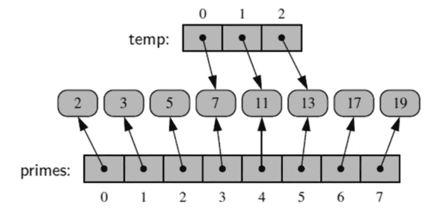

temp =素数[3:6]

现在让我们把深层拷贝和浅层拷贝放在一边，把注意力集中在下面的事情上:1)一个单独的实例可能有对同一个对象的多个引用作为列表中的元素。

2)单个对象可以是两个或多个的元素。

考虑素数列表中的元素 7(即素数[3])，元素 7 既有来自素数[3]的引用，也有来自临时[0]的引用。

现在我们来谈谈深层拷贝和浅层拷贝。

在抽象层次上，浅拷贝意味着两个列表都引用相同的值，而深拷贝意味着两个列表都有自己独立的值和不同的内存分配，如下所示。

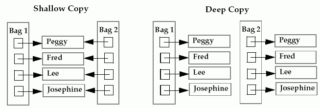

# 列表的浅层副本

Bag1 = ["佩吉"，"弗雷德"，"李"，"约瑟芬"]

Bag2 = Bag1 #这将是一个浅拷贝，如上图所示

# 列表的深层副本

Bag1 = ["佩吉"，"弗雷德"，"李"，"约瑟芬"]

Bag2 = Bag2 **[:]** #通过切片它将创建一个深层副本

这是可以的，但是如果它是深度拷贝，那么当我们切片它时，为什么它在深度拷贝中创建一个新的引用，如上面的 Bag2？

在深度拷贝 python 内部实现中，新列表引用了原始列表中的相同元素，但是当我们重新分配深度拷贝列表时，考虑到如果我们改变，元素是可变的

温度[2] = 15

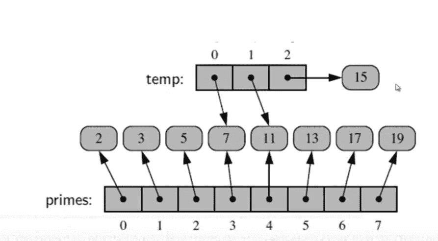

它将创建一个新的引用对象 15，而不会像在浅层复制中那样改变旧的引用对象

让我们看看更多的例子

计数器= [0]*8

在上面列出的计数器中，所有八个单元格引用同一个对象

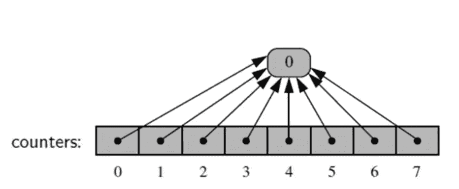

如果我们改变 counters 元素中的任何值，它不会改变它所引用的元素，而是会创建一个新元素，并改变它对新元素的引用，如下所示

计数器[2]+=1

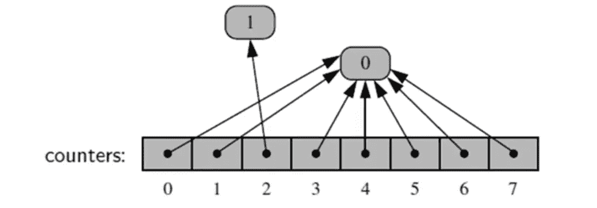

如果你在抽象层次上对一个列表执行扩展操作，它显示元素被附加到旧列表中，它只是引用新列表，如下所示

extras = [23，29，31]

素数.扩展(额外)

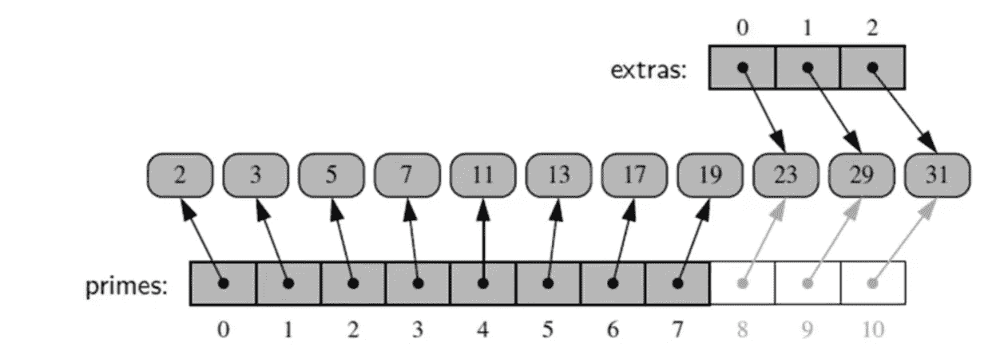

# **动态数组:**

当我们使用 python 列表时，我们不需要指定列表的大小，因为在 array 中我们可以不断地添加列表。列表是怎么做到的？

列表实例的容量通常大于当前长度。如果元素不断被追加，最终这些额外的空间会耗尽。下面通过创建我们自己的动态数组来演示列表中的动态数组是如何工作的。

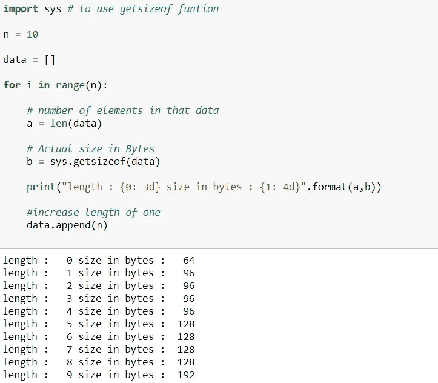

因此，您会注意到，我们开始的全长为 0，字节大小为 64 字节。有趣的是，当我们将长度增加到 1 时，字节数增加到 96。但是你会注意到，当我们把长度一直增加到 4 时，字节的大小实际上并没有改变，所以 Python 实际上设置了比它在列表中保存当前元素所需的字节数更大的字节数。同时向数组追加新元素。为了更好地理解这一点，我们将放入一个更大的末端。

在下一篇博客中，我们将会看到更多关于动态数组是如何在 python 中实现的细节。

如果你有任何反馈或批评，请随时与我分享。如果本演练对您有所帮助，请喜欢👏文章。干杯！🍻