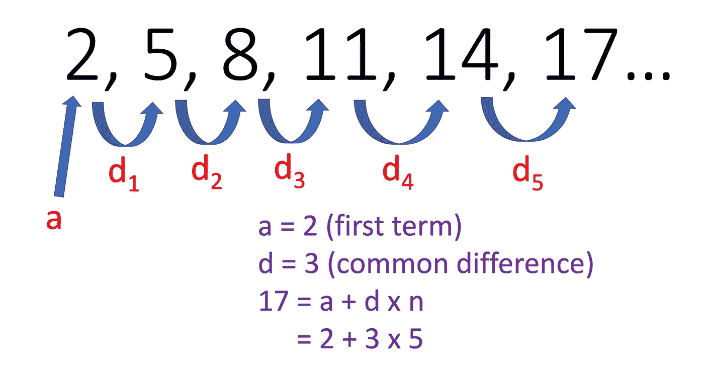

# 数组索引:从 0 开始还是从 1 开始？

> 原文：<https://medium.com/analytics-vidhya/array-indexing-0-based-or-1-based-dd89d631d11c?source=collection_archive---------4----------------------->


萨法尔·萨法罗夫在 [Unsplash](https://unsplash.com/s/photos/code?utm_source=unsplash&utm_medium=referral&utm_content=creditCopyText) 上拍摄的照片

从零开始的数组索引是对数组中的项进行编号的一种方式，这样数组的第一项的索引为 0，而从一开始的数组索引数组的第一项的索引为 1。在当今的现代数学符号中，从零开始的索引是一种非常常见的顺序编号方式。特别是，在组合数学中，组合数系使用数字 0 来表示集合的空子集。在下面这篇博文中，我将仔细研究这两者，比较它们的优缺点。

在现代计算机科学中，大多数编程语言如 Python、Ruby、PHP、Java 都有从零开始的数组索引。一个很大的原因是，它提供了一个清晰的区别，即序数形式(如第一，第二，第三)有一个既定的意义，即函数的零阶导数，实际上是函数本身(因为你微分 0 次！)，在一阶导数之前，一阶导数在二阶导数之前，依此类推。这是因为当我们描述属于前面序列的元素时，我们使用序数。众所周知，整数是编程中最基本的类型之一，因为零是存在的最小无符号整数值，所以我们经常会发现零被用作数学序列中多种数值递归的基本情况。此外，一些语言，如 C 和 C++使用指针来存储数据，因此索引从零开始也是有意义的，因为默认情况下，程序计数器首先将内存地址保存为 0，从而使编译更容易。在这些情况下，使用从零开始的数组索引会更合适，因为它基于我们经常使用数组的数值方法。

相比之下，对于计算机科学和编程的新用户来说，人们从小就被教导自然数序列是 1、2、3 等。因此，对于一个完全的初学者来说，从 1 开始进行数组索引是有意义的。在数学课上，大多数高中生可能是从 1 开始的序列和数列索引，其中序列的第一个数字的位置是 n，其中 n 是大于零的正整数。从物理上来说，索引为 0 更有意义，因为你不能有第 0 项，因为一个项目通常必须有一个正整数的索引。大多数人都被教导计算一个以 1 为基数的指数等差数列的第 n 项为`a+(n-1)*d`，所以他们已经非常熟悉这个数学现象了。然而，基于零的索引允许在运行时更有效的`a+n*d`。

```
a = first term
n = the index
d = common difference
```

在以下情况下，基于 0 的索引可能更有用。

```
sequence = [2,5,8,11,14,17,20,23,26,29,32,35]
```

这里，如果序列的第一项的索引为 0，这意味着我们可以使用`a+n*d`计算序列的第 n 项。因此可以使用`a+n*d = 2+5*3=17`找到索引为 5 的项目。



虽然我们可以使用 Python 等基于 0 的索引语言来确认这是否正确，但还是让我们使用 Julia 中一个名为 [OffsetArrays.jl](https://github.com/JuliaArrays/OffsetArrays.jl) 的包。它允许 Julia 用户使用他们自己选择的任意索引的数组，类似于其他语言中可用的数组，例如 Fortran。这基本上意味着我们可以创建一个数组，并定义数组中任意项的索引。我们可能使用它的一个原因是，如果我们从 Python(基于 0 的索引)转移，那么对于像我们这样的用户来说，进行基于 0 的索引会更有意义，也更直观。

在下面的例子中，我从 0 开始索引数组中的项，以创建一个从零开始的数组。

```
using OffsetArrays
sequence = OffsetVector([2,5,8,11,14,17,20,23,26,29,32,35], 0:11)
```

如果我们将第五项输入 REPL，我们会得到:

```
julia> println(sequence[5])
17
```

如您所见，基于 0 的数组索引要容易得多，因为您可以更容易地计算第 n 项，而不必在乘以公差带之前从 n 中减去 1。这正是基于 0 的索引可能派上用场的一个场景。

现在，假设我们有 50 件物品，这些物品被分成 10 块，每块 5 个。使用方程式`a + n*d`；其中 d = 5(固定块大小)，第 n 项是 a `5n + a`。这里，`n`是大数组中方块的索引，范围从 0 到 9，一旦找到了方块`n`，就需要找到物品。这就是`a`的用武之地，范围从 0 到 4: `a`成为你在块(编号从 0 到 9)中寻找的项目(0 到 4)的索引。

Python 中的以下数组显示了这方面的一个示例:

```
myarray = [
[0,1,2,3,4],
[5,6,7,8,9],
[10,11,12,13,14],
[15,16,17,18,19],
[20,21,22,23,24],
[25,26,27,28,29],
[30,31,32,33,34],
[35,36,37,38,39],
[40,41,42,43,44],
[45,46,47,48,49]
]
```

例如，如果我想找到第 6 行第 3 项的值，我可以简单地使用公式`5n+a`来计算。由于 Python 是从 0 开始索引的，`n=5`和`a=2`，所以值只是简单的`5*5+2 = 27`。我们可以在 REPL 证实这一点，看看我们是否正确:

```
In[2]: myarray[5][2]
Out[2]: 27
```

然而，如果我们在 Julia 中这样做，我们不能直接使用公式`5n+a`。因为是基于 1 的索引编程语言，所以我们会有`n=6`和`a=3`。如果我们这样做了，我们的值将变成`5*6+3 = 33`。让我们与 REPL 核对一下:

```
julia> myarray[6][3]
27
```

就像您可能预测的那样，它也给出了`27`，因为实际上值根本没有改变。因为它仍然没有满足我们得到值 27 的目标。我们必须从`n`和`a`值中减去`1`，因为 Julia 是基于 1 的索引，所以公式改为`5(n-1)+(a-1)`。因此，我们可以得出结论，在这种情况下，我们使用基于 0 的数组索引会更有用，因为如果我们使用基于 1 的数组索引，公式`5(n-1)+(a-1)`会使人们更难遵循，需要更长的运行时间，并使程序效率更低(如果我们要大规模执行)。

然而，由于 Julia 天生是一种基于 1 的数组索引编程语言，如果我们要在下面的示例中找到该数组的第五个元素，基于 1 的数组索引会更有帮助，因为它会返回该数组中的第五个项目，在本例中为“grape”。

```
fruit = ["apple", "banana", "lemon", "peach", "grape", "orange", "lychee"]
```

REPL 的输出:

```
julia> println(fruit[5])
grape
```

所以，你可能会问“哪个更好？基于 0 的索引还是基于 1 的？”。从我们之前看到的情况来看，在计算机科学和组合学中使用基于 0 的索引非常有用，对 c 等语言的编译也很有帮助。但是，如果我们谈论的是 Julia，那么它使用基于 1 的索引更有意义，因为它在科学和数学研究领域更受欢迎。此外，它为初学者提供了一个更容易的入口，因为它对那些从一开始计数的人来说非常直观！我相信很高兴看到 Julia 为那些想在 Julia 中使用基于 0 的索引的人提供了一个选择，但是，它确实需要更多的步骤和一些设置来适应。

## **感谢您的阅读！**

# 参考

【https://github.com/JuliaArrays/OffsetArrays.jl
[https://developer sider . co/why-the-indexing-of-array-start-with-zero-in-c/](https://developerinsider.co/why-does-the-indexing-of-array-start-with-zero-in-c/)
[https://en.wikipedia.org/wiki/Zero-based_numbering](https://en.wikipedia.org/wiki/Zero-based_numbering)