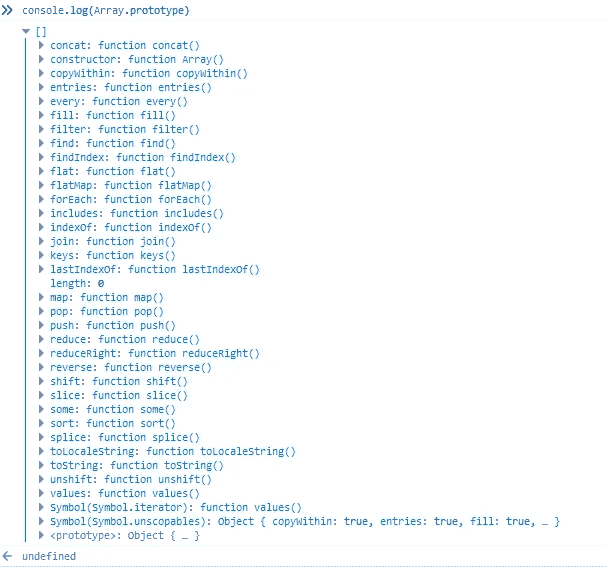

# 数组也是对象

> 原文：<https://medium.com/analytics-vidhya/arrays-are-objects-too-2df9fe4cad19?source=collection_archive---------31----------------------->

*构建我们自己阵列的实验*

照片由[法里斯·默罕默德](https://unsplash.com/@pkmfaris?utm_source=medium&utm_medium=referral)在 [Unsplash](https://unsplash.com?utm_source=medium&utm_medium=referral) 上拍摄

曾经在您的浏览器控制台中调试并记录阵列的原型吗？

哇，没想到会这样，是吧？好吧，也许你有。我最近一直在研究 React 替代品，而且…