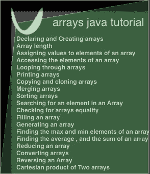

# Java 中的数组:教程

> 原文：<https://medium.com/analytics-vidhya/arrays-in-java-a-tutorial-77baf5e11747?source=collection_archive---------25----------------------->

本教程是关于 java 中的数组的。它将展示如何声明和创建数组，如何赋值和访问数组元素，如何循环和打印数组元素。

它还将显示:

*   如何复制、克隆和合并阵列
*   如何排序、搜索和检查数组的相等性。
*   如何填充一个数组，生成一个数组，减少一个数组:找到最大，最小或平均…
*   如何将数组转换为流或集合，如何反转数组，以及如何计算两个数组的笛卡尔积。



# 1-声明和创建数组

数组类型的变量可以通过使用`Type[] nameOfVariable`或`Type nameOfVariable[]`来声明。在第一种情况下，`Type[]`之后的所有变量都是数组类型。在第二种情况下，只有带方括号的变量是数组类型。`Type`和`[]`之间可以有空格。

```
int[] iArrayOne , iArrayTwo ;
/* 
iArrayOne and iArrayTwo are variables 
  of type int[] , since the square brackets
  are placed after the int type .*/

String sArray[] , aString ;
/* 
sArray is a variable of type
  String[] , since the square 
  brackets is placed after sArray.
aString is a variable of type
  String .*/
```

数组类型的变量可以被**赋值**为数组类型的引用。如果没有数组引用分配给数组类型的变量，则分配给数组类型的变量的值为 null。

```
int iArray[];
/*
iArray is a variable of type 
  int[] .
No array reference was assigned
  to iArray , as such it is 
  assigned the null value .*/
```

为了**创建**一个数组，符号:

*   `{expression , expression ...}`。
*   `new Type[length]`。
*   `new Type[]{expression , expression ...}`

可以使用。

**符号** `{expression , expression ...}`只能在声明数组时使用，其他符号可以在任何地方使用。

```
jshell> 

> String[] sArrayOne;
/*
Declare the sArrayOne variable , to
  be an array of type 
  String . 
The sArrayOne variable is not 
  initialized with any value
  that holds a reference to 
  an array of type String[]
  ,as such it has a null
  value .*/
sArrayOne ==> null

> int[] iArrayOne , iArrayTwo = { 1, 2, 3+5 }
/*
Declare iArrayOne and iArrayTwo to 
be variables of type int[] . 
iArrayOne is not initialized , to 
  any value which holds a reference 
  to an array of type int[] . As 
  such it has a null value . 
iArrayTwo is initialized using 
  { 1, 2, 3+5 } . 
  An array of type int[] is created . 
    Its length is equal to the number of 
      elements inside { 1, 2, 3+5 } . 
    The expressions in { 1, 2, 3+5 }
      are evaluated and are assigned 
      to the first , second and third 
      element of the newly created array . 
  A reference of the newly created array , 
    is stored inside iArrayTwo .*/
iArrayOne ==> null
iArrayTwo ==> [ 1, 2, 8 ]

> Object[] oArrayOne , oArrayTwo = {new Object()};
/*
oArrayOne is a variable , of type 
  Object[]. It is not initialized ,
  to hold a reference to an array 
  of type Object[] , as such it 
  is assigned a null value . 
oArrayTwo is a variable of type 
  Object[]. It is initialized using 
    {new Object()}. 
  An array of type Object is created , 
    it has a length of 1 . The expression 
    new Object is evaluated , it creates
    a new instance of Object . A reference 
    of  the newly created object is stored 
    inside the first element of the newly 
    created array . 
  A reference of the newly created array
    is stored inside oArrayTo .*/
oArrayOne ==> null
oArrayTwo ==> [ java.lang.Object@59f99ea ]

> oArrayOne = {new Object()}
/* 
It is illegal to use 
  {expression , expression ..}
  anywhere beside in array 
  declaration .*/
|  Error:
|  illegal start of expression
|  oArrayOne = {new Object()}

> oArrayOne = oArrayTwo
/*
Assign the value of the variable 
  oArrayTwo to oArrayOne .*/
oArrayOne ==> [ java.lang.Object@59f99ea ]
```

当使用**符号** `new Type[length_expression]`时，创建一个指定长度和类型的数组，其所有元素为空，除非数组是原始类型，在这种情况下元素被初始化为默认值。例如`int`的默认值是`0`。

长度表达式必须计算为类型`int`，并且必须是`>=0`。因此，可以创建的数组的最大长度是`2147483647`。

```
jshell> 

> import java.util.Arrays;
/* 
import the Arrays utility 
  class .*/

> String []sArray;
/* 
Declare a variable of type 
  String [] .
It is not initialized ,
  as such its value is 
  null .*/
sArray ==> null

> sArray = new String[3];
/* 
Create an array of type String[]
  which has three elements 
  initialized to null . 
A reference of this array is 
  stored inside the variable 
  sArray .*/
sArray ==> [ null, null, null ]

> int k = 1 ; 
> int j = 3 ; 
> int iArray[] = new int[k*j];
/* 
Declare the iArray variable
  to be an array of type 
  int .
Evaluate the expression 
  k*j , its value is 3 .  
Create a new array of 
  length three , of type 
  int , with all of its 
  elements having a value 
  of 0\. 
Assign a reference of
  the newly created array 
  to the variable iArray .*/
iArray ==> [ 0, 0, 0 ]

> char cArray[] = new char[2];
/* 
Declare cArray to be a variable
  of type char[]. 
Create a char array of length 
  two , with all of its elements 
  initialized to their default
  values . 
Assign a reference of the newly 
  created array to the
  variable cArray .*/
cArray ==> [ '\000', '\000' ]

> Arrays.toString(new int[5])
/*
Create a new array of type int ,
  which has a length of 5 . 
Pass a reference to it , 
  to Arrays toString method . 
Arrays.toString method will print 
  the elements contained in this 
  array .*/
[0, 0, 0, 0, 0]
```

当使用**符号** `new Type[]{expression , expression ...}`时，创建一个给定类型和长度为`{expression , expression ...}`的数组。

计算表达式。如果数组类型是基本的，表达式的值存储在数组中。如果数组类型是引用类型，则存储对计算值的引用。

```
jshell> 

> import java.util.Arrays;
/* 
import the Arrays utility 
  class .*/

> Arrays.toString(new int[]{ 1, 2, 3 })
/*
Create an anonymous array , 
  of type int .
Its elements are initialized to 
  the three elements 1 , 2 and 3 .
Use the Arrays.toString method 
  to print the value of each
  element in the newly created 
  array .*/
[ 1, 2, 3 ]

> int[] iArrayOne = new int[]{}
/*
Declare iArrayOne to be a variable 
  of type int [] . 
Create an new array of type
  int , containing no elements .
Assign a reference to the
  newly created array to 
  iArrayOne .*/
iArrayOne ==> []
```

类型为**的变量可以通过在变量声明中添加括号来创建多维**数组，每个额外的括号对应一个额外的维度。

```
jshell>

> int[][] iArrayOne , iArratTwo;
/*
Create two variables of the type :
  int [][] . 
int[][] is an an array , which 
  elements references arrays 
  of the type int [] .*/
iArrayOne ==> null
iArratTwo ==> null

> int iArrayOne[][] , iArratTwo;
/*
Declare a variable of the type :
  int [][] , and a variable of 
  the type int .*/
iArrayOne ==> null
iArratTwo ==> 0
```

为了**创建**一个多维数组，我们也可以使用前面描述的方法。

```
jshell>

/* 
Creating arrays using the notation
  {expression , expression ...} */

> int[][] iArray = { { 1, 2 } , { 1, 2, 3, 4 } };
iArray ==> [ [ 1, 2 ] , [ 1, 2, 3, 4 ] ] 
/*
Create a multi dimensional array of length
  2 and of type int [][]. 
Each element of this multidimensional array 
  references an array of type int []. 
The first element reference an array of 
  type int [] which has a length of 2 , 
  and which contains the elements 1 
  and 2 . 
The second element also reference an array 
  of type int[] which has a length of 
  4 ,  and contains the elements 1 2 3 
  and 4 .
Store a reference of the array of 
  type int [][] into the variable 
  iArray .*/

/*
Creating arrays using the notation 
  new Type[length] .*/> String sArray[][];
/*
Declare a variable of type String[][] .*/

> sArray = new String[2][2]
/*
Create an array of type String[][]
  and of length two .
It contain references to arrays of 
  type String[] .
The first element reference an array
  of type String[] , of length two , 
  which elements contains references to
  null . 
The second element reference an array 
  of type String[] , of length two , 
  which elements contains references to 
  null . 
Assign a reference to the array of type 
  String[][] to the variable sArray .*/
sArray ==> [ [ null, null ],[ null, null ] ]

> sArray = new String[3][]
/*
Create an array of length 3 , 
  which elements hold references
  to arrays of type String[] .*/
sArray ==> [ null , null , null ]

> sArray[0] = new String[]{ "hello", "arrays" };
/*
Each element of sArray , can be assigned
  an array of type String[]
Create a new array of type String[] , 
  which elements reference the two
  String "hello" and "arrays".
Store a reference to this array in
  sArray[0] .*/

> sArray
sArray ==> [ [ "hello", "arrays" ], null, null ]

/*
Creating arrays using the notation 
  new Type[]{expression , expression ...} .*/

> sArray = new String[][]{ { "hey", "java" }, { "chrome", "help" , "space" } }
sArray ==> [ [ "hey", "java" ], [ "chrome", "help", "space" ] ]
```

# 双数组长度

使用`.length`属性可以**获得**数组长度。

**访问具有**一维**的数组的数组长度的示例**。

```
jshell>

> int []iArrayOne = {} , iArrayTwo = { 1, 2 } , iArrayThree;
/*
Declare three variables of type int[].
iArrayOne contains a reference 
  to an array which contains 
  no elements. 
iArrayTwo contains a reference 
  to an array which contains 
  2 elements. 
iArrayThree contains a reference 
  to null .*/
iArrayOne ==> []
iArrayTwo ==> [ 1, 2 ]
iArrayThree ==> null

> iArrayOne.length
/*
iArrayOne reference an array 
  which contains no elements
  , the length of the array 
  is 0 .*/
0

> iArrayTwo.length
/*
iArrayTwo reference an array
  which contains two elements , 
  as such its length is 2 .*/
2

> iArrathree.length
/*
iArrayThree does not reference
  any array . It contains a
  reference to a null value , as 
  such it cannot access the 
  length property .*/
|  Exception java.lang.NullPointerException
|        at (#26:1)
```

**示例**访问具有**多维度**的数组的数组长度。

```
jshell>

> int[][] iArrayOne = new int[2][] , iArrayTwo  , iArrayThree = { { 1, 2, 3 }, { } } ;
/*
Create three variables of type 
  int [][] .
The first variable references an 
  array of length 2 , which elements 
  references array of type int [] .
The second variable is of type int[][] ,
  but does not reference any array of 
  type int [][] , as such it 
  references a null value.
The third variable references an 
  array of length 2 , which elements
  references an array of type 
  int [] .*/
iArrayOne ==> [ null, null ]
iArrayTwo ==> null
iArrayThree ==> [ [ 1, 2, 3 ], [ ] ]

> iArrayOne.length;
/*
The length of the array which 
  elements contain references
  to arrays of type int[]
  is : */
2

> iArrayOne[0].length;
/* 
The first element of the array
  referenced by iArrayOne does 
  not reference any array
  of type int[] , as such it 
  references a null value . 
Trying to access the length property
  of null will result in 
  NullPointerException .*/
 Exception java.lang.NullPointerException
|        at (#5:1)

> iArrayTwo.length;
/*
iArrayTwo references a null value , 
  so trying to access the length 
  property of a null value results 
  in a null pointer exception. */
|  Exception java.lang.NullPointerException
|        at (#4:1)

> iArrayThree[1].length
/*
Access the first element of 
  int[][] , which is {} an array
  of type int [] .
Access its length property .*/
0
```

# 3-为数组元素赋值

数组由零个或多个元素组成。可以使用**方形符号**为数组的元素赋值，该符号采用一个被求值的表达式。

当数组的元素被赋值时，该值是基于基元或引用类型的赋值规则来赋值的。

如果要分配给的**值是基元类型，那么**基元类型**值被复制并存储在数组中。**

```
jshell>

> int []iArrayOne = new int[1];
/*
iArrayOne is a variable of type int[] .
new int[1] , creates an array 
  of the primitive type int , 
  of length 1 . 
The elements of the newly created 
  array are initialized to the 
  default value 0 . 
A reference to the newly created 
  array is stored inside iArrayOne .*/
iArrayOne ==> [ 0 ]

> iArrayOne[1-1]  = 10 ;
/*
1 - 1 is evaluated to 0 . 
The first element of the 
  array reference by iArrayOne 
  is assigned the value 10 . 
10 is a primitive value , 
  as such it is copied and 
  stored inside the array .*/

> int anInt = 1 ; 
/*
anInt contains the value
  1 .*/

> iArrayOne[0]  = anInt ; 
/*
The value contained in anInt
  is copied to iArrayOne[0] .
anInt contains 1 , as such 
  iArrayOne[0] contains 1 .*/

> iArrayOne
/*
iArrayOne is a variable which
  references an array of type
  int[] , and which contains
  the element 1 .*/
iArrayOne ==> [1]
```

如果要赋值的**值**是引用类型，那么**引用**被复制并存储在数组中。

```
jshell>

> String aString = "hello";
/*
Create a variable of type
  String . 
Assign a reference of 
  the String "hello" to
  aString .*/

> String[] sArray = {aString};
/*
sArray is a variable of type
  String [] . 
it is initialized using 
  {aString} .
A new array of type String[]
  and of length 1 is created . 
  aString is a reference type , 
  as such the value  of aString ,
  which is a reference , is stored 
  inside the first element of 
  sArray . 
A reference of the newly created 
  array is stored inside the 
  variable sArray .
sArray[0] and aString contain the  
  same reference .*/

> sArray[0] = "hey"
/*
"hey" is a string literal , 
  a reference for the String
  "hey" is stored inside 
  sArray[0] . 
sArray[0] and aString do not
  contain the same reference 
  anymore .*/
sArray[0] ==> "hey"

> aString
/*
aString is still referencing the
  String literal "hello"*/
aString ==> "hello"

/*
String are immutable , so their 
  values cannot change .*/

> class WWW{
 String address; 
}
/*
Create the WWW class , with one
  field of type String . */

> WWW aWWW = new WWW();
/*
Create a new instance of WWW , 
  and store a reference to
  it in the variable aWWW . 
aWWW address attribute is initialized , 
  to null. */
aWWW ==> WWW@6ddf90b0

> aWWW.address
aWWW.address ==> null

> WWW wwwArray[] = {aWWW};
/*
wwwArray is a variable of 
  type WWW[] .
A new array is created , 
  of type WWW and of length 
  1 . 
The reference contained in
  the variable aWWW , is copied
  and stored inside aWWW[0].
aWWW[0] and the variable 
  aWWW contain the same reference . 
A reference of the newly created
  array is stored in the 
  wwwArray variable .*/
wwwArray ==> [ WWW@6ddf90b0 ]

> wwwArray[0].address = "[http://difyel.com](http://difyel.com)";
/*
wwwArray[0] address field is 
  assigned the value of 
  "[http://difyel.com](http://difyel.com)" .*/
wwwArray[0].address ==> "[http://difyel.com](http://difyel.com)"

> aWWW.address
/*
aWWW refers to the same object , 
  referenced by wwwArray[0] . As 
  such aWWW.address field has a 
  value of [http://difyel.com](http://difyel.com) .*/
aWWW.address ==> "[http://difyel.com](http://difyel.com)"

> aWWW = new WWW();
/*
A new instance of WWW is 
  created . Its reference is 
  assigned to the variable 
  aWWW .*/
aWWW ==> WWW@369f73a2
/*
aWWW and wwwArray[0] do not refer to 
  the same object . So changing 
  the field value of aWWW , will 
  not affect the field value 
  of wwwArray[0] and the inverse
  is also true .*/

> int[][] iArrayOne = new int[2][];
/*
Declare a variable iArrayOne 
  of the type int[][] . 
Create an array of length 2 , 
  which elements reference an array
  of type int [] .
Assign a reference to the newly created
  array inside the variable 
  iArrayOne .*/
iArrayOne ==> [ null, null ]

> iArrayOne[0] = new int[1] ;
/*
Create an array of type int[]
  of length 1 . 
Store a reference to the newly
  created array to iArrayOne[0] .*/

> iArrayOne[0][0] = 1 
/*
Access the first array of type 
  int[] .
Store inside the first element
  of the array of type int[] ,
  the value 1 .*/
```

# 4-访问数组的元素

数组的元素可以用方括号符号**访问**，它接受一个 int 值`>=0`并且小于数组的长度。

```
jshell>

> int[] iArray = new int[]{ 0, 1, 2 }
/*
iArray is a variable of type int[].
It is assigned a reference to an
  array of length 3 and of type 
  int[] .*/
iArray ==> [ 0, 1, 2 ]

> iArray[0]
/*
Access the first element 
  of the array referenced by 
  iArray[0] .*/
iArray[0] ==> 0

> iArray[0+2]
/*
0+2 is evaluated to 2 .
Access the third element 
  of the array referenced by 
  iArray[2] .*/
iArray[2] ==> 2

> iArray[3]
/*
An ArrayIndexOutOfBoundsException is 
  thrown , when trying to access an element
  with index <0 or >= length of the array .*/
|  Exception java.lang.ArrayIndexOutOfBoundsException: Index 3 out of bounds for length 3
|        at (#3:1)

> iArray[-1]
|  Exception java.lang.ArrayIndexOutOfBoundsException: Index -1 out of bounds for length 3
|        at (#4:1)

> int iArrayTwo[][] = {{}} 
/*
Create an array which references
  an array of type int [] . 
The array of type int[] does not
  contain any elements .
Store a reference of the newly
  created array inside the 
  variable iArrayTwo .*/
iArrayTwo ==> [ [ ] ]

> iArrayTwo[0][0]
/*
Access the first element of
  the array referenced by the
  variable iArrayTwo . 
Access the first element 
  referenced by the array of type
  int [] .
There is no elements found in 
  the array of type int[] , 
  as such an index out of 
  bound exception is thrown .*/
|  Exception java.lang.ArrayIndexOutOfBoundsException: Index 0 out of bounds for length 0
|        at (#5:1)
```

# 5-遍历数组

要遍历一个数组，可以如下使用循环的**。**

```
jshell>

> int iArray[] = {1, 2, 3 }
/*
iArray is a variable of type int[] .
  It holds a reference to an array
  of three elements 1 , 2 and 3 .*/
iArray ==> [ 1, 2, 3 ]

> /* Loop through the array using a for loop */
for( int i = 0 ; i < iArray.length ; i++ )
{
    int elementAtIndexI = iArray[i];
    /*
      do something , for example 
      print the array elements .*/
    System.out.println(elementAtIndexI);
}
1
2
3

> int iArrayTwo[][] = { { 1, 2 }, { 3, 4 } }
/*
iArrayTwo is a variable of type 
  int[][] . It hold a reference to 
  an array of type int[][]. 
The array of type int[][] has a 
  length of two , and contains 
  references to two arrays of 
  type int[] .
The arrays of type int[] , each 
  contain two int elements .*/
iArrayTwo ==> [ [ 1, 2 ], [ 3, 4 ] ]

> /* For each additional dimension , 
  an additional for loop must 
  be added .*/
for( int i = 0 ; i < iArrayTwo.length ; i++ )
{
    for( int j = 0 ; j < iArrayTwo[i].length ; j++ )
    {
        int elementAtIndexIJ = iArrayTwo[i][j];
        /*
            Do something , for example 
            print the array elements .*/
        System.out.println(elementAtIndexIJ);  
    }
}
1
2
3
4
```

每个循环的**也可用于循环遍历一个数组。for 和 for each 循环的区别在于，在 for each 循环中，不需要声明用于循环数组的索引，但同时这意味着不能访问索引。**

for 和 for each 循环可以混合使用。

```
jshell>

> String sArray[] = { "Hello", "Search" }
/*
sArray is a variable of type
  String [] .
It holds a reference to an array 
  of type String [] .
The array of type String []
  holds two references for 
  Strings .*/
sArray ==> [ "Hello", "Search" ]

> /* Loop through an array using a for each loop */
for( String element : sArray )
{
    /*
      do something , with the
      element .*/
    System.out.println(element);
}
Hello
Search

> String sArrayOne[][] =  { {"java"} , {"red" , "green"} }
/*
sArrayOne is a variable of type String [][] .
It hold a reference to an array which
  contains two references to arrays of 
  type String[] .*/
sArrayOne ==> [ [ "java" ] , [ "red", "green" ] ]

> for( String[] stArray : sArrayOne )
{
    for(String sElem : stArray)
    {
        /*
          Do something with the element .*/
          System.out.println(sElem);
    }
}
java
red
green
```

一个`Spliterator`也可以用来遍历一个数组。顾名思义，**拆分器**是一个可以被拆分的迭代器。它允许使用它的`tryAdvance`方法一次循环一个元素，或者使用它的`forEachRemaining`方法循环所有剩余的元素，或者使用`trySplit`方法从这个`Spliterator`中获得另一个 `Spliterator`，这在理想情况下可能会尝试将`Spliterator`分成两半，但可能会在其他点将其分开，或者可能会失败。

如果一个`Spliterator`源不具有不可变的或并发的特征，它就不能被修改。

一个`Spliterator`只能被迭代一次。

```
jshell>

> import java.util.Arrays;
> import java.util.Spliterator;

> int iArray[] = { 1, 2, 3, 4 } ;
/*
iArray is a variable which contains
  a reference to an array of
  type int [] .*/
iArray ==> [ 1, 2, 3, 4 ]

> Spliterator<Integer> iSpliterator = Arrays.spliterator(iArray);
/*
Use Arrays.spliterator to create a 
  Spliterator which has a source , 
  the array referenced by 
  iArray .*/
iSpliterator ==> java.util.Spliterators$IntArraySpliterator@68be2bc2

> iSpliterator.hasCharacteristics(Spliterator.IMMUTABLE)
/*
Using hasCharacteristics , check 
  if the created Spliterator 
  has the characteristic of being 
  Immutable .*/
$ ==> true

> iSpliterator.hasCharacteristics(Spliterator.CONCURRENT)
/*
Using hasCharacteristics , check 
  if the created Spliterator
  has the characteristic of being
  Concurrent .*/
$ ==> false

> iSpliterator.hasCharacteristics(Spliterator.NONNULL)
/*
Using hasCharacteristics , check 
  if the Source guarantees 
  that encountered elements
  will not be null .*/
$ ==> false

> iSpliterator.hasCharacteristics(Spliterator.ORDERED)
/*
Using hasCharacteristics , check 
  if an encounter order
  is defined for the
  elements .*/
$ ==> true

> iSpliterator.tryAdvance(System.out::println)
/*
Using the tryAdvance method , try 
  to advance one element in the 
  Spliterator .
Returns true on success , false 
  on failure.
Pass the println function as argument 
  to tryAdvance , to print the 
  element .*/
1
$ ==> true

> int index = 1 ; 
/*
Declare a variable containing the 
  current index of the 
  Spliterator .*/

> iSpliterator.forEachRemaining( iElement -> {
    System.out.println(iElement);
    if(index < iArray.length - 1)
        iArray[++index] *= 2;
    } )
/*
Use forEachRemaining , to loop 
  through the remaining elements 
  of the Spliterator . 
Pass a lambda function to 
  forEachRemaining, which takes 
  as argument : iElement , the 
  current iterating element , print 
  it , and modify the next element 
  by doubling it .*/
2
6
8

> String [][]sArray = { { "ae", "ar" }, { "be", "br" }, { "ce", "ck" } }
/*
Create an array of type 
  String [][] . It contains 
  three references to arrays
  of types String [] . Each
  contains two references to
  Strings .*/
sArray ==> [ [ "ae", "ar" ] , ["be" , "br"]  , [ "ce", "ck" ] ]

> Spliterator<String []> saSpliterator = Arrays.spliterator(sArray , 1 , 3 ) ;
/*
Use Arrays.spliterator , to create 
  a Spliterator which has a 
  source the array referenced by 
  the  variable sArray , starting 
  from index 1 inclusive , till
  index 3 non inclusive .*/

> Spliterator<String []> splitSaSplitIerator = saSpliterator.trySplit();
/*
Use trySplit to split the 
  Spliterator which has a source 
  the array referenced by sArray 
Store a reference to the created 
  Spliterator in the variable 
  splitSaSplitIterator .*/> saSpliterator.forEachRemaining(
    aElement -> {
        for(String sElement : aElement)
            System.out.println(sElement);
    })
/*
Use forEachRemaining , to loop 
  through the elements of the
  Spliterator referenced by
  the variable saSpliterator .
Pass in a lambda function , 
  which takes one argument ,
  of type String [] : aElement .
Loop through aElement , which 
  is an array of type String [] , 
  using a for each loop . 
Print the values referenced 
  by the elements of the
  array of type String[] .*/
ce
ck 

> splitSaSplitIerator.forEachRemaining(
    aElement -> {
        for(String sElement : aElement)
            System.out.println(sElement);
    })
/*
Use forEachRemaining to loop 
  through the elements of the 
  Spliterator referenced by 
  splitSaSplitIerator . They 
  are of type String [] .
Pass in a lambda function , 
  which takes one argument 
  of type String[] : aElement . 
Loop through the elements
  of the array referenced by 
  the variable aElement . 
Each element contains a 
  reference to a String .
Print the String . */
be
br
```

同样，一个**流**可以从一个数组中获得，它可以用来循环数组的元素。一个流只能迭代一次。

```
jshell>

> import java.util.Arrays ;
> import java.util.stream.IntStream ;
> import java.util.stream.Stream ;

> int iArray[] = { 0, 3, 1, 2 };
/*
Create an array of type int[]
  , which has 4 elements .
Store a reference to it in
  the variable iArray .*/
iArray ==> [ 0, 3, 1, 2 ]

> IntStream iStream = Arrays.stream(iArray);
/*
Use Arrays.stream , to create 
  a sequential Stream .
It has a source the array 
  referenced by the variable 
  iArray .*/
iStream ==> java.util.stream.IntPipeline$Head@29ee9faa

> iStream.forEach(System.out::println);
/*
Iterate over the stream using 
  the forEach method.
The forEach method takes as 
  argument the function println , 
  and use it to print the 
  stream .*/
0
3
1
2

> iStream = Arrays.stream(iArray);
/*
Using Arrays.stream , create 
  a sequential stream , which 
  source is the array referenced 
  by iArray .*/

> iStream.parallel().forEach(System.out::println);
/*
Create a parallel Stream from the 
  sequential stream referenced by 
  the variable iStream.
The forEach method does not guarantee 
  the order of encounter as defined
  in the Stream source for parallel 
  streams .*/
1
2
3
0

> iStream = Arrays.stream(iArray);
/*
Use Arrays.stream to create 
  a sequential stream , which 
  source is the array referenced 
  by iArray .*/

> iStream.parallel().forEachOrdered(System.out::println);
/*
Create a parallel Stream from the
  sequential stream referenced
  by the variable iStream .
Iterate over the parallel Stream using 
  forEachOrdered .
The forEachOrdered guarantees the order
  of encounter as defined in the Stream
  source for parallel Streams. */
0
3
1
2

> String[][] sArray = { { "aa", "ab" }, { "cd", "c" } }
/*
Create an array of type String[][]
  and assign a reference to it 
  to the variable sArray .*/
sArray ==> [ [ "aa", "ab" ], [ "cd", "c" ] ]

> Stream<String[]> saStream = Arrays.stream(sArray , 1 , 2);
/* 
Use Arrays.stream to create a 
  sequential Stream which has a 
  source the array  referenced by 
  sArray , starting at index 1 
  inclusive , ending index 2 
  exclusive .*/
saStream ==> java.util.stream.ReferencePipeline$Head@6f7fd0e6

> saStream.forEach( aString -> Arrays.stream(aString).forEach(System.out::println));
/*
Iterate over the Stream using
  forEach Method.
Pass in a lambda function , which
  takes as argument an element of
  type String[] . 
Create a Stream from this element ,
  and use the forEach method , to
  iterate over its elements .
  Pass to the forEach method , 
    the println function to print
    the elements .*/
cd
c
```

# 6-打印阵列

`Arrays.toString`和`Arrays.deepToString`可以用来获得一个数组的字符串表示。`Arrays.deepToString`将获得包含其他数组的数组的字符串表示。

```
jshell> 

> int iArray[][] = { { 1, 2 }, { 3, 4 } }
/*
Create an array of type int [][] ,
  and store a reference to it 
  in the variable iArray .*/
iArray ==> [ [ 1, 2 ], [ 3, 4 ] ]

> Arrays.toString(iArray)
/*
Use Arrays.toString to get a 
  toString representation of 
  the array referenced by the 
  variable iArray .*/
$ ==> "[[I@58651fd0, [I@4520ebad]"

> Arrays.deepToString(iArray)
/*
Use Arrays.deepToString to 
  get a deep toString 
  representation of the array , 
  referenced by the variable
  iArray .*/
$ ==> "[[1, 2], [3, 4]]"
```

# 7-复制和克隆阵列

`clone`方法可以用来克隆一个数组。这将返回数组元素的浅表副本。

如果数组是一个**原语**类型的数组，这就很好了。如果数组是**引用**类型，这意味着数组的元素及其克隆包含相同的引用，因此它们共享相同的对象。

```
jshell>

> int iArray[] = { 1, 2, 4 };
/*
Create an array of type 
  int[] which contains 
  three integers .
Store a reference to it 
  in the variable 
  iArray .*/
iArray ==> [ 1, 2, 4 ]

> int iArrayClone[] = iArray.clone() 
/*
Create a new array , and 
  shallow copy the elements 
  1 , 2 and 4 , of the array 
  referenced by the iArray 
  variable .
Store a reference of the 
  newly created array in 
  iArrayClone .*/
iArrayClone ==> [ 1, 2, 4 ]

> Object oArray[] = { new Object(), new Object() }
/*
Create an array of type 
  Object[] , and which contains 
  two elements . 
Store the reference of 
  this array in the variable 
  oArray .*/
oArray ==> [ java.lang.Object@4520ebad, java.lang.Object@5419f379 ]

> Object oArrayClone[] = oArray.clone();
/*
Shallow copy the elements of 
  the array referenced by 
  oArray , into a new array of 
  type Object[] .
They are of reference type , as 
  such shallow copy the 
  references .
Store the reference of the newly 
  created array inside 
  oArrayClone .
The elements of the arrays 
  referenced by the oArray ,
   and oArrayClone variable 
   refer to the same Objects .*/
oArrayClone ==> [ java.lang.Object@4520ebad, java.lang.Object@5419f379 ]

> int iArrayTwo [][] = { {1, 2, 3 }, { 0 } }
/*
Create an array of length 2 , 
  which elements refers to 
  arrays of type int [] .
Store a reference to this 
  array , in the variable 
  iArrayTwo .*/
iArrayTwo ==> [ [ 1, 2, 3 ], [ 0 ] ]

> int[][] iArrayTwoClone = iArrayTwo.clone();
/*
Create a shallow copy of the array
  referenced by the variable
  iArrayTwo .
A new array which elements can
  hold a reference to arrays of 
  type int [] is created . 
The elements of the array referenced
  by the iArrayTwo variable are 
  copied .
They contain references to arrays of 
  type int []. 
Store a reference of the newly 
  created array in the variable
  iArrayTwoClone .
The elements of the arrays referenced
  by iArrayTwo and iArrayTwoClone ,
  reference the same arrays of type 
  int [] .*/
iArrayTwoClone ==> [ [ 1, 2, 3 ], [ 0 ] ]

> iArrayTwo[1][0] = 3
/* 
Access the second element of the
  array referenced by the variable
  iArrayTwo.
Assign to this array first 
  element the value of 3 .*/

> iArrayTwoClone 
/*
Print the array referenced by 
  the variable iArrayTwoClone .
The arrays referenced by the 
  variables iArrayTwoClone
  and iArrayTwo , contain 
  the same references . 
iArrayTwoClone[1][0] is equal 
  also to 3 .*/
iArrayTwoClone ==> [ [ 1, 2, 3 ] ,[ 3  ] ]
```

创建数组浅层副本的另一种方法是使用 **System.arraycopy** 方法。

```
public static void arraycopy(Object src, int srcPos, Object dest, int destPos, int length)
```

它的第一个**参数**是要复制的源数组。它的第二个参数是从源数组开始复制的索引。它的第三个参数是要复制到的数组。它的第四个参数是从目标数组开始复制的索引。它的第五个参数是要复制的元素数量。

该方法与`clone`方法的**区别**在于，该方法可用于复制数组的一部分或整个数组，并且在执行复制之前，两个数组都必须存在或被创建。

```
jshell>

> int [] iArray = { 10, 1, 2, 34, 12 }
/*
Create an array of type int[]
  and store a reference to it
  in the variable iArray .*/
iArray ==> [ 10, 1, 2, 34, 12 ]

int [] iArrayCopy = new int[2]
/*
Create an aray of length 2 , 
  of type int[].
Store a reference to it inside 
  iArrayCopy .*/
iArrayCopy ==> [ 0, 0 ]

> System.arraycopy(iArray , 2 , iArrayCopy , 0 , 2 )
/*
Using System.arraycopy , copy 
  from the array referenced 
  by iArray , starting at index 
  2 , to the array referenced by 
  iArrayCopy , starting at index 
  0 , two elements .*/

> iArrayCopy
iArrayCopy ==> [ 2, 34 ]

> int iArrayTwo[][] = { {}, {1 , 2} }
/*
Create an array of length 2 , 
  which elements contains 
  references to arrays of 
  type int [] .*/
iArrayTwo ==> [ [ ], [ 1, 2 ] ]

> int iArrayTwoCopy[][] = new int[4][]
/*
Create an array of length 4 , 
  which elements contain 
  references to arrays of 
  types int[] .*/
iArrayTwoCopy ==> [ null, null, null, null ]

> System.arraycopy(iArrayTwo , 0 , iArrayTwoCopy , 0 , 2 )
/*
Use System.arraycopy to copy
  from the array referenced by 
  iArrayTwo , starting at index 0 , 
  to the array referenced by 
  iArrayTwoCopy , starting at 
  position 0 , 2 elements . 
The elements which are copied are
  references to arrays of type 
  int [] .*/

> iArrayTwoCopy
iArrayTwoCopy ==> [  [ ], [ 1, 2 ], null, null ]
```

当任何源或目标索引为负，或大于源或目标数组长度时，抛出一个**IndexOutOfBoundsException**。

当`srcPos + length`大于源数组长度，或者`destPost + length`大于目标数组长度时，也会抛出`IndexOutOfBoundsException`。

当长度为负时，也会抛出一个`IndexOutOfBoundsException`。

如果抛出一个`IndexOutOfBoundsException`，目标数组不被修改。

```
jshell>

> int [] iArray = { 10, 1, 2, 34, 12 }
/*
Create an array of five elements
  of type int[] , and store
  a reference to it in the 
  variable iArray .*/
iArray ==> [ 10, 1, 2, 34, 12 ]

> System.arraycopy(iArray , 2 , iArray , 0 , 10 )
/*
Use System.arraycopy to copy from 
  the array reference by the 
  variable iArray starting at position
  2 , to itself starting position
  0 , 10 elements. 
IndexOutOfBoundsException is 
  thrown because 12 is larger 
  then the length of the source 
  array .*/
|  Exception java.lang.ArrayIndexOutOfBoundsException: arraycopy: last source index 12 out of bounds for int[5]
|        at System.arraycopy (Native Method)
|        at (#11:1)

> iArray
/*
The array referenced by 
  iArray is not 
  modified .*/
iArray ==> int[5] { 10, 1, 2, 34, 12 }
```

如果指向源或目标数组的变量是`null`，则抛出 **NullPointerException** 。

```
jshell>

> int[] iArray = { 10, 1, 2, 34, 12 }
/*
Create an array of type int [] , 
  containing five elements . 
Store a reference to it inside
  the variable iArray .*/
iArray ==> [ 10, 1, 2, 34, 12 ]

> int[] iArrayCopy;
/*
Declare a variable iArrayCopy , 
  of type int [] .
It is assigned a null value .*/
iArrayCopy ==> null

> System.arraycopy(iArray , 0 , iArrayCopy , 0 , 5 )
/*
iArrayCopy is a variable which does 
  not refer to an array , it contains 
  a null reference , as such 
  System.arraycopy throws a null 
  exception .*/
|  Exception java.lang.NullPointerException
|        at System.arraycopy (Native Method)
|        at (#3:1)
```

当源或目标不是数组类型时，或者当源或目标是不同基元类型的数组时，或者当一个是基元类型的数组而另一个是引用类型的数组时，抛出 **ArrayStoreException** 。在这些情况下，不会修改目标数组。

```
jshell>

> int iArray[] = { 10, 2, 33, 4, 1 }
/*
Create an array of type int[]
  formed of five elements. 
Store a reference to it inside
  the iArray variable .*/
iArray ==> [ 10, 2, 33, 4, 1 ]

> System.arraycopy(new Object(), 0 , iArray  , 2 , 3 )
/*
ArrayStoreException is thrown 
  because the source is not 
  of type array .*/
|  Exception java.lang.ArrayStoreException: arraycopy: source type java.lang.Object is not an array
|        at System.arraycopy (Native Method)
|        at (#2:1)

> iArray
/*
The array reference by iArray 
  was not modified .*/
iArray ==> [ 10, 2, 33, 4, 1 ]
```

当源和目标都是引用类型的数组，并且源数组引用的元素不能转换为目标数组 elements 类型时，也会抛出 **ArrayStoreException** 。在这种情况下，修改目标数组，直到出现异常。

```
jshell>

> Object oArray[] = {new Integer(1) , new Object() }
/*
Create an array of type Object[] ,
  formed of two elements .
Store a reference to this array 
  inside the variable oArray .*/
oArray ==> [ 1 , java.lang.Object@64bfbc86 ]

> Integer iArray[] = new Integer[2] 
/*
Create an array of type Integer[]
  of length 2 .
Store a reference to it inside the 
  variable iArray .*/
iArray ==> [ null, null ]

> System.arraycopy(oArray , 0 , iArray , 0 , 2 )
/*
Use System.arraycopy to copy from 
  the array referenced by oArray 
  starting index 0 , to the array
  referenced by iArray starting index 
  0 , 2 elements .
ArrayStoreException is thrown because
  an Object cannot be stored inside
  an Integer array .*/
|  Exception java.lang.ArrayStoreException: arraycopy: element type mismatch: can not cast one of the elements of java.lang.Object[] to the type of the destination array, java.lang.Integer
|        at System.arraycopy (Native Method)
|        at (#5:1)

> iArray
/*
Only one element is copied from 
  the array referenced by oArray 
  to iArray .*/
iArray ==> [ 1, null ]
```

数组的浅层副本，也可以用 **Stream** `toArray`方法创建。

```
jshell>
> import java.util.Arrays;

> int iArray[] = { 1, 2, 34 };
/*
Create an array of type int[] , 
  and store a reference to it
  inside the variable iArray .*/
iArray ==> [ 1 , 2 , 34 ]

> int iArrayClone[] = Arrays.stream(iArray).toArray();
/*
For primitive types : double , int , long ,
  Arrays.stream create a stream of type 
  DoubleStream IntStream and LongStream . 
Use the toArray method to collect 
  the elements of the Stream into
  an array .*/
iArrayClone ==> [ 1, 2, 34 ]

> String sArray[][] = { {"ae" , "df"}, {"oo", "on"} }
/*
Create an array of type String [][] , and 
  store a reference to it in the variable
  sArray .*/
sArray ==> [ [ "ae", "df" ] , [ "oo", "on" ] ]

> String sArrayClone[][] = Arrays.stream(sArray).toArray(String[][]::new);
/* 
Use Arrays.stream method , to
  create a sequential stream 
  backed by  the array 
  referenced by sArray . 
Use the toArray method , to return
  an array containing the elements
  of the Stream .
Pass in the function which will be used
  to create the array , of the specified
  type. 
The function receive as a 
  parameter the length of the 
  to be created array .*/
sArrayClone ==> [ [ "ae", "df" ], [ "oo", "on" ] ]
```

# 8-合并数组

没有内置的 java 方法来合并多个数组，一个可能的**解决方案**如下。

```
jshell>
> import java.lang.reflect.Array;

> /*Create a Class named MergeArrays*/
class MergeArrays
{

    public static Object mergeArrays(Object ... oElements)
    {
        if(oElements.length == 0)
            /* 
              If no arguments were provided , 
              return null .*/
            return null ;
        int length = 0 ; 

        for( int i = 0 ; i < oElements.length ; i++ )
        {
            /* 
            check that oElements types are arrays .
            Check that the arrays referred by 
              oElements , have the same Component
              types or that their component type
              is a subtype of the component type
              of oElements[0] .
            Get the length of the arrays referred 
              by oElements , and calculate 
              the total length of the to be newly 
              created array .*/
            if(! oElements[i].getClass().isArray())
                throw new IllegalArgumentException("All elements must be arrays");
            if(! oElements[0].getClass().getComponentType().isAssignableFrom(oElements[i].getClass().getComponentType()))
                throw new IllegalArgumentException("oElements[" + i + "] component type is not a subclass or class of oElements[0] component type");
            length += Array.getLength(oElements[i]);
        }

        Object rASrray = Array.newInstance(oElements[0].getClass().getComponentType(), length);
        System.arraycopy(oElements[0] , 0 , rASrray , 0 , Array.getLength(oElements[0]));
        for(int i = 1 ; i < oElements.length ; i++)
        {
            System.arraycopy(oElements[i] , 0 , rASrray , Array.getLength(oElements[i-1]) , Array.getLength(oElements[i]));
        }
        return rASrray;
    }
}

> int iArray[] = (int []) MergeArrays.mergeArrays( new int[]{ 0, 1 }, new int[]{ 2, 3 } )
iArray ==> [ 0, 1, 2, 3 ]

> String sArray[][] = (String [][] )MergeArrays.mergeArrays( new String[][]{ {"hello"}, {"world"} } , new String[][]{ { "df", "8" } } )
sArray ==> [ [ "hello" ], [ "world" ], [ "df", "8" ] ]
```

数组也可以通过使用**流 API** 进行**合并**。

```
jshell>

> import java.util.stream.Stream;

> Stream<int []> iaStream = Stream.of(new int[]{ 1, 2, 3 }, new int[]{ 5, 9, 12 })
/*
Create using the Stream.of 
  method a sequential 
  stream whose elements are 
  of type int [] .*/
iaStream ==> java.util.stream.ReferencePipeline$Head@4678c730

> int iaMerged[] = iaStream.flatMapToInt(iArray -> Arrays.stream(iArray)).toArray()
/*
The elements of the stream are
  of type int[] .
For each element of the stream , 
  create a stream backed by
  this element using the 
  Arrays.stream method. 
The created stream will be of 
  type int . 
This is why the flatMapToInt 
  method was used . 
This will flat and map each 
  element of the type int[]
  of the Stream referenced by
  iaStream into elements of 
  the type int , creating
  an IntStream . 
Collect the elements of the 
  IntStream into an array .
  array . */
iaMerged ==> [ 1, 2, 3, 1, 5, 9 ]

> Stream <int [][]> iaaStream = Stream.of(new int[][] { { 1, 2, 3 }, { 4, 5, 6 } } , new int[][]{ {5, 9 , 12 } })
/*
Using the Stream.of method create
  a sequential order Stream 
  whose elements are of type 
  int[][] .*/
iaaStream ==> java.util.stream.ReferencePipeline$Head@6767c1fc

> int iaaMerged[][] = iaaStream.flatMap(iaaElement -> Arrays.stream(iaaElement)).toArray(int[][]::new)
/*
For each element of the stream ,
  apply the method Arrays.stream .
This methods will return a stream
  which elements are of type 
  int [] . 
The result of the flatMap function
  is a Stream of objects .
Using the toArray method , collect
  the elements of the flat mapped
  stream of objects , into an array
  of type int[][] .*/
iaaMerged ==>  [ [ 1, 2, 3 ], [ 4, 5, 6 ], [ 5, 9, 12 ] ]
```

# 9-排序数组

`java.util.Arrays`类提供了一些操作数组的实用方法。

`Arrays.parallelSort`方法可以用来并行排序数组。如果要排序的数组元素的数量小于指定的阈值，`Arrays.parallelSort`将使用`Arrays.sort`方法对数组元素进行排序。

对于**原语**类型的数组，`Arrays.parallelSort`和`Arrays.sort`将按升序对元素进行排序。

```
jshell> 

> import java.util.Arrays;

> int[] iArray = { 4, 1, 7, 8, 3 };
iArray ==> [ 4, 1, 7, 8, 3 ]

> Arrays.sort(iArray)

> iArray
iArray ==> [ 1, 3, 4, 7, 8 ]

> double[] dArray = {10 , 12 , 14 , 5.0  , 1/3.0}

> Arrays.parallelSort(dArray)

> dArray
dArray ==> [ 0.3333333333333333, 5.0, 10.0, 12.0, 14.0 ]

> char cArray[] = { 'a' , 'e' , 'i' , 'o' , 'u' , 'z' , 'h' , 'r' , 'v' }

> Arrays.sort(cArray , 5 , 9)
/*
Sort cArray only from index 5 
    inclusive , till index 9 not
    inclusive .*/

> cArray
cArray ==> [ 'a', 'e', 'i', 'o', 'u', 'h', 'r', 'v', 'z' ]

> Arrays.parallelSort(cArray , 1 , 9)
/*
Parallel sort cArray from
    index 1 inclusive , till
    index 9 not inclusive .*/

> cArray
cArray ==> ['a', 'e', 'h', 'i', 'o', 'r', 'u', 'v', 'z' ]

> int iArrayOne [][] = { { 4, 2 }, { 1, 0 } }
iArrayOne ==> [ [4, 2 ], [ 1, 0 ] ]

> for ( int i = 0 ; i < iArrayOne.length ; i++ )
    Arrays.parallelSort(iArrayOne[i]);

> iArrayOne
iArrayOne ==> [ [ 2, 4 ], [ 0, 1 ] ]

> int iArrayTwo [][][] = { { { 4, 2 }, { 1, 0 } } };
iArrayTwo ==> [ [ [ 4, 2 ], [ 1, 0 ] ] ]

> for (int i = 0 ; i < iArrayTwo.length ; i++ )
    for(int j = 0 ; j < iArrayTwo[i].length ; j++ )
            Arrays.parallelSort(iArrayTwo[i][j]);

> iArrayTwo
iArrayTwo ==> [ [ [ 2, 4 ], [ 0, 1 ] ] ]
```

对于引用类型的数组，如果该类型实现了**可比的**接口，那么这些方法将使用`Comparable`接口的`compareTo`方法对数组进行排序。这叫自然排序，`compareTo`法叫自然比较法。

```
jshell> 

> import java.util.Arrays; 

> String sArray[] = { "ab", "aa", "ae" }
sArray ==> [ "ab", "aa", "ae" ]

> Arrays.parallelSort(sArray)
/*
The String class implements the comparable
  interface as such it is possible 
  to use either of Arrays.parallelSort
  or Arrays.sort to sort an array of 
  Strings .*/

> sArray
sArray ==> String[3] { "aa", "ab", "ae" }

> Object oArray[] = { new Object(), new Object() }
oArray ==> [ java.lang.Object@5e5792a0, java.lang.Object@26653222 ]

> Arrays.sort(oArray)
/*
The Object class does not implement 
  the Comparable interface , as such , 
  an array of Objects cannot be sorted
  using Arrays.sort or Arrays.parallelSort .*/
|  Exception java.lang.ClassCastException: class java.lang.Object cannot be cast to class java.lang.Comparable (java.lang.Object and java.lang.Comparable are in module java.base of loader 'bootstrap')
|        at ComparableTimSort.countRunAndMakeAscending (ComparableTimSort.java:320)
|        at ComparableTimSort.sort (ComparableTimSort.java:188)
|        at Arrays.sort (Arrays.java:1249)
|        at (#6:1)

> /*
Create a class File
  which implements the Comparable 
  interface .*/
class File implements Comparable<File>
{
    String fileName;
    public File(String fileName)
    {
        this.fileName = fileName ;
    }
    [@Override](http://twitter.com/Override)
    public int compareTo(File file)
    {
        return this.fileName.compareTo(file.fileName);
    }
}

> File files[] = { new File("Manager.java"), new File("File.java") }
files ==> [ File@4b9e13df, File@2b98378d ]

> System.out.println( "[ " + files[0].fileName + " , " + files[1].fileName + " ]"); 
[ Manager.java , File.java ]

> Arrays.parallelSort(files , 0 , 2 )

> System.out.println( "[ " + files[0].fileName + " , " + files[1].fileName + " ]"); 
[ File.java , Manager.java ]
```

如果一个类型没有实现`Comparable`接口，那么`Arrays.parallelSort`和`Arrays.sort`，可以通过一个**比较器**对数组进行排序。

```
jshell> 

> import java.util.Arrays ; 

> Object oArray[] = { new Object(), new Object() }
oArray ==> [ java.lang.Object@735b5592, java.lang.Object@58651fd0 ]

> Arrays.parallelSort(oArray , 0 , 2 , new Comparator<Object>(){
    [@Override](http://twitter.com/Override) 
    public int compare(Object objectOne , Object objectTwo)
    {
        return objectOne.toString().compareTo(objectTwo.toString());
    }
});
/*
Sort the array by passing a
  Comparator which sort by 
  the String value of Object .*/

> oArray
oArray ==> [ java.lang.Object@58651fd0, java.lang.Object@735b5592 ]

> /* 
Create a Class Point
which does not implement 
Comparable .*/
class Point
{
    String axis ; 
    int position ;

    public Point(String axis , int position)
    {
        this.axis = axis;
        this.position = position;
    }

    public String getAxis()
    {
        return this.axis;
    }

    public int getPosition()
    {
        return this.position;
    }

    public String toString()
    {
        return this.axis + ":" + position ; 
    }
}

> Point points[] = { new Point("y",10), new Point("x",5), new Point("y" ,1), new Point("z" , 4) }
/*
Create an array of points .*/
points ==> [ y:10, x:5, y:1, z:4 ]

Comparator<Point> axisComparator  = Comparator.comparing(Point::getAxis);
/*
The Comparator class has a static 
  method comparing.
It creates a Comparator using a 
  Comparable value extracted by 
  a function . 
In this case the Comparator created 
  for the Point type is using 
  the axis field which is a Comparable
  of type String .*/

> Arrays.sort( points , axisComparator )
/*
Sort the array using the Comparator :
  axisComparator .*/

> points
points ==> [ x:5, y:10, y:1, z:4 ]

> Arrays.sort( points , axisComparator.reversed())
/*
The reversed method of Comparator
  returns a reverse Comparator . 
  So the ordering will be 
  reversed .*/

> points
points ==> [ z:4.0, y:10.0, y:1.0, x:5.0 ]

> Comparator<Point> axisPositionComparator = Comparator.comparing(Point::getAxis).thenComparing(Point::getPosition);
/*
Create a Comparator which first 
  compares using the axis field , 
  and when the values are equal 
  compare using the position field .*/

> Arrays.parallelSort(points , axisPositionComparator );

> points
points ==> [ x:5, y:1, y:10, z:4 ]

> Arrays.parallelSort(points , ( point1 , point2 ) -> point1.position - point2.position ) ;
/*
Use lambda expression , to pass
  the compare method of Comparator .*/

> points
points ==> [ y:1, z:4, x:5, y:10 ]
```

**Stream** API 也可以用来创建数组的排序浅拷贝。

```
jshell> 

> import java.util.Arrays;

> int iArray[] = { 10, 3, 5 }
/*
Create an array of type 
  int[] , and store a 
  reference to it in the 
  variable iArray .*/
iArray ==> int[3] { 10, 3, 5 }

> int iArrayCopySorted [] = Arrays.stream(iArray).sorted().toArray()
/*
Use Arrays.stream to create a 
  sequential IntStream , with 
  its source being the
  array referenced by the
  variable iArray .
Using the sorted function ,
  create a sorted stream ,
  using primitive types 
  comparaison .
Use toArray method to create 
  an array of type int[]
  from the sorted IntStream 
Store a reference to the 
  created array in the 
  variable iArrayCopySorted .*/
iArrayCopySorted ==> int[3] { 3, 5, 10 }

> String sArray[] = {"ar" , "ab"}
/*
Create an array of type 
  String[] and store a 
  reference to it in the 
  variable sArray .*/
sArray ==> String[2] { "ar", "ab" }

> String sArrayCopySorted[] = Arrays.stream(sArray).sorted().toArray(String[]::new)
/*
Using Arrays.stream , create a 
  stream backed by the array 
  referenced by sArray . 
Using the sorted method , sort
  the String elements . String 
  implements the Comparable 
  interface . As such sort using 
  the compareTo method .
The sorted method returns a 
  sorted Stream of Objects .
Using the toArray method , create 
  an array from the elements of the 
  sorted Stream . 
Pass to the toArray , method the 
  function which will create the 
  array of the given type , and 
  the passed size to the 
  function 
Store a reference to the sorted
  array in the sArrayCopySorted
  variable .*/
sArrayCopySorted ==> [ "ab", "ar" ]

> int iaa[][] = { { 4, 3 }, { 2, 1 } } 
/*
Create an array of type int[][] ,
  and store a reference to it 
  in iaa .*/

> int iaaShallowCopySorted[][] = Arrays.
    stream(iaa).
    sorted(
        (ia1 , ia2)->
            {
                Arrays.parallelSort(ia1);
                Arrays.parallelSort(ia2);
                return ia1[0] - ia2[0];
            }).
    toArray(int[][]::new);
/*
Use Arrays.stream to create a 
  sequential stream backed by 
  the array referenced by the 
  variable iaa.
The elements of the stream are 
  of type int[] , and they don't
  implement the Comparable interface . 
As such we can pass to the sorted
  function a comparator , to be used
  for performing comparison between
  elements .
The comparator is passed as a lambda
  function . 
The lambda function takes , two variables
  of type int[] . Using Arrays.parallelSort
  it sorts , the arrays , and finally to 
  compare the two arrays , it compare 
  the first element of the two arrays , 
  by subtracting them .
The sorted function return a sorted 
  stream of objects .
Use the toArray method , to create
  an array of type int[][] , from 
  this sorted stream .
Store a reference of the newly
  created array in the variable 
  iaaShallowCopySorted .*/
iaaShallowCopySorted ==> [ [ 1, 2 ], [ 3, 4 ] ]
/*
iaaShallowCopySorted[0] is sorted.
iaaShallowCopySorted[1] is sorted.
The array referenced by iaaShallowCopySorted
  is sorted .*/

> iaa 
/*
iaa[0] is sorted . 
iaa[1] is sorted .
The array referenced by iaa is 
  not sorted .*/
iaa ==> [ [ 3, 4 ], [ 1, 2 ] ]
```

# 10-搜索数组中的元素

如果一个数组被排序，可以使用`java.util.Arrays.binarySearch`方法在数组中搜索给定的元素。

**Arrays.binarySearch** 方法返回找到的元素的索引。如果没有找到，它将返回`(-(insertion point) - 1)`。因此，要获得未找到的元素必须插入数组的位置，只需对返回值求反并减去 1。

如果多个元素匹配要搜索的元素，则不能保证返回哪个匹配的元素索引。

```
jshell> 

> import java.util.Arrays;

> int iArray[] = { 0, 1, 2 }
/*
iArray is a variable of type 
  int[] which holds a reference
  to a sorted Array .*/

> Arrays.binarySearch(iArray , -1)
/*
Search for the element -1 
  in the sorted array . 
The element -1 is not found.
-1 is less than 0 , so it must
  be inserted at index 0 , As such
  the binary search method returns 
  minus the insert position minus 1 , 
  which is : -0 -1 , which is -1 . 
To get where the element will be 
  inserted from the value returned 
  by Arrays.binarySearch , negate 
  the value and substract 1 . In this
  case --1 -1 = 1 -1 = 0 .*/
-1

> Arrays.binarySearch(iArray , 10)
/*
10 is not found in the sorted
  array , the binarySearch method 
  return minus the insert position
  of 10 minus 1\. 
10 if it is to be inserted must be 
  inserted as the last element . As
  such binarySearch return -3 -1 
  which is -4 .*/
-4

> Arrays.binarySearch(iArray , 0 , 1 , 0)
/*
Search the array from index 0 inclusive , 
  to index 1 not inclusive , for the 
  integer 0 . 
The integer 0 is found in the array , 
  and this is the first element .*/
0

>int iArrayOne [][] = { { 2, 4 } , { 0, 1 } } ;
/*
iArrayOne holds a reference to an 
  array of length 2 which its elements
  are of type int [] . Each element of
  type int[] is sorted .*/

> int ElementToSearchFor = 0 ; 
/*
The element to search for is 0 .*/

> /*
Loop through the elements of the array
  referenced by the variable iArrayOne .
The elements of the array are of type
  int[] .
Each type int [] element is sorted , 
  search it using Arrays.binarySearch .
Print the index of the array where 
  the element is found , and the index
  of the element in the array .*/
for ( int i = 0 ; i < iArrayOne.length ; i++ )
    {
        int indexFoundElement = Arrays.binarySearch(iArrayOne[i] , ElementToSearchFor) ;
        if( indexFoundElement >= 0 ){
            System.out.println("Found at : [" + i + "]"  + "[" + indexFoundElement + "]");
            break;
        }
    }
Found at : [1][0]
```

当使用`Arrays.binarySearch`搜索**非基元类型**的数组时，数组元素类型必须实现`Comparable`接口，否则必须传递一个`Comparator`给`Arrays.binarySearch`。

```
jshell> 

> import java.util.Arrays;

> String sArray[] = { "ea", "ca", "ba" };
sArray ==> [ "ea", "ca", "ba" ]

> Arrays.parallelSort(sArray)
/*
sArray is not sorted , to search
  an array using Arrays.binarySearch
  it must be sorted . As such sort the 
  array using Arrays.parallelSort . 
If we don't want to sort the array , 
  a copy of it can be created and 
  searched .*/
sArray ==> [ "ba", "ca", "ea" ]

> Arrays.binarySearch(sArray , 1 , 3 , "ca")
/*
Search the array from index
  1 till index 3 , for the 
  element "ca" . 
String type implements the 
  Comparable interface , as 
  such the binarySearch method
  can be used .
An element containing a
  reference to "ca" was found 
  at index 1 of the array . 
If String did not implement the
  Comparable interface a 
  java.lang.ClassCastException
  would have been thrown .*/
1

>/* Create class Seconds */
class Seconds
{
    int seconds ; 
    public Seconds(int seconds)
    {
        this.seconds = seconds;
    }
}

> Seconds time[] = { new Seconds(10), new Seconds(20) }
/*
The array containing Seconds(10) 
  and Seconds(20) is sorted by 
  seconds , since 10 < 20 .*/
time ==> [ Seconds@58651fd0, Seconds@4520ebad ]

> System.out.println( "[ " + time[0].seconds + " , " + time[1].seconds + " ]"); 
/*output*/
[ 10 , 20 ]

> Arrays.binarySearch( time , 0 , 2 , new Seconds(20) , new Comparator<Seconds>(){
    [@Override](http://twitter.com/Override) 
    public int compare(Seconds secondsOne , Seconds secondsTwo)
    {
        return secondsOne.seconds - secondsTwo.seconds ;
    }});
/*
Use Arrays.binarySearch method 
  to search an array from 
  start index 0 inclusive , till
  index 2 exclusive . 
The element to search for is : 
  new Seconds(20) .
A Comparator was created to 
  compare the values of the 
  elements of the array by the 
  seconds field .*/
1
```

如果数组的元素**没有排序**，我们可以遍历数组并单独比较每个元素，只返回索引。

```
jshelh>

> /*Class IndexSearch*/
class IndexSearch
{
    public static int findByIndex (int[] iArray , int iElement)
    {
    /* Method for primitive type int
     * Returns the index of the element to search for .  
     * -1 if not found .*/
        for(int i = 0 ; i < iArray.length ; i++)
        {
            if(iArray[i] == iElement )
            /* element found return its index .*/
                return i;
        }
        return -1 ;
    }

    public static <T extends Comparable<? super T>> int findByIndex (T[] cArray , T element)
    {
    /* Method for types which implement the Comparable interface
     * Returns the index of the element to search for .  
     * -1 if not found .*/
        for(int i = 0 ; i < cArray.length ; i++)
        {
            if(cArray[i].compareTo(element) == 0 )
            /* element found return its index .*/
                return i;
        }
        return -1 ;
    }

    public static <T> int findByIndex(T[] ncArray , T element , Comparator<? super T> comparator)
    /* Method For types that do not implement Comparable interface .
     * As such they must provide a Comparator .
     * Returns the index of the element to search for .  
     * -1 if not found .*/
    {
        for(int i = 0 ; i < ncArray.length ; i++)
        {
            if(comparator.compare(ncArray[i] , element) == 0 )
            /* element found return its index .*/
                return i;
        }
        return -1 ; 
    }
}

> int iArray[] = { 10, 0, 22, 11 }
/*
Create an array which has 
  a type of int[] , and which 
  is not sorted .
Store a reference to it in 
  the variable iArray .*/
iArray ==> [ 10, 0, 22, 11 ]

> IndexSearch.findByIndex(iArray , 22)
/*
Search the array for the 
  element 22 .
The element 22 is found at 
  index 2 .*/
2

> String sArray[] = { "ce", "af", "ah" }
/*
Create an array of type 
  String[] which is not 
  sorted .*/
sArray ==> [ "ce", "af", "ah" ]

> IndexSearch.findByIndex(sArray , "af")
/*
Search the array for the element 
  "af".
The String type implements the 
  Comparable interface , as such 
  the Comparable findByIndex 
  method is called .
The element of the array containing 
  a reference to a String of value 
  "af" is found at index 1 .*/
1

> Object object = new Object() ; 
/*
Create a new Object .*/
object ==> java.lang.Object@20e2cbe0

> Object oArray[] = { new Object()  , object };
/*
Create an array of two 
  objects .*/
oArray ==> Object[2] { java.lang.Object@68be2bc2, java.lang.Object@20e2cbe0 }

> IndexSearch.findByIndex(oArray , object , Comparator.comparing(Object::toString))
/*
Search the array for an object . 
Object does not implement the
  Comparable interface .
Create a Comparator using the 
  Comparator.comparing method from 
  the Object toString method .
IndexSearch.findByIndex comparator
  method is called .
A reference to the object searched 
  for is found at index 1 .*/
1
```

流 API 可用于检查数组中元素的存在，并返回元素，但不能用于以直接的方式获取元素的索引。

流 **anyMatch** 方法可用于检查数组中的元素是否验证了某些条件，例如相等、大于或等于，或其他任何条件。

```
jshelh>

> import java.util.Arrays;

> int iArray[] = { 10, 2, 15 }
/*
Create an array of type int[] , 
  and store a reference to it 
  in iArray .*/
iArray ==> [ 10, 2, 15 ]

> Arrays.stream(iArray).anyMatch(iElem -> iElem == 2 );
/*
Using Arrays.stream create a
  sequential stream backed
  by the array referenced by
  the variable iArray.
Using the anyMatch method , 
  pass a lambda function , 
  to test if any element 
  is equal to 2 .*/
$ ==> true

> import java.util.function.Predicate;
/*
A predicate is a functional 
  interface , it can be assigned 
  a lambda function . 
A predicate can be combined 
  with another predicate using 
  the and , or methods . 
It can be negated using the 
  negate method .
A predicate is used to test for 
  a condition .*/

> import java.util.function.IntPredicate;

> IntPredicate lessTwenty = iElem  -> iElem < 20  ;
/*
Create a predicate which will test , 
  if the passed integer element
  is less than 20 . 
*/
lessTwenty ==> $Lambda$15/0x000000102faa9440@4520ebad

> IntPredicate lessTwentyAndLargerFourteen = lessTwenty.and( iElem -> iElem > 14 )
/*
Create a predicate , which will test
  if an element is less than twenty , 
  and larger than 14 .*/
lessTwentyAndLargerFourteen ==> java.util.function.Predicate$$Lambda$17/0x000000102faaa840@548a9f61

> Arrays.stream(iArray).anyMatch(lessTwentyAndLargerFourteen)
/*
Use Arrays.stream , to create 
  a sequential Stream backed by 
  the array referenced by the 
  variable iArray .
Use anyMatch with the predicate
  lessTwentyAndLargerFourteen , to 
  test if any element is larger than
  fourteen and less than twenty .*/
$ ==> true

> String[][] sArray = { { "ab", "ar" }, {"iq", "id" } }
/*
Create an array of type String[][] , 
  and store a reference to it in , 
  the variable sArray .*/
sArray ==> [ [ "ab", "ar" ], [ "iq", "id" ] ]

> Predicate<String[]> isNull = saElem -> saElem == null ;
/*
Create a lambda function which takes
  an element of type String[] , and
  check if its null .
Store a reference to it , in the 
  variable isNull .*/
isNull ==> $Lambda$28/0x000000102faad040@57baeedf

> Arrays.stream(sArray).anyMatch(isNull)
/*
Use Arrays.stream method to create
  a sequential stream , backed by
  the array referenced by sArray.
Use the anymatch method to check , if
  any element , is null , by passing
  the predicate isNull .*/
$ ==> false

> Arrays.stream(sArray).anyMatch(isNull.negate())
/*
Use Arrays.stream method to 
  create a sequential stream , 
  backed by the array 
  referenced by sArray.
Use the anymatch method to 
  check , if any element , 
  is not null , by passing
  the negation of the 
  predicate isNull .*/
$ ==> true
```

Stream `filter`方法可用于获取元素满足特定谓词的流。

可以使用 Stream `toArray`方法从过滤后的流中构造一个数组。

使用 Stream `limit`方法，可以从过滤后的流中创建被截断到一定数量的元素的流。

可以使用 Stream `findAny`或`findFirst`方法从过滤后的流中返回一个可选的。

如果流有遇到顺序，则`findFirst`方法将返回流的第一个元素，如果流没有遇到顺序，则返回任何元素。

`findAny`将返回流中的任何元素。

```
jshell>

> import java.util.Arrays;

> int iArray[] = { 1, 2, 10, 2 }
/*
Create an array of type int[] ,
  store a reference to it , in 
  the variable iArray .*/

> Arrays.stream(iArray).filter( iElem -> iElem == 2 ).toArray()
/*
Use Arrays.stream to create a 
  sequential Stream backed
  by the array referenced by 
  iArray .
Using the filter method , pass 
  a predicate which create a
  stream whose elements are
  filtered to be equal to 2 .
Using the toArray method , convert
  the filtered Stream to an int [] .*/
[ 2 , 2 ]

> Arrays.stream(iArray).filter( iElem -> iElem != 2 ).limit(1).toArray()
/*
Use Arrays.stream to create a 
  sequential Stream backed
  by the array referenced by 
  iArray .
Using filter method , pass a predicate , 
  which create a stream containing
  elements different than
  2 .
Using limit method , create a Stream 
  from the filtered Stream truncated
  to length 1 .
Using the toArray method , create an  
  array of type int[] .*/
[ 1 ]

> Arrays.stream(iArray).filter( iElem -> iElem > 1 ).findFirst()
/*
Use Arrays.stream to create a 
  sequential Stream backed
  by the array referenced by 
  iArray .
Use filter method , to create a 
  Stream containing elements 
  larger than 1 . 
Use findFirst to return an 
  optional , containing the 
  first element in the Stream , 
  if the Stream has an encounter 
  order , or any element if
  not .*/
$ ==> OptionalInt[2]

> Arrays.stream(iArray).filter( iElem -> iElem > 1 ).findAny()
$ ==> OptionalInt[2]
/*
Use Arrays.stream to create a 
  sequential Stream backed
  by the array referenced by 
  iArray .
Use filter method , to create a 
  Stream containing elements 
  larger than 1 . 
Use findAny to return an optional , 
  containing any element in the 
  Stream .*/
$ ==> OptionalInt[2]

> int iArray[][] = { { 1, 2 }, null, { } }
/*
Create an array of type int [][] , 
  and store a reference to it , 
  in the variable iArray. */
[ [ 1 , 2 ], null, [ ] ]

> Predicate<int []> isNull = iaElem -> iaElem == null ;
/*
Create a lambda function , which 
  checks , if its parameter of 
  type int [] is null .*/
isNull ==> $Lambda$15/0x000000102faa9440@5419f379

> Predicate<int []> isNullOrEmpty = isNull.or( iaElem -> iaElem.length == 0 ) 
/* 
Create a Predicate which check if its 
  parameter of type int[] is null or 
  if it has a length of 0 .*/
isNullOrEmpty ==> java.util.function.Predicate$$Lambda$17/0x000000102faaa840@1753acfe

> Arrays.stream(iArray).filter(isNullOrEmpty.negate()).findAny()
/*
Use Arrays.stream to create a 
  sequential Stream backed
  by the array referenced by 
  iArray .
Use the filter method , to 
  create a Stream which elements
  are neither null nor arrays
  which have a length of 0 .
use findAny method to return , 
  the first found element , if 
  the stream has an encounter
  order , or any element if
  not .*/
$10 ==> Optional[[I@6093dd95]
```

# 11-检查数组是否相等

`==`操作符可以用来检查两个变量是否指向同一个数组。

```
jshell>

> int iArray[] = { 1, 2, 3 } , iArrayTwo[] , iArrayThree[] ;
/*
Create an array of type 
  int[] , having the three 
  elements 1 , 2 and 3 .
Store a reference to it , 
  in the variable iArray .
The variable iArrayTwo 
  and iArrayThree holds 
  no reference to any 
  array of type int[] , 
  as such they refer 
  to null .*/
iArray ==> int[3] { 1, 2, 3 }
iArrayTwo ==> null
iArrayThree ==> null

> iArrayThree == iArrayTwo
/*
The variable iArrayThree and
  iArrayTwo are both of type
  int [] , and they both hold
  no reference to any array
  of type int[] , as such they
  both refers to null .*/
$ ==> true

> iArray == iArrayTwo
/*
Compare the reference held 
  by the variable iArray , 
  and the reference held 
  by the variable iArrayTwo 
  for equality .*/
$ ==> false

> iArrayTwo = iArray
/*
Assign the reference held by the
  variable iArray , to the 
  variable iArrayTwo. */

> iArray == iArrayTwo
/*
Compare the reference held by
  the variable iArray , to the 
  reference held by the variable
  iArrayTwo for equality */
$ ==> true
```

`Arrays.equals`和`Arrays.deepEquals`方法可用于比较两个数组是否相等。

`Arrays.equals`将首先检查两个传递的变量是否指向同一个数组，如果是，它们是否相等。如果不是，并且如果任何一个引用 null 而另一个不为 null，它将返回 false。否则，如果它们的长度不同，将返回 false。最后，它将使用`==`操作符比较数组的元素。如果`==`认为所有元素都相等，那么`Arrays.equals`返回 true。

```
jshell>

> int iArrayOne[] = { 1, 2, 3 } , iArrayTwo[] = { 1, 2, 4 } ;
/*
Create an array of type int [] ,
  formed from the elements : 1 ,
  2 and 3 , and store a reference
  to it in the variable 
  iArrayOne .
Create an array of type int[] , 
  containing the elements : 1 , 2 
  , 4 , and hold a reference to it
  in the variable iArrayTwo .*/
iArrayOne ==>  { 1, 2, 3 }
iArrayTwo ==>  { 1, 2, 4 }

> Arrays.equals( iArrayOne , iArrayTwo )
/*
iArrayOne != iArrayTwo
iArrayOne and iArrayTwo are both
  not null . 
iArrayOne and iArrayTwo have the same 
  length .
Compare the elements of both arrays , 
  using the == operator . 
1 == 1 , 2 == 2 , 3 != 4 .*/
$ ==> false
```

`Arrays.deepEquals`方法将首先使用`==`操作符检查两个传递的变量是否相等。

接下来，如果变量不相等，使用`==`操作符，如果任何一个为空，它将返回 false。

如果两个变量都不包含对 null 的引用，但是如果这些变量引用的数组具有不同的长度，则该方法返回 false。

接下来，这个方法将遍历两个数组，按顺序比较元素。

如果使用`==`返回 true，或者如果它们都不是数组并且使用第一个数组`equals`方法的元素，从第二个数组传递元素，返回 true，或者如果它们都是对象数组，并且递归调用这两个元素上的`deepEquals`方法返回 true，或者如果它们是原始类型的数组并且调用这两个元素上的`Arrays.equals`方法返回 true。

```
jshell>

> int iArray[] = { 1, 2 };
/*
Create an array of type int 
  [] , containing the elements 
  1 and 2 , and store a reference 
  to it in the variable 
  iArray. */
iArray ==> [ 1, 2 ]

> int iArrayTwo[][] = { iArray , iArray } ;
/*
Create an array of type int[][] , 
  stores inside it two references
  to the array referenced by 
  the iArray variable .*/
iArrayTwo ==> [ [ 1, 2 ], [ 1, 2 ] ]

> int iArrayThree[][] = { iArray , { 1, 2 } }
/*
Create an array of type int[][] , 
  store a reference inside it to the 
  array referenced by the variable 
  iArray . 
Create another array of type int[] , 
  containing the values 1 and 2 , 
  and store a reference to it 
  inside the array referenced by
  iArrayThree .*/
iArrayThree ==> [ [ 1, 2 ], [ 1, 2 ] ]

> Arrays.equals(iArrayTwo , iArrayThree)
/*
iArrayTwo != iArrayThree .
iArrayTwo and iArrayThree are 
  both not null .
iArrayTwo and iArrayThree have 
  equal length .
Compare the elements of both 
  arrays in order .
iArrayTwo[0] == iArrayThree[0]
iArrayTwo[1] != iArrayThree[1] .*/
$ ==> false

> Arrays.deepEquals(iArrayTwo , iArrayThree)
/*
iArrayTwo != iArrayThree .
iArrayTwo and iArrayThree are 
  both not null .
iArrayTwo and iArrayThree have 
  equal length .
Compare the elements of both 
  arrays in order .
iArrayTwo[0] == iArrayThree[0]
iArrayTwo[1] != iArrayThree[1]
Both iArrayTwo[1] and iArrayThree[1] 
  are not null .
Both iArrayTwo[1] and iArrayThree[1] 
  are of type int[] .
Use Arrays.equals(iArrayTwo[1] , iArrayThree[1]  )
  iArrayTwo[1]  != iArrayThree[1] .
  iArrayTwo[1] and iArrayThree[1] are 
    both not null .
  iArrayTwo[1] and iArrayThree[1] have 
    equal length .
  Compare the elements of both 
    iArrayTwo[1] and iArrayThree[1] 
    in order .
  iArrayTwo[1][0] == iArrayThree[1][0]
  iArrayTwo[1][1] == iArrayThree[1][1] .*/
$ ==> true
```

# 12-填充数组

使用提供的单个值，可以使用`Arrays.fill`方法填充数组的一部分或整个数组。

```
jshell>

> import java.util.Arrays ; 

> int iArray[] = new int[3];
/*
Create an array of type int[]
  , having a length of 
  three .
The array is of type int[] , as
  such all of its elements are 
  initialized to the default 
  value of 0 .
Store a reference to the 
  newly created array in the 
  variable iArray .*/
iArray ==> [ 0, 0, 0 ]

> Arrays.fill(iArray , 1 , 3 , 1 )
/*
Fill the elements of
  the array referenced by
  the variable iArray , 
  starting index 1 inclusive , 
  till index 3 exclusive , 
  with the value 1 .*/

> iArray
iArray ==> [ 0, 1, 1 ]

> int iArrayOne[][] = new int[2][2]
/*
Create an array of length 2 , 
  which elements are of type 
  int[] .
Create two arrays of type 
  int[] , each of length 2 ,
  which elements are initialized
  to 0 , and store a reference 
  to them inside the array
  referenced by the variable
  iArrayOne .*/
iArrayOne ==> [ [ 0, 0 ], [ 0, 0 ] ]

> Arrays.fill(iArrayOne , new int[]{1,0})
/*
Create an array of type int [] ,
  having the two elements 1 , 
  and 0 .
Fill the elements of the array 
  referenced by the variable 
  iArrayOne , with a reference
  to the newly created array .*/

> iArrayOne
iArrayOne ==> [ [ 1, 0 ], [ 1, 0 ] ]
```

# 13-生成数组

使用提供的生成器函数，`Arrays.parallelSetAll`和`Arrays.setAll`方法可用于填充数组的所有元素。生成器函数接收要填充的元素的索引。

`Arrays.parallelSetAll`和`Arrays.setAll`的区别在于`Arrays.parallelSetAll`中，填充是并行进行的。

```
jshell >

> import java.util.Arrays ;

> double dArray[] = new double[2] ; 
/*
Create an array of type double[] ,
  which its elements are 
  initialized to the default 
  value of 0.0 .
Store a reference to it in the 
  variable dArray .*/

> Arrays.parallelSetAll( dArray, index -> Math.random() + index );
/*
Parallel set all the elements of 
  the array referenced by the 
  variable dArray using the
  parallelSetAll function . 
The parallelSetAll receives , 
  as a first argument , the 
  array to be filled , and 
  as a second argument , a 
  function which receives the
  index of the element to be
  filled , and generates 
  an element .*/

> dArray
dArray ==> [ 0.5157471129598236, 1.1915950324664246 ]
```

Stream API `generate`方法可以用来生成一个有序的无序流。

它接收一个函数作为参数，该函数将执行生成流的元素。

`generate`方法可以与流 API 的`limit`方法一起使用，以创建具有指定限制的流，并与`toArray`方法一起创建数组。

```
jshell >

> import java.util.stream.Stream;

> Double dArray[] = Stream.generate(()->Math.random()).limit(2).toArray(Double[]::new);
/*
Pass to the Stream.generate method
  a lambda function , which 
  returns a random double 
  number .
Using limit , create a stream with 
  only 2 elements from the stream 
  generated by generate . 
Using toArray , create an array 
  out of the elements of this 
  stream , passing a function which 
  will create an array of a Double 
  type , and of the length provided 
  by toArray .*/
dArray ==> [ 0.12407886170343518, 0.6000542329067424 ]
```

Stream API `iterate`方法可以用来生成一个有序的流。它将一个种子和一个函数作为参数，并将产生系列`seed , f(seed) , f(f(seed)) ...`。

使用 stream 的`limit`方法，可以从`iterate`生成的流中创建一个元素数量有限的流，使用 Stream 的`toArray`方法，可以从有限的流中创建一个数组。

```
jshell >

> import java.util.stream.Stream;

> Integer iArray [] = Stream.iterate( 1 , seed -> 2 * seed).limit(4).toArray(Integer[]::new);
/*
Create a Stream using the iterate
  method . The elements of the 
  stream are 1 , 2 , 4 , 8... They 
  are the seed and the computed values 
  by the function passed to iterate 
  which receives as argument , 
  the seed , f(seed) ...
Create a stream of 4 elements using
  the limit method . 
Create an array from the elements
  of the limited Stream , passing
  to toArray , a function which 
  will create an array of the 
  Integer type , and of the length
  provided by toArray .*/
iArray ==> [ 1, 2, 4, 8 ]
```

# 14-查找数组的最大和最小元素

如果数组**按升序排序**，那么 min 元素是数组的第一个元素，max 元素是数组的最后一个元素。

如果数组**未排序**，任何循环机制都可用于搜索数组的最小值和最大值。

```
> int iArray[] = { 1 , 2, 3 }
/*
Create an array of type int [] ,
  containing the three elements 
  1 , 2 and 3 .
Store a reference to this array , 
  in the variable iArray .*/
iArray ==> [ 1, 2, 3 ]

/*
The array referenced by iArray ,
  is sorted in ascending order , 
  as such the min value is 
  iArray[0] , and the max value
  is iArray[2] .*/

> int iArray[] = { 3 , -1, 2 }
/*
Create an array of type int[] , 
  containing the elements 3 , -1
  and 2 . 
Store a reference to it inside 
  the variable iArray .*/
iArray ==> [ 3, -1, 2 ]

> int max = Integer.MIN_VALUE
/*
set max equal to 
  Integer.MIN_VALUE .*/
max ==> -2147483648

> int min = Integer.MAX_VALUE
/*
set min equal to 
  Integer.MAX_VALUE .*/
min ==> 2147483647

> for (int iElem : iArray)
{
   if(iElem > max)
      max = iElem;
   if(iElem < min )
      min = iElem;
}
> max 
max ==> 3

> min
min ==> -1
```

**流** API `max`和`min`方法，也可用于查找最大值和最小值。

```
> import java.util.Arrays;

> int iArray[] = { 1, -1, 2 }
/*
Create an array of type int[] , and
  store a reference to it in
  the variable iArray .*/

> Arrays.stream(iArray).max()
/*
Use Arrays.stream method to 
  get a sequential stream backed
  by the array referenced by 
  iArray .
Use the Stream max method to 
  find the max element of the
  stream .
The Stream max method returns
  an Optional .*/
$ ==> OptionalInt[2]

> Arrays.stream(iArray).min()
/*
Use Arrays.stream method to
  create a sequential stream
  backed by the array referenced
  by iArray .
Use the Stream method min , 
  to find the min value of the
  stream .
The stream min method returns , 
  an Optional .*/
$ ==> OptionalInt[-1]

> String sArray[] = { "or" , "ei" }
/*
Create an array of type String[] ,
  containing two references
  to the Strings "or" , and 
  "ei" .
Store a reference of this array ,
  in the variable sArray .*/

> Arrays.stream(sArray).min((elem1 , elem2)-> elem1.compareTo(elem2))
/*
use Arrays.stream to create
  a sequential stream backed
  by the array referenced by 
  sArray .
The created stream is a stream of 
  objects , as such we pass a 
  Comparator to min , to perform
  the Comparison . 
The passed Comparator is a lambda
  function , which calls the compareTo
  method of elem1 . 
elem1 and elem2 , both have the 
  compareTo method because the 
  stream objects are of type 
  String , and String implements
  the Comparable interface .*/
$ ==> Optional[ei]

> Arrays.stream(sArray).max((elem1 , elem2)-> elem1.compareTo(elem2))
/*
Use Arrays.stream method to 
  create a sequential stream 
  backed by the array referenced 
  by the variable sArray .
The Stream is a stream of 
  objects , as such pass a 
  Comparator to the Stream max 
  function .
The comparator is a lambda 
  function , which call elem1 
  compareTo method .
The max method returns an Optional .*/
$ ==> Optional[or]
```

# 求一个数组的平均值和总和

要找到一个数组的**平均值**或**总和**，可以使用任何循环方法。

```
jshell>

> int iArray[] = {-1, 0, 2 };
/*
Create an array of type 
  int[] , and store a 
  reference to it , in the
  variable iArray .*/
iArray ==> [ -1, 0, 2 ]

> double sum = 0.0 ;
sum ==> 0.0

> double average = 0.0 ; 
average ==> 0.0

> for(int iElem : iArray)
/*
Calculate the sum of the 
  array referenced by the
  variable iArray. */
  sum += iElem;

> sum 
sum ==> 1.0

> average = sum / iArray.length ;
average ==> 0.3333333333333333
```

在**流** API 中，IntStream、LongStream 和 DoubleStream 提供了可用于计算数组平均值和总和的`average`和`sum`方法。

```
jshell>

> import java.util.Arrays;

> int iArray[] = { -1, 0, 2 }
iArray ==> [ -1, 0, 2 ]

> Arrays.stream(iArray).sum()
$ ==> 1

> Arrays.stream(iArray).average()
$4 ==> OptionalDouble[0.3333333333333333]
```

# 16-缩小数组

Stream API 提供了`reduce`方法，该方法可用于迭代流的所有元素以执行组合计算，并返回单个值。

`reduce`方法可用于计算流的总和、平均值、最小值和最大值以及其他函数。使用`Arrays.stream`方法可以将数组转换成流。

```
jshell>

> import java.util.Arrays;
> import java.util.stream.IntStream;
> import java.util.stream.Stream;

> int iArray[] = { 1, -2, 3 };
/*
Create an array of type int[] , 
  containing the elements ,
  1 , -2 and 3 , and store
  a reference of it in the 
  variable iArray .*/
iArray ==> [ 1, -2, 3 ]

> Arrays.stream(iArray).reduce(Integer::sum);
/*
Use Arrays.stream to create
  a sequential stream backed by
  the array referenced by 
  iArray .
Using the reduce function , 
  compute the sum of the 
  elements of the stream , by
  passing the sum function
  of Integer .*/
$ ==> OptionalInt[2]

> String sArray[] = { "hello ", "world" };
sArray ==> [ "hello ", "world" ]
/*
Create an array of type String[] , 
  containing references to the 
  String "hello" and "world" .
Store a reference of this array
  in the variable sArray .*/

> Arrays.stream(sArray).reduce((previous , current)-> previous + current );
/*
use Arrays.stream to create 
  a sequential Stream , backed 
  by the array referenced by 
  the variable sArray.
Pass a lambda function to ,
  reduce. It receives the previous
  computed value , and the current
  iterating element , and return 
  the currently computed value .
reduce returns an Optional .*/
$ ==> Optional[hello world]

> int iArray[][] = { { 1, 2}, { 3, 4 } }
/*
Create an array of type int[][] ,
  and store a reference to it ,
  in the variable iArray .*/

> Arrays.
    stream(iArray).
    reduce(
            (prev, current)-> 
                    IntStream.concat(Arrays.stream(prev) , Arrays.stream(current)).toArray()
        ).
    get()
/*
This expression creates an 
  int[] out of an int[][] .
Use Arrays.stream to create a 
  sequential stream , backed 
  by the array reference by iArray .
Use reduce method , to pass
  a function , which takes a
  previous computed value , and 
  a current iterating value.
The function uses IntStream.concat 
  method , to concatenate the 
  streams created from the previous
  int [] array and the current int [] 
  array , using the Arrays.stream ,
  method. 
  It then create an array of type 
  int [] from this stream .
The reduce functions returns an
  Optional , and we use the get method
  of an Optional to retrieve its 
  value .*/
$ ==> int[4] { 1, 2, 3, 4 }

> int iArray[] = {} ; 
/*
Create an array of type int[]
  , having no elements .
Assign a reference to this array,
  in the variable iArray .*/
iArray ==> [ ]

> Arrays.stream(iArray).reduce(Integer::sum)
/*
Use Arrays.stream to create
  a sequential stream backed 
  by the array referenced by
  iArray.
Pass the Integer::sum function
  to reduce , to perform the 
  summation of the elements of 
  the stream . 
Since no elements are found in
  the Stream , reduce returns 
  an empty optional .
An empty optional , have no value .*/
$ ==> OptionalInt.empty

> Arrays.stream(iArray).reduce(0, Integer::sum)
/*
Instead of getting an empty Optional , 
  when no elements are present in
  the Stream , an initial value ,
  can be passed to reduce . 
If no elements are found , in the 
  stream , the initial value is returned . 
If elements are found in the stream , 
  reduce starts from the provided 
  initial value .*/
$ ==> 0

> int iArray[][] = { { 1, 2 }, { 3, 4 } };
iArray ==> [ [ 1, 2 ], [ 3, 4 ] ]
/*
Create an array of type int[][] , 
  and store a reference to it ,
  in the iArray variable .*/

> Arrays.
    stream(iArray).
    reduce(
            IntStream.empty(),
            (prev, current)-> 
                IntStream.concat(prev , Arrays.stream(current)),
            IntStream::concat
        ).
    toArray()
/*
Use Arrays.stream to create 
  a sequential Stream backed by
  the array referenced by iArray.
Use reduce method , to convert
  this stream which is of type
  int [] , into a stream of type 
  int . 
The first argument to reduce , 
  is the default or initial value.
  It is an empty Stream of type int .
The second argument is a function ,
  that will concat the previous
  value with the current value , 
  using IntStream.concat , 
  returning a stream of int .
  The previous value is of type 
  IntStream , whereas the current
  value of type int []. As such
  Arrays.stream is used to 
  convert it to a Stream of 
  type int .
The last argument to reduce , is 
  a function which will return 
  a value of the type of the 
  default value , which in 
  this case is an IntStream . 
  The function passed is
  IntStream::concat .
An array is created from , 
  the created IntStream elements
  , using the Stream toArray 
  method .*/
$ ==> int[4] { 1, 2, 3, 4 }
```

# 17-转换阵列

通过使用`Arrays.aslist`方法，可以从数组中获取列表视图。创建的列表，将有提供的数组，作为其数据存储，它将是固定的大小，任何修改将影响其他。

```
jshell>

> import java.util.List;
> import java.util.Arrays;
> import java.util.Set;
> import java.util.TreeSet;

> Integer iArray[] = new Integer[3] ;
/*
Create an array of type 
  Integer [] , of length 3 , 
  all of its elements contain
  a reference to null . 
Store a reference to this array , 
  in the iArray variable. */
iArray ==> [ null, null, null ]

> List<Integer> iList = Arrays.asList(iArray) ;
/*
Create a fixed sized List , backed 
  by the array reference by the 
  variable iArray. */
iList ==> [null, null, null]

> iList.set(0 , 1 )
/*
Set the first element of the 
  list to 1 .*/
iList ==> [1, null, null]

> iArray
/*
Print the content of the array
  referenced by iArray .*/
iArray ==> [ 1, null, null ]

> Arrays.fill(iArray , 2 ) ;
/*
Fill the array reference by
  iArray with 2 .*/

> iList
/*
Print the content of the list
  reference by iList . */
iList ==> [2, 2, 2]

/*
Once an array is converted to a List , 
  Other collections can be gotten .*/

> Set<Integer> sInteger = new TreeSet<Integer>(iList);
/*
Create a TreeSet from the 
  list referenced by iList . 
A Set contains no duplicate .*/
sInteger ==> [2]
```

`Arrays.stream`方法可用于创建由提供的数组支持的顺序流。一个流可以被收集到不同的集合中，比如列表、集合...

```
jshell>

> import java.util.Arrays;
> import java.util.stream.Collectors;

> Integer iArray [] = { 1, 2, 2, 1, 0 }
/*
Create an array of type int [] , 
  containing the elements , 
  1 , 2 , 2 , 1 , 0 .
Store a reference to this 
  array in the variable iArray .*/
iArray ==> [ 1, 2, 2, 1, 0 ]

> Arrays.stream(iArray).collect(Collectors.toList());
/*
Use Arrays.stream method to 
  create a sequential stream ,
  backed by the array reference 
  by iArray . 
Use the Stream collect method , 
  by passing to it a Collector .
The collector accumulate the 
  elements of the stream into a 
  List .*/
$ ==> [1, 2, 2, 1, 0]

> Arrays.stream(iArray).collect(Collectors.toSet());
/*
Use Arrays.stream to create 
  a sequential stream backed
  by the array referenced by 
  the iArray variable. 
Use the Stream collect method , 
  to pass a Collector , which 
  collect the elements of the 
  Stream into a Set .*/
$ ==> [0, 1, 2]

> Arrays.stream(iArray).skip(3).collect(Collectors.toCollection(PriorityQueue::new));
/*
Use Arrays.stream method , to
  create a sequential stream , 
  backed by the array referenced
  by the iArray variable.
Use skip , to create a Stream , 
  which skipped three elements 
  of the previous stream . 
Use Collect function , passing to
  it a Collector , which will 
  collect the element of the 
  Stream , into a PriorityQueue .*/
$ ==> [0, 1, 2, 2, 1]
```

# 18-反转数组

要反转数组，可以使用以下方法:

```
int anArray[] = {1, 2 ,4 };

for(int i = 0 ; i < anArray.length / 2 ; i++ )
{
    int tmp = anArray[i];
    anArray[i] = anArray[anArray.length - i - 1];
    anArray[anArray.length - i - 1 ] = tmp ;
}

/*
anArray ==> [ 4, 2, 1 ]
*/
```

# 两个数组的 19-笛卡尔乘积

两个数组的笛卡尔积可以计算如下:

```
int anArrayOne[] = { 1, 2, 4 } ;

int anArrayTwo[] = { 4, 5, 6 } ;

int aCartesianProduct[][][] = new int[anArrayOne.length][anArrayTwo.length][2];

for (int i = 0 ; i < anArrayOne.length ; i++)
    for(int j = 0 ; j < anArrayTwo.length ; j++)
        aCartesianProduct[i][j] = new int[]{anArrayOne[i],anArrayTwo[j]};

/*
Output : 
[[[1, 4], [1, 5], [1, 6]], [[2, 4], [2, 5], [2, 6]], [[4, 4], [4, 5], [4, 6]]]*/
```

*原载于 2020 年 10 月 27 日*[*【https://difyel.com】*](https://difyel.com/java/arrays-in-java-a-tutorial/)*。*