# 箭头功能——何时“不”使用！

> 原文：<https://medium.com/analytics-vidhya/arrow-functions-when-not-to-use-cfe03d53407d?source=collection_archive---------10----------------------->


大家好🌼！本文将告诉您 JavaScript 箭头函数中的异常。阅读本文前的先决条件-

1.  [*箭头函数的语法*](https://www.w3schools.com/js/js_arrow_function.asp)
2.  [***本*** *本*](/@prachisown/this-in-javascript-45d70f989b6b)

就我个人而言，我几乎每天都在使用 JS arrow 函数，我猜很多开发人员也是这样。这就是语法——JS 语言中最好的语法之一。Arrow 函数使开发变得更加容易，但是今天我们将讨论它的缺陷！🐞

# 参数绑定🦋

假设我们想定义一个函数，计算传递给它的任意数量的参数之和。最好的想法是使用函数重载(定义一个函数的能力，这样就可以用不同的形状或不同数量的参数来调用它)。

JavaScript 函数有一个内置的类似数组的对象，叫做 arguments。它包含传递给函数的所有参数。

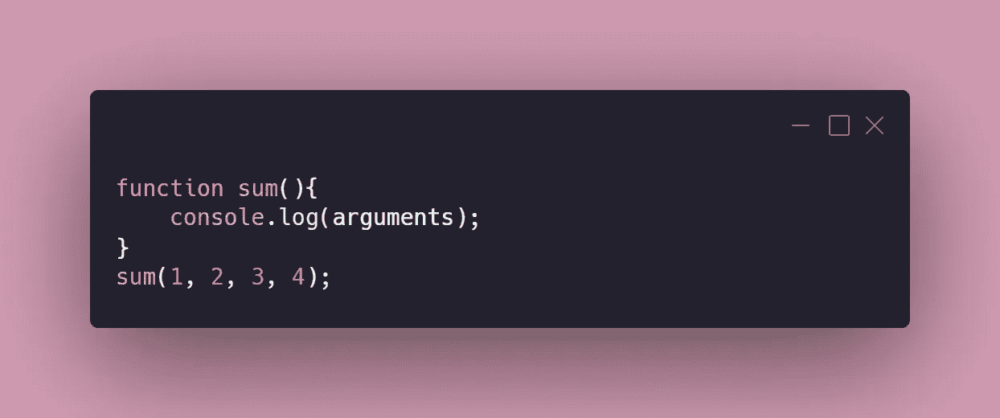

它的输出看起来像-

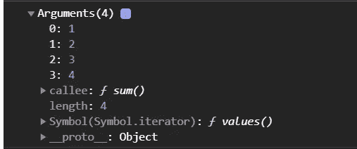

让我们使用正则函数表达式定义 sum()函数—

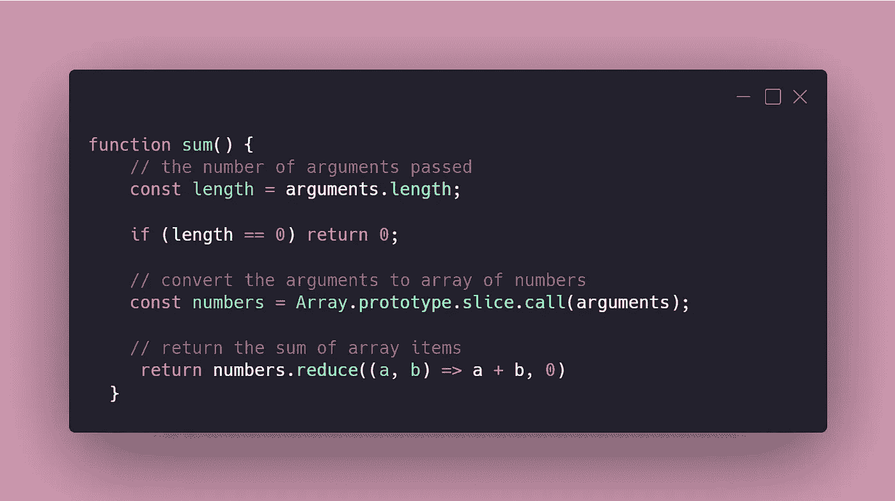

使用不同的参数调用 sum()

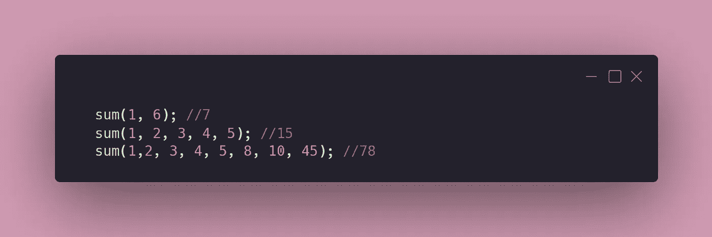

让我们使用箭头函数语法复制 sum()

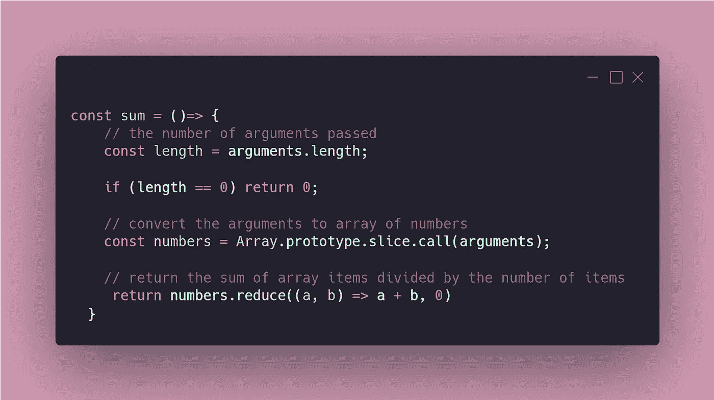

当你现在测试这个函数时，它抛出一个`Reference Error`，抱怨`arguments`没有定义。

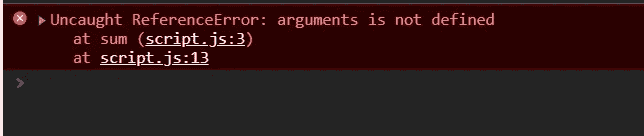

## 这有什么不好？？🎃

> 箭头函数不存在`arguments`绑定。它只为常规功能而存在。但是，箭头函数可以访问非箭头父函数的`arguments`对象。

上面的语句意味着—如果您想访问 arrow 函数中的 argument 对象，您必须返回常规父函数中立即调用的 arrow 函数。

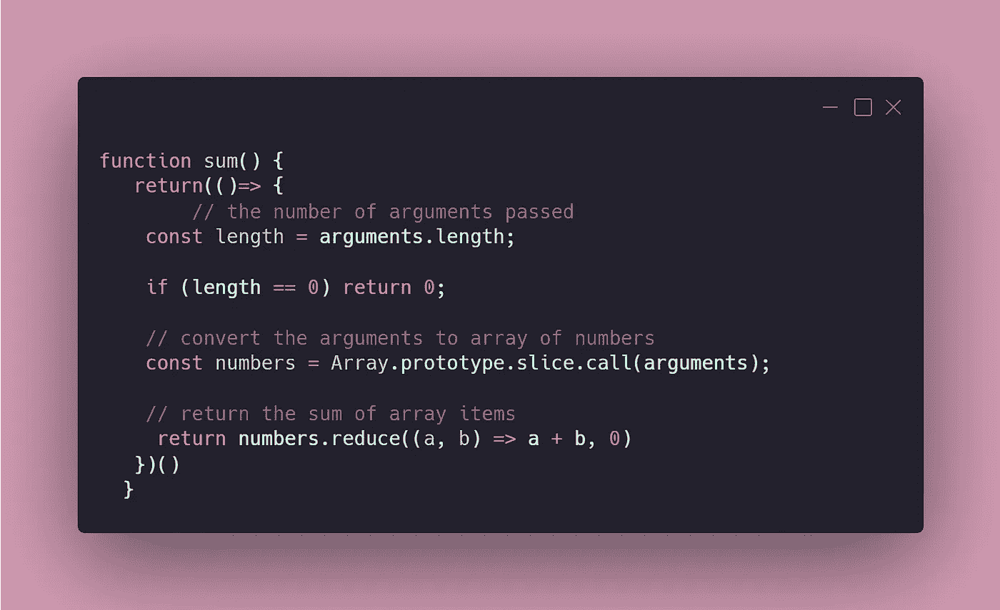

上面的代码就可以了！

## 我们有更好的选择吗？？🐰

是啊！向`rest parameters`问好。使用`rest parameters`,我们可以将任意数量的参数收集到一个数组中，并对它们做我们想做的事情。

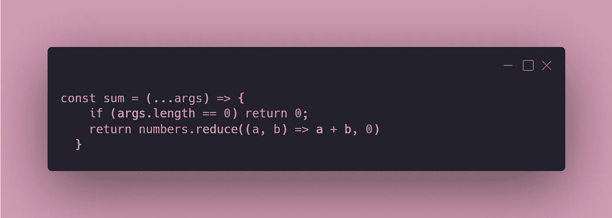

> **注意:**其余参数必须在**最后一个参数**处。这是因为它将所有的`remaining` / `excess`参数收集到一个数组中。所以像这样的函数会抛出错误—

```
const sum = (a,…args, c) => {
       .....
       .....
       return
}
```

# 构造函数🐘

可以用关键字`new`调用一个常规的 JavaScript 函数，对于这个函数来说，它的行为就像一个创建新实例对象的类构造函数。

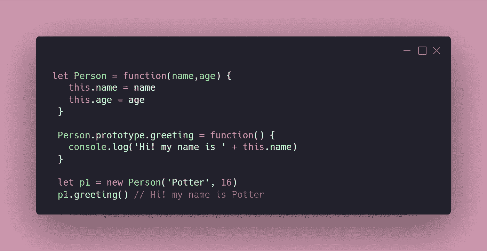

如果我对箭头函数做同样的操作会怎么样？？🤔

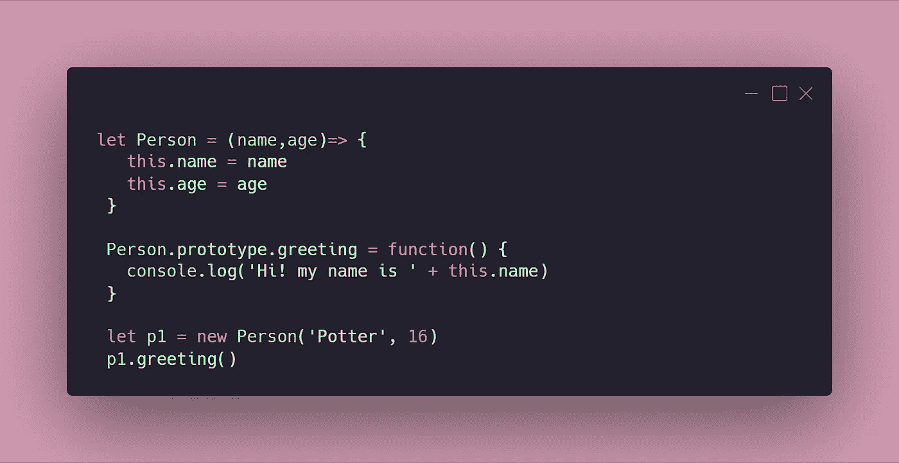

是抛出错误——一个箭头函数的`prototype`是`undefined`。

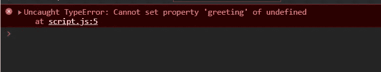

> 箭头函数永远不能用 new 关键字调用，因为它们没有`[[Construct]]`方法。因此，箭头函数也不存在`prototype`属性。

# 这💭🎪

在正则函数表达式中，这是指基于调用函数的 ***上下文*** 的值。而在 arrow 函数中，这个值依赖于 ***词法范围。👻***

***上下文—*** 上下文与对象相关。它指的是函数所属的对象。当您使用 JavaScript“this”关键字时，它指的是函数所属的对象。

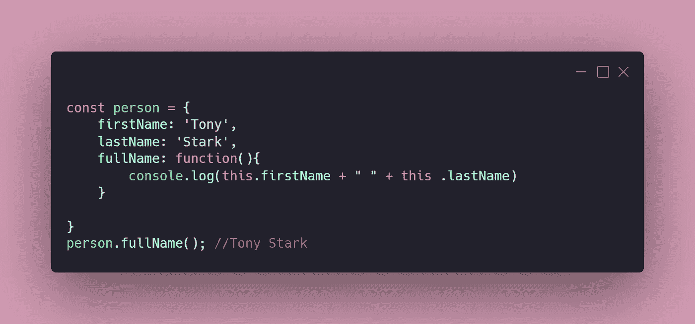

1.  方法 ***全称*** 是由 ***人*** 对象调用的，这就是为什么这个方法的上下文是 ***人*** 对象。方法内 ***这个*** 的值因此是 ***人*** 对象。
2.  如果一个函数被全局调用，它的上下文是窗口，这就是为什么该函数内的 ***这个*** 的值是 ***窗口对象。***

***作用域—*** 作用域决定变量的可见性。它与功能有关。让我们看看如何！！

1.假设您在函数内部使用“var”初始化变量。您不能在函数外部访问此变量。

2.但是如果父函数内部有函数，那么内部函数可以访问父函数的变量。而那个变量就被说成是 ***【作用域内】*** 。

*词法作用域*意味着在一组嵌套的函数中，**内部函数可以访问其父作用域**的变量和其他资源。

*arrow 函数中的这个* **从词法范围即父环境中取值。**

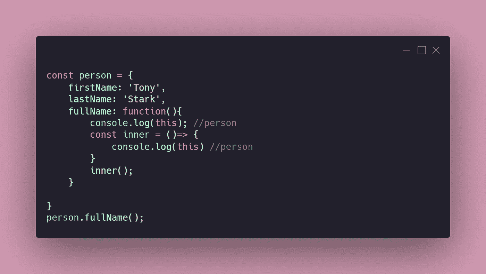

在上面的例子中，需要注意以下几点—

1.  ***console . log(this)****在方法* ***fullName*** 里面打印对象 ***person*** 因为方法 ***fullName*** 是被对象***【person】***调用的，所以这个方法的上下文是 ***person*** 对象。
2.  ***console . log(this)***箭头函数内部 ***内部*** 打印对象 ***人*** 因为 ***箭头函数内部的这个*** 从词法作用域即父包围**中取值。**在其父环境(全名)中，这是指对象人。

让我们举个例子，了解一下这里的箭头函数有什么问题—

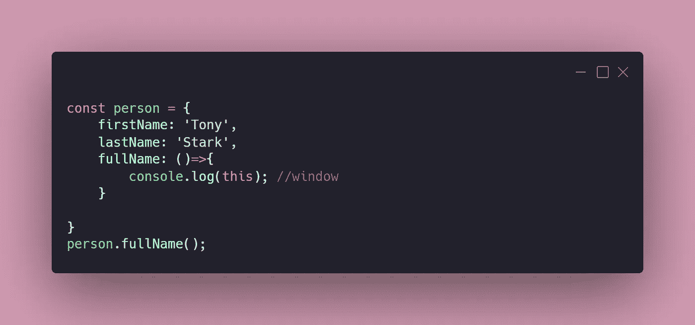

在上面的例子中，我们用箭头函数替换了常规函数。这就是为什么 logging ***这个*** 是返回窗口对象！

**箭头函数不会将** `**this**` **绑定到调用它们的对象上。它们只是在它们被定义的范围内使用** `**this**` **的值。在这种情况下，这就是全局对象。所以箭头函数不能用于对象方法！**

# 重复参数🐯

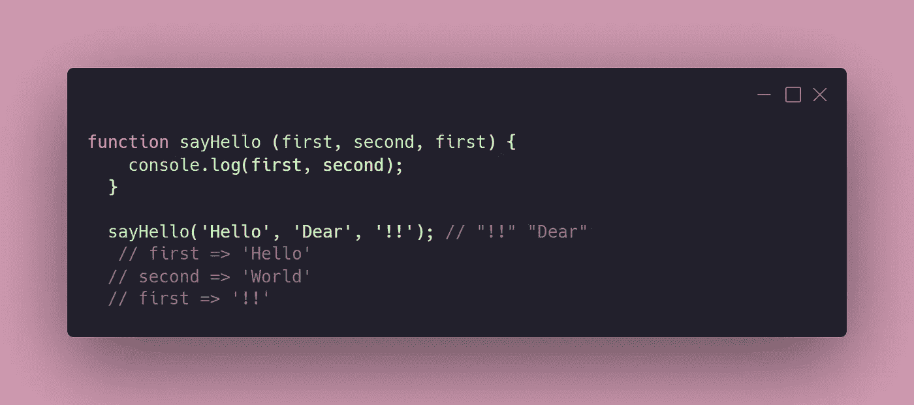

`first`参数重复。它被赋予传递给函数调用的第三个参数的值，该值完全覆盖传递的第一个参数。

用箭头函数复制上面的例子—

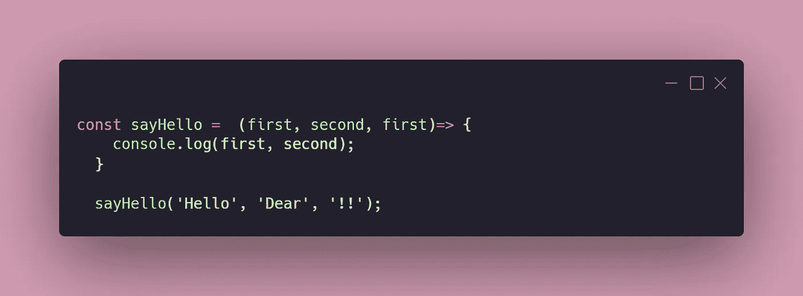

它将抛出一个错误— *未捕获的语法错误:在这个上下文中不允许重复的参数名*

> 与常规函数不同，箭头函数不允许重复的参数，重复的参数会导致抛出一个`Syntax Error`。

如果你认为这些内容已经为你提供了一些价值，你可以关注我在[媒体](/@prachisown)上的更多此类内容。

感谢您的阅读！🌺🙏